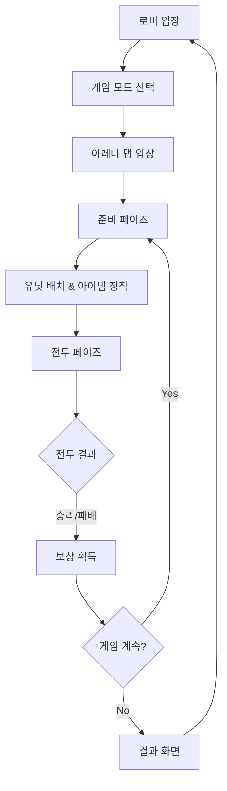

# 메토체스 게임 개요

## 프로젝트 소개

메토체스는 **MapleStory Worlds(MSW)** 플랫폼 기반으로 개발된 오토 배틀러 장르의 게임입니다. 플레이어는 메이플스토리의 캐릭터들을 수집하고 전략적으로 배치하여 자동 전투를 통해 승리를 목표로 합니다.

## 핵심 게임플레이 루프



게임은 다음과 같은 **4단계 페이즈**로 진행됩니다:

### 1. Ready Phase (준비 단계)
- 플레이어 상태 초기화 및 골드 지급
- 유닛 상점 갱신
- 다음 라운드 준비

### 2. Setting Phase (세팅 단계) 
- 유닛 배치 및 전략 수립
- 아이템 장착 및 룬카드 설정
- 시너지 확인

### 3. Battle Phase (전투 단계)
- 자동 전투 진행
- 실시간 전투 상황 표시
- 승부 결정

### 4. Clean Phase (정리 단계)
- 전투 결과 처리
- 보상 계산 및 지급
- 다음 라운드 진행

## 주요 시스템

### 유닛 시스템
- **캐릭터 수집**: 메이플스토리의 다양한 캐릭터들
- **등급 시스템**: 1성~3성 등급별 능력치
- **시너지 효과**: 같은 계열 캐릭터 조합 시 추가 효과

### 아이템 시스템  
- **장비 아이템**: 공격력, 방어력 등 능력치 증가
- **아이템 조합**: 특정 아이템 조합으로 상위 아이템 제작
- **아이템 상점**: 라운드별 아이템 구매 시스템

### 룬카드 시스템
- **룬카드 장착**: 특별한 능력 부여
- **세트 효과**: 같은 종류 룬카드 다수 장착 시 추가 효과
- **룬카드 상점**: 확률 기반 룬카드 획득

### 코치 시스템
- **코치 수집**: 게임 진행에 도움을 주는 코치 캐릭터
- **가챠 시스템**: 확률 기반 코치 획득
- **아바타 변경**: 코치를 통한 플레이어 외형 변경

## 프로젝트 폴더 구조

```
MetoChess/
├── RootDesk/MyDesk/          # 메인 게임 로직
│   ├── InGame/               # 인게임 시스템들
│   └── OutGame/              # 아웃게임 UI 및 메뉴
├── map/                      # 게임 맵 파일들
├── ui/                       # UI 레이아웃 파일들
├── Environment/              # MSW 환경 설정
└── Global/                   # 전역 설정 파일들
```

### 핵심 폴더별 역할

| 폴더 | 역할 | 주요 내용 |
|------|------|-----------|
| `RootDesk/MyDesk/InGame/` | 인게임 시스템 | 전투, 유닛, 아이템, 매니저 시스템 |
| `RootDesk/MyDesk/OutGame/` | 아웃게임 시스템 | 업적, 컬렉션, 프로필, 미션 |
| `map/` | 맵 정의 | Lobby, Arena, Field 등 게임 맵 |
| `ui/` | UI 레이아웃 | 게임 인터페이스 구성 |
| `Global/` | 전역 설정 | 플레이어 기본 설정, 게임 규칙 |

## 초보 개발자를 위한 시작 가이드

### 1. 프로젝트 구조 파악
먼저 다음 순서로 프로젝트를 이해하는 것을 권장합니다:

1. **Global/DefaultPlayer.model** - 플레이어 기본 구성 확인
2. **RootDesk/MyDesk/InGame/Managers/GameManager.mlua** - 게임 진행 흐름 파악  
3. **map/** 폴더 - 게임 맵 구조 이해
4. **ui/** 폴더 - 사용자 인터페이스 확인

### 2. 핵심 매니저 시스템 이해
게임은 여러 매니저 클래스로 구성되어 있습니다:

- **GameManager**: 게임 전체 흐름 제어
- **TeamManager**: 플레이어 팀 정보 관리  
- **CharacterShopManager**: 캐릭터 상점 운영
- **SynergyManager**: 시너지 효과 계산
- **TitleManager**: 칭호 시스템 관리

### 3. 개발 환경 설정
MapleStory Worlds 프로젝트이므로 다음이 필요합니다:

- MSW 개발 환경 구축
- Lua 스크립팅 이해
- MSW 컴포넌트 시스템 학습

### 4. 권장 학습 순서
1. **프로젝트 구조 이해** → 폴더별 역할 파악
2. **게임플레이 흐름** → 전체적인 게임 진행 과정
3. **핵심 아키텍처** → 맵, 데이터, 이벤트 시스템
4. **세부 시스템** → 유닛, 아이템, UI 등 개별 기능

## 코드 참조

### 주요 진입점
- `Global/DefaultPlayer.model` :: 플레이어 기본 컴포넌트 구성
- `RootDesk/MyDesk/InGame/Managers/GameManager.mlua :: OnMapEnter()` — 게임 시작 처리
- `RootDesk/MyDesk/InGame/Managers/GameManager.mlua :: GoToNextPhase()` — 페이즈 전환 로직

### 게임 진행 관리  
- `RootDesk/MyDesk/InGame/Managers/GameManager.mlua :: Ready()` — 준비 페이즈 처리
- `RootDesk/MyDesk/InGame/Managers/GameManager.mlua :: StartBattle()` — 전투 시작
- `RootDesk/MyDesk/InGame/Managers/GameManager.mlua :: OnUpdate()` — 실시간 업데이트

### 데이터 관리
- `RootDesk/MyDesk/Dictionary/Data/DictionaryDataManager.mlua :: DataSetInitialize()` — 게임 데이터 초기화
- `RootDesk/MyDesk/Dictionary/DictionaryManager.mlua :: OnBeginPlay()` — 사전 시스템 시작

이 문서를 통해 메토체스 프로젝트의 전체적인 구조와 게임 플레이 흐름을 이해할 수 있으며, 각 세부 시스템은 해당 문서에서 더 자세히 다룹니다.

