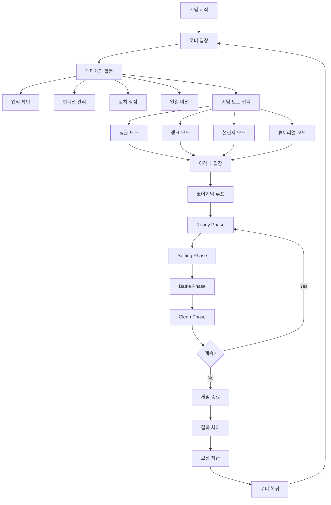
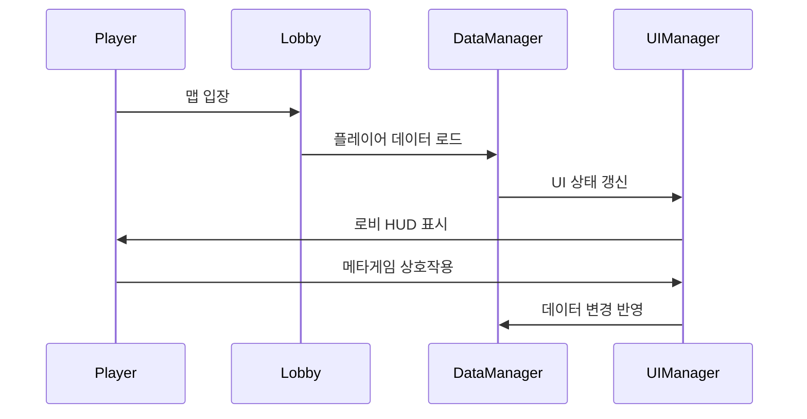
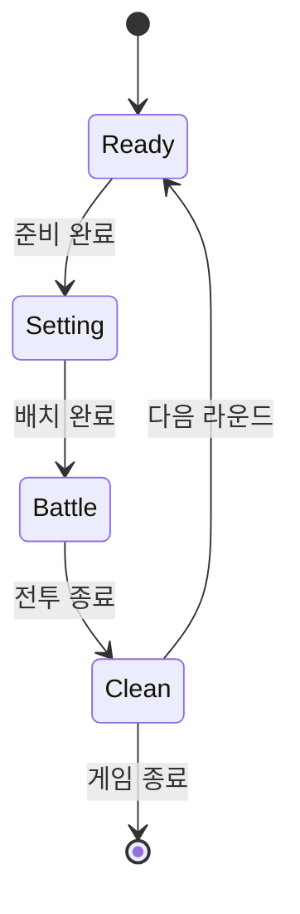
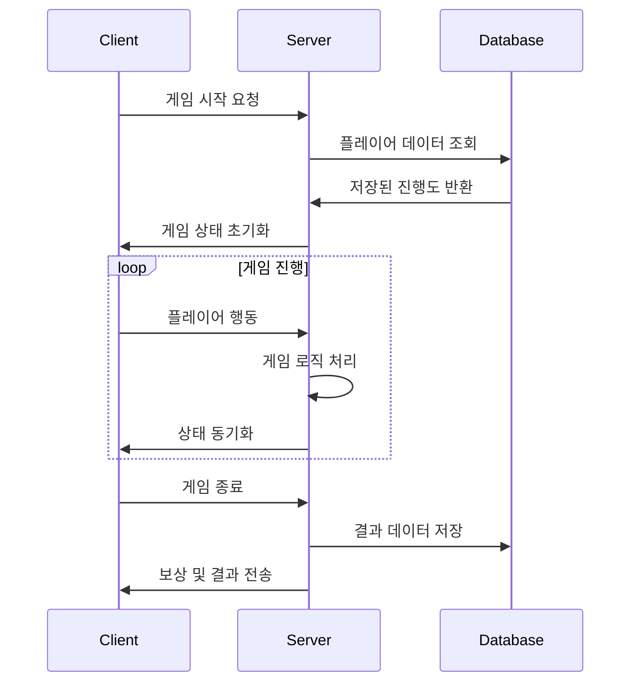

# 게임플레이 흐름

## 전체 플레이어 경험 설계

메토체스의 플레이어 경험은 **로비 중심의 메타게임**과 **아레나 중심의 코어게임**이 순환하는 구조로 설계되어 있습니다.



## 1단계: 로비 메타게임 시스템

### 로비 입장 및 초기화
플레이어가 게임에 접속하면 **Lobby 맵**으로 입장하며, 다양한 메타게임 요소들이 활성화됩니다.

#### 로비에서의 주요 활동

| 시스템 | 역할 | 관련 UI |
|--------|------|---------|
| **업적 시스템** | 플레이 목표 제시 및 보상 | AchievementManager |
| **컬렉션 시스템** | 캐릭터 카드/시너지 뱃지 수집 | CollectionBook.ui |
| **코치 시스템** | 아바타 관리 및 가챠 | CoachShop 관련 UI |
| **일일 미션** | 단기 목표 및 일일 보상 | DailyMission UI |
| **프로필 관리** | 플레이어 정보 및 랭킹 | Profile UI |
| **사전 시스템** | 게임 정보 학습 | Dictionary.ui |

### 로비 시스템 동작 흐름


## 2단계: 게임 모드 선택

### 모드 선택 시스템
`UI_LobbyLevelSelect`를 통해 4가지 게임 모드 중 선택합니다.

#### 게임 모드별 특징

| 모드 | 설명 | 진입 조건 | 특징 |
|------|------|-----------|------|
| **Tutorial** | 튜토리얼 | 제한 없음 | 기본 게임플레이 학습 |
| **Single** | 싱글플레이 | 제한 없음 | 난이도별 도전 가능 |
| **Rank** | 랭크 모드 | 레벨 10 이상 | 시즌별 랭킹 경쟁 |
| **Challenge** | 챌린지 모드 | 특정 조건 | 특수 룰 도전과제 |

### 모드 선택 처리 흐름
```lua
-- UI_LobbyLevelSelect :: OnButtonClick_ModeSelect()
if mode == "Rank" then
    -- 플레이어 레벨 체크 (10 이상)
    -- 남은 시간 체크 (1시간 이상)
elseif mode == "Challenge" then
    -- 도전 조건 체크
    -- 일일 시도 횟수 체크
end
```

### 입장 대기 시스템
모드 선택 후 **SetEnteranceMode()** 를 통해 입장 대기 상태로 전환됩니다:

1. **UI 비활성화**: 모드 변경, 코치 변경 등 버튼 비활성화
2. **이펙트 재생**: 입장 버튼 파티클 이펙트 활성화  
3. **카운트다운**: 3초 대기 후 실제 입장 실행
4. **맵 이동**: `GameManager :: MoveToArena()` 호출

## 3단계: 아레나 맵 전환

### 맵 전환 처리
```lua
-- GameManager :: MoveToArena()
-- 1. 입장 조건 검증
-- 2. 플레이어 데이터 준비  
-- 3. 아레나 맵으로 이동 요청
-- 4. 로딩 화면 활성화
```

### 아레나 입장 시 초기화
`GameManager :: OnMapEnter()`에서 아레나 맵 진입 시 처리:

```lua
if enteredMap.MapComponent.IsDynamicMap == true then
    -- 게임 상태 초기화
    self.Stage = 1
    self.Round = 1
    self.Phase = 0
    
    -- 유닛 샘플 스폰
    _SampleClientSpawnLogic:SpawnUnitSample(userId, "start")
    _UnitSetLogic_New:ProjectileSampleSpawn(userId)
    
    -- 새 게임 초기화
    self.Entity.TeamManager:InitNewGame(true)
end
```

## 4단계: 코어게임 루프 (4페이즈 시스템)

메토체스의 핵심은 **Ready → Setting → Battle → Clean**의 4단계 페이즈가 반복되는 구조입니다.



### Phase 1: Ready Phase (준비 단계)

#### 주요 동작
- **골드 지급**: 이전 라운드 보상 지급
- **상점 갱신**: 캐릭터/아이템/룬카드 상점 새로고침
- **UI 활성화**: 준비 관련 UI 그룹 활성화
- **타이머 시작**: 준비 시간 측정

```lua
-- GameManager :: Ready()
-- 골드 지급 처리
teamManager:AddGolds(getGolds, "roundResult")

-- 연출 재생
_GeneralDirectorLogic:PlayCoinDirector_Sprite(getGolds/2, nil, "RoundResult", userId)

-- UI 전환
self:Ready_OnClient(userId)
```

#### 플레이어 활동
- 캐릭터 구매 및 판매
- 레벨업 및 경험치 구매
- 아이템 구매 및 조합
- 룬카드 구매 및 장착

### Phase 2: Setting Phase (세팅 단계)

#### 주요 동작
- **배치 모드**: 유닛 드래그앤드롭 활성화
- **전략 수립**: 시너지 효과 확인 및 최적화
- **장비 관리**: 아이템 장착 및 재배치
- **사운드 재생**: 전투 준비 사운드 (`M0145`)

```lua
-- GameManager :: SetBattle()
-- 사운드 재생
_PlaySoundLogic:PlaySound("M0145", userId)

-- 전투 준비 처리
self:SetBattle_OnClient(userId)
```

#### 플레이어 활동
- 유닛을 게임판 타일에 배치
- 시너지 조합 확인 및 조정
- 아이템 장착 최적화
- 마지막 전략 점검

### Phase 3: Battle Phase (전투 단계)

#### 주요 동작
- **자동 전투**: AI 기반 유닛 행동
- **실시간 상태**: 전투 진행 상황 UI 업데이트
- **타이머 관리**: 전투 제한 시간 카운트다운
- **결과 판정**: 승부 조건 확인

```lua
-- GameManager :: OnUpdate() - Battle Phase
if self.PhaseType == "Battle" then
    self.BattleTime -= delta
    
    if self.BattleTime <= 0 then
        self:GoToNextPhase()  -- 연장전/무승부
    elseif self.EnemyCount <= 0 then
        self:SetBattleResult(true, self.MyUnitCount)  -- 승리
    elseif self.MyUnitCount <= 0 then
        self:SetBattleResult(false, self.EnemyCount)  -- 패배
    end
end
```

#### 전투 시스템 동작
- **행동트리 AI**: 유닛들의 자동 행동 결정
- **스킬 시스템**: 마나 축적 및 스킬 발동
- **투사체 시스템**: 원거리 공격 처리
- **상태효과**: 버프/디버프 적용 및 해제

### Phase 4: Clean Phase (정리 단계)

#### 주요 동작
- **결과 집계**: 전투 통계 및 데이터 정리
- **보상 계산**: 승부 결과에 따른 보상 결정
- **다음 라운드 준비**: Stage/Round 정보 갱신
- **상태 초기화**: 유닛 상태 및 필드 정리

```lua
-- GameManager :: Clean()
-- 전투 결과 처리 및 정리
-- 다음 라운드 준비
-- 상태 초기화
```

#### 진행 조건 확인
- **계속**: Ready Phase로 복귀하여 다음 라운드 진행
- **종료**: HP가 0이 되거나 목표 달성 시 게임 종료

## 5단계: 게임 종료 및 결과 처리

### 게임 종료 조건
- **체력 소진**: 플레이어 HP가 0 이하로 떨어짐
- **목표 달성**: 모든 스테이지 클리어 완료
- **강제 종료**: 플레이어가 직접 게임 종료

### 결과 화면 시스템
게임 종료 시 **GameResult UI**를 통해 결과를 표시합니다:

#### 결과 정보 표시
- **최종 순위**: 도달한 라운드 및 순위
- **전투 통계**: 딜량, 받은 피해, 사용한 스킬 등
- **획득 보상**: 경험치, 골드, 업적 진행도
- **기록 갱신**: 개인 최고 기록 업데이트

### 보상 시스템 처리

#### 경험치 및 골드 지급
```lua
-- GetBattleReward :: 보상 계산 로직
-- 1. 기본 보상 계산 (라운드, 순위 기반)
-- 2. 보너스 보상 적용 (업적, 연승 등)
-- 3. 플레이어 데이터에 반영
```

#### 진행도 저장
- **업적 진행**: 달성한 목표들의 진행률 업데이트
- **컬렉션**: 새로 확인한 캐릭터/시너지 정보 저장
- **랭킹**: 랭크 모드의 경우 시즌 랭킹 갱신
- **통계**: 플레이 기록 및 통계 데이터 누적

## 데이터 흐름 및 동기화

### 클라이언트-서버 데이터 흐름


### 데이터 저장 시점
- **실시간**: 중요한 게임 상태 변화 (구매, 레벨업 등)
- **페이즈 전환**: 각 페이즈 종료 시점
- **게임 종료**: 최종 결과 및 보상 데이터
- **주기적**: 일정 간격으로 진행 상황 자동 저장

## UI 그룹 관리 시스템

### 맵별 UI 그룹 전환
각 맵에 따라 적절한 UI 그룹들이 활성화/비활성화됩니다:

#### 로비 맵 UI 그룹
- **Lobby_HUD**: 메인 로비 인터페이스
- **Lobby_LevelSelect**: 모드 선택 화면
- **Dictionary**: 게임 백과사전
- **CollectionBook**: 컬렉션 관리
- **PopupGroup**: 각종 팝업 및 모달

#### 아레나 맵 UI 그룹
- **Arena_Default**: 아레나 기본 레이아웃
- **Arena_ReadyPhase**: 준비 단계 UI
- **Arena_BattlePhase**: 전투 진행 UI
- **HoverPopupGroup**: 툴팁 및 호버 정보
- **ToastGroup**: 알림 메시지

### 로딩 시스템
맵 전환 시 **LoadingManager**가 로딩 과정을 관리합니다:

```lua
-- LoadingManager 주요 기능
-- 1. 로딩 진행률 추적
-- 2. 로딩 팁 메시지 순환 표시  
-- 3. BGM 페이드 인/아웃 처리
-- 4. 로딩 완료 후 UI 전환
```

## 코드 참조

### 게임 플로우 제어
- `RootDesk/MyDesk/InGame/Managers/GameManager.mlua :: OnMapEnter()` — 맵 입장 시 초기화
- `RootDesk/MyDesk/InGame/Managers/GameManager.mlua :: GoToNextPhase()` — 페이즈 전환 로직
- `RootDesk/MyDesk/InGame/Managers/GameManager.mlua :: MoveToArena()` — 아레나 맵 이동

### 모드 선택 시스템
- `RootDesk/MyDesk/UIComponents/UI_Lobby/UI_LobbyLevelSelect.mlua :: OnButtonClick_ModeSelect()` — 모드 선택 처리
- `RootDesk/MyDesk/UIComponents/UI_Lobby/UI_LobbyLevelSelect.mlua :: SetEnteranceMode()` — 입장 대기 모드

### 페이즈별 처리
- `RootDesk/MyDesk/InGame/Managers/GameManager.mlua :: Ready()` — 준비 페이즈
- `RootDesk/MyDesk/InGame/Managers/GameManager.mlua :: StartBattle()` — 전투 페이즈
- `RootDesk/MyDesk/InGame/Managers/GameManager.mlua :: Clean()` — 정리 페이즈

### 데이터 관리
- `RootDesk/MyDesk/DataStorage/PlayerDataComponent.mlua` — 플레이어 데이터 저장
- `RootDesk/MyDesk/InGame/BattleEndReward/GetBattleReward.mlua` — 보상 처리

이러한 체계적인 게임플레이 흐름을 통해 플레이어는 끊김없는 게임 경험을 할 수 있으며, 각 시스템이 유기적으로 연결되어 전체적인 게임의 재미를 극대화합니다.

