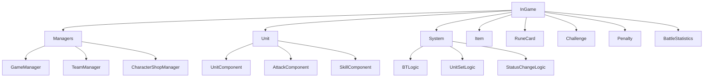
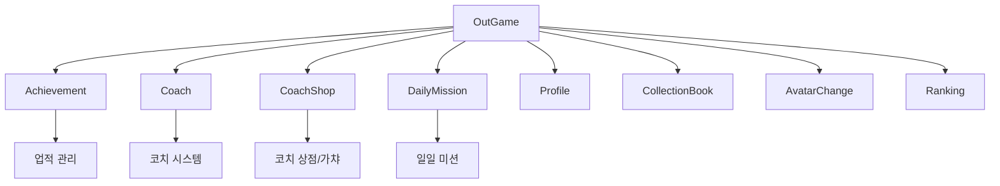

# 폴더 구조와 역할

## 전체 프로젝트 구조

메토체스 프로젝트는 **MapleStory Worlds(MSW)** 플랫폼의 표준 구조를 따라 다음과 같이 구성됩니다:

```
MetoChess/
├── RootDesk/MyDesk/          # 메인 게임 로직 및 데이터
├── map/                      # 게임 맵 정의 파일들  
├── ui/                       # 사용자 인터페이스 레이아웃
├── Environment/              # MSW 플랫폼 환경 설정
├── Global/                   # 전역 게임 설정
└── docs/                     # 프로젝트 문서화
```

## RootDesk/MyDesk 폴더 구조

프로젝트의 핵심 로직이 집중된 메인 폴더로, **InGame**과 **OutGame**으로 명확히 분리되어 있습니다.

### InGame 폴더 - 게임 진행 중 시스템



#### 주요 하위 폴더별 역할

| 폴더명 | 역할 | 주요 파일 |
|--------|------|-----------|
| **Managers/** | 게임 전체 진행 관리 | GameManager, TeamManager, SynergyManager |
| **Unit/** | 유닛 관련 모든 시스템 | UnitComponent, AttackComponent, SkillComponent |
| **System/** | 핵심 게임 시스템 로직 | BTLogic, UnitSetLogic, StatusChangeLogic |
| **Item/** | 아이템 시스템 | ItemInfo, ItemCombineService |
| **RuneCard/** | 룬카드 시스템 | RuneCardComponent, RuneCardList |
| **Challenge/** | 도전과제 시스템 | ChallengeManager, ChallengeComponent |
| **Penalty/** | 페널티 시스템 | PenaltyManager, PenaltyComponent |
| **BattleStatistics/** | 전투 통계 시스템 | BattleStatistics UI 관련 |
| **Coach/** | 인게임 코치 시스템 | CoachComponent, CoachManager |
| **ESCMenu/** | 인게임 메뉴 시스템 | ESCMenuService, ShortCutKeyService |

#### Unit 폴더의 세부 구조
```
Unit/
├── 00_AttackComponent/     # 공격 관련 컴포넌트들 (99개 파일)
├── 00_SkillComponent/      # 스킬 관련 컴포넌트들 (101개 파일)  
├── 00_ProjectileComponent/ # 투사체 시스템 (21개 파일)
├── 01_UnitComponent/       # 기본 유닛 컴포넌트들 (10개 파일)
└── BT/                     # 행동트리 시스템 (4개 파일)
```

### OutGame 폴더 - 게임 외적 시스템



#### 주요 하위 폴더별 역할

| 폴더명 | 역할 | 주요 파일 |
|--------|------|-----------|
| **Achievement/** | 업적 시스템 | AchievementManager, UI_AchievementPopup |
| **Coach/** | 로비 코치 시스템 | CoachService, CoachMoveComponent |
| **CoachShop/** | 코치 상점 및 가챠 | CoachShopManager, GachaLogic |
| **DailyMission/** | 일일 미션 시스템 | DailyMissionLogic, DailyMissionComponent |
| **Profile/** | 플레이어 프로필 | UI_Profile, PlayerTouch |
| **CollectionBook/** | 컬렉션 시스템 | UI_CollectionManager, PlayerCollectionData |
| **AvatarChange/** | 아바타 변경 | PlayerAvatarChangeComponent |
| **Ranking/** | 랭킹 시스템 | Ranking_UILogic |
| **Reward_Popup/** | 보상 팝업 | UI_RewardPopup |

### 공통 폴더들

#### Dictionary 폴더 - 게임 백과사전 시스템
```
Dictionary/
├── Data/              # 게임 데이터 관리 (캐릭터, 시너지, 아이템 등)
├── UI/                # 사전 UI 컴포넌트들
└── Model/             # 사전 관련 모델들
```

#### Events 폴더 - 이벤트 시스템  
```
Events/
├── SystemEvents/      # 시스템 레벨 이벤트들 (13개)
├── UnitBehaviorEvents/ # 유닛 행동 이벤트들 (11개) 
└── UserBehaviorEvents/ # 사용자 행동 이벤트들 (19개)
```

#### UIComponents 폴더 - UI 공통 컴포넌트
- 재사용 가능한 UI 컴포넌트들 (85개 파일)
- 버튼, 팝업, 토스트, 툴팁 등 기본 UI 요소들

## map 폴더 구조

게임에서 사용되는 모든 맵을 정의합니다:

| 맵 파일 | 용도 | 주요 특징 |
|---------|------|-----------|
| **Lobby.map** | 로비/대기실 | 플레이어 스폰, NPC 배치, UI 요소들 |
| **Arena.map** | 전투 아레나 | 타일 시스템 (Line_1/Tile_1 구조), 전투 영역 |
| **Field.map** | 게임 필드 | 실제 게임플레이 공간 |
| **Sample.map** | 테스트용 맵 | 개발/테스트 목적 |

### 맵 구조 예시 (Arena.map)
```
Arena/
├── Background/          # 배경 이미지
├── Line_1/             # 게임판 첫 번째 줄
│   ├── Tile_1/         # 개별 타일 + 유닛 스프라이트
│   ├── Tile_2/
│   └── ...
├── Line_2/             # 게임판 두 번째 줄  
└── SpawnLocation/      # 플레이어 스폰 위치
```

## ui 폴더 구조

모든 사용자 인터페이스 레이아웃을 정의합니다:

### 주요 UI 파일들

| UI 파일 | 역할 | 연결된 스크립트 |
|---------|------|----------------|
| **Dictionary.ui** | 게임 백과사전 메인 | DictionaryManager |
| **Lobby_HUD.ui** | 로비 메인 화면 | 로비 관련 UI 컴포넌트들 |
| **Arena_ReadyPhase.ui** | 전투 준비 화면 | 유닛 배치, 상점 UI |
| **Arena_BattlePhase.ui** | 전투 진행 화면 | 실시간 전투 상태 표시 |
| **CollectionBook.ui** | 컬렉션 화면 | UI_CollectionManager |
| **PopupGroup.ui** | 팝업 관리 | 다양한 팝업 시스템 |

## Environment 폴더

**MapleStory Worlds 플랫폼**의 환경 설정 파일들을 포함합니다:

```
Environment/
├── NativeScripts/      # MSW 네이티브 스크립트 정의들
│   ├── Component/      # MSW 컴포넌트 정의 (102개 파일)
│   ├── Enum/          # 열거형 정의 (117개 파일)
│   ├── Event/         # 이벤트 정의 (215개 파일)
│   ├── Logic/         # 로직 정의 (11개 파일)
│   ├── Misc/          # 기타 정의 (123개 파일)
│   └── Service/       # 서비스 정의 (46개 파일)
└── config             # 환경 설정 파일
```

## Global 폴더

전역적으로 사용되는 설정과 모델들을 정의합니다:

| 파일명 | 역할 | 포함된 컴포넌트 |
|--------|------|----------------|
| **DefaultPlayer.model** | 플레이어 기본 설정 | 모든 매니저 컴포넌트들 (28개) |
| **Player.model** | 플레이어 엔티티 설정 | MSW 기본 컴포넌트들 (24개) |
| **common.gamelogic** | 공통 게임 로직 | - |
| **CollisionGroupSet.collisiongroupset** | 충돌 그룹 설정 | - |

### DefaultPlayer.model의 주요 컴포넌트들
```lua
-- 게임 관리 컴포넌트들
"script.GameManager"           -- 게임 전체 진행 관리
"script.TeamManager"          -- 팀 정보 관리  
"script.CharacterShopManager_New" -- 캐릭터 상점
"script.SynergyManager_New"   -- 시너지 계산

-- 플레이어 데이터 컴포넌트들  
"script.PlayerDataComponent"   -- 플레이어 데이터 저장
"script.TitleManager"         -- 칭호 시스템
"script.AchievementManager"   -- 업적 시스템
"script.CoachManager"         -- 코치 관리
```

## MSW 프로젝트 아키텍처의 특징

### 1. 컴포넌트 기반 설계
- 모든 게임 객체는 **컴포넌트 조합**으로 구성
- **Model 파일**에서 컴포넌트 구성 정의
- **스크립트 컴포넌트**와 **MSW 네이티브 컴포넌트** 혼용

### 2. 클라이언트-서버 분리
- `@ExecSpace("ServerOnly")` - 서버 전용 로직
- `@ExecSpace("ClientOnly")` - 클라이언트 전용 로직  
- `@Sync` 속성을 통한 데이터 동기화

### 3. 이벤트 드리븐 아키텍처
- **SystemEvents**: 게임 상태 변화
- **UnitBehaviorEvents**: 유닛 액션
- **UserBehaviorEvents**: 플레이어 액션

### 4. 데이터 중심 설계
- **CSV + UserDataSet** 조합으로 게임 데이터 관리
- **DictionaryDataManager**를 통한 중앙 집중식 데이터 관리
- 시즌별 데이터 구성으로 업데이트 용이성 확보

## 코드 참조

### 프로젝트 구조 관련 주요 파일들
- `Global/DefaultPlayer.model` :: 플레이어 기본 컴포넌트 구성 정의
- `RootDesk/MyDesk/InGame/Managers/GameManager.mlua :: OnMapEnter()` — 맵별 초기화 처리
- `RootDesk/MyDesk/Dictionary/Data/DictionaryDataManager.mlua :: DataSetInitialize()` — 게임 데이터 초기화

### 폴더별 진입점  
- `RootDesk/MyDesk/InGame/Managers/` :: 인게임 시스템 중앙 관리
- `RootDesk/MyDesk/OutGame/Achievement/AchievementManager.mlua` :: 아웃게임 기능 대표
- `RootDesk/MyDesk/Events/SystemEvents/` :: 이벤트 시스템 구조 파악

이 폴더 구조를 이해하면 기능별로 코드가 어디에 위치하는지 쉽게 파악할 수 있으며, 새로운 기능 추가 시에도 적절한 위치를 선택할 수 있습니다.

