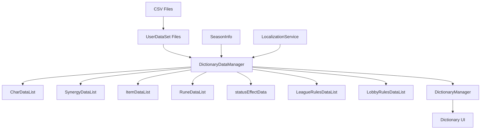
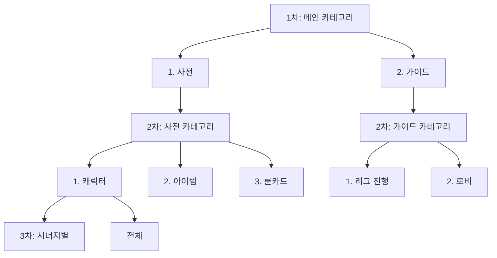

# 게임 데이터 시스템

## 개요

메토체스의 게임 데이터 시스템은 **DictionaryDataManager**를 중심으로 모든 게임 콘텐츠 데이터를 통합 관리합니다. 캐릭터, 시너지, 아이템, 룬카드 등 핵심 게임플레이 요소들의 정보를 체계적으로 구조화하고, **백과사전 UI**를 통해 플레이어에게 직관적으로 제공합니다.

## 데이터 시스템 아키텍처



## DictionaryDataManager - 핵심 데이터 관리자

### 데이터 관리 구조

**DictionaryDataManager**는 게임의 모든 메타데이터를 메모리에 로드하고 관리하는 싱글톤 로직입니다.

```lua
@Logic
script DictionaryDataManager extends Logic
    property boolean IsDataLoadComplete = false
    
    -- 핵심 게임 데이터
    property table CharDataList = {}         -- 캐릭터 정보
    property table SynergyDataList = {}      -- 시너지 정보
    property table ItemDataList = {}         -- 아이템 정보
    property table RuneDataList = {}         -- 룬카드 정보
    property table statusEffectData = {}     -- 상태효과 정보
    
    -- 게임 규칙 데이터
    property table LeagueRulesDataList = {}  -- 인게임 규칙
    property table LobbyRulesDataList = {}   -- 아웃게임 규칙
```

### 데이터 초기화 프로세스

시스템 시작 시 **DataSetInitialize()** 메서드를 통해 모든 데이터를 순차적으로 로드합니다:

```lua
@ExecSpace("ClientOnly")
method void DataSetInitialize()
    self:SetCharacterData()      -- 캐릭터 데이터 로드
    self:SetSynergyData()        -- 시너지 데이터 로드  
    self:SetItemData()           -- 아이템 데이터 로드
    self:SetStatusEffectData()   -- 상태효과 데이터 로드
    self:SetRuneCardData()       -- 룬카드 데이터 로드
    self:SetAllGameRulesData()   -- 게임 규칙 데이터 로드
    
    self.IsDataLoadComplete = true  -- 로딩 완료 플래그
end
```

## 캐릭터 데이터 시스템

### CharDictionaryData 구조

각 캐릭터의 모든 정보를 포함하는 데이터 클래스입니다:

```lua
@Struct
script CharDictionaryData
    -- 기본 정보
    property string CharID = ""              -- 캐릭터 고유 ID
    property number Cost = 0                 -- 구매 비용
    property number Scale = 1                -- 크기 배율
    property string Role = ""                -- 역할 (Tank, LRD, SRD)
    property string MainStats = ""           -- 주 스탯
    property string IdleRUID = ""            -- 기본 상태 스프라이트
    
    -- 시너지 정보
    property number SynergyCount = 0         -- 보유 시너지 수
    property table Synergies = {}           -- 시너지 ID 목록
    
    -- 시즌별 포함 여부
    property table ContainedSeason = {}     -- 시즌별 사용 가능 여부
    
    -- UI 표시 옵션
    property boolean DictionaryEnable = true  -- 백과사전 표시 여부
    property boolean CollectionEnable = true -- 컬렉션 표시 여부
end
```

### 캐릭터 데이터 로딩 과정

```lua
@ExecSpace("ClientOnly") 
method void SetCharacterData()
    -- 1. CSV 데이터 소스 로드
    local data_CharInfo = _DataService:GetTable("CharacterInfo")
    local data_CharSynergy = _DataService:GetTable("CharacterSynergy")  
    local data_CharStat = _DataService:GetTable("CharacterStatus")
    local data_CharInfoBySeason = _DataService:GetTable("CharacterListBySeason")
    local seasonInfo = _DataService:GetTable("SeasonInfo")
    
    -- 2. 각 캐릭터별 정보 처리
    for i=1, data_CharInfo:GetRowCount() do
        local character = CharDictionaryData()
        local row_charInfo = data_CharInfo:GetRow(i)
        
        -- 기본 정보 설정
        character.CharID = row_charInfo:GetItem("CharID")
        character.Cost = tonumber(row_charInfo:GetItem("Cost"))
        character.Role = row_charInfo:GetItem("Role")
        
        -- 시즌별 포함 여부 설정
        local charRow_inCharListBySeason = data_CharInfoBySeason:FindRow("CharID", character.CharID)
        for j=1, seasonInfo:GetRowCount() do
            local season = seasonInfo:GetRow(j):GetItem("Season")
            local isContained = charRow_inCharListBySeason:GetItem(season) == "TRUE"
            character.ContainedSeason[season] = isContained
        end
        
        -- 최종 데이터 저장
        self.CharDataList[character.CharID] = character
    end
end
```

## 시너지 데이터 시스템

### SynergyDictionaryData 구조

시너지 효과의 모든 정보를 관리합니다:

```lua
@Struct
script SynergyDictionaryData
    property string SynergyID = ""           -- 시너지 고유 ID
    property string IconRUID = ""            -- 시너지 아이콘
    property string Desc = ""                -- 시너지 설명
    
    -- 단계별 효과 정보
    property table NeedCount_step = {}       -- 각 단계별 필요 유닛 수 (5단계)
    property table Detail_step = {}          -- 각 단계별 효과 설명 (4단계)
    
    -- 포함 캐릭터 정보
    property number CharacterCount = 0       -- 포함된 캐릭터 수
    property table CharIDs = {}             -- 포함된 캐릭터 ID 목록
    
    -- 연결된 시너지
    property number LinkedCount = 0          -- 연결된 시너지 수
    property table linkedSynergyIDs = {}    -- 연결된 시너지 ID 목록
    
    -- 시즌별 포함 여부
    property table ContainedSeason = {}
end
```

### 시너지 데이터 처리 특징

- **단계별 효과**: 1-5단계까지 시너지 레벨별 필요 유닛 수와 효과 관리
- **캐릭터 연결**: 해당 시너지를 가진 모든 캐릭터 목록 자동 관리
- **시너지 연결**: 관련 시너지들 간의 연관성 표현

## 아이템 데이터 시스템

### ItemStatusDictionaryData 구조

게임 내 모든 아이템의 상세 정보를 관리합니다:

```lua
@Struct  
script ItemStatusDictionaryData
    property string ItemID = ""             -- 아이템 고유 ID
    property string Type = ""               -- 아이템 타입
    property string Tags = ""               -- 아이템 태그
    property string RUID = ""               -- 아이템 스프라이트
    
    -- UI 표시 정보
    property Vector3 RUID_LocalPos = Vector3(0,0,0)    -- 로컬 위치
    property Vector3 RUID_LocalScale = Vector3(1,1,1)  -- 로컬 스케일
    
    -- 게임플레이 정보
    property string Guide = ""              -- 아이템 가이드 (로컬라이제이션)
    property string StatusEffectID = ""     -- 연결된 상태효과 ID
    
    -- 시즌별 포함 여부
    property table ContainedSeason = {}
end
```

### 아이템 리소스 최적화

아이템 로딩 시 UI 표시 최적화를 위한 리소스 정보를 사전 계산합니다:

```lua
-- 아이템 UI 최적화
local resourceInfo = _LoadResourcesInfo:GetUILocalPositionScale(item.RUID)
item.RUID_LocalPos = resourceInfo["pos"]     -- UI에서 최적 위치
item.RUID_LocalScale = resourceInfo["scale"] -- UI에서 최적 크기
```

## 룬카드 데이터 시스템

### RuneCardDictionaryData 구조

룬카드 시스템의 메타데이터를 관리합니다:

```lua
@Struct
script RuneCardDictionaryData
    property string RuneID = ""             -- 룬카드 고유 ID  
    property string Grade = ""              -- 등급 (Normal, Rare, Epic, Legendary)
    property string Type = ""               -- 타입 분류
    property string Guide = ""              -- 룬카드 효과 설명
    property string RUID = ""               -- 룬카드 스프라이트
    
    -- 시즌별 포함 여부
    property table ContainedSeason = {}
end
```

## CSV + UserDataSet 파일 구조

### 파일 구조 체계

메토체스는 **이중 파일 구조**를 사용하여 데이터를 관리합니다:

```
데이터 파일 구조:
├── CharacterInfo.csv          # 실제 캐릭터 데이터
├── CharacterInfo.userdataset  # CSV 메타정보와 MSW 설정
├── CharacterListBySeason.csv  # 시즌별 캐릭터 포함 정보
├── CharacterListBySeason.userdataset
└── ... (다른 데이터 파일들)
```

#### CSV 파일 예시 (CharacterInfo.csv)

```csv
CharID,Version,Cost,Scale,Name,Role,MainStats,IdleRUID,AttackComponent,SkillComponent,DictionaryEnable,CollectionEnable
C10001,1,1,1,슬라임,SRD,Status_MagicalAttack,37291140ca7149c29e4cce958b0e7767,C10001_Slime_Attack,C10001_Slime_Skill,TRUE,TRUE
C10002,1,1,1,주황버섯,Tank,Status_PhysicalAttack,b1dac2598a0949fa83cc289ee16b5b6e,C10002_OrangeMushRoom_Attack,C10002_OrangeMushRoom_Skill,TRUE,TRUE
```

#### UserDataSet 파일 구조

```json
{
  "EntryKey": "userdataset://2b67bfcd-73b0-49be-ad48-1c2c2e7ddbc1",
  "ContentProto": {
    "Use": "Json",
    "Json": {
      "name": "CharacterInfo",
      "serveronly": false,        // 클라이언트에서도 접근 가능
      "dynamicloading": 0,       // 즉시 로딩
      "worldCoreVersion": "1.24.0.0",
      "useService": 0
    }
  }
}
```

### 시즌별 데이터 관리

#### CharacterListBySeason.csv 예시

```csv
CharID,Name,1.0,1.1,1.2,1.3,1.4,1.5,1.6,1.7
C10001,슬라임,TRUE,TRUE,TRUE,TRUE,TRUE,TRUE,TRUE,TRUE
C10002,주황버섯,TRUE,TRUE,TRUE,TRUE,TRUE,TRUE,TRUE,TRUE
C10003,변형된 달팽이,TRUE,FALSE,TRUE,FALSE,TRUE,TRUE,TRUE,FALSE
```

#### 시즌별 필터링 로직

```lua
-- DictionaryDataManager :: GetSortedCharIDList()
method table GetSortedCharIDList(string season, string synergyID)
    local sortedCharIDList = {}
    
    for charID, charData in pairs(self.CharDataList) do
        -- 현재 시즌에 포함된 캐릭터만 필터링
        local isContainedSeason = charData.ContainedSeason[season] == true
        
        -- 타겟 시너지를 가진 캐릭터만 필터링  
        local hasTargetSynergy = (synergyID == "ALL") or 
                                 table.contains(charData.Synergies, synergyID)
        
        if isContainedSeason and hasTargetSynergy then
            table.insert(sortedCharIDList, charID)
        end
    end
    
    return sortedCharIDList
end
```

## DictionaryManager - 백과사전 UI 시스템

### UI 관리 구조

**DictionaryManager**는 게임 내 백과사전 UI의 모든 상호작용을 관리합니다:

```lua
@Logic
script DictionaryManager extends Logic
    -- UI 엔티티 참조
    property Entity UI_Dictionary = "fe246253-c976-4abe-9cb0-ba3b32a59366"
    property Entity UI_CharListPanel = "ae92af29-481e-4087-8f59-0e2f3aab1d68"
    property Entity UI_ItemListPanel = "fec85286-f6bd-4a0f-9c0b-6af1bcd27ffa"
    property Entity UI_RuneListPanel = "4810457e-6c2b-4ca2-a6cc-417d98bba628"
    property Entity UI_GameGuidePanel = "8723e575-1248-490a-97a6-2326fc92de16"
    
    -- 상태 관리
    property string NowShowingSeason = "1.0"              -- 현재 표시 중인 시즌
    property SyncTable<string, integer> ShowingPageIndex -- 페이지 인덱스 관리
    property SyncTable<string> CategoryList_3rd          -- 3차 카테고리 목록
    property SyncTable<string> SeasonList               -- 시즌 목록
end
```

### 카테고리 시스템

백과사전은 **3단계 카테고리 구조**를 사용합니다:



### 페이지 인덱스 관리

각 카테고리별로 현재 페이지 위치를 추적합니다:

```lua
@ExecSpace("ClientOnly")
method void Initialize()
    self.ShowingPageIndex["Default"] = 1      -- 1차 카테고리 = 사전
    self.ShowingPageIndex["1"] = 1           -- (1) 사전 = (1) 캐릭터  
    self.ShowingPageIndex["1_1"] = 1         -- 사전 > 캐릭터 > 전체
    self.ShowingPageIndex["1_2"] = 1         -- 사전 > 아이템 > 첫번째
    self.ShowingPageIndex["1_3"] = 1         -- 사전 > 룬카드 > 전체
    self.ShowingPageIndex["2"] = 1           -- (2) 가이드 = (1) 로비
    self.ShowingPageIndex["2_1"] = 1         -- 가이드 > 리그 진행 > 첫번째
    self.ShowingPageIndex["2_2"] = 1         -- 가이드 > 로비 > 첫번째
end
```

### 시즌 드롭다운 시스템

```lua  
@ExecSpace("ClientOnly")
method void SetUI_SeasonDropDownList()
    -- SeasonInfo 데이터를 읽어서 시즌 목록 구성
    local seasonInfo = _DataService:GetTable("SeasonInfo") 
    
    for i=1, seasonInfo:GetRowCount() do
        local row = seasonInfo:GetRow(i)
        local season = row:GetItem("Season")
        table.insert(self.SeasonList, season)
    end
end
```

## 게임 규칙 데이터 관리

### GameRulesData 구조

게임 규칙과 도움말 정보를 구조화합니다:

```lua
@Struct
script GameRulesData
    property string Style = ""              -- 스타일 정보
    property string RuleDesc = ""           -- 규칙 설명
    property string CategoryLocalKey = ""   -- 카테고리 로컬라이제이션 키
end
```

### 인게임 vs 아웃게임 규칙 분리

```lua
@ExecSpace("ClientOnly")
method void SetAllGameRulesData()
    -- 인게임 규칙 (리그 진행 관련)
    local ingameRulesDataset = _DataService:GetTable("InGameRulesData")
    for i=1, ingameRulesDataset:GetRowCount() do
        local row = ingameRulesDataset:GetRow(i)
        local ruleData = GameRulesData()
        
        ruleData.CategoryLocalKey = row:GetItem("CategoryLocalKey")
        ruleData.RuleDesc = row:GetItem("RuleDesc")
        
        -- 카테고리별로 분류하여 저장
        if not self.LeagueRulesDataList[ruleData.CategoryLocalKey] then
            self.LeagueRulesDataList[ruleData.CategoryLocalKey] = {}
        end
        table.insert(self.LeagueRulesDataList[ruleData.CategoryLocalKey], ruleData)
    end
    
    -- 아웃게임 규칙 (로비 관련)
    local outgameRulesDataset = _DataService:GetTable("OutGameRulesData") 
    -- 유사한 처리로 self.LobbyRulesDataList에 저장
end
```

## 데이터 로딩 최적화

### 지연 로딩 시스템

```lua
@ExecSpace("ClientOnly")
method void OnBeginPlay()
    _DictionaryDataManager:DataSetInitialize()    -- 데이터 초기화
    
    -- 로딩 완료 대기
    local loadingSprite = _EntityService:GetEntity("loading-sprite-id")
    local checkLoading = function()
        loadingSprite.Enable = not _DictionaryDataManager.IsDataLoadComplete
    end
    
    local TimerID = _TimerService:SetTimerRepeat(checkLoading, 1.5)
    
    if _DictionaryDataManager.IsDataLoadComplete then
        _TimerService:ClearTimer(TimerID)
        self:Initialize()  -- UI 초기화
        self.IsInitialized = true
    end
end
```

### 메모리 관리

- **싱글톤 패턴**: DictionaryDataManager는 게임 전체에서 단일 인스턴스 사용
- **참조 기반 접근**: 데이터 복사 없이 참조를 통한 효율적 접근
- **필요 시점 로딩**: UI가 활성화될 때 관련 데이터만 처리

## 로컬라이제이션 연동

```lua
-- 다국어 지원을 위한 로컬라이제이션 처리
item.Guide = _LocalizationService:GetText(row:GetItem("Guide"))

-- 시즌 이름, 카테고리명 등도 로컬라이제이션 키로 관리
ruleData.CategoryLocalKey = row:GetItem("CategoryLocalKey")
```

## 코드 참조

### 핵심 데이터 관리
- `RootDesk/MyDesk/Dictionary/Data/DictionaryDataManager.mlua :: DataSetInitialize()` — 전체 데이터 로딩
- `RootDesk/MyDesk/Dictionary/Data/DictionaryDataManager.mlua :: SetCharacterData()` — 캐릭터 데이터 로딩
- `RootDesk/MyDesk/Dictionary/Data/DictionaryDataManager.mlua :: GetSortedCharIDList()` — 시즌별 필터링

### 백과사전 UI 시스템
- `RootDesk/MyDesk/Dictionary/DictionaryManager.mlua :: OnBeginPlay()` — 백과사전 초기화
- `RootDesk/MyDesk/Dictionary/DictionaryManager.mlua :: Initialize()` — 페이지 인덱스 설정
- `RootDesk/MyDesk/Dictionary/DictionaryManager.mlua :: SetUI_SeasonDropDownList()` — 시즌 목록 구성

### 데이터 클래스들
- `RootDesk/MyDesk/Dictionary/Data/CharDictionaryData.mlua` — 캐릭터 데이터 구조
- `RootDesk/MyDesk/Dictionary/Data/SynergyDictionaryData.mlua` — 시너지 데이터 구조  
- `RootDesk/MyDesk/Dictionary/Data/ItemStatusDictionaryData.mlua` — 아이템 데이터 구조
- `RootDesk/MyDesk/Dictionary/Data/GameRulesData.mlua` — 게임 규칙 데이터 구조

### CSV 데이터 파일들
- `RootDesk/MyDesk/InGame/CharacterInfo/CharacterInfo.csv` — 캐릭터 기본 정보
- `RootDesk/MyDesk/InGame/CharacterInfo/CharacterListBySeason.csv` — 시즌별 캐릭터 포함 정보
- `RootDesk/MyDesk/InGame/CharacterInfo/SynergyInfo.csv` — 시너지 정보
- `RootDesk/MyDesk/InGame/CharacterInfo/ItemStatus.csv` — 아이템 상태 정보

이러한 체계적인 데이터 관리 시스템을 통해 메토체스는 복잡한 게임 콘텐츠를 효율적으로 관리하고, 플레이어에게 풍부한 정보를 제공할 수 있습니다.

