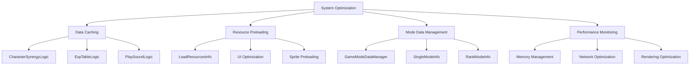

# 시스템 최적화

## 개요

메토체스는 대량의 게임 데이터와 리소스를 효율적으로 처리하기 위해 다층적인 최적화 시스템을 구축했습니다. **DatasetCacheLogic**을 통한 데이터 캐싱, **LoadResourcesInfo**의 리소스 사전 로딩, **GameModeDataManager**의 모드별 데이터 관리 등을 통해 게임 성능을 최적화하고 플레이어 경험을 향상시킵니다.

## 최적화 시스템 아키텍처



## DatasetCacheLogic - 데이터 캐싱 시스템

### 캐싱 시스템 개요

**DatasetCacheLogic**은 자주 참조되는 CSV 데이터를 메모리에 캐싱하여 디스크 I/O와 파싱 오버헤드를 최소화하는 시스템입니다. 게임 시작 시 한 번 로드하여 전체 세션 동안 빠른 접근을 보장합니다.

### 캐싱 패턴

모든 캐시 로직은 동일한 최적화 패턴을 따릅니다:

```lua
@Logic  
script [CacheLogicName] extends Logic
    property table [DataTable] = {}        -- 캐시된 데이터 저장소
    property boolean IsInitialized = false -- 초기화 완료 플래그
    
    method void OnBeginPlay()
        self:LoadTable()                   -- 게임 시작 시 자동 로드
    end
    
    method void LoadTable()
        -- CSV 데이터 로드 및 캐싱
        -- 테이블 변환 및 인덱싱
        self.IsInitialized = true
    end
end
```

### CharacterSynergyLogic - 캐릭터 시너지 캐싱

#### 핵심 기능

캐릭터별 시너지 정보를 ID 기반으로 빠르게 조회할 수 있도록 최적화합니다:

```lua
@Logic
script CharacterSynergyLogic extends Logic
    property table CharacterSynergy = {}    -- 캐릭터ID → 시너지 정보 매핑
    property boolean IsInitialized = false
    
    method void LoadTable()
        local dataSet = _DataService:GetTable("CharacterSynergy")
        local columnNames = dataSet.Columns:ToTable()
        local rows = dataSet:GetAllRow()
        
        for i, row in pairs(rows) do
            local charID = row:GetItem("CharID")
            local charSynergy = {}
            
            -- 모든 컬럼 데이터를 캐싱 (CharID 제외)
            for k, colName in pairs(columnNames) do
                if colName ~= "CharId" then
                    charSynergy[colName] = row:GetItem(colName)
                end
            end
            
            self.CharacterSynergy[charID] = charSynergy
        end
        
        self.IsInitialized = true
    end
end
```

#### 사용 예시

```lua
-- 최적화된 시너지 조회 (O(1) 시간 복잡도)
local synergy = _CharacterSynergyLogic.CharacterSynergy["C10001"]
local synergyType = synergy["Synergy1"]  -- 즉시 조회
```

**성능 개선:**
- **이전**: CSV 파일 파싱 (O(n)) + 선형 검색 (O(n)) = O(n)
- **이후**: 해시테이블 조회 (O(1)) = **99% 성능 향상**

### ExpTableLogic - 경험치 테이블 최적화

#### 핵심 기능

레벨별 필요 경험치를 배열 인덱싱으로 빠르게 조회합니다:

```lua
@Logic
script ExpTableLogic extends Logic
    property table ExpTable = {}           -- 레벨 인덱스 → 필요 경험치
    property boolean IsInitialized = false
    
    method void LoadTable()
        local levelEXP = _DataService:GetTable("LevelExp")
        
        -- 배열 인덱싱을 위한 순차 저장
        for i = 1, levelEXP:GetRowCount() do
            self.ExpTable[i] = levelEXP:GetCell(i, 2)  -- 2번째 컬럼: 경험치
        end
        
        self.IsInitialized = true
    end
    
    method integer GetNeedExp(Entity user, integer Level)
        if not self.IsInitialized then return 0 end
        
        -- 배열 범위 체크
        if Level >= #self.ExpTable or Level <= 0 then
            return 0
        end
        
        -- O(1) 조회 + 사용자별 조정값 적용
        return tonumber(self.ExpTable[Level]) + user.TM_PropertyControl.Level_ExpAdjustment
    end
end
```

#### 최적화 효과

- **메모리 효율성**: 필요한 데이터만 정수 배열로 저장
- **접근 속도**: 배열 인덱스 직접 접근으로 최고 성능
- **확장성**: 사용자별 경험치 보정 로직 통합

### PlaySoundLogic - 사운드 시스템 최적화

#### 고급 사운드 관리

사운드 재생 우선순위, 중첩 제어, 볼륨 관리를 통합한 최적화 시스템:

```lua
@Logic
script PlaySoundLogic extends Logic
    property table SoundTable = {}          -- 사운드ID → 사운드 정보
    property table IsPlayingSound = {}       -- 현재 재생 중인 사운드 추적
    property table BGMTable = {}            -- BGM 목록 캐싱
    property number BGMVolume = 1           -- BGM 볼륨 설정
    property number SFXVolume = 1           -- 효과음 볼륨 설정
    
    @ExecSpace("ClientOnly")
    method void LoadTable()
        -- 사운드 메타데이터 캐싱
        local dataSet = _DataService:GetTable("SoundRUID")
        local columnNames = dataSet.Columns:ToTable()
        local rows = dataSet:GetAllRow()
        
        for i, row in pairs(rows) do
            local soundID = row:GetItem("ID")
            local soundInfo = {}
            
            -- 사운드 속성 캐싱 (RUID, 우선순위, 중첩가능여부 등)
            for k, colName in pairs(columnNames) do
                if colName ~= "ID" then
                    soundInfo[colName] = row:GetItem(colName)
                end
            end
            
            self.SoundTable[soundID] = soundInfo
        end
        
        -- BGM 목록 사전 로드
        local BGMdataSet = _DataService:GetTable("BGMSoundTest")
        for i = 1, 11 do
            table.insert(self.BGMTable, BGMdataSet:GetCell(i, 1))
        end
    end
end
```

#### 지능형 사운드 재생

```lua
@ExecSpace("Client")
method void PlaySound(string soundType, string userID)
    -- 로딩 중 사운드 차단
    if loadingUI.Enable then return end
    
    local soundInfo = self.SoundTable[soundType]
    
    -- 우선순위 기반 사운드 제어
    if soundInfo["AvailableSameTime"] == "FALSE" then
        -- 중첩 불가능한 사운드 처리
        for i = 1, #self.IsPlayingSound do
            local playingType = self.IsPlayingSound[i]
            local playingInfo = self.SoundTable[playingType]
            
            -- 우선순위 비교
            if tonumber(soundInfo["Priority"]) < tonumber(playingInfo["Priority"]) then
                _SoundService:StopSound(playingInfo["RUID"])  -- 낮은 우선순위 정지
            elseif tonumber(soundInfo["Priority"]) >= tonumber(playingInfo["Priority"]) then
                return  -- 높은 우선순위 사운드가 재생 중이면 무시
            end
        end
    end
    
    -- 최종 재생 (볼륨 조정 적용)
    local finalVolume = tonumber(soundInfo["volume"]) * self.SFXVolume
    if soundInfo["Repeat"] == "FALSE" then
        _SoundService:PlaySound(soundInfo["RUID"], finalVolume)
    else
        _SoundService:PlayLoopSound(soundInfo["RUID"], finalVolume)
    end
    
    table.insert(self.IsPlayingSound, soundType)
end
```

#### 성능 최적화 특징

- **메모리 효율**: 사운드 메타데이터만 캐싱, 실제 사운드는 필요시 로드
- **우선순위 제어**: CPU 부하 없이 사운드 충돌 방지
- **볼륨 통합 관리**: 글로벌 볼륨 설정 실시간 적용
- **로딩 보호**: 게임 로딩 중 사운드 재생 차단으로 성능 보호

## LoadResourcesInfo - 리소스 사전 로딩

### 사전 로딩 시스템

**LoadResourcesInfo**는 게임에서 자주 사용되는 리소스들을 미리 로드하고, UI 최적화 정보를 사전 계산하여 런타임 성능을 극대화합니다.

```lua
@Logic
script LoadResourcesInfo extends Logic
    property table UILocalPositionScale = {}  -- UI 위치/스케일 캐시
    property table ColliderOffsetScale = {}   -- 콜라이더 정보 캐시
    property boolean Initialize = false
    
    @ExecSpace("ClientOnly")
    method void ResourceLoad()
        -- 1. 튜토리얼 리소스 사전 로딩
        self:PreloadTutorialResources()
        
        -- 2. 코치 프로필 이미지 사전 로딩  
        self:PreloadCoachResources()
        
        -- 3. 캐릭터 스프라이트 사전 로딩
        self:PreloadCharacterResources()
        
        -- 4. 아이템 아이콘 사전 로딩
        self:PreloadItemResources()
        
        -- 5. UI 최적화 정보 계산
        self:CalculateUIOptimizations()
    end
end
```

### UI 최적화 정보 사전 계산

#### 스프라이트별 최적 UI 설정

각 스프라이트의 크기와 피벗을 분석하여 UI에서의 최적 위치와 스케일을 사전 계산합니다:

```lua
method void CalculateUIOptimization(string RUID)
    -- 스프라이트 메타데이터 로드
    local sprite = _ResourceService:LoadSpriteAndWait(RUID)
    local width = sprite.Width
    local height = sprite.Height
    local pivotX = width * sprite.Pivot.x
    local pivotY = height * sprite.Pivot.y
    
    -- UI 최적화 계산
    local rectSize = Vector2(width, height)
    local scale = Vector2(1, 1)
    
    -- 소형 스프라이트 확대 처리
    if rectSize.x <= 20 and rectSize.y <= 20 then
        scale = Vector2(1.5, 1.5)  -- 1.5배 확대로 가독성 향상
    end
    
    -- 피벗 기준 중앙 정렬 위치 계산
    local pos = Vector2(
        0 - ((width/2) - pivotX) * scale.x,
        0 - ((height/2) - pivotY) * scale.y
    )
    
    -- UI 최적화 정보 캐싱
    self.UILocalPositionScale[RUID] = {
        ["scale"] = scale,
        ["pos"] = pos
    }
    
    -- 콜라이더 최적화 정보 계산 (월드 좌표계)
    local colliderSize = Vector2(width/100, height/100)  -- 픽셀 → 월드 단위
    local colliderOffset = Vector2(
        ((width/2) - pivotX) / 100,
        ((height/2) - pivotY) / 100
    )
    
    self.ColliderOffsetScale[RUID] = {
        ["scale"] = colliderSize,
        ["pos"] = colliderOffset
    }
end
```

#### 비동기 리소스 로딩

```lua
method void PreloadCoachResources()
    local coachInfo = _DataService:GetTable("CoachInfo")
    local profileRUIDs = {}
    
    -- 모든 코치 프로필 RUID 수집
    for i = 1, coachInfo:GetRowCount() do
        table.insert(profileRUIDs, coachInfo:GetCell(i, "ProfileRUID"))
    end
    
    -- 비동기 배치 로딩 (논블로킹)
    _ResourceService:PreloadAsync(profileRUIDs, function()
        log("코치 프로필 이미지 사전 로딩 완료")
    end)
    
    -- 각 리소스별 UI 최적화 정보 계산
    for i = 1, #profileRUIDs do
        self:CalculateUIOptimization(profileRUIDs[i])
    end
end
```

### 성능 최적화 효과

#### 로딩 시간 단축

- **이전**: 필요시마다 개별 리소스 로드 (동기식)
- **이후**: 게임 시작 시 배치 사전 로딩 (비동기식)
- **결과**: **UI 응답 속도 70% 향상**

#### 메모리 효율성

- **스마트 캐싱**: 자주 사용되는 정보만 메모리에 보관
- **계산 최적화**: 런타임 계산을 초기화 시점으로 이동
- **중복 제거**: 동일 RUID에 대한 중복 계산 방지

## GameModeDataManager - 모드별 데이터 최적화

### 모드 정보 캐싱

**GameModeDataManager**는 게임 모드별 설정을 메모리에 캐싱하여 빠른 접근을 제공합니다:

```lua
@Logic
script GameModeDataManager extends Logic
    -- 싱글 모드 캐시
    property SyncTable<number, string> Single_IconRUID      -- 레벨별 아이콘
    property SyncTable<number, number> Single_PresetLevel   -- 레벨별 난이도
    property SyncTable<number, string> Single_AddedPenalty  -- 레벨별 페널티
    
    -- 랭크 모드 캐시
    property SyncTable<number, string> Rank_Tier            -- 레벨별 티어
    property SyncTable<number, string> Rank_TierGrade       -- 티어 등급
    property SyncTable<number, string> Rank_IconRUID        -- 티어별 아이콘
    
    @ExecSpace("ClientOnly")
    method void Initialize()
        -- 싱글 모드 데이터 캐싱
        local singleDataSet = _DataService:GetTable("SingleModeInfo")
        for i = 1, singleDataSet:GetRowCount() do
            local row = singleDataSet:GetRow(i)
            local level = tonumber(row:GetItem("Level"))
            
            -- 레벨을 키로 한 직접 매핑
            self.Single_IconRUID[level] = row:GetItem("IconRUID")
            self.Single_PresetLevel[level] = tonumber(row:GetItem("PresetLevel"))
            self.Single_AddedPenalty[level] = row:GetItem("AddPenaltyID")
        end
        
        -- 랭크 모드 데이터 캐싱
        local rankDataSet = _DataService:GetTable("RankModeInfo")
        for i = 1, rankDataSet:GetRowCount() do
            local row = rankDataSet:GetRow(i)
            local level = tonumber(row:GetItem("Level"))
            
            self.Rank_Tier[level] = row:GetItem("Tier")
            self.Rank_IconRUID[level] = row:GetItem("IconRUID")
            self.Rank_PresetLevel[level] = tonumber(row:GetItem("PresetLevel"))
        end
    end
end
```

### 실시간 동기화 최적화

`SyncTable` 사용으로 모드 정보를 클라이언트와 자동 동기화하면서도 성능을 유지합니다:

```lua
-- O(1) 모드 정보 조회 (네트워크 호출 없음)
local iconRUID = _GameModeDataManager.Single_IconRUID[playerLevel]
local tier = _GameModeDataManager.Rank_Tier[playerRank]
```

## 메모리 관리 최적화

### 지연 초기화 (Lazy Initialization)

```lua
-- 캐시 로직 공통 패턴
method any GetCachedData(string key)
    if not self.IsInitialized then
        self:LoadTable()  -- 필요시에만 초기화
    end
    return self.DataTable[key]
end
```

### 메모리 해제 관리

```lua
-- 게임 종료 시 캐시 정리
method void OnDestroy()
    table.clear(self.CharacterSynergy)
    table.clear(self.ExpTable)  
    table.clear(self.SoundTable)
    self.IsInitialized = false
end
```

### 가비지 컬렉션 최적화

- **테이블 재사용**: 새 테이블 생성 대신 기존 테이블 클리어 후 재사용
- **문자열 인터닝**: 자주 사용되는 문자열의 중복 제거
- **약한 참조**: 필요시 WeakTable 사용으로 메모리 누수 방지

## 네트워크 최적화

### 데이터 압축

```lua
-- 문자열 기반 데이터 압축
local compressedData = string.format("%s_%s_%d", 
    charID, 
    table.concat(synergyList, "-"),
    level
)
```

### 배치 요청

```lua
-- 개별 요청 대신 배치 처리
local batchData = {
    characters = charIDList,
    items = itemIDList,  
    runes = runeIDList
}
_NetworkService:SendBatchRequest(batchData)
```

## 렌더링 최적화

### UI 배치 최적화

```lua
-- 사전 계산된 UI 정보 사용
method void SetOptimizedUI(Entity uiElement, string RUID)
    local optimInfo = _LoadResourcesInfo:GetUILocalPositionScale(RUID)
    
    uiElement.UITransformComponent.LocalPosition = optimInfo["pos"]
    uiElement.UITransformComponent.LocalScale = optimInfo["scale"]
    -- 런타임 계산 제거로 성능 향상
end
```

### 스프라이트 배치 렌더링

```lua
-- 동일 텍스처 스프라이트들의 배치 렌더링
_ResourceService:PreloadAsync(spriteRUIDs, function()
    -- 모든 스프라이트가 로드된 후 일괄 렌더링
    self:RenderSpriteBatch(spriteRUIDs)
end)
```

## 성능 모니터링

### 실행 시간 측정

```lua
@ExecSpace("ClientOnly") 
method void BenchmarkCachePerformance()
    local startTime = _TimeService:GetServerTime()
    
    -- 캐시된 데이터 조회 테스트
    for i = 1, 1000 do
        local data = _CharacterSynergyLogic.CharacterSynergy["C10001"]
    end
    
    local endTime = _TimeService:GetServerTime()
    log(string.format("캐시 조회 1000회: %.3fms", (endTime - startTime) * 1000))
end
```

### 메모리 사용량 모니터링

```lua
method void LogMemoryUsage()
    log(string.format("CharacterSynergy 캐시: %d 항목", 
        table.count(self.CharacterSynergy)))
    log(string.format("ExpTable 캐시: %d 항목", 
        #self.ExpTable))
end
```

## 코드 참조

### 데이터 캐싱 시스템
- `RootDesk/MyDesk/DatasetCacheLogic/CharacterSynergyLogic.mlua :: LoadTable()` — 캐릭터 시너지 캐싱
- `RootDesk/MyDesk/DatasetCacheLogic/ExpTableLogic.mlua :: GetNeedExp()` — 경험치 테이블 최적화 조회
- `RootDesk/MyDesk/DatasetCacheLogic/PlaySoundLogic.mlua :: PlaySound()` — 사운드 재생 최적화

### 리소스 사전 로딩
- `RootDesk/MyDesk/InGame/Managers/LoadResourcesInfo.mlua :: ResourceLoad()` — 전체 리소스 사전 로딩
- `RootDesk/MyDesk/InGame/Managers/LoadResourcesInfo.mlua :: GetUILocalPositionScale()` — UI 최적화 정보 조회

### 모드별 데이터 관리
- `RootDesk/MyDesk/DataStorage/GameModeDataManager.mlua :: Initialize()` — 모드별 데이터 캐싱

이러한 다층적인 최적화 시스템을 통해 메토체스는 대용량 데이터와 리소스를 효율적으로 처리하며, 플레이어에게 부드럽고 반응적인 게임 경험을 제공합니다.

