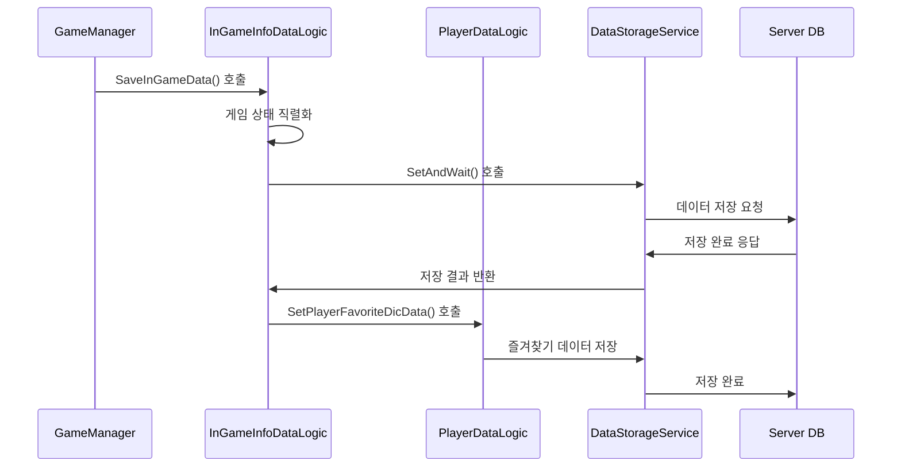
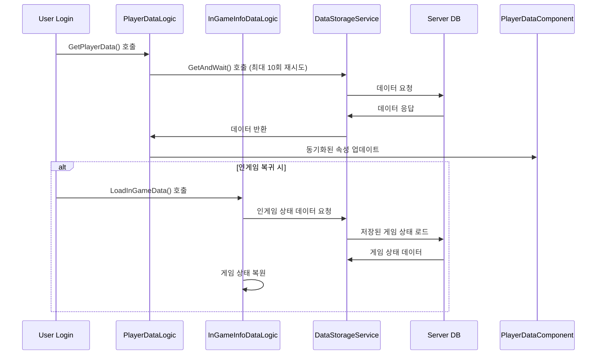

# 플레이어 데이터 시스템

## 개요

메토체스의 플레이어 데이터 시스템은 **아웃게임 영속 데이터**와 **인게임 진행 상태**를 통합 관리합니다. **PlayerDataLogic**과 **InGameInfoDataLogic**를 중심으로 플레이어의 모든 진행도를 안전하게 저장하고 복원하며, 서버-클라이언트 간 실시간 동기화를 통해 일관된 게임 경험을 제공합니다.

## 데이터 시스템 아키텍처

```mermaid
graph TD
    A[Player Data System] --> B[PlayerDataLogic]
    A --> C[InGameInfoDataLogic]
    A --> D[PlayerDataComponent]
    A --> E[GameModeDataManager]
    
    B --> B1[아웃게임 영속 데이터]
    B1 --> B11[업적 시스템]
    B1 --> B12[코치 컬렉션]
    B1 --> B13[타이틀 관리]
    B1 --> B14[플레이어 레벨/경험치]
    B1 --> B15[컬렉션 진행도]
    
    C --> C1[인게임 진행 상태]
    C1 --> C11[게임 진행도]
    C1 --> C12[유닛 정보]
    C1 --> C13[룬카드 장착]
    C1 --> C14[상점 상태]
    
    D --> D1[실시간 동기화]
    D1 --> D11[@TargetUserSync]
    D1 --> D12[클라이언트 동기화]
    
    F[DataStorageService] --> G[서버 DB]
    B --> F
    C --> F
```

## PlayerDataLogic - 아웃게임 데이터 관리

### 핵심 역할

**PlayerDataLogic**은 플레이어의 **영속적인 진행도**를 관리하는 핵심 시스템입니다. 게임 접속 시 모든 아웃게임 데이터를 로드하고, 게임 진행에 따라 업데이트합니다.

```lua
@Logic
script PlayerDataLogic extends Logic
    property string SetVer = "OpenBeta"  -- 데이터 버전 관리
    
    @ExecSpace("ServerOnly")
    method void GetPlayerData(string userID)
        -- 플레이어 접속 시 모든 데이터 로드
        self:GetLastLoginDateData(userID)           -- 최종 로그인 일자
        self:GetAchievementData(userID)             -- 업적 진행도
        self:GetCoachesData(userID)                 -- 보유 코치들
        self:GetTitleData(userID)                   -- 획득한 타이틀들
        self:GetPlayerRecordData(userID)            -- 플레이 기록
        self:GetPlayerSyrupsData(userID, true)      -- 보유 통화 (시럽/다이아)
        self:GetPlayerFavoriteDicData(userID)       -- 즐겨찾기 사전
        self:GetCollectionData(userID)              -- 컬렉션 진행도
        self:GetPlayerLevelData(userID)             -- 레벨과 경험치
        self:GetPlayerTutorialData(userID)          -- 튜토리얼 진행도
        self:GetPlayerChallengeInfoData(userID)     -- 챌린지 정보
        self:GetPlayerDailyMissionData(userID)      -- 일일 미션 진행도
        
        self:SetPlayerInfoData(userID)              -- 최종 플레이어 정보 설정
    end
end
```

### 주요 데이터 카테고리

#### 1. 업적 시스템 데이터

업적 데이터는 복잡한 문자열 구조로 저장되며, 각 업적의 상태와 진행도를 추적합니다:

```lua
@ExecSpace("ServerOnly")
method void GetAchievementData(string userID)
    -- 데이터 포맷: (ID)_(state-state-state)_(count)_(date-date-date)
    local p_err, pachieve_Data = _DataStorageService:GetUserDataStorage(userID):GetAndWait(
        string.format("PlayerAchievementData_%s", self.SetVer)
    )
    
    -- 최대 10회 재시도로 안정성 보장
    for i = 1, 10 do
        if p_err == 0 then
            break
        elseif i == 10 then
            _UserService:KickUser(userID, KickReason.WorldContent)  -- 실패 시 강제 퇴장
        end
    end
    
    -- 데이터 파싱 및 적용
    if isvalid(pachieve_Data) then
        local achievementList = _UtilLogic:Split(pachieve_Data, ",")
        for _, data in pairs(achievementList) do
            local aData = _UtilLogic:Split(data, "_")
            local aID = aData[1]
            local aStateTable = _UtilLogic:Split(aData[2], "-")
            local aCount = tonumber(aData[3])
            local aDateTable = _UtilLogic:Split(aData[4], "-")
            
            achievementManager.PlayerAchievementData[aID] = {
                ["state"] = aStateTable, 
                ["count"] = aCount, 
                ["date"] = aDateTable
            }
        end
    end
end
```

#### 2. 코치 컬렉션 데이터

플레이어가 보유한 모든 코치들의 정보를 관리합니다:

```lua
-- 코치 데이터 구조
-- CoachID1,CoachID2,CoachID3,... 형태로 저장
local coachData = _UtilLogic:Split(pcoaches_Data, ",")
for _, coach in pairs(coachData) do
    coachManager.CoachList[coach] = true  -- 보유 코치 목록에 추가
end
```

#### 3. 플레이어 레벨 시스템

경험치와 레벨 정보를 관리하며, 레벨업 보상을 처리합니다:

```lua
-- 레벨 데이터 로드
local p_err, pLevel_Data = _DataStorageService:GetUserDataStorage(userID):GetAndWait(
    string.format("PlayerLevel_%s", self.SetVer)
)

local levelData = _UtilLogic:Split(pLevel_Data, "_")
playerDataComponent.Level = tonumber(levelData[1])
playerDataComponent.EXP = tonumber(levelData[2])
```

#### 4. 컬렉션 진행도

캐릭터 카드와 시너지 뱃지 수집 현황을 추적합니다:

```lua
-- 컬렉션 데이터 구조
-- CharacterCard: "C10001,C10002,C10003,..."
-- SynergyBadge: "SY001-Bronze,SY002-Silver,SY003-Gold,..."
```

## InGameInfoDataLogic - 인게임 진행 상태 관리

### 핵심 역할

**InGameInfoDataLogic**은 현재 진행 중인 게임의 **모든 상태 정보**를 저장하고 복원합니다. 게임 중단 시에도 정확한 시점부터 재개할 수 있도록 세밀한 상태 관리를 수행합니다.

```lua
@Logic
script InGameInfoDataLogic extends Logic
    
    @ExecSpace("ServerOnly")
    method void SaveInGameData(string userID)
        -- 인게임 모든 상태 저장
        self:SaveInGameInfoData(user)           -- 게임 기본 정보
        self:SaveInGameTeamInfoData(user)       -- 팀 상태 정보
        self:SaveInGameUnitInfoData(user)       -- 유닛 배치 정보
        self:SaveInGameRuneInfoData(user)       -- 룬카드 장착 정보
        self:SaveInGameTeamPropertyInfoData(user) -- 팀 속성 정보
        
        -- 전투 통계 저장
        self:SaveGameUnitBattleStatisticsData(user, 0)
        self:SaveGameTeamBattleStatisticsData(user, 0)
        
        self:SetSavedDataDB(true, user)         -- 저장 완료 플래그
    end
    
    @ExecSpace("ServerOnly") 
    method void LoadInGameData(string userID)
        -- 저장된 인게임 상태 복원
        self:LoadInGameInfoData(userID)         -- 게임 기본 정보 복원
        self:LoadInGameTeamInfoData(userID)     -- 팀 상태 복원
        self:LoadInGameUnitInfoData(userID)     -- 유닛 배치 복원
        self:LoadInGameRuneInfoData(userID)     -- 룬카드 장착 복원
        self:LoadInGameTeamPropertyInfoData(userID) -- 팀 속성 복원
        
        -- 전투 통계 복원
        self:LoadInGameUnitBattleStatisticsData(userID)
        self:LoadInGameTeamBattleStatisticsData(userID)
    end
end
```

### 게임 기본 정보 저장/로드

#### 저장할 게임 정보

```lua
@ExecSpace("ServerOnly")
method void SaveInGameInfoData(Entity user)
    local gameInfoTable = {}
    
    -- 모드 및 진행 정보
    gameInfoTable["ModeVersion"] = gameManager.ModeSetVersion
    gameInfoTable["ModeType"] = gameManager.ModeType        -- Single/Rank/Challenge
    gameInfoTable["ModeLevel"] = gameManager.ModeLevel      -- 난이도
    gameInfoTable["PhaseType"] = gameManager.PhaseType      -- Ready/Battle/Clean
    gameInfoTable["PlayTime"] = gameManager.PlayTime        -- 총 플레이 시간
    
    -- 게임 진행도
    gameInfoTable["Stage"] = gameManager.Stage              -- 현재 스테이지
    gameInfoTable["Round"] = gameManager.Round              -- 현재 라운드
    gameInfoTable["Round83"] = gameManager.Round8_3Num      -- 8-3 라운드 번호
    
    -- 전투 관련
    gameInfoTable["NextEnemyPresetID"] = gameManager.NextEnemyPresetID
    
    -- 상점 상태
    gameInfoTable["CharShopRerollCount"] = charShopManager.RerollCount
    gameInfoTable["CharShopLineUp"] = table.concat(charShopManager.LineUp, ",")
    gameInfoTable["ItemShopLineUp"] = table.concat(specialShopManager.ItemLineUp, ",")
    gameInfoTable["RuneShopLineUp"] = table.concat(specialShopManager.RuneLineUp, ",")
    
    -- JSON 직렬화하여 저장
    local gameInfoJSON = _HttpService:JSONEncode(gameInfoTable)
    local saveResult = _DataStorageService:GetUserDataStorage(userID):SetAndWait(
        string.format("InGameInfo_%s", _PlayerDataLogic.SetVer), 
        gameInfoJSON
    )
end
```

### 팀 정보 저장/로드

플레이어의 현재 팀 상태 (체력, 골드, 레벨 등)를 저장합니다:

```lua
-- 팀 기본 정보
teamInfoTable["TeamHP"] = teamManager.TeamHP
teamInfoTable["Golds"] = teamManager.Golds  
teamInfoTable["TeamLevel"] = teamManager.TeamLevel
teamInfoTable["TeamEXP"] = teamManager.TeamEXP
teamInfoTable["WinningStreak"] = teamManager.WinningStreak
teamInfoTable["LoseStreak"] = teamManager.LoseStreak

-- 보유 아이템 목록 (ID:개수 형태)
local itemList = {}
for itemID, count in pairs(teamManager.ItemList) do
    table.insert(itemList, string.format("%s:%d", itemID, count))
end
teamInfoTable["ItemList"] = table.concat(itemList, ",")
```

### 유닛 배치 정보 저장/로드

현재 필드와 대기석의 모든 유닛 상태를 저장합니다:

```lua
-- 유닛 정보 직렬화
local unitInfoList = {}
for _, unit in pairs(teamManager.UnitList) do
    local unitData = {
        ID = unit.UnitInfo.ID,
        StarLevel = unit.UnitInfo.StarLevel,
        TilePos = string.format("%d,%d", unit.UnitInfo.TileX, unit.UnitInfo.TileY),
        ItemList = table.concat(unit.UnitInfo.ItemList, "-"),
        -- 추가 유닛 상태 정보들...
    }
    table.insert(unitInfoList, _HttpService:JSONEncode(unitData))
end
teamInfoTable["UnitList"] = table.concat(unitInfoList, "|")
```

## PlayerDataComponent - 실시간 동기화

### 동기화 시스템

**PlayerDataComponent**는 플레이어의 핵심 데이터를 **@TargetUserSync** 속성을 통해 실시간으로 클라이언트와 동기화합니다:

```lua
@Component
script PlayerDataComponent extends Component
    
    -- 게임 진행도 (모드별 클리어 레벨)
    @TargetUserSync
    property SyncTable<string, number> ClearLevelByMode
    
    @TargetUserSync  
    property SyncTable<string, number> ClearStageByMode
    
    -- 플레이 통계
    @TargetUserSync
    property number StartGameCount = 0      -- 시작한 게임 수
    
    @TargetUserSync
    property number PlayGameCount = 0       -- 플레이한 게임 수
    
    @TargetUserSync
    property number WinGameCount = 0        -- 승리한 게임 수
    
    -- 플레이어 레벨 시스템
    @TargetUserSync
    property integer Level = 0              -- 현재 레벨
    
    @TargetUserSync
    property integer EXP = 0                -- 현재 경험치
    
    -- 게임 통화
    @TargetUserSync
    property integer Syrup = 0              -- 일반 화폐
    
    @TargetUserSync
    property integer RoyalSyrup = 0         -- 프리미엄 화폐
    
    -- 부활권
    @TargetUserSync
    property integer Repechage = 0          -- 유료 부활권
    
    @TargetUserSync
    property integer Repechage_Free = 0     -- 무료 부활권
end
```

### 프로필 시스템

플레이어 프로필에 표시되는 최근 게임 기록들을 관리합니다:

```lua
-- 게임 히스토리 (최대 10개 기록)
@TargetUserSync
property SyncTable<number, boolean> Profile_IsWin         -- 승리 여부

@TargetUserSync  
property SyncTable<number, string> Profile_ModeType       -- 게임 모드

@TargetUserSync
property SyncTable<number, number> Profile_ModeLevel      -- 난이도

@TargetUserSync
property SyncTable<number, string> Profile_LastRound      -- 도달한 라운드

@TargetUserSync
property SyncTable<number, string> Profile_UnitInfo       -- 사용한 유닛들

@TargetUserSync  
property SyncTable<number, string> Profile_RuneList       -- 장착한 룬카드들

-- 공개 설정
@TargetUserSync
property boolean Profile_Record_IsPublic = false          -- 기록 공개 여부

@TargetUserSync
property boolean Profile_History_IsPublic = false         -- 히스토리 공개 여부
```

### 즐겨찾기 시스템

백과사전의 즐겨찾기 항목들을 동기화합니다:

```lua
@TargetUserSync
property SyncTable<string> fave_Character_Dictionary       -- 즐겨찾기 캐릭터

@TargetUserSync  
property SyncTable<string> fave_Item_Dictionary           -- 즐겨찾기 아이템

@TargetUserSync
property SyncTable<string> fave_Rune_Dictionary           -- 즐겨찾기 룬카드
```

## GameModeDataManager - 모드별 데이터

### 모드 정보 관리

**GameModeDataManager**는 각 게임 모드의 세부 설정을 관리합니다:

```lua
@Logic
script GameModeDataManager extends Logic
    
    -- 싱글 모드 설정
    property SyncTable<number, string> Single_IconRUID      -- 레벨별 아이콘
    property SyncTable<number, string> Single_BigIconRUID   -- 레벨별 큰 아이콘  
    property SyncTable<number, number> Single_PresetLevel   -- 레벨별 프리셋 난이도
    property SyncTable<number, string> Single_AddedPenalty  -- 레벨별 추가 페널티
    
    -- 랭크 모드 설정
    property SyncTable<number, string> Rank_Tier            -- 레벨별 티어
    property SyncTable<number, string> Rank_TierGrade       -- 티어 등급
    property SyncTable<number, string> Rank_IconRUID        -- 티어별 아이콘
    property SyncTable<number, string> Rank_BigIconRUID     -- 티어별 큰 아이콘
    property SyncTable<number, string> Rank_PresetLevel     -- 티어별 프리셋 난이도
    property SyncTable<number, string> Rank_EnemyLevel      -- 티어별 적 레벨
    
    @ExecSpace("ClientOnly")
    method void Initialize()
        -- CSV 데이터로부터 모드 정보 로드
        local singleDataSet = _DataService:GetTable("SingleModeInfo")
        local rankDataSet = _DataService:GetTable("RankModeInfo")
        
        -- 데이터 매핑 및 캐싱
    end
end
```

## 데이터 저장/로드 프로세스

### 저장 프로세스



### 로드 프로세스



### 오류 처리 및 복구

```lua
-- 데이터 로드 시 안정성 보장
for i = 1, 10 do
    local p_err, data = _DataStorageService:GetUserDataStorage(userID):GetAndWait(dataKey)
    if p_err == 0 then
        break  -- 성공 시 루프 종료
    elseif i == 10 then
        -- 10회 실패 시 유저 강제 퇴장
        _UserService:KickUser(userID, KickReason.WorldContent)
        return
    end
    -- 재시도 대기시간 (선택적)
    wait(0.1)
end
```

## 데이터 버전 관리

### 버전 시스템

```lua
property string SetVer = "OpenBeta"  -- 현재 데이터 버전

-- 버전별 데이터 키 생성
local dataKey = string.format("PlayerAchievementData_%s", self.SetVer)
```

### 업그레이드 처리

- **버전 변경 시**: 기존 데이터를 새 버전으로 마이그레이션
- **호환성 유지**: 이전 버전 데이터의 점진적 업그레이드
- **롤백 지원**: 문제 발생 시 이전 버전으로 복구 가능

## 성능 최적화

### 데이터 압축

복잡한 데이터 구조를 문자열로 압축하여 저장 공간과 전송량을 최적화합니다:

```lua
-- 업적 데이터 압축: ID_state-state-state_count_date-date-date
local compressedData = string.format("%s_%s_%d_%s", 
    achievementID, 
    table.concat(stateList, "-"),
    count,
    table.concat(dateList, "-")
)
```

### 배치 처리

관련된 여러 데이터를 한 번에 저장하여 DB 호출 횟수를 최소화합니다:

```lua
-- 인게임 데이터 배치 저장
self:SaveInGameInfoData(user)
self:SaveInGameTeamInfoData(user) 
self:SaveInGameUnitInfoData(user)
self:SaveInGameRuneInfoData(user)
-- 한 번의 트랜잭션으로 처리
```

### 선택적 동기화

**@TargetUserSync** 속성을 통해 필요한 데이터만 클라이언트와 동기화하여 네트워크 부하를 줄입니다.

## 코드 참조

### 핵심 데이터 로직
- `RootDesk/MyDesk/DataStorage/PlayerDataLogic.mlua :: GetPlayerData()` — 아웃게임 데이터 로드
- `RootDesk/MyDesk/DataStorage/InGameInfoDataLogic.mlua :: SaveInGameData()` — 인게임 상태 저장
- `RootDesk/MyDesk/DataStorage/InGameInfoDataLogic.mlua :: LoadInGameData()` — 인게임 상태 복원

### 플레이어 컴포넌트
- `RootDesk/MyDesk/DataStorage/PlayerDataComponent.mlua` — 플레이어 동기화 속성들
- `RootDesk/MyDesk/DataStorage/GameModeDataManager.mlua :: Initialize()` — 모드별 데이터 초기화

### 개별 데이터 처리
- `RootDesk/MyDesk/DataStorage/PlayerDataLogic.mlua :: GetAchievementData()` — 업적 데이터 처리
- `RootDesk/MyDesk/DataStorage/PlayerDataLogic.mlua :: GetCoachesData()` — 코치 데이터 처리
- `RootDesk/MyDesk/DataStorage/PlayerDataLogic.mlua :: GetPlayerLevelData()` — 레벨 데이터 처리

이러한 통합적인 플레이어 데이터 시스템을 통해 메토체스는 플레이어의 모든 진행도를 안전하게 보존하고, 언제든지 중단한 지점부터 게임을 재개할 수 있는 견고한 시스템을 제공합니다.

