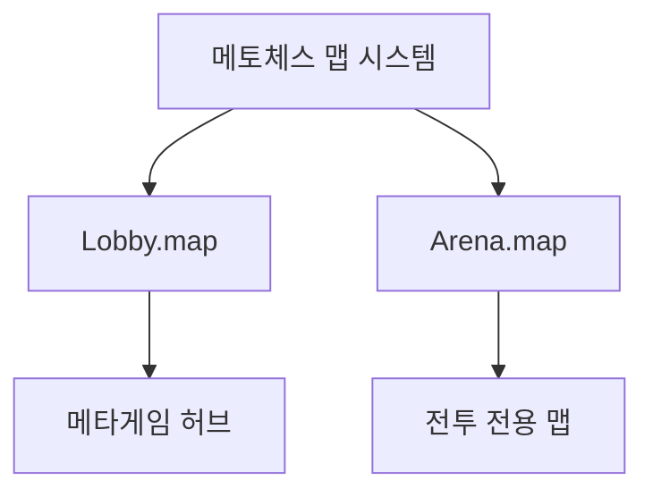

# 맵 구조와 컴포넌트

## 개요

메토체스는 2개의 주요 맵으로 구성되어 있으며, 각 맵은 게임의 특정 목적과 기능에 맞게 설계되어 있습니다. **MapleStory Worlds**의 맵 시스템을 기반으로 하여 엔티티-컴포넌트 구조로 구성됩니다.

## 전체 맵 구성



## 1. Lobby.map - 메타게임 허브

### 맵의 역할
**Lobby.map**은 플레이어들이 게임에 접속했을 때 만나는 **메타게임의 중심지**입니다. 모든 아웃게임 활동과 게임 모드 선택이 이곳에서 이루어집니다.

### 주요 구성 요소

#### 기본 맵 구조
```
Lobby/
├── Background/          # 배경 이미지
├── MapleMapLayer/      # MSW 맵 레이어
├── RectTileMap/        # 타일맵 시스템
├── SpawnLocation/      # 플레이어 스폰 지점들 (여러 개)
└── bground/            # 추가 배경 요소
```

#### NPC 시스템
로비에는 다양한 **NPC 캐릭터들**이 배치되어 분위기를 조성합니다:

| NPC 이름 | 역할 | 컴포넌트 구성 |
|----------|------|---------------|
| **npc-spiegelmann** | 메인 NPC | StateAnimation, ChatBalloon, NameTag |
| **npc-caster** | 해설자 캐릭터 | StateAnimation, ChatBalloon, NameTag |
| **npc-3fansLeft/Right** | 관중 NPC | StateAnimation, KinematicLayerOrder |
| **npc-noblesse** | 특별 NPC | StateAnimation 포함 |

#### CustomCameraComponent 기능
Lobby 맵에는 **CustomCameraComponent**가 부착되어 맵별 UI 제어를 담당합니다:

```lua
-- CustomCameraComponent :: OnBeginPlay()
if currentMapName == "Lobby" then
    ui_lobbyHUD.Enable = true           -- 로비 메인 UI 활성화
    ui_lobbycurrencyHUD.Enable = true   -- 통화 표시 UI 활성화
    
    -- 아레나 UI들 비활성화
    ui_arena_Default.Enable = false
    ui_arena_Ready.Enable = false
    ui_arena_battle.Enable = false
end
```

### 맵 설정 정보
- **EntryKey**: `map://lobby`
- **주요 컴포넌트**: MapComponent, FootholdComponent, CustomCameraComponent, SoundComponent
- **스폰 지점**: 다수의 SpawnLocation 엔티티로 여러 플레이어 동시 접속 지원

## 2. Arena.map - 전투 전용 맵

### 맵의 역할  
**Arena.map**은 실제 **오토 체스 전투**가 벌어지는 핵심 맵입니다. 게임판 구조와 전투 관련 모든 요소들이 체계적으로 배치되어 있습니다.

### 게임판 타일 시스템

#### Line-Tile 구조
Arena 맵의 가장 특징적인 요소는 **Line_X/Tile_Y** 형태의 체계적인 타일 배치입니다:

```
Arena/
├── Line_1/                    # 첫 번째 줄
│   ├── Tile_1/               # 1행 1열 타일
│   │   └── Knight/           # 타일 위 유닛 스프라이트
│   ├── Tile_2/               # 1행 2열 타일  
│   ├── Tile_3/               # 1행 3열 타일
│   └── ...
├── Line_2/                   # 두 번째 줄
│   ├── Tile_1/
│   ├── Tile_2/
│   └── ...
└── Line_8/                   # 최대 8줄까지 확장
```

#### TileComponent_New 시스템
Arena의 타일들은 **TileComponent_New**를 사용하여 향상된 기능을 제공합니다:

```lua
-- TileComponent_New의 주요 속성
property string Zone = "Neutral"     -- 영역 구분 (Neutral/Friendly/Enemy)
property string type = "Unit"        -- 타일 타입 (Unit/Item 등)
property number horizontalNum = 0    -- 가로 좌표 (동기화)
property number verticalNum = 0      -- 세로 좌표 (동기화)
```

**TileComponent vs TileComponent_New 비교:**

| 구분 | TileComponent (구버전) | TileComponent_New (신버전) |
|------|------------------------|---------------------------|
| **좌표 시스템** | rowNum, columnNum | horizontalNum, verticalNum |
| **동기화** | 서버 전용 | @Sync 속성으로 실시간 동기화 |
| **영역 관리** | roomType, roomNumber | Zone 기반 단순화 |
| **실행 공간** | Server 전용 로직 | Multicast 지원 |

### 전투 관련 특수 엔티티

#### SellZone - 판매 영역
```lua
-- SellZoneComponent 역할
-- ScreenTouchReleaseEvent 발생 시 마우스를 뗀 곳이 '판매 영역인가'를 판별
```
- **위치**: `/maps/Arena/SellZone`
- **역할**: 유닛/아이템 판매를 위한 드래그 앤 드롭 영역
- **컴포넌트**: SellZoneComponent, TouchReceiveComponent, TriggerComponent

#### UIDragSample - 드래그 샘플
- **위치**: `/maps/Arena/UIDragSample`  
- **역할**: 드래그 앤 드롭 시각적 피드백을 위한 샘플 엔티티
- **연결**: `_UnitSetLogic_New.DragSample`로 참조됨

#### 플레이어 정보 표시
- **AdventurerEntity**: 플레이어 아바타 및 정보
  - `Score`: 현재 점수 표시 (TextComponent)
  - `ExpBar`: 경험치 바 (SliderComponent)
- **CopiedUserEntity**: 다른 플레이어 정보 복사본

### 맵 설정 정보
- **EntryKey**: `map://arena`
- **주요 컴포넌트**: MapComponent, FootholdComponent, SoundComponent
- **Dynamic Map**: `IsDynamicMap = true` (동적 맵으로 설정)

## 맵별 엔티티 컴포넌트 구성

### 공통 기본 구조
모든 맵은 다음과 같은 **기본 엔티티들**을 공통으로 포함합니다:

| 엔티티 | 컴포넌트 | 역할 |
|--------|----------|------|
| **Root Map** | MapComponent, FootholdComponent | 맵의 기본 설정 |
| **Background** | BackgroundComponent | 배경 이미지 표시 |
| **MapleMapLayer** | MapLayerComponent | MSW 맵 레이어 |
| **RectTileMap** | RectTileMapComponent | 타일맵 시스템 |
| **SpawnLocation** | SpawnLocationComponent | 플레이어 스폰 지점 |

### 맵별 특화 컴포넌트

#### Lobby 맵 특화
- **CustomCameraComponent**: 맵별 UI 제어
- **NPC 시스템**: 다양한 배경 캐릭터들
- **UI 연동**: 로비 전용 UI 그룹 관리

#### Arena 맵 특화  
- **TileComponent_New**: 향상된 타일 시스템
- **SellZoneComponent**: 판매 영역 감지
- **Dynamic Map**: 실시간 변화 지원
- **전투 UI**: Arena 전용 UI 그룹


## 맵 전환 시 초기화 과정

### GameManager의 맵 감지
```lua
-- GameManager :: OnMapEnter(Entity enteredMap)
if enteredMap.MapComponent.IsDynamicMap == true then
    -- 아레나/필드 맵 (동적 맵) 진입 시
    self.Entity.MovementComponent.Enable = false
    self.Stage = 1
    self.Round = 1
    -- 유닛 샘플 스폰 및 게임 초기화
elseif enteredMap.Name == "Lobby" then
    -- 로비 맵 진입 시
    self.Entity.MovementComponent.Enable = true
end
```

### UI 시스템 연동
**CustomCameraComponent**가 맵 변경을 감지하여 적절한 UI 그룹을 활성화합니다:

1. **로비 진입**: Lobby_HUD, Lobby_CurrencyHUD 활성화
2. **아레나 진입**: Arena_Default, Arena_ReadyPhase 활성화  
3. **기존 UI 비활성화**: 이전 맵의 UI 요소들 정리

## 맵 시스템의 확장성

### 새로운 맵 추가 시 고려사항
1. **EntryKey 설정**: `map://맵이름` 형식
2. **기본 엔티티**: MapComponent, Background, SpawnLocation 필수
3. **특화 컴포넌트**: 맵의 목적에 맞는 고유 기능 추가
4. **UI 연동**: CustomCameraComponent에서 UI 제어 로직 추가

### 맵 간 데이터 공유
- **PlayerDataComponent**: 맵 전환 시에도 유지되는 플레이어 데이터
- **GameManager**: 게임 상태 정보의 맵 간 연속성
- **TeamManager**: 팀 정보의 지속적 관리

## 코드 참조

### 맵 시스템 핵심
- `map/Arena.map` :: 전투용 맵 엔티티 구성
- `map/Lobby.map` :: 로비 맵 엔티티 구성

### 맵 관련 컴포넌트
- `RootDesk/MyDesk/InGame/CustomCameraComponent.mlua :: OnBeginPlay()` — 맵별 UI 제어
- `RootDesk/MyDesk/InGame/TileComponent_New.mlua :: TileSet()` — 타일 시스템 설정
- `RootDesk/MyDesk/InGame/Managers/SellZoneComponent.mlua` — 판매 영역 감지

### 맵 전환 처리
- `RootDesk/MyDesk/InGame/Managers/GameManager.mlua :: OnMapEnter()` — 맵 진입 시 초기화
- `RootDesk/MyDesk/InGame/System/UnitSetLogic_New.mlua :: SettingTile()` — 타일 시스템 설정

이러한 맵 시스템을 통해 각각의 목적에 맞는 최적화된 게임 환경을 제공하며, 플레이어는 자연스럽고 몰입감 있는 게임 경험을 할 수 있습니다.

