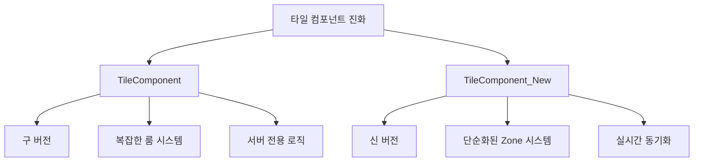
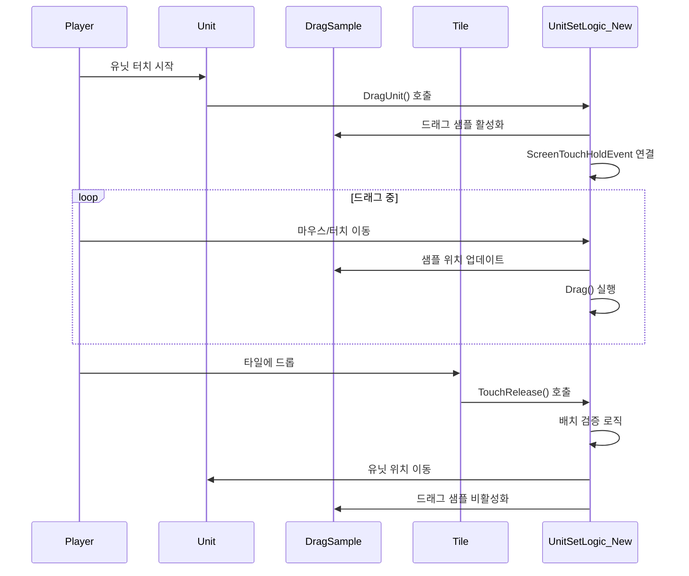

# 타일 시스템

## 개요

메토체스의 타일 시스템은 **오토 체스 게임의 핵심**인 유닛 배치와 상호작용을 담당합니다. **Line-Tile 구조**를 기반으로 하며, 드래그앤드롭을 통한 직관적인 유닛 배치와 정교한 터치 이벤트 처리를 제공합니다.

## 타일 컴포넌트 비교

### TileComponent vs TileComponent_New

메토체스는 기존 `TileComponent`에서 개선된 `TileComponent_New`로 전환하여 더 나은 성능과 기능을 제공합니다.



#### 주요 차이점 비교

| 구분 | TileComponent (구버전) | TileComponent_New (신버전) |
|------|----------------------|--------------------------|
| **좌표 시스템** | `rowNum`, `columnNum` | `horizontalNum`, `verticalNum` |
| **영역 관리** | `roomType`, `roomNumber`, `Zone` | `Zone` (단순화) |
| **동기화 방식** | 서버 전용 처리 | `@Sync` 속성으로 실시간 동기화 |
| **실행 공간** | `@ExecSpace("Server")` | `@ExecSpace("Multicast")` |
| **타일 설정** | 복잡한 룸 기반 검증 | 간단한 Zone 기반 설정 |
| **성능** | 네트워크 부하 높음 | 최적화된 동기화 |

### TileComponent_New 구조

```lua
@Component
script TileComponent_New extends Component
    property string Zone = "Neutral"      -- 영역 구분
    property string type = "Unit"         -- 타일 타입
    
    @Sync
    property number horizontalNum = 0     -- X 좌표 (실시간 동기화)
    
    @Sync
    property number verticalNum = 0       -- Y 좌표 (실시간 동기화)
```

#### Zone 시스템
- **User**: 플레이어 배치 구역
- **Enemy**: 적 배치 구역  
- **Neutral**: 중립 구역 (일부 맵에만 존재)
- **Waiting**: 대기석 구역

## 게임판 타일 배치 구조

### Line-Tile 아키텍처

Arena 맵의 게임판은 **Line_X/Tile_Y** 형태의 체계적인 구조로 설계되어 있습니다:

```
Arena 게임판 구조:
├── WaitLine/              # 대기석 (Y=0)
│   ├── Tile_1/           # 대기석 1번
│   ├── Tile_2/           # 대기석 2번
│   └── ... (Tile_9)      # 최대 9개 대기석
├── Line_1/               # 게임판 1줄 (Y=1)
│   ├── Tile_1/          # (1,1)
│   ├── Tile_2/          # (2,1)
│   └── ... (최대 9개)
├── Line_2/               # 게임판 2줄 (Y=2)
│   ├── Tile_1/          # (1,2)
│   ├── Tile_2/          # (2,2)
│   └── ... (최대 8개)
└── ... (Line_7까지)      # 최대 7줄
```

### 헥사고날 좌표 시스템

게임판은 **육각형 좌표계**를 사용하여 전략적 깊이를 제공합니다:

```lua
-- UnitSetLogic_New :: SettingTile()
for i = 1, 7 do  -- 7줄 (세로)
    local tileLine = currentMap:GetChildByName("Line_" .. i)
    local jMax = 8 + (i%2)  -- 홀수 줄은 9개, 짝수 줄은 8개 타일
    
    for j = 1, jMax do  -- 가로 타일 수
        local tile = tileLine:GetChildByName("Tile_" .. j)
        local jNum = j * 2 - (i%2)  -- 헥사고날 X 좌표 계산
        
        -- 좌표 저장
        user.GameManager.RoomTile[jNum .. "," .. i] = tile
    end
end
```

#### 좌표 변환 공식
- **X 좌표**: `jNum = j * 2 - (i%2)`  
- **Y 좌표**: `i` (줄 번호)
- **헥사고날 오프셋**: 홀수 줄은 반 칸씩 오프셋됨

### Zone 자동 할당

타일의 Zone은 위치에 따라 자동으로 결정됩니다:

```lua
-- Zone 할당 로직
if jMax == 9 and j == 5 then
    tile.TileComponent_New:TileSet("Neutral", "Unit", j, i)  -- 중앙 중립구역
elseif j <= 4 then
    tile.TileComponent_New:TileSet("User", "Unit", j, i)     -- 플레이어 구역
elseif j >= 5 then
    tile.TileComponent_New:TileSet("Enemy", "Unit", j, i)    -- 적 구역
end
```

## 터치 이벤트 시스템

### 드래그앤드롭 처리 흐름



### 1단계: 드래그 시작 (DragUnit)

```lua
@ExecSpace("Client")
method void DragUnit(Entity selectUnit, string selectUnitID)
    -- 중복 드래그 방지
    if isvalid(self.SelectUnit) then
        return  -- 이미 드래그 중인 유닛이 있으면 중단
    end
    
    -- 드래그 상태 설정
    self.SelectUnit = selectUnit
    selectUnit.Visible = false  -- 원본 유닛 숨김
    
    -- 드래그 샘플 활성화
    self.DragSample.SpriteRendererComponent.SpriteRUID = selectUnit.UnitInfo.spriteRenderer.SpriteRendererComponent.SpriteRUID
    self.DragSample.Visible = true
    
    -- 터치 이벤트 연결
    self.Handler = _InputService:ConnectEvent(ScreenTouchHoldEvent, self.Drag)
end
```

### 2단계: 드래그 이동 (Drag)

```lua
@ExecSpace("ClientOnly")
method void Drag(any screenholdEvent)
    if isvalid(self.SelectUnit) then
        local touchPoint = screenholdEvent.TouchPoint
        
        -- 스크린 좌표를 월드 좌표로 변환
        self.DragSample.TransformComponent.WorldPosition = 
            _UILogic:ScreenToWorldPosition(touchPoint):ToVector3()
        
        self.DragSample.Visible = true
    end
end
```

### 3단계: 드롭 완료 (TouchRelease)

드롭 시 여러 검증 단계를 거칩니다:

#### 주요 검증 사항

1. **움직임 가능성 검사**
```lua
if selectUnit.UnitInfo.IsMovableByPlayer == false then
    log_warning("이 유닛은 대기석에 배치할 수 없습니다.")
    return
end
```

2. **게임 페이즈 검사**  
```lua
if gameManager.PhaseType ~= "Ready" then
    _UIToast:ShowMessageByLocalizingKey("CannotDragUnit", userID)
    return
end
```

3. **대기석 배치 제한**
```lua
if selectUnit.UnitInfo.IsSettableOnWatingField == false then
    if selectTile.TileComponent_New.verticalNum == 0 then
        log_warning("이 유닛은 대기석에 배치할 수 없습니다.")
        return
    end
end
```

4. **대기석 수량 제한**
```lua
if UnitAmount >= userPControl.Tile_AvailableWaitingTile then
    log_warning("대기석이 가득 찼습니다.")
    return
end
```

### 4단계: 드래그 종료 (DragOff)

```lua
@ExecSpace("Client")  
method void DragOff(Entity selectUnit)
    -- 이벤트 해제
    _InputService:DisconnectEvent(ScreenTouchHoldEvent, self.Handler)
    
    -- 상태 초기화
    selectUnit.Visible = true  -- 원본 유닛 복원
    self.DragSample.Visible = false  -- 드래그 샘플 숨김
    self.SelectUnit = nil
    
    -- 시각 효과 정리
    _GeneralDirectorLogic:SetTileDirection_Main("OnDragging", false)
    _GeneralDirectorLogic:UnitOnTileDirector(selectUnit, true)
end
```

## 시각적 피드백 시스템

### DragSample 엔티티

**DragSample**은 드래그 중 시각적 피드백을 제공하는 핵심 엔티티입니다:

- **위치**: `/maps/Arena/UIDragSample`
- **역할**: 드래그 중인 유닛의 시각적 표현
- **동작**: 마우스/터치 위치를 실시간으로 따라다님

### 타일 시각적 효과

#### TileSetAlpha 컴포넌트

타일의 알파값을 조절하여 부드러운 시각적 피드백을 제공합니다:

```lua
@Component
script TileSetAlpha extends Component
    
    @ExecSpace("Client")
    method void Starttoalpha100()
        -- 알파값을 점진적으로 100%까지 증가
        local setalpha = function()
            self.Entity.SpriteRendererComponent.Color.a += 0.035
        end
        
        for i = 1, 20 do
            _TimerService:SetTimerOnce(setalpha, i/125)
        end
    end
```

#### 타일 아웃라인 머터리얼

다양한 상황에 맞는 타일 외곽선 효과를 제공합니다:

| 머터리얼명 | 용도 | 색상 특징 |
|-----------|------|-----------|
| **AvailableTileOutline** | 배치 가능한 타일 표시 | 청록색 (InnerOutline) |
| **AttackRangeOutline** | 공격 범위 표시 | 설정 가능한 색상 |
| **SynergyHoverTileOutLine** | 시너지 타일 하이라이트 | 시너지별 고유 색상 |
| **GreenTileOutLine_2** | 일반 타일 강조 | 녹색 외곽선 |
| **RedrTileOutLine_2** | 경고/제한 타일 | 빨간색 외곽선 |

### 타일 특수 효과 머터리얼

#### 동적 조명 효과
```json
// KnightTile.material - 동적 조명 효과
{
  "shadertype": "LimLight",
  "Glow": 3.0,
  "LightColor": {"r": 1.0, "g": 0.140625, "b": 0.0, "a": 1.0},
  "TimeScale": 0.5,  // 애니메이션 속도
  "Width": 5.0       // 조명 폭
}
```

## 타일 상호작용 처리

### 터치 이벤트 연결

타일 시스템은 MSW의 터치 이벤트 시스템을 활용합니다:

```lua
-- 이벤트 타입들
ScreenTouchHoldEvent    -- 드래그 중
ScreenTouchPressEvent   -- 터치 시작  
ScreenTouchReleaseEvent -- 터치 종료
```

### 좌표 변환 시스템

```lua
-- 스크린 좌표 → 월드 좌표
local worldPos = _UILogic:ScreenToWorldPosition(touchPoint)

-- 월드 좌표 → 타일 좌표
local tileX = math.floor(worldPos.x / TILE_WIDTH)
local tileY = math.floor(worldPos.y / TILE_HEIGHT)
```

### 타일 상태 관리

각 타일은 다음과 같은 상태 정보를 유지합니다:

```lua
-- TeamManager에서 관리하는 타일 상태
property SyncTable<Entity, Entity> EntityOnTile  -- 타일 위의 엔티티
property SyncTable<string, Entity> RoomTile      -- 좌표 문자열로 타일 참조
```

## 고급 타일 기능

### 헥사고날 경로 탐색

타일 시스템은 A* 알고리즘을 지원하는 헥사고날 그리드를 제공합니다:

```lua
-- AStarAlgorithm.mlua에서 사용되는 좌표계
-- 6방향 이동 지원 (육각형 타일의 인접 방향)
local directions = {
    {0, -1},   -- 북쪽
    {1, -1},   -- 북동쪽  
    {1, 0},    -- 남동쪽
    {0, 1},    -- 남쪽
    {-1, 1},   -- 남서쪽
    {-1, 0}    -- 북서쪽
}
```

### 동적 타일 제한

게임 진행에 따라 사용 가능한 타일 수가 동적으로 변화합니다:

```lua
-- TM_PropertyControl에서 관리
property number Tile_AvailableWaitingTile = 4  -- 사용 가능한 대기석 수
property number Tile_AvailableFieldTile = 8    -- 사용 가능한 필드 타일 수
```

### 시너지 타일 하이라이트

특정 시너지 조합 시 관련 타일들을 하이라이트합니다:

```lua
-- GeneralDirectorLogic의 타일 연출 제어
_GeneralDirectorLogic:SetTileDirection_Main("OnDragging", true)    -- 드래그 중 표시
_GeneralDirectorLogic:ShowRedTile(userId)                         -- 초과 배치 경고
_GeneralDirectorLogic:UnitOnTileDirector(unit, true)             -- 유닛 배치 연출
```

## 성능 최적화

### 타일 캐싱 시스템

자주 참조되는 타일들은 캐시하여 성능을 향상시킵니다:

```lua
-- GameManager에서 타일 참조 캐싱
property SyncTable<string, Entity> RoomTile  -- "X,Y" 형태로 캐싱
```

### 동기화 최적화

`TileComponent_New`는 `@Sync` 속성을 통해 필요한 데이터만 동기화합니다:

- **horizontalNum, verticalNum**: 좌표 정보만 동기화
- **Zone, type**: 초기 설정 후 변경 없음

## 코드 참조

### 핵심 타일 시스템
- `RootDesk/MyDesk/InGame/TileComponent_New.mlua :: TileSet()` — 신버전 타일 설정
- `RootDesk/MyDesk/InGame/TileComponent.mlua :: TouchReleaseCheck()` — 구버전 터치 처리
- `RootDesk/MyDesk/InGame/System/UnitSetLogic_New.mlua :: SettingTile()` — 타일 배치 시스템

### 드래그앤드롭 시스템
- `RootDesk/MyDesk/InGame/System/UnitSetLogic_New.mlua :: DragUnit()` — 드래그 시작
- `RootDesk/MyDesk/InGame/System/UnitSetLogic_New.mlua :: Drag()` — 드래그 이동 처리
- `RootDesk/MyDesk/InGame/System/UnitSetLogic_New.mlua :: TouchRelease()` — 드롭 완료 처리

### 시각적 효과 시스템
- `RootDesk/MyDesk/EffectFolder/Components/TileSetAlpha.mlua :: Starttoalpha100()` — 알파 애니메이션
- `RootDesk/MyDesk/EffectFolder/Material/AvailableTileOutline.material` — 타일 외곽선 효과

이러한 정교한 타일 시스템을 통해 플레이어는 직관적이고 부드러운 유닛 배치 경험을 할 수 있으며, 전략적 게임플레이의 기반을 제공합니다.

