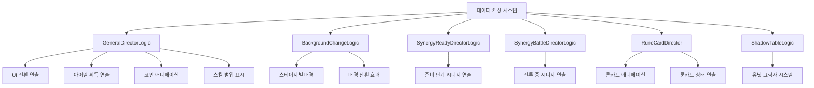
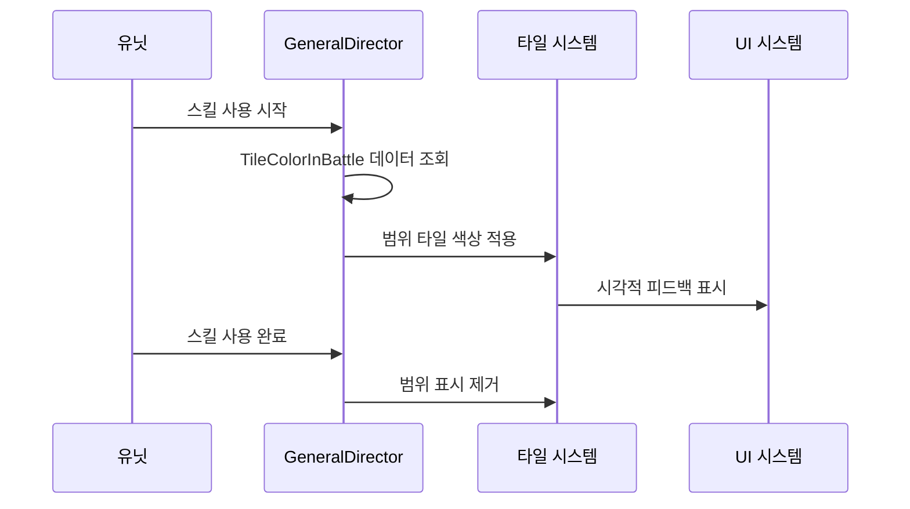
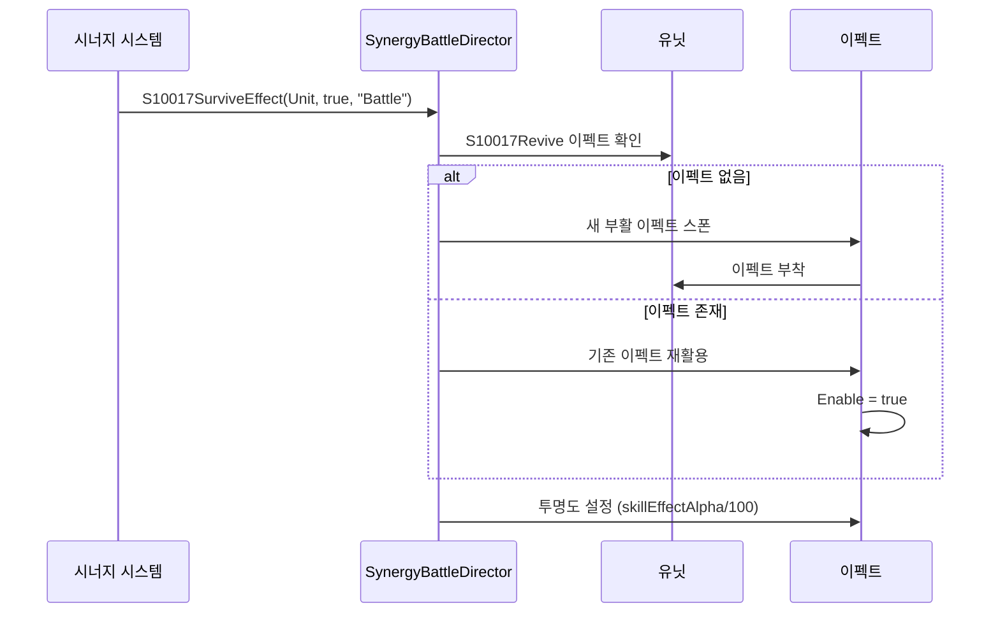
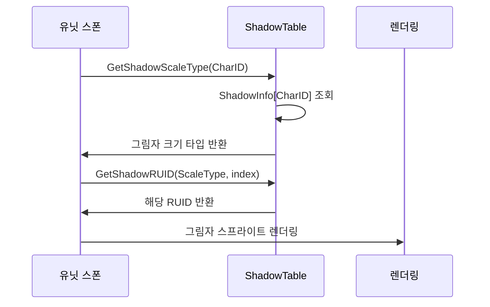
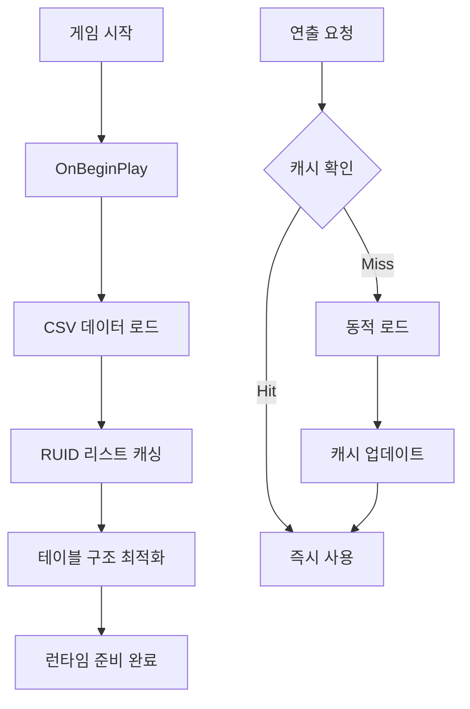
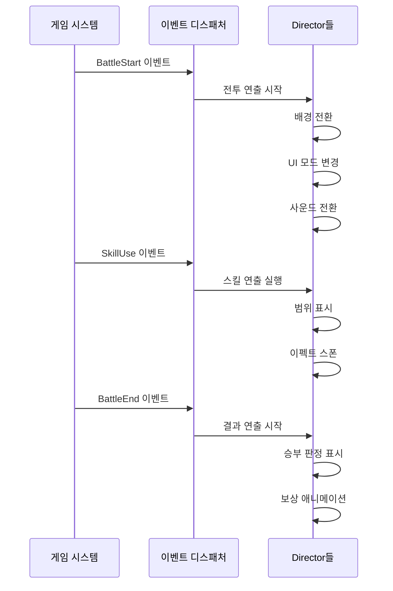

# 핵심 아키텍처 - 연출 및 음향 시스템 - 게임 연출 관리

## 개요

메토체스의 게임 연출 관리 시스템은 플레이어에게 몰입감 있는 시각적 경험을 제공하기 위한 종합적인 연출 제어 시스템입니다. `EffectFolder/Logic` 폴더에 구현된 이 시스템은 인게임 전체 연출 총괄, 시너지별 특화 연출, 배경 전환, UI 애니메이션, 그림자 시스템을 통합적으로 관리하여 전문적이고 세련된 게임 경험을 구현합니다.

이 시스템의 핵심 설계 철학은 **성능 최적화**와 **시각적 일관성**으로, 리소스 사전 캐싱과 재사용을 통해 부드러운 연출을 보장하면서도, 모든 연출 요소들이 게임의 전체적인 아트 스타일과 조화를 이루도록 설계되었습니다.

## 시스템 아키텍처

### 전체 구조도



### 연출 시스템 계층구조

1. **총괄 관리 계층**: `GeneralDirectorLogic`
2. **전문 연출 계층**: 각종 Director 로직들
3. **데이터 관리 계층**: 리소스 캐싱 및 최적화
4. **렌더링 계층**: 실제 시각적 출력

## 핵심 컴포넌트

### 1. GeneralDirectorLogic (연출 총괄 관리자)

게임 내 모든 연출의 중앙 제어소 역할을 담당하는 핵심 로직입니다.

#### 주요 관리 영역

**UI 전환 및 애니메이션**
- 상점 패널, 인벤토리 UI 전환
- 준비/전투 페이즈 UI 변경
- ESC 메뉴 표시/숨김

**게임플레이 연출**
- 유닛 스폰 버프 이펙트 타이머 관리
- 스킬 범위 타일 색상 표시
- 공격 범위 시각화

**경제 시스템 연출**
- 코인 획득/소모 애니메이션
- 결과 화면 코인 연출 (`ResultCoin`)
- 골드 방향 표시 (`IsCoinDirection`)

#### 핵심 기능 구현

**스킬 범위 표시 시스템**


### 2. BackgroundChangeLogic (배경 전환 시스템)

스테이지 진행에 따른 동적 배경 변화를 관리합니다.

#### 주요 기능

**배경 데이터 관리**
- `BackgroundTable` CSV 데이터 캐싱
- 스테이지별 배경 이미지 매핑
- 배경 전환 애니메이션 제어

**스테이지 시각화**
- 진행 중/완료 상태별 아이콘 관리
- 스테이지 로드맵 UI 업데이트
- 노드 연결선 표시

#### 스테이지 아이콘 시스템
```lua
StageIconRUID["Ing"] = {진행중 아이콘 8개}
StageIconRUID["Clear"] = {완료 아이콘 8개}
```

### 3. 시너지 연출 시스템

#### SynergyReadyDirectorLogic (준비 단계 연출)

**리소스 사전 캐싱**
- `SynergyDirection` 데이터테이블 처리
- 아트 리소스 (RUID1~5) 및 사운드 리소스 관리
- 시너지 상세 정보 (`SynergyDirectionRUIDInfo`) 캐싱

**타일 기반 효과**
- 특정 위치에 표시되는 시너지 효과
- 아군/적군 구분 타일 효과 (`Tile10025`, `Tile10025_Enemy`)

#### SynergyBattleDirectorLogic (전투 단계 연출)

**개별 시너지 특수 연출**

**S10017 - 부활 시너지**


**S10019 - 아이템 획득 연출**
- 유닛 위치에서 아이템 스프라이트 스폰
- 위쪽으로 날아가는 트윈 애니메이션
- 아이템 RUID 동적 설정

### 4. RuneCardDirector (룬카드 연출 시스템)

#### 룬카드 애니메이션 관리
- 18개 아이콘 RUID 사전 로딩
- 룬카드 획득/사용 시 흔들림 효과
- 스택형 룬카드 시각적 표현

#### 특별 관리 룬카드
```lua
RuneCardManagingValue = {
    ["RC10010"] = {}, -- 특수 값 관리
    ["RC20007"] = {}, -- 고급 룬카드
    ["RC30001"] = {}, -- 전설 룬카드
    -- ... 총 22개 특별 관리 대상
}
```

#### 스택 제한 룬카드
```lua
RuneCardMaxStack = {
    ["RC10024"] = 4,   -- 최대 4스택
    ["RC20011"] = 50,  -- 최대 50스택
    ["RC30017"] = 30,  -- 최대 30스택
    -- ... 스택 제한이 있는 룬카드들
}
```

### 5. ShadowTableLogic (그림자 시스템)

#### 유닛별 그림자 관리
- `ShadowInfoTable` 데이터 캐싱
- 캐릭터ID별 그림자 크기/위치 정보
- Small/Medium/Large 3단계 크기 구분

#### 그림자 RUID 시스템
```lua
ShadowRUID = {
    ["Small"] = {3개 RUID},
    ["Medium"] = {3개 RUID},
    ["Large"] = {3개 RUID}
}
```

#### 그림자 적용 흐름


## 성능 최적화 전략

### 1. 리소스 사전 캐싱
- **OnBeginPlay**에서 모든 필요한 데이터 로드
- 런타임 중 데이터베이스 조회 최소화
- RUID 리스트 메모리 캐싱

### 2. 오브젝트 재사용
- 이펙트 오브젝트 삭제 대신 Enable/Disable 사용
- 클론 오브젝트 풀링 시스템
- 메모리 할당/해제 최소화

### 3. 조건부 렌더링
- 화면에 보이는 연출만 활성화
- 페이즈별 연출 분리 (준비/전투)
- 거리 기반 LOD (Level of Detail)

### 4. 배치 처리
- 같은 타입의 이펙트 일괄 처리
- 타이머 기반 배치 업데이트
- 프레임별 연출 작업량 분산

## 데이터 구조 및 관리

### 주요 데이터테이블

#### BackgroundTable
- **ID**: 배경 식별자
- **Stage**: 스테이지 번호
- **기타**: 배경 관련 속성들

#### SynergyDirection
- **시너지ID**: 고유 식별자
- **RUID1~5**: 아트 리소스들
- **SoundID**: 사운드 리소스

#### TileColorInBattle
- 전투 중 타일 색상 정보
- 스킬 범위 표시용 색상 데이터

#### ShadowInfoTable
- **CharID**: 캐릭터 식별자
- **ScaleType**: Small/Medium/Large
- **위치 정보**: 그림자 오프셋

### 캐싱 전략


## 연출 타이밍 제어

### 게임 페이즈별 연출

#### 준비 페이즈
- 시너지 준비 연출 활성화
- UI 전환 애니메이션
- 배경음악 페이드 인

#### 전투 페이즈
- 시너지 전투 연출 활성화
- 스킬 이펙트 표시
- 결과 연출 준비

#### 결과 페이즈
- 승리/패배 연출
- 보상 애니메이션
- 다음 라운드 준비

### 이벤트 기반 연출 트리거


## 확장성 및 커스터마이징

### 새로운 연출 추가 가이드

#### 1. 시너지 연출 추가
```lua
-- SynergyBattleDirectorLogic에 새 메서드 추가
method void S99999NewEffect(Entity Unit, boolean Active)
    -- 새로운 시너지 연출 구현
end
```

#### 2. 새로운 배경 추가
- `BackgroundTable.csv`에 새 행 추가
- 해당 리소스 RUID 등록
- `BackgroundChangeLogic`에서 자동 로드

#### 3. 새로운 룬카드 연출
- `IconRUIDList`에 새 아이콘 추가
- 특별 관리가 필요한 경우 `RuneCardManagingValue`에 등록

### 모듈화 설계
각 Director 로직은 독립적으로 작동하므로:
- 개별 시스템 수정이 다른 시스템에 영향 없음
- 새로운 연출 시스템 추가 용이
- A/B 테스트를 위한 연출 변경 가능

## 디버깅 및 개발 도구

### 연출 디버그 기능
- 개별 연출 온/오프 토글
- 연출 성능 모니터링
- 리소스 사용량 추적

### 아티스트 친화적 도구
- CSV 기반 데이터 수정
- 실시간 리소스 교체
- 연출 타이밍 조정

## Code References

- `RootDesk/MyDesk/EffectFolder/Logic/GeneralDirectorLogic.mlua :: OnBeginPlay()` — 전체 연출 시스템 초기화 및 리소스 캐싱
- `RootDesk/MyDesk/EffectFolder/Logic/GeneralDirectorLogic.mlua :: ShowReadyUI()` — 준비 페이즈 UI 연출 관리
- `RootDesk/MyDesk/EffectFolder/Logic/BackgroundChangeLogic.mlua :: LoadTable()` — 배경 데이터 캐싱 및 스테이지 아이콘 설정
- `RootDesk/MyDesk/EffectFolder/Logic/BackgroundChangeLogic.mlua :: ChangeBackground()` — 스테이지별 배경 전환 로직
- `RootDesk/MyDesk/EffectFolder/Logic/SynergyReadyDirectorLogic.mlua :: LoadTable()` — 시너지 연출 리소스 사전 로딩
- `RootDesk/MyDesk/EffectFolder/Logic/SynergyBattleDirectorLogic.mlua :: S10017SurviveEffect()` — 부활 시너지 특수 연출
- `RootDesk/MyDesk/EffectFolder/Logic/SynergyBattleDirectorLogic.mlua :: S10019GetItem()` — 아이템 획득 연출
- `RootDesk/MyDesk/EffectFolder/Logic/RuneCardDirector.mlua :: ShakingCard_Battle()` — 룬카드 전투 연출 애니메이션
- `RootDesk/MyDesk/EffectFolder/Logic/ShadowTableLogic.mlua :: GetShadowScaleType()` — 유닛별 그림자 크기 결정
- `RootDesk/MyDesk/EffectFolder/DataSet/BackgroundTable.csv` — 스테이지별 배경 설정 데이터

