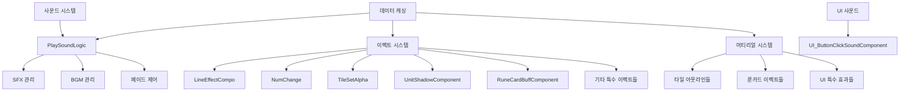
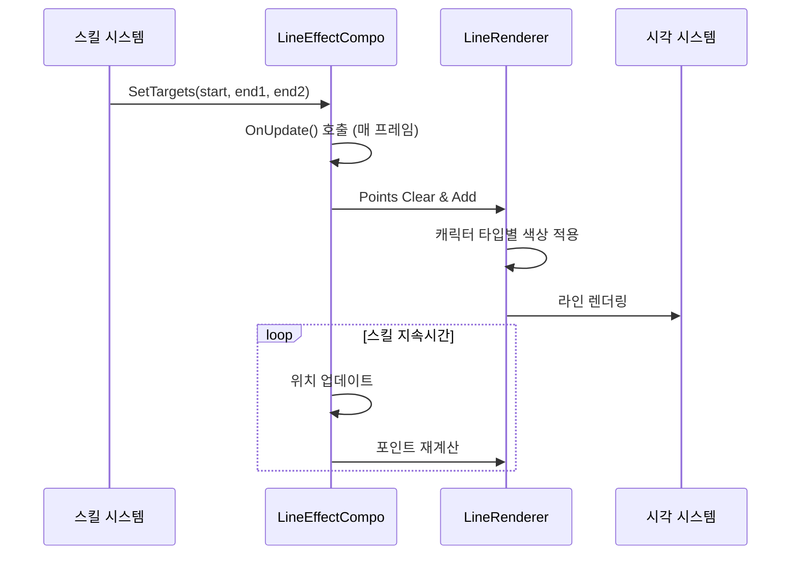
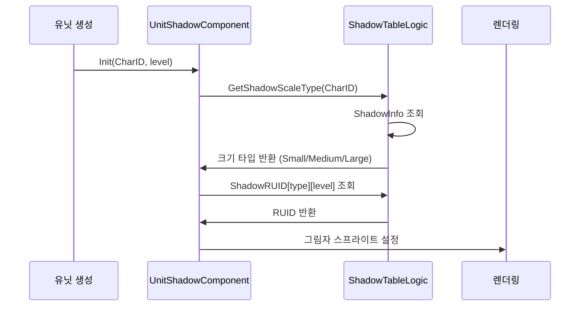
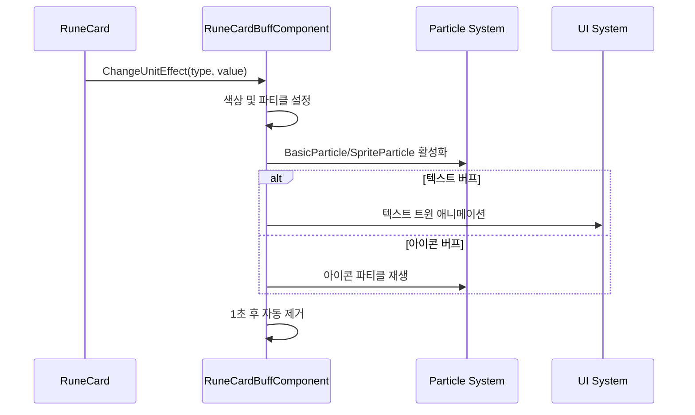
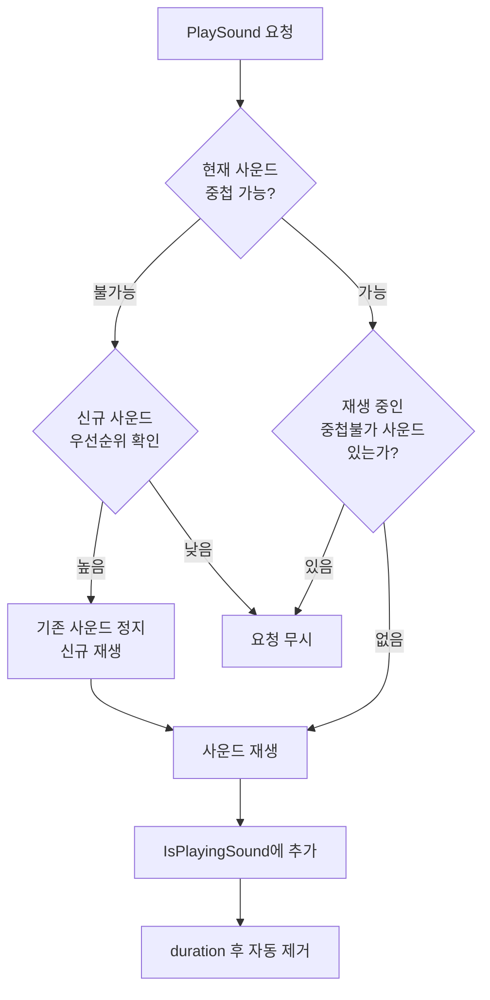
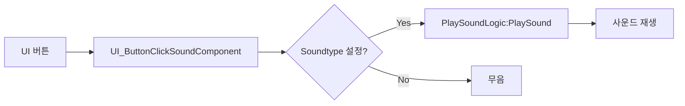

# 핵심 아키텍처 - 연출 및 음향 시스템 - 이펙트 및 사운드

## 개요

메토체스의 이펙트 및 사운드 시스템은 게임의 시각적·청각적 완성도를 높이기 위한 세밀하고 전문적인 연출 시스템입니다. `EffectFolder/Components`와 `PlaySoundLogic`을 중심으로 구현된 이 시스템은 **캐릭터별 특화 이펙트**, **동적 시각 효과**, **지능형 사운드 관리**, **UI 피드백 시스템**을 통해 플레이어에게 몰입감 있는 게임 경험을 제공합니다.

이 시스템의 핵심 설계 원칙은 **성능 최적화**와 **모듈화**로, 각 이펙트 컴포넌트는 독립적으로 작동하면서도 전체적으로 조화로운 연출을 만들어내며, 사운드 시스템은 중복 재생 방지와 우선순위 관리를 통해 깔끔한 오디오 경험을 보장합니다.

## 시스템 아키텍처

### 전체 구조도



### 이펙트 계층구조

1. **컴포넌트 계층**: 개별 이펙트 컴포넌트들
2. **머티리얼 계층**: 시각적 셰이더 효과들
3. **사운드 계층**: 오디오 재생 및 관리
4. **데이터 계층**: 리소스 캐싱 및 설정

## 핵심 이펙트 컴포넌트

### 1. LineEffectCompo (라인 이펙트 시스템)

캐릭터별로 특화된 라인 이펙트를 제공하는 핵심 시각 효과 시스템입니다.

#### 캐릭터별 특화 이펙트

**전사계열 - 라이오너 (C20008)**
```lua
-- 황금색 번개 형태의 라인 이펙트
Color(255/255, 242/255, 0/255) -- 골드 컬러
random_width = 1~20/10 -- 랜덤한 굵기로 번개 효과
```

**궁수계열 - 사수 (C20011)**
```lua
-- 녹색 정확한 사격선
Color(21/255, 163/255, 7/255) -- 그린 컬러
width = 0.2 -- 얇고 정확한 선
```

**마법사계열 - 플레임위자드 (C30006)**
```lua
-- 오렌지색 화염 라인
Color(255/255, 146/255, 0/255) -- 오렌지 컬러
```

**특수계열 - 카이린 (C30013)**
```lua
-- 푸른색 신비한 라인
Color(0/255, 30/255, 142/255) -- 딥 블루 컬러
```

#### 시너지 전용 라인 이펙트

**S10020 - 아케인리버 시너지**
```lua
-- 연한 녹색 치유의 빛
startColor = Color(148/255, 227/255, 181/255) -- 라이트 그린
endColor = Color(220/255, 244/255, 176/255) -- 옐로우 그린
```

**S10010 - 저격수 시너지**
```lua
-- 적갈색 저격선
Color(133/255, 83/255, 83/255) → Color(233/255, 83/255, 83/255)
```

#### 라인 이펙트 동작 흐름


### 2. NumChange (숫자 애니메이션 시스템)

숫자 변화를 시각적으로 표현하는 애니메이션 컴포넌트입니다.

#### 기능 구현
```lua
Swaping(Pool) -- 숫자 풀에서 순환 재생
- 0.7초 간격 타이머
- 배열 순환을 통한 부드러운 변화

StopNum(value) -- 최종 숫자로 고정
- 타이머 정지
- 확정값 표시
```

#### 사용 사례
- **골드 획득 애니메이션**: 100, 200, 150, 175, 160... → 최종값
- **데미지 표시**: 랜덤 숫자 → 실제 데미지
- **경험치 획득**: 가상 증가 → 실제 증가량

### 3. TileSetAlpha (타일 강조 시스템)

타일의 투명도를 애니메이션하여 플레이어의 주의를 끄는 시스템입니다.

#### 애니메이션 패턴
```lua
Starttoalpha100() -- 0 → 100% (페이드 인)
- 20단계로 나누어 0.035씩 증가
- 0.3초 지속 후 자동으로 페이드 아웃 시작

Starttoalpha0() -- 100% → 0 (페이드 아웃)
- 20단계로 나누어 0.035씩 감소
```

#### 시각적 효과 타이밍

```mermaid
gantt
    title 타일 알파 애니메이션 타이밍
    dateFormat X
    axisFormat %L ms
    
    section 페이드 인
    알파 증가 :0, 160
    
    section 유지
    최대 투명도 :160, 300
    
    section 페이드 아웃
    알파 감소 :300, 460
```


### 4. UnitShadowComponent (유닛 그림자 시스템)

각 유닛에 동적으로 적절한 그림자를 생성하는 시스템입니다.

#### 그림자 생성 로직
```lua
Init(CharID, level)
- 기본 색상: #19182E (어두운 네이비)
- 투명도: 0.4
- RUID: ShadowTableLogic에서 캐릭터별 조회
```

#### ShadowTableLogic 연동


### 5. RuneCardBuffComponent (룬카드 버프 연출)

룬카드 효과 발동 시 시각적 피드백을 제공하는 정교한 이펙트 시스템입니다.

#### 버프 타입별 색상 시스템
```lua
버프 타입별 색상:
1. Attack (공격력): #ff8b8b (연한 빨강)
2. Speed (공격속도): #8bfbff (연한 청록)
3. Defense (방어력): #ffd68b (연한 노랑)
4. BloodSucking (흡혈): #e88cef (연한 보라)
5. Weakening (약화): #faff18 (밝은 노랑)
6. Debuff (디버프): #000000 (검정)
```

#### 특수 효과 - 유닛 변화 (RC20039 덴마 룬카드)
```lua
등급별 색상:
1성: #8d8d8d (회색)
2성: #54efaf (녹색)
3성: #81eff7 (하늘색)
4성: #d7b8ff (연보라)
5성: #ffd038 (골드)
6성: #ffffff (화이트) + 특수 이펙트
```

#### 버프 연출 흐름


## 사운드 시스템

### PlaySoundLogic (종합 사운드 관리자)

메토체스의 모든 오디오를 통합 관리하는 핵심 시스템입니다.

#### 사운드 데이터 구조
```lua
SoundTable[soundID] = {
    RUID = "오디오 리소스 ID",
    AvailableSameTime = "TRUE/FALSE", -- 중첩 재생 가능 여부
    Priority = "1-10", -- 우선순위 (낮을수록 높은 우선순위)
    volume = "0.0-1.0", -- 기본 볼륨
    durationTime = "초 단위", -- 재생 시간
    Repeat = "TRUE/FALSE" -- 반복 여부
}
```

#### 지능형 사운드 충돌 관리

**중첩 불가능 사운드 처리**


#### BGM 시스템

**부드러운 BGM 전환**
```lua
PlayBGM_Ver2(Stage)
1. 현재 BGM 페이드 아웃 (1초)
2. 새 BGM으로 교체
3. 새 BGM 페이드 인 (1초)
```

**페이드 인/아웃 구현**
```lua
FadeInFadeOut(IsFadeIn, durationTime, startVolume, toVolume)
- 60단계로 나누어 부드러운 볼륨 변화
- 타이머 기반 프레임별 볼륨 조절
```

#### 스테이지별 사운드 시스템
```lua
PlayTileSettingSound()
- BackgroundChangeLogic에서 현재 스테이지 확인
- 스테이지별 Sound_1, Sound_2 중 랜덤 선택
- 타일 배치 시 상황에 맞는 효과음 재생
```

### UI_ButtonClickSoundComponent (UI 사운드)

모든 UI 상호작용에 일관된 오디오 피드백을 제공합니다.

#### 이벤트 기반 사운드 재생
```lua
HandleButtonClickEvent() -- 버튼 클릭
HandleUITouchDownEvent() -- 터치 다운
- Soundtype 프로퍼티로 재생할 사운드 지정
- PlaySoundLogic을 통한 통합 관리
```

#### 사용 패턴


## 머티리얼 시스템

### 시각 효과 머티리얼 (50여개)

#### 타일 관련 머티리얼
- **AttackRangeOutline**: 공격 범위 표시
- **AvailableTileOutline**: 배치 가능 타일
- **HoverTileOutline**: 마우스 오버 타일
- **SynergyHoverTileOutLine**: 시너지 타일 강조

#### 룬카드 이펙트 머티리얼
- **BattleWave_RuneCardEffect**: 전투 중 룬카드 효과
- **RC10003_RuneCardEffect**: 특정 룬카드 전용 효과
- **RC30004TileEffect**: RC30004 룬카드 타일 효과

#### UI 특수 효과 머티리얼
- **UI_BattleStartButton**: 전투 시작 버튼 효과
- **UI_LoadingGuage**: 로딩 게이지 효과
- **UIToggled**: 토글된 UI 요소 강조

#### 캐릭터 관련 머티리얼
- **CharacterMaterial_2star/3star**: 등급별 캐릭터 효과
- **CharacterMaterial_Shadow**: 캐릭터 그림자
- **CoachShadowMaterial**: 코치 그림자

## 성능 최적화

### 1. 리소스 관리
- **사전 캐싱**: OnBeginPlay에서 모든 사운드 데이터 로드
- **RUID 기반**: 직접 파일 경로 대신 RUID 시스템 사용
- **풀링**: 파티클 이펙트 재사용으로 메모리 절약

### 2. 렌더링 최적화
- **조건부 렌더링**: 화면에 보이는 이펙트만 활성화
- **LOD 시스템**: 거리에 따른 이펙트 품질 조절
- **배치 렌더링**: 같은 머티리얼의 이펙트 일괄 처리

### 3. 오디오 최적화
- **중복 방지**: 동일 사운드 중복 재생 차단
- **우선순위**: 중요한 사운드가 덜 중요한 사운드를 대체
- **자동 정리**: 재생 완료된 사운드 자동 메모리 해제

### 4. 타이머 최적화
```lua
-- 효율적인 타이머 사용 예시
_TimerService:SetTimerOnce(function() 
    self.Entity:Destroy() 
end, 1.0) -- 1초 후 자동 정리
```

## 확장 가능성

### 새로운 이펙트 추가
1. **새 캐릭터 라인 이펙트**: LineEffectCompo에 타입 추가
2. **새로운 버프 시각화**: RuneCardBuffComponent 색상 확장
3. **커스텀 머티리얼**: EffectFolder/Material에 새 셰이더 추가

### 사운드 시스템 확장
1. **3D 사운드**: 위치 기반 오디오 효과
2. **동적 음향**: 환경에 따른 사운드 변화
3. **사용자 정의**: 플레이어별 사운드 설정

### UI 이펙트 강화
1. **트랜지션 효과**: 화면 전환 애니메이션
2. **상호작용 피드백**: 더 풍부한 UI 반응
3. **접근성**: 시각/청각 장애인을 위한 대체 피드백

## 개발자 도구

### 이펙트 디버깅
- 개별 이펙트 온/오프 토글
- 실시간 색상/크기 조정
- 성능 프로파일링

### 사운드 디버깅
- 현재 재생 중인 사운드 목록
- 볼륨 레벨 시각화
- 충돌 감지 및 우선순위 표시

## 실제 사용 시나리오

### 1. 전투 시퀀스
```
1. 유닛 선택 → UI 클릭 사운드
2. 스킬 사용 → 캐릭터별 라인 이펙트
3. 데미지 발생 → NumChange로 숫자 애니메이션
4. 버프 적용 → RuneCardBuffComponent 파티클
5. 타일 강조 → TileSetAlpha 깜빡임
```

### 2. BGM 전환 시나리오
```
로비 BGM → 게임 시작 → 스테이지 BGM
1. 현재 BGM 페이드 아웃 (1초)
2. 새 BGM 로드 및 재생
3. 새 BGM 페이드 인 (1초)
```

### 3. UI 상호작용
```
버튼 호버 → 시각적 하이라이트
버튼 클릭 → 사운드 + 시각적 효과
메뉴 전환 → 트랜지션 이펙트
```

## Code References

- `RootDesk/MyDesk/EffectFolder/Components/LineEffectCompo.mlua :: OnUpdate()` — 캐릭터별 라인 이펙트 실시간 렌더링
- `RootDesk/MyDesk/EffectFolder/Components/NumChange.mlua :: Swaping()` — 숫자 순환 애니메이션 시스템
- `RootDesk/MyDesk/EffectFolder/Components/TileSetAlpha.mlua :: Starttoalpha100()` — 타일 페이드 인/아웃 애니메이션
- `RootDesk/MyDesk/EffectFolder/Components/UnitShadowComponent.mlua :: Init()` — 유닛별 동적 그림자 생성
- `RootDesk/MyDesk/DatasetCacheLogic/PlaySoundLogic.mlua :: PlaySound()` — 지능형 사운드 충돌 관리
- `RootDesk/MyDesk/DatasetCacheLogic/PlaySoundLogic.mlua :: PlayBGM_Ver2()` — 부드러운 BGM 전환 시스템
- `RootDesk/MyDesk/DatasetCacheLogic/PlaySoundLogic.mlua :: FadeInFadeOut()` — 볼륨 페이드 효과 구현
- `RootDesk/MyDesk/UIComponents/UI_Common/UI_ButtonClickSoundComponent.mlua :: HandleButtonClickEvent()` — UI 버튼 클릭 사운드
- `RootDesk/MyDesk/EffectFolder/Components/RuneCardBuffComponent.mlua :: ChangeUnitEffect()` — 룬카드 버프 시각 효과
- `RootDesk/MyDesk/EffectFolder/Material/*.material` — 50여개의 특화된 시각 효과 머티리얼

