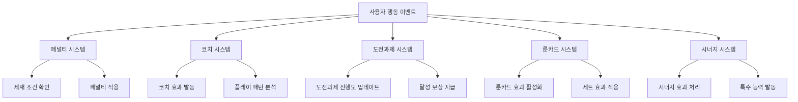
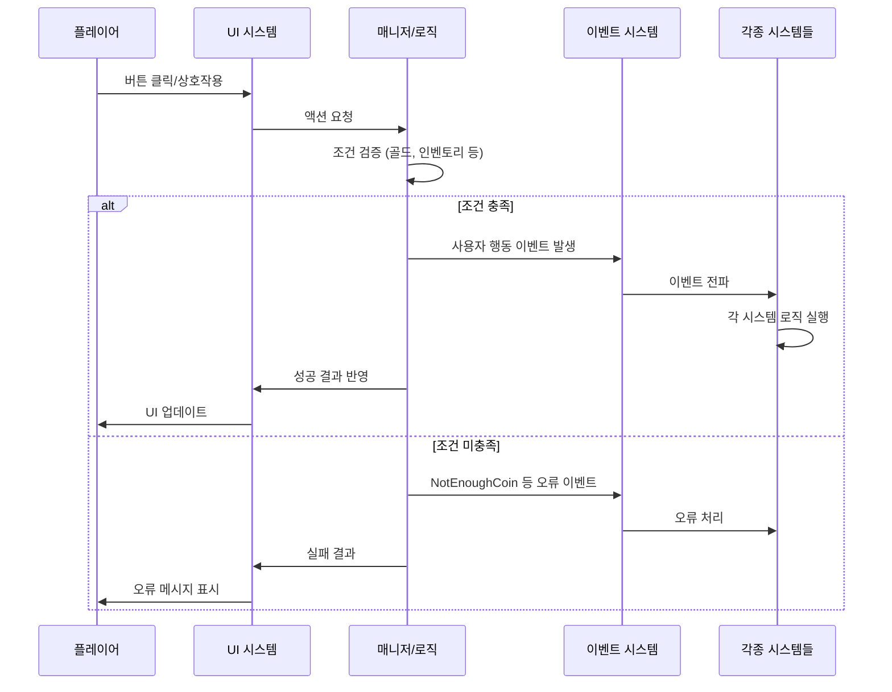
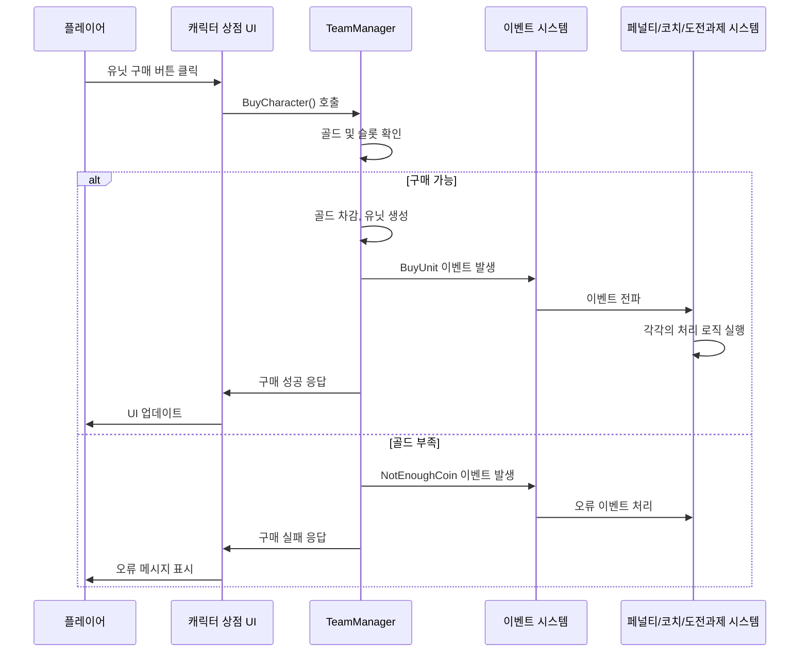
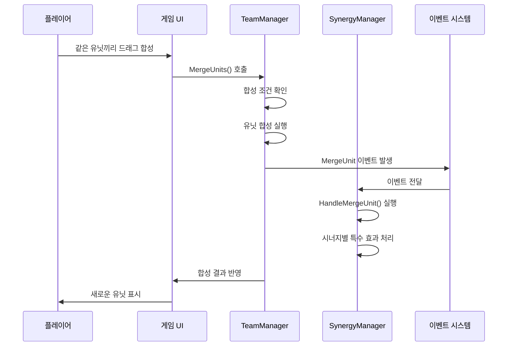

# 핵심 아키텍처 - 이벤트 시스템 - 사용자 행동 이벤트

## 개요

사용자 행동 이벤트 시스템은 메토체스에서 플레이어가 게임 내에서 수행하는 모든 의도적 행동을 추적하고 처리하는 시스템입니다. `Events/UserBehaviorEvents` 폴더에 정의된 19개의 이벤트를 통해 상점 이용, 유닛 관리, 아이템 조작, UI 상호작용 등 플레이어의 모든 게임플레이 행동을 체계적으로 관리합니다.

이 시스템은 플레이어의 행동 패턴 분석, 도전과제 진행 추적, 게임 밸런스 데이터 수집, 그리고 각종 게임 시스템들의 반응적 로직 실행을 위한 핵심 인프라 역할을 합니다.

## 이벤트 카테고리별 분류

### 상점 및 구매 관련 이벤트

#### 1. BuyUnit
플레이어가 캐릭터 상점에서 유닛을 구매했을 때 발생합니다.
```
- Unit: 구매한 유닛 엔티티
- CharID: 구매한 캐릭터 ID
```

#### 2. BuyItem
플레이어가 아이템 상점에서 아이템을 구매했을 때 발생합니다.
```
- (속성 없음)
```

#### 3. BuyRuneCard
플레이어가 룬카드 상점에서 룬카드를 구매했을 때 발생합니다.
```
- RuneID: 구매한 룬카드 ID
```

#### 4. BuyEXP
플레이어가 경험치를 구매했을 때 발생합니다.
```
- (속성 없음)
```

#### 5. NotEnoughCoin
플레이어가 구매를 시도했지만 코인이 부족할 때 발생합니다.
```
- (속성 없음)
```

### 유닛 관리 이벤트

#### 6. PlaceUnit
플레이어가 유닛을 배치했을 때 발생합니다.
```
- CharID: 배치한 캐릭터 ID
```

#### 7. SetUnitOnTile
플레이어가 유닛을 특정 타일에 설정했을 때 발생합니다.
```
- setUnit: 설정할 유닛 엔티티
- setTile: 목적지 타일 엔티티
- nowTile: 현재 타일 엔티티
```

#### 8. MergeUnit
플레이어가 유닛 합성을 수행했을 때 발생합니다.
```
- MergedUnit: 합성된 유닛 엔티티
- TargetLevel: 목표 레벨
```

#### 9. SellUnit
플레이어가 유닛을 판매했을 때 발생합니다.
```
- (속성 없음)
```

#### 10. LevelUpUnit
플레이어가 개별 유닛을 레벨업했을 때 발생합니다.
```
- (속성 없음)
```

### 팀 관리 이벤트

#### 11. LevelUpTeam
플레이어가 팀 전체 레벨을 올렸을 때 발생합니다.
```
- SetLevel: 설정된 레벨
```

### 아이템 및 인벤토리 관리 이벤트

#### 12. EquipedItem
플레이어가 유닛에 아이템을 장착했을 때 발생합니다.
```
- Unit: 아이템을 장착받은 유닛 엔티티
- ItemID: 장착한 아이템 ID
```

#### 13. CombinationItem
플레이어가 아이템 조합을 수행했을 때 발생합니다.
```
- (속성 없음)
```

#### 14. UseConsumableItem
플레이어가 소비 아이템을 사용했을 때 발생합니다.
```
- ItemID: 사용한 아이템 ID
```

#### 15. OpenItemBox
플레이어가 아이템 상자를 열었을 때 발생합니다.
```
- (속성 없음)
```

### 룬카드 관리 이벤트

#### 16. SellRuneCard
플레이어가 룬카드를 판매했을 때 발생합니다.
```
- (속성 없음)
```

#### 17. ChangeRuneCardOrder
플레이어가 룬카드 순서를 변경했을 때 발생합니다.
```
- (속성 없음)
```

### 상점 관리 이벤트

#### 18. RerollCharacterShop
플레이어가 캐릭터 상점을 리롤했을 때 발생합니다.
```
- (속성 없음)
```

#### 19. LockShop
플레이어가 상점을 잠갔을 때 발생합니다.
```
- (속성 없음)
```

## 이벤트 처리 시스템 구조

### 주요 이벤트 리스너 시스템



### 이벤트 연결 패턴

각 주요 시스템은 관심 있는 사용자 행동 이벤트에 연결하여 자체 로직을 실행합니다:

#### 1. 페널티 시스템 (`PenaltyComponent.mlua`)
- `BuyUnit`: 유닛 구매 제한 확인
- `UseConsumableItem`: 소비 아이템 사용 제한

#### 2. 코치 시스템 (`CoachComponent.mlua`)
- `BuyUnit`: 코치별 유닛 구매 보너스
- `UseConsumableItem`: 코치 특수 효과 발동

#### 3. 도전과제 시스템 (`ChallengeComponent.mlua`)
- `BuyUnit`: "특정 유닛 구매" 도전과제
- `UseConsumableItem`: "소비 아이템 사용" 도전과제

#### 4. 룬카드 시스템 (`RuneCardComponent.mlua`)
- `BuyUnit`: 룬카드 구매 보너스 효과
- `UseConsumableItem`: 룬카드 특수 능력

#### 5. 시너지 시스템 (`SynergyManager_New.mlua`)
- `MergeUnit`: 시너지별 합성 특수 효과

## 이벤트 발생 흐름

### 일반적인 사용자 행동 처리 과정



### 구체적인 이벤트 사용 사례

#### 1. 유닛 구매 흐름



#### 2. 유닛 합성 흐름



## 이벤트 활용 분야

### 1. 게임플레이 통계 수집
- 플레이어의 구매 패턴 분석
- 유닛 사용 빈도 추적
- 아이템 선호도 조사
- 플레이 스타일 분류

### 2. 도전과제 및 업적 시스템
- "유닛 100마리 구매" → `BuyUnit` 이벤트 카운팅
- "아이템 10개 조합" → `CombinationItem` 이벤트 추적
- "룬카드 5개 구매" → `BuyRuneCard` 이벤트 모니터링

### 3. 게임 밸런싱 데이터
- 어떤 유닛이 가장 많이 구매되는지
- 어떤 아이템이 가장 많이 사용되는지
- 플레이어들이 어떤 전략을 선호하는지

### 4. 동적 게임 시스템 반응
- 코치별 특수 보너스 적용
- 룬카드 효과 발동
- 페널티 시스템 작동
- 시너지 특수 능력 활성화

### 5. 사용자 경험 개선
- 플레이어 행동 패턴 기반 UI 최적화
- 개인화된 상점 추천
- 적응형 튜토리얼 시스템

## 이벤트 확장성

### 새로운 사용자 행동 추가
새로운 게임플레이 요소를 위해 이벤트를 추가할 때:

1. **이벤트 정의**: `Events/UserBehaviorEvents/` 폴더에 새 이벤트 파일 생성
2. **속성 설계**: 해당 행동에 필요한 데이터 속성 정의
3. **발생 지점 구현**: 관련 매니저나 UI에서 이벤트 발생 로직 추가
4. **처리 시스템 연결**: 필요한 시스템들에서 해당 이벤트 연결
5. **테스트**: 이벤트 발생과 처리가 올바르게 작동하는지 검증

### 크로스 시스템 이벤트 처리
하나의 사용자 행동이 여러 시스템에 영향을 미치는 경우:
- 각 시스템은 독립적으로 같은 이벤트에 연결
- 이벤트 핸들러 간 의존성 최소화
- 필요시 이벤트 체이닝을 통한 순차적 처리

## 성능 최적화

### 이벤트 처리 효율성
- **조건부 연결**: 필요한 시스템만 관련 이벤트에 연결
- **빠른 실패**: 조건 검증을 통한 불필요한 처리 방지
- **배치 처리**: 유사한 이벤트들의 그룹 처리

### 데이터 수집 최적화
- **샘플링**: 모든 이벤트가 아닌 필요한 이벤트만 로깅
- **압축**: 중복되거나 불필요한 데이터 제거
- **비동기 처리**: 게임플레이에 영향 없는 통계 수집

## Code References

- `RootDesk/MyDesk/Events/UserBehaviorEvents/*.mlua` — 모든 사용자 행동 이벤트 정의
- `RootDesk/MyDesk/InGame/Penalty/PenaltyComponent.mlua :: ConnectEvent(BuyUnit, ...)` — 페널티 시스템의 구매 이벤트 처리
- `RootDesk/MyDesk/InGame/Coach/CoachComponent.mlua :: ConnectEvent(UseConsumableItem, ...)` — 코치 시스템의 아이템 사용 처리
- `RootDesk/MyDesk/InGame/Challenge/ChallengeComponent.mlua :: ConnectEvent(BuyUnit, ...)` — 도전과제 시스템의 이벤트 추적
- `RootDesk/MyDesk/InGame/RuneCard/RuneCardComponent.mlua :: ConnectEvent()` — 룬카드 시스템의 이벤트 반응
- `RootDesk/MyDesk/InGame/Managers/SynergyManager_New.mlua :: HandleMergeUnit()` — 시너지 시스템의 유닛 합성 처리
- `RootDesk/MyDesk/InGame/Managers/TeamManager.mlua` — 팀 관리 및 사용자 행동 이벤트 발생원
- `RootDesk/MyDesk/UIComponents/UI_Ingame/*.mlua` — UI에서 사용자 상호작용 처리 및 이벤트 발생

