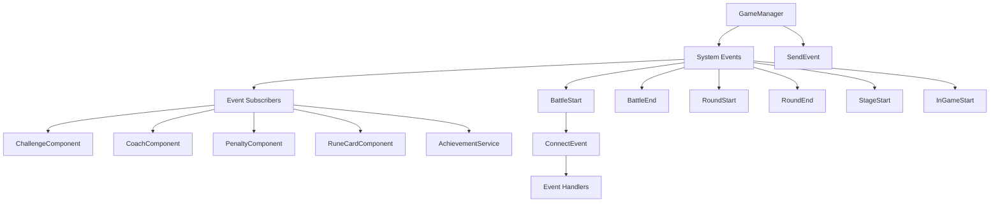

# 시스템 이벤트

## 개요

메토체스의 시스템 이벤트는 게임의 주요 상태 변화와 생명주기를 관리하는 **이벤트 드리븐 아키텍처**의 핵심입니다. **Events/SystemEvents** 폴더에 정의된 13개의 시스템 레벨 이벤트를 통해 게임 진행의 각 단계를 체계적으로 처리하고, 다양한 컴포넌트들 간의 느슨한 결합을 실현합니다.

## 이벤트 시스템 아키텍처



## 시스템 이벤트 목록

### 게임 생명주기 이벤트

| 이벤트명 | 발생 시점 | 주요 데이터 | 역할 |
|----------|-----------|-------------|------|
| **InGameStart** | 인게임 입장 시 | - | 게임 세션 시작 알림 |
| **InGameDataLoad** | 인게임 데이터 로드 시 | - | 저장된 게임 상태 복원 |
| **StageStart** | 새 스테이지 시작 시 | - | 스테이지 레벨 초기화 |
| **RoundStart** | 라운드 시작 시 | RoundType, Round, Stage | 라운드별 시스템 준비 |
| **RoundEnd** | 라운드 종료 시 | - | 라운드 결과 처리 |

### 전투 관련 이벤트

| 이벤트명 | 발생 시점 | 주요 데이터 | 역할 |
|----------|-----------|-------------|------|
| **BattleSet** | 전투 준비 완료 시 | - | 전투 세팅 완료 알림 |
| **BattleStart** | 전투 시작 시 | RoundType | 전투 시작 처리 |
| **BattleEnd** | 전투 종료 시 | RoundType | 전투 결과 집계 |
| **BattleWin** | 전투 승리 시 | - | 승리 보상 및 효과 |
| **BattleLose** | 전투 패배 시 | - | 패배 페널티 처리 |
| **BattleOverTime** | 전투 연장전 시 | - | 연장전 특수 처리 |
| **BattleReward** | 전투 보상 지급 시 | rewardTable | 보상 데이터 전달 |

### 특수 시스템 이벤트

| 이벤트명 | 발생 시점 | 주요 데이터 | 역할 |
|----------|-----------|-------------|------|
| **SetActiveRune** | 룬카드 활성화 시 | - | 룬카드 효과 적용 |

## 이벤트 정의 구조

### 기본 이벤트 구조

모든 시스템 이벤트는 **@Event** 어노테이션과 **EventType** 상속을 통해 정의됩니다:

```lua
@Event
script [EventName] extends EventType
    -- 이벤트별 필요 데이터 정의
    property [DataType] [PropertyName] = [DefaultValue]
end
```

### 주요 이벤트 정의 예시

#### BattleStart - 전투 시작 이벤트

```lua
@Event
script BattleStart extends EventType
    property string RoundType = ""  -- "Battle", "Monster" 등 라운드 타입
end
```

#### BattleReward - 전투 보상 이벤트

```lua
@Event
script BattleReward extends EventType
    property table rewardTable = {}  -- 보상 상세 정보
    -- rewardTable 구조 예시:
    -- {
    --   ["Default"] = 5,        -- 기본 골드
    --   ["Interest"] = 2,       -- 이자 골드  
    --   ["WinningBonus"] = 3,   -- 승리 보너스
    --   ["Streak"] = 1          -- 연승 보너스
    -- }
end
```

#### RoundStart - 라운드 시작 이벤트

```lua
@Event
script RoundStart extends EventType
    property string RoundType = ""  -- 라운드 타입
    property number Round = 0       -- 현재 라운드 번호
    property number Stage = 0       -- 현재 스테이지 번호
end
```

## 이벤트 발생 (Publisher)

### GameManager에서의 이벤트 발생

**GameManager**는 게임 진행의 주요 시점에서 적절한 시스템 이벤트를 발생시킵니다:

```lua
-- 라운드 시작 시
@ExecSpace("ServerOnly")
method void Ready()
    -- ... 라운드 준비 로직 ...
    
    -- 라운드 시작 이벤트 발생
    user:SendEvent(RoundStart(self.RoundType, self.Round, self.Stage))
end

-- 전투 시작 시  
@ExecSpace("ServerOnly")
method void StartBattle()
    self.BattleTime = 30
    _UnitSetLogic_New:BattleSetting_OnBattlePhase(self.Entity.OwnerId)
    
    -- 전투 시작 이벤트 발생
    self.Entity:SendEvent(BattleStart(self.RoundType))
end

-- 전투 종료 시
@ExecSpace("ServerOnly") 
method void EndBattle()
    -- ... 전투 결과 처리 ...
    
    -- 전투 종료 이벤트 발생
    self.Entity:SendEvent(BattleEnd(self.RoundType))
    
    -- 업적 시스템에 전투 종료 알림
    _AchievementService:BattleEnd(win, self.ModeType, self.ModeLevel, self.Stage, self.Round, self.Round8_3Num, user)
end
```

### 이벤트 발생 패턴

#### 1. 단순 알림 이벤트

```lua  
-- 데이터 없이 상태 변화만 알림
self.Entity:SendEvent(InGameStart())
self.Entity:SendEvent(BattleOverTime())
```

#### 2. 데이터 전달 이벤트

```lua
-- 필요한 게임 데이터를 함께 전달
self.Entity:SendEvent(BattleStart("Battle"))
self.Entity:SendEvent(RoundStart("Monster", 5, 2))
self.Entity:SendEvent(BattleReward(rewardData))
```

## 이벤트 구독 (Subscriber)

### 컴포넌트별 이벤트 구독

다양한 게임 컴포넌트들이 필요한 시스템 이벤트를 구독하여 해당 시점에 적절한 로직을 실행합니다.

#### ChallengeComponent - 도전과제 시스템

```lua
@ExecSpace("ServerOnly")
method void OnBeginPlay()
    local userEntity = self.Entity.Parent
    
    -- 게임 생명주기 이벤트 구독
    userEntity:ConnectEvent(InGameStart, function(event) 
        self:StartGameHandler(event) 
    end)
    userEntity:ConnectEvent(StageStart, function(event) 
        self:StartStageHandler(event) 
    end)
    userEntity:ConnectEvent(RoundStart, function(event) 
        self:StartRoundHandler(event) 
    end)
    
    -- 전투 관련 이벤트 구독
    userEntity:ConnectEvent(BattleStart, function(event) 
        self:StartBattleHandler(event) 
    end)
    userEntity:ConnectEvent(BattleEnd, function(event) 
        self:EndBattleHandler(event) 
    end)
    userEntity:ConnectEvent(BattleWin, function(event) 
        self:WinBattleHandler(event) 
    end)
    userEntity:ConnectEvent(BattleLose, function(event) 
        self:LoseBattleHandler(event) 
    end)
end
```

#### CoachComponent - 코치 시스템

```lua
@ExecSpace("ServerOnly")
method void OnBeginPlay()
    local userEntity = self.Entity.Parent.Parent
    
    -- 동일한 이벤트 구독 패턴
    userEntity:ConnectEvent(InGameStart, startGameAct)
    userEntity:ConnectEvent(RoundStart, startRoundAct) 
    userEntity:ConnectEvent(BattleStart, startBattleAct)
    
    -- 코치별 특수 효과 처리
    userEntity:ConnectEvent(BattleWin, winBattleAct)
    userEntity:ConnectEvent(RoundEnd, endRoundAct)
end
```

#### PenaltyComponent - 페널티 시스템

```lua
@ExecSpace("ServerOnly")
method void OnBeginPlay()
    local userEntity = self.Entity.Parent.Parent
    
    -- 페널티 적용 시점에 맞춘 이벤트 구독
    userEntity:ConnectEvent(RoundStart, function(event)
        self:ApplyRoundPenalties(event)
    end)
    userEntity:ConnectEvent(BattleStart, function(event)
        self:ApplyBattlePenalties(event)  
    end)
end
```

#### RuneCardComponent - 룬카드 시스템

```lua
@ExecSpace("ServerOnly")
method void OnBeginPlay() 
    local userEntity = self.Entity.Parent.Parent
    
    -- 룬카드 효과 발동 시점 구독
    userEntity:ConnectEvent(StageStart, startStageAct)
    userEntity:ConnectEvent(RoundStart, startRoundAct)
    userEntity:ConnectEvent(BattleStart, startBattleAct)
    
    -- 특수 룬카드 이벤트
    userEntity:ConnectEvent(SetActiveRune, setActiveRuneAct)
end
```

## 이벤트 처리 패턴

### 1. 상태 기반 처리

```lua
-- 이벤트 발생 시점의 게임 상태에 따른 조건부 처리
method void StartRoundHandler(RoundStart event)
    if event.RoundType == "Monster" then
        self:HandleMonsterRound(event.Round, event.Stage)
    elseif event.RoundType == "Battle" then  
        self:HandleBattleRound(event.Round, event.Stage)
    end
end
```

### 2. 데이터 수집 및 처리

```lua
-- 이벤트 데이터를 활용한 상세 처리
method void BattleRewardHandler(BattleReward event)
    local rewards = event.rewardTable
    
    -- 각 보상 타입별 처리
    if rewards["Default"] > 0 then
        self:ProcessDefaultReward(rewards["Default"])
    end
    if rewards["WinningBonus"] > 0 then
        self:ProcessWinBonus(rewards["WinningBonus"])
    end
end
```

### 3. 연쇄 이벤트 처리

```lua
-- 하나의 이벤트가 다른 이벤트들을 트리거
method void BattleEndHandler(BattleEnd event)
    -- 전투 통계 업데이트
    self:UpdateBattleStatistics(event)
    
    -- 도전과제 진행도 체크  
    self:CheckChallengeProgress(event)
    
    -- 다음 이벤트 예약
    if self:ShouldProceedToNextRound() then
        _TimerService:SetTimerOnce(function()
            self.Entity:SendEvent(RoundStart(nextRoundType, nextRound, nextStage))
        end, 2.0)
    end
end
```

## 이벤트 시스템의 활용 사례

### 1. 도전과제 시스템

```lua
-- 다양한 시스템 이벤트를 통해 도전과제 진행도를 추적
userEntity:ConnectEvent(BuyUnit, function(event)
    self:CheckUnitPurchaseChallenges(event)
end)

userEntity:ConnectEvent(BattleWin, function(event) 
    self:CheckWinStreakChallenges(event)
end)

userEntity:ConnectEvent(RoundEnd, function(event)
    self:CheckSurvivalChallenges(event)
end)
```

### 2. 코치 효과 시스템

```lua  
-- 코치별 특수 효과를 적절한 시점에 발동
userEntity:ConnectEvent(RoundStart, function(event)
    if self.ActiveCoach == "ExpBoostCoach" then
        self:ApplyExpBoost(event.Round)
    end
end)

userEntity:ConnectEvent(BattleStart, function(event)
    if self.ActiveCoach == "AttackBoostCoach" then
        self:ApplyAttackBoost()
    end
end)
```

### 3. 페널티 시스템

```lua
-- 게임 진행에 따른 페널티 적용
userEntity:ConnectEvent(RoundStart, function(event)
    for penaltyID, penalty in pairs(self.ActivePenalties) do
        penalty:ApplyRoundEffect(event.Round, event.Stage)
    end
end)

userEntity:ConnectEvent(BattleLose, function(event)
    for penaltyID, penalty in pairs(self.ActivePenalties) do
        penalty:ApplyLossEffect()
    end  
end)
```

## 이벤트 시스템 최적화

### 1. 조건부 구독

```lua
-- 필요한 경우에만 이벤트 구독으로 성능 최적화
method void UpdateEventSubscriptions()
    if self.HasActiveChallenges then
        userEntity:ConnectEvent(BattleStart, battleStartHandler)
    else
        userEntity:DisconnectEvent(BattleStart, battleStartHandler)
    end
end
```

### 2. 이벤트 배치 처리

```lua
-- 연관된 여러 이벤트를 배치로 처리
property table PendingEvents = {}

method void QueueEvent(EventType event)
    table.insert(self.PendingEvents, event)
end

method void ProcessEventBatch()
    for _, event in pairs(self.PendingEvents) do
        self:ProcessEvent(event)
    end
    table.clear(self.PendingEvents)
end
```

### 3. 비동기 이벤트 처리

```lua
-- 무거운 처리는 비동기로 실행하여 게임 블로킹 방지
method void HeavyEventHandler(SystemEvent event)
    _TimerService:SetTimerOnce(function()
        self:ProcessHeavyOperation(event)
    end, 0.1)
end
```

## 이벤트 디버깅 및 모니터링

### 이벤트 로깅

```lua
-- 개발/디버깅용 이벤트 로깅
method void LogSystemEvent(EventType event)
    local eventName = event.GetTypeName()
    local timestamp = _TimeService:GetServerTime()
    log(string.format("[%f] SystemEvent: %s", timestamp, eventName))
    
    -- 이벤트 데이터 상세 로그
    if eventName == "RoundStart" then
        log(string.format("  RoundType: %s, Round: %d, Stage: %d", 
            event.RoundType, event.Round, event.Stage))
    end
end
```

### 이벤트 순서 추적

```lua
-- 이벤트 발생 순서 추적으로 게임 흐름 분석
property table EventHistory = {}

method void TrackEvent(EventType event)
    table.insert(self.EventHistory, {
        name = event.GetTypeName(),
        timestamp = _TimeService:GetServerTime(),
        data = event
    })
    
    -- 최대 100개 이벤트만 보관 (메모리 관리)
    if #self.EventHistory > 100 then
        table.remove(self.EventHistory, 1)
    end
end
```

## 코드 참조

### 시스템 이벤트 정의
- `RootDesk/MyDesk/Events/SystemEvents/BattleStart.mlua` — 전투 시작 이벤트
- `RootDesk/MyDesk/Events/SystemEvents/BattleEnd.mlua` — 전투 종료 이벤트
- `RootDesk/MyDesk/Events/SystemEvents/RoundStart.mlua` — 라운드 시작 이벤트  
- `RootDesk/MyDesk/Events/SystemEvents/BattleReward.mlua` — 전투 보상 이벤트

### 이벤트 발생
- `RootDesk/MyDesk/InGame/Managers/GameManager.mlua :: Ready()` — 라운드 시작 이벤트 발생
- `RootDesk/MyDesk/InGame/Managers/GameManager.mlua :: StartBattle()` — 전투 시작 이벤트 발생
- `RootDesk/MyDesk/InGame/Managers/GameManager.mlua :: EndBattle()` — 전투 종료 이벤트 발생

### 이벤트 구독 및 처리
- `RootDesk/MyDesk/InGame/Challenge/ChallengeComponent.mlua :: OnBeginPlay()` — 도전과제 이벤트 구독
- `RootDesk/MyDesk/InGame/Coach/CoachComponent.mlua :: OnBeginPlay()` — 코치 시스템 이벤트 구독
- `RootDesk/MyDesk/InGame/Penalty/PenaltyComponent.mlua :: OnBeginPlay()` — 페널티 시스템 이벤트 구독

이러한 체계적인 시스템 이벤트를 통해 메토체스는 복잡한 게임 로직을 모듈화하고, 각 시스템 간의 의존성을 최소화하여 유지보수성과 확장성을 크게 향상시켰습니다.

