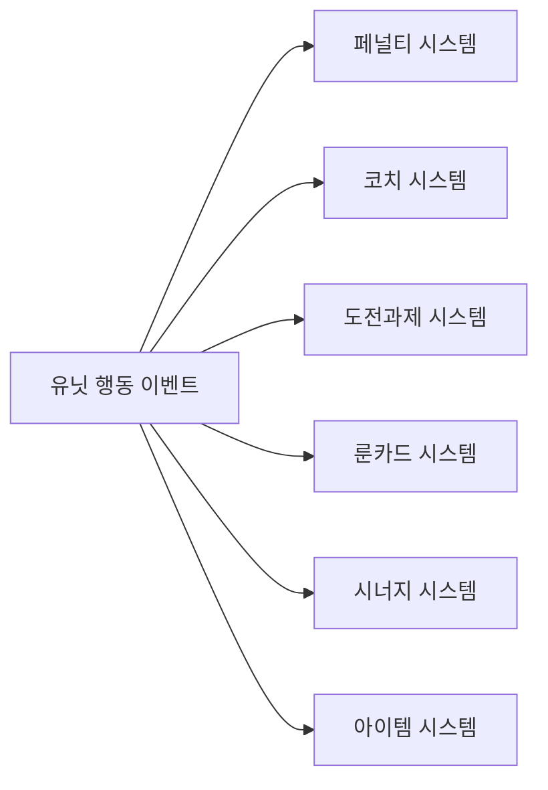
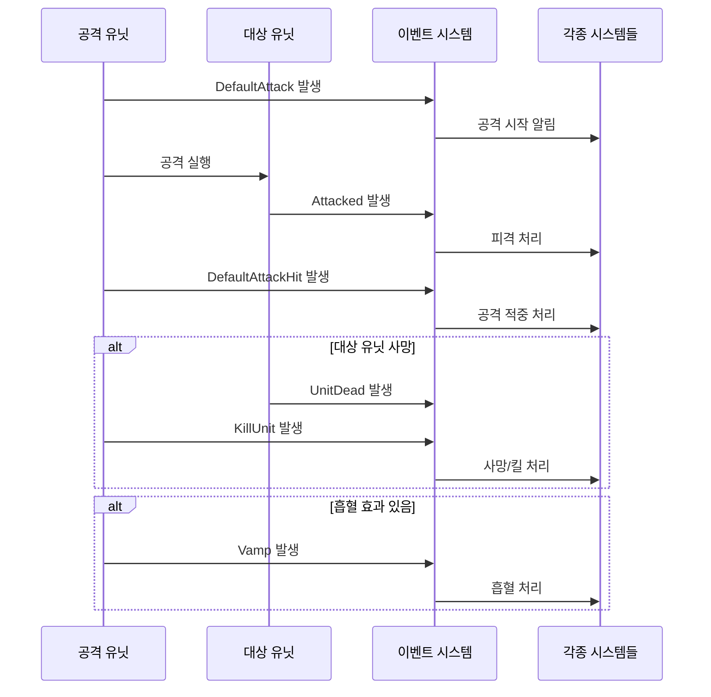
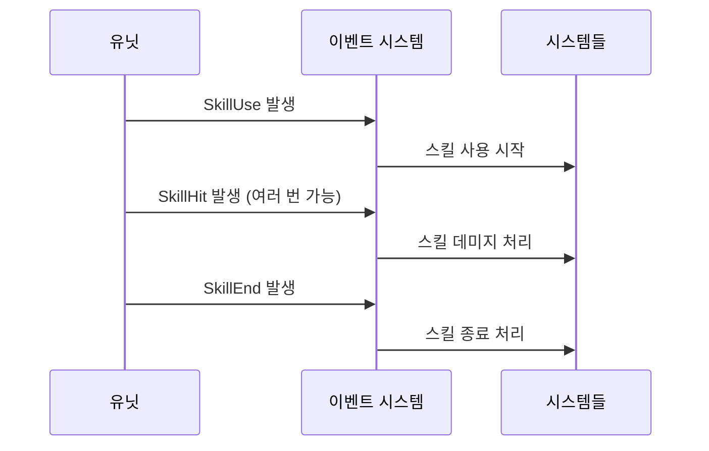

# 핵심 아키텍처 - 이벤트 시스템 - 유닛 행동 이벤트

## 개요

유닛 행동 이벤트 시스템은 메토체스에서 전투 중 발생하는 모든 유닛의 행동과 상태 변화를 추적하고 처리하는 핵심 메커니즘입니다. `Events/UnitBehaviorEvents` 폴더에 정의된 11개의 이벤트를 통해 공격, 스킬 사용, 피격, 사망 등 전투의 모든 순간을 세밀하게 관리합니다.

이 시스템은 페널티, 코치, 도전과제, 룬카드 등 다양한 게임 시스템들이 유닛의 행동에 반응하여 각자의 로직을 수행할 수 있도록 하는 중앙 집중식 이벤트 허브 역할을 합니다.

## 이벤트 종류와 구조

### 공격 관련 이벤트

#### 1. DefaultAttack
기본 공격 시작 시 발생하는 이벤트입니다.
```
- attacker: 공격자 엔티티
- target: 공격 대상 엔티티
```

#### 2. DefaultAttackHit
기본 공격이 실제로 적중했을 때 발생하는 이벤트입니다.

#### 3. Attacked
유닛이 공격받았을 때 발생하는 가장 포괄적인 피격 이벤트입니다.
```
- Attacker: 공격자 엔티티
- Target: 피격자 엔티티
- InitialDamages: 초기 데미지 값 (테이블)
- FinalDamages: 최종 데미지 값 (테이블)
- IsCritical: 크리티컬 여부
- AttackType: 공격 타입 (문자열)
```

### 스킬 관련 이벤트

#### 4. SkillUse
유닛이 스킬을 사용할 때 발생하는 이벤트입니다.
```
- Attacker: 스킬 사용자 엔티티
```

#### 5. SkillHit
스킬이 실제로 적중했을 때 발생하는 이벤트입니다.
```
- Attacker: 스킬 사용자 엔티티
- Target: 스킬 대상 엔티티
- InitialDamages: 초기 데미지 값 (테이블)
- FinalDamages: 최종 데미지 값 (테이블)
- IsCritical: 크리티컬 여부
- HitCount: 지속 데미지 스킬의 타격 횟수
```

#### 6. SkillEnd
스킬 사용이 완료되었을 때 발생하는 이벤트입니다.

### 상태 변화 이벤트

#### 7. ChangeHPAmount
유닛의 HP가 변화했을 때 발생하는 이벤트입니다.
```
- Attacker: 변화를 일으킨 엔티티
- Target: 변화를 받은 엔티티
- SetDamage: 설정된 데미지 값
- TargetHPPer: 대상의 HP 비율
```

#### 8. PlayAttack
공격 애니메이션이나 이펙트 재생 시 발생하는 이벤트입니다.

### 생존 관련 이벤트

#### 9. UnitDead
유닛이 사망했을 때 발생하는 이벤트입니다.
```
- Attacker: 킬을 한 엔티티
- Target: 사망한 엔티티
- DeadTile: 사망한 유닛이 마지막으로 서 있던 타일
```

#### 10. KillUnit
유닛이 다른 유닛을 처치했을 때 발생하는 이벤트입니다.
```
- Attacker: 킬을 한 엔티티
- Target: 처치된 엔티티
- DeadTile: 처치된 유닛이 서 있던 타일
- AttackType: 킬의 유형
```

### 특수 효과 이벤트

#### 11. Vamp
흡혈 효과가 발동했을 때 발생하는 이벤트입니다.
```
- VampRate: 흡혈률
- VampAmount: 흡혈량
- Attacker: 흡혈한 유닛
- Victim: 피해를 입은 유닛
```

## 이벤트 처리 메커니즘

### 이벤트 연결 (Event Connection)

각 시스템은 관심 있는 유닛 행동 이벤트에 연결하여 자신만의 로직을 수행합니다:



### 주요 이벤트 처리 시스템

#### 1. 페널티 시스템 (`PenaltyComponent.mlua`)
- 모든 주요 유닛 행동 이벤트 모니터링
- 페널티 조건 확인 및 적용
- 특정 행동에 대한 제재 처리

#### 2. 코치 시스템 (`CoachComponent.mlua`) 
- 유닛의 행동 패턴 분석
- 코치별 특수 효과 적용
- 전투 통계 수집

#### 3. 도전과제 시스템 (`ChallengeComponent.mlua`)
- 특정 행동 조건 달성 확인
- 도전과제 진행도 업데이트
- 보상 지급 처리

#### 4. 룬카드 시스템 (`RuneCardComponent.mlua`)
- 룬카드 효과 발동 조건 체크
- 특수 능력 활성화
- 세트 효과 적용

#### 5. 시너지 시스템 (`UnitSynergy.mlua`)
- 시너지 효과 발동
- 유닛 상태 변화 처리
- 팀 버프/디버프 적용

#### 6. 아이템 시스템 (`UnitItem.mlua`)
- 아이템 효과 발동
- 장착된 아이템의 특수 능력 활성화

## 이벤트 발생 시점

### 전투 흐름과 이벤트 발생



### 스킬 사용 시 이벤트 흐름



## 이벤트 활용 사례

### 1. 도전과제 진행 추적
- "적 유닛 10마리 처치" → `KillUnit` 이벤트 카운팅
- "크리티컬 공격 성공" → `Attacked` 이벤트의 `IsCritical` 확인
- "스킬로 적 처치" → `SkillHit`와 `UnitDead` 연관성 분석

### 2. 룬카드 효과 발동
- "공격 시 추가 효과" → `DefaultAttack` 이벤트에서 특수 효과 적용
- "피격 시 방어막 생성" → `Attacked` 이벤트에서 보호 효과 활성화

### 3. 시너지 효과 처리
- "아군 유닛 사망 시 분노" → `UnitDead` 이벤트에서 팀원 버프 적용
- "스킬 사용 시 마나 회복" → `SkillUse` 이벤트에서 마나 보너스

### 4. 통계 및 분석
- 전투 통계 수집을 위한 모든 행동 기록
- 밸런싱을 위한 데미지 및 킬 데이터 수집

## 성능 최적화

### 이벤트 핸들러 최적화
- `@ExecSpace("ServerOnly")`: 서버에서만 처리되는 이벤트 핸들러
- `@EventSender("Self")`: 이벤트 발생 범위 제한
- 불필요한 이벤트 연결 최소화로 성능 향상

### 데이터 전송 최적화
- 필요한 데이터만 이벤트 속성으로 전달
- 복잡한 계산은 이벤트 발생 시점이 아닌 핸들러에서 처리

## 확장 가능성

### 새로운 이벤트 추가
새로운 유닛 행동이나 특수 효과를 위해 이벤트를 추가할 때:
1. `Events/UnitBehaviorEvents/` 폴더에 새 이벤트 정의
2. 필요한 속성들을 `property`로 선언
3. 관련 시스템들에서 해당 이벤트에 연결
4. 이벤트 발생 로직을 적절한 컴포넌트에 구현

### 크로스 시스템 확장
여러 시스템이 동시에 반응해야 하는 복합적인 이벤트의 경우, 기존 이벤트 구조를 활용하여 각 시스템이 독립적으로 처리하도록 설계가 가능합니다.

## Code References

- `RootDesk/MyDesk/Events/UnitBehaviorEvents/*.mlua` — 모든 유닛 행동 이벤트 정의
- `RootDesk/MyDesk/InGame/Penalty/PenaltyComponent.mlua :: ConnectEvent()` — 페널티 시스템 이벤트 연결
- `RootDesk/MyDesk/InGame/Coach/CoachComponent.mlua :: ConnectEvent()` — 코치 시스템 이벤트 연결
- `RootDesk/MyDesk/InGame/Challenge/ChallengeComponent.mlua :: ConnectEvent()` — 도전과제 시스템 이벤트 연결
- `RootDesk/MyDesk/InGame/RuneCard/RuneCardComponent.mlua :: ConnectEvent()` — 룬카드 시스템 이벤트 연결
- `RootDesk/MyDesk/InGame/Unit/01_UnitComponent/UnitSynergy.mlua :: HandleAttacked()` — 시너지 시스템 피격 처리
- `RootDesk/MyDesk/InGame/Unit/01_UnitComponent/UnitItem.mlua :: HandleSkillUse()` — 아이템 시스템 스킬 사용 처리
- `RootDesk/MyDesk/InGame/Unit/00_SkillComponent/C10014_MoonBunny_Skill.mlua :: HandleAttacked()` — 개별 스킬의 피격 반응

