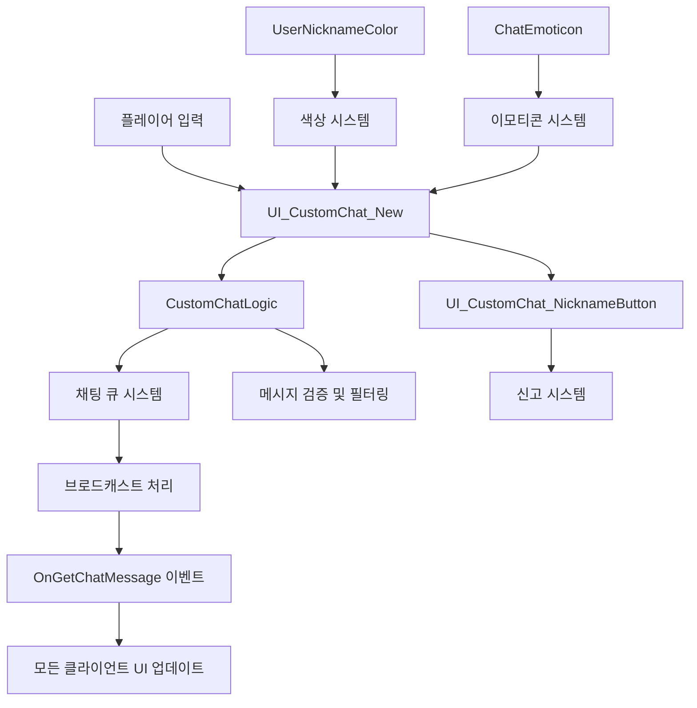
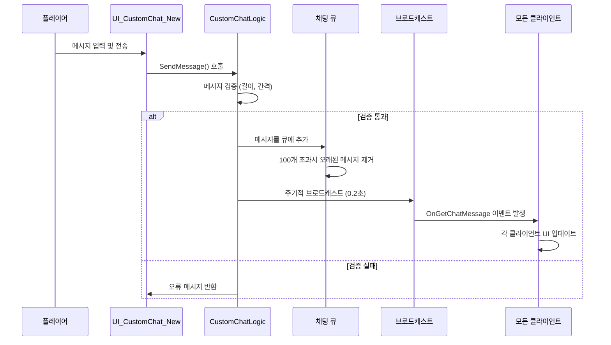
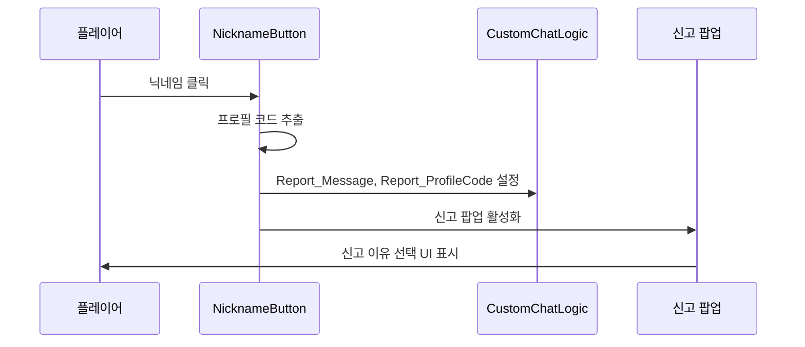

# 핵심 아키텍처 - 커뮤니케이션 시스템

## 개요

메토체스의 커뮤니케이션 시스템은 플레이어 간의 실시간 소통을 지원하는 포괄적인 채팅 및 상호작용 시스템입니다. `CustomChat` 폴더에 구현된 이 시스템은 텍스트 채팅, 이모티콘, 닉네임 색상 표시, 사용자 신고 기능을 통합적으로 제공하여 안전하고 활발한 커뮤니티 환경을 조성합니다.

이 시스템의 핵심 설계 원칙은 **성능 최적화**와 **사용자 안전**으로, 메시지 큐잉을 통한 효율적인 브로드캐스팅과 강력한 신고 메커니즘을 통해 대규모 멀티플레이어 환경에서도 안정적인 커뮤니케이션을 보장합니다.

## 시스템 아키텍처

### 전체 구조도



### 채팅 타입 분류

메토체스는 다음과 같은 채팅 타입을 지원합니다:

- **TYPE_DEFAULT (0)**: 일반 전체 채팅
- **TYPE_PARTY (1)**: 파티/그룹 채팅 (현재 비활성화)
- **TYPE_WHISPER (2)**: 귓속말/개인 메시지 (현재 비활성화)  
- **TYPE_SYSTEM (3)**: 시스템 메시지
- **TYPE_MEGAPHONE (4)**: 확성기/공지 메시지 (현재 비활성화)
- **TYPE_CACHED (-1)**: 캐시된 이전 메시지

## 핵심 컴포넌트

### 1. CustomChatLogic (채팅 로직 엔진)

채팅 시스템의 중추 역할을 하는 서버사이드 로직입니다.

#### 주요 기능
- **메시지 큐 관리**: 채팅 타입별 독립적인 큐 시스템
- **브로드캐스트 제어**: 0.2초 간격의 효율적인 메시지 전파
- **메시지 제한**: 50자 문자 제한, 1초 최소 간격 제한
- **캐싱 시스템**: 신규 접속자를 위한 최근 10개 메시지 캐시

#### 핵심 속성
```lua
- chatQueue: 타입별 메시지 큐 테이블
- BROADCAST_INTERVAL: 브로드캐스트 간격 (0.2초)
- CharacterLimit: 메시지 길이 제한 (50자)
- minChatInterval: 최소 채팅 간격 (1초)
- cachedDefaultMessageCount: 캐시 메시지 개수 (10개)
```

#### 메시지 처리 흐름



### 2. UI_CustomChat_New (경량 채팅 UI)

사용자 인터페이스의 새로운 버전으로, 성능 최적화에 중점을 둔 컴포넌트입니다.

#### 주요 기능
- **메시지 표시**: 최대 50개 메시지 관리
- **스크롤 시스템**: 자동 스크롤 및 수동 스크롤 제어
- **색상 시스템**: 메시지 타입별/사용자별 색상 구분
- **이모티콘 지원**: 텍스트 기반 이모티콘 자동 변환

#### 색상 시스템
```lua
- ChatColor_DefaultChatColor: 기본 채팅 색상
- ChatColor_MyChatColor: 본인 채팅 색상
- MessageColor_DEFAULT: 일반 메시지 색상
- MessageColor_SYSTEM: 시스템 메시지 색상
```

### 3. 사용자 상호작용 시스템

#### UI_CustomChat_NicknameButton
닉네임을 클릭 가능한 버튼으로 만들어 사용자 간 상호작용을 지원합니다.

**신고 기능 흐름**:


### 4. 데이터 시스템

#### UserNicknameColor 시스템
- **89가지 닉네임 색상** 제공
- HEX 색상 코드로 관리 (#CD5C5C, #BC8F8F 등)
- 사용자별 고유 색상 할당으로 시각적 구분

#### ChatEmoticon 시스템
- **키워드 기반 이모티콘** (:cry:, :happy:, :super: 등)
- **RUID 기반 스프라이트 관리**
- 텍스트 입력 시 자동 이모티콘 변환

## 성능 최적화 전략

### 1. 메시지 큐잉 시스템
- **배치 처리**: 개별 메시지가 아닌 큐 단위로 브로드캐스트
- **타입별 분리**: 채팅 종류에 따른 독립적 큐 관리
- **자동 정리**: 100개 초과 시 오래된 메시지 자동 제거

### 2. 브로드캐스트 최적화
- **고정 간격**: 0.2초 간격으로 일정한 네트워크 부하
- **조건부 전송**: 새 메시지가 있을 때만 브로드캐스트
- **인덱스 기반**: 전송된 메시지 인덱스 추적으로 중복 방지

### 3. UI 최적화
- **메시지 제한**: UI에서 최대 50개 메시지만 유지
- **레이지 로딩**: 화면에 보이는 메시지만 렌더링
- **효율적 스크롤**: 스크롤바 드래깅 상태 최적화

## 사용자 안전 및 관리 기능

### 1. 스팸 방지 메커니즘
- **길이 제한**: 메시지당 50자 제한
- **간격 제한**: 1초 최소 채팅 간격
- **명령어 보호**: 관리자 명령어 사용 제한

### 2. 신고 및 모니터링 시스템
- **원클릭 신고**: 닉네임 클릭만으로 신고 가능
- **컨텍스트 보존**: 신고 대상의 메시지와 프로필 코드 자동 저장
- **관리자 도구**: 신고된 메시지 및 사용자 정보 관리

### 3. 메시지 필터링
- **자동 검열**: 부적절한 내용 자동 필터링 (확장 가능)
- **사용자 차단**: 특정 사용자 메시지 숨김 기능 (확장 가능)

## 확장성 및 향후 개발

### 1. 현재 비활성화된 기능
현재 코드에는 있지만 주석 처리된 기능들:
- **파티 채팅**: 그룹 채팅 시스템
- **귓속말**: 개인 메시지 기능  
- **확성기**: 전서버 공지 시스템

### 2. 확장 가능한 영역
- **음성 채팅**: WebRTC 기반 음성 통신
- **이미지 공유**: 스크린샷 및 이미지 전송
- **번역 기능**: 다국어 실시간 번역
- **채팅봇**: AI 기반 자동 응답 시스템

### 3. 관리 도구 강화
- **실시간 모니터링**: 채팅 활동 실시간 추적
- **자동 제재**: AI 기반 자동 제재 시스템
- **통계 분석**: 채팅 사용 패턴 분석

## 실제 사용 시나리오

### 1. 일반 채팅 상황
```
플레이어A: "안녕하세요! 처음 플레이해보는데 팁 좀 알려주세요 :happy:"
↓ (0.2초 후 모든 플레이어에게 브로드캐스트)
플레이어B: "환영합니다! 초반에는 경제 관리가 중요해요"
플레이어C: "시너지 조합을 먼저 익혀보세요 :super:"
```

### 2. 신고 상황
```
1. 불쾌한 메시지 발견
2. 해당 닉네임 클릭
3. 신고 팝업 자동 표시 (메시지와 프로필 코드 자동 저장)
4. 신고 사유 선택 및 제출
5. 관리자에게 신고 내용 전달
```

### 3. 시스템 메시지
```
시스템: "새로운 이벤트가 시작되었습니다!"
시스템: "플레이어A님이 전설 등급 유닛을 획득했습니다!"
```

## 보안 고려사항

### 1. 서버사이드 검증
- 모든 메시지는 서버에서 검증 후 전송
- 클라이언트 조작 방지를 위한 이중 검증
- 프로필 코드 기반 사용자 식별

### 2. 개인정보 보호
- 닉네임 외 개인정보 노출 금지
- 프로필 코드 암호화 저장
- 신고 내용의 안전한 보관

## Code References

- `RootDesk/MyDesk/CustomChat/CustomChatLogic.mlua :: OnBeginPlay()` — 채팅 큐 초기화 및 브로드캐스트 타이머 설정
- `RootDesk/MyDesk/CustomChat/CustomChatLogic.mlua :: AddMessage()` — 메시지 검증 및 큐 추가 로직
- `RootDesk/MyDesk/CustomChat/UI_CustomChat_New.mlua :: OnBeginPlay()` — 채팅 UI 초기화 및 색상 시스템 설정
- `RootDesk/MyDesk/CustomChat/UI_CustomChat_New.mlua :: OnGetMessage()` — 메시지 수신 및 UI 업데이트
- `RootDesk/MyDesk/CustomChat/UI_CustomChat_NicknameButton.mlua :: HandleButtonClickEvent()` — 닉네임 클릭 시 신고 팝업 활성화
- `RootDesk/MyDesk/CustomChat/OnGetChatMessage.mlua` — 채팅 메시지 수신 이벤트 정의
- `RootDesk/MyDesk/CustomChat/UserNicknameColor.csv` — 89가지 닉네임 색상 데이터
- `RootDesk/MyDesk/CustomChat/ChatEmoticon.csv` — 16가지 이모티콘 키워드-RUID 매핑

