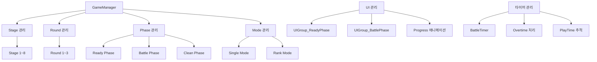
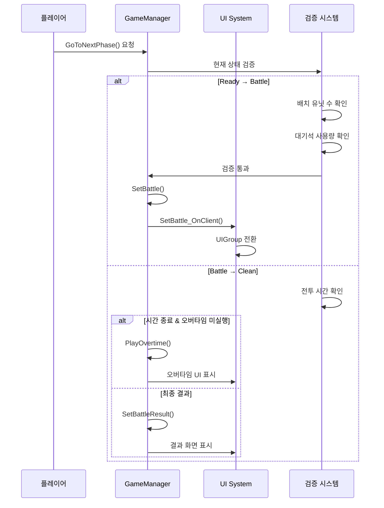
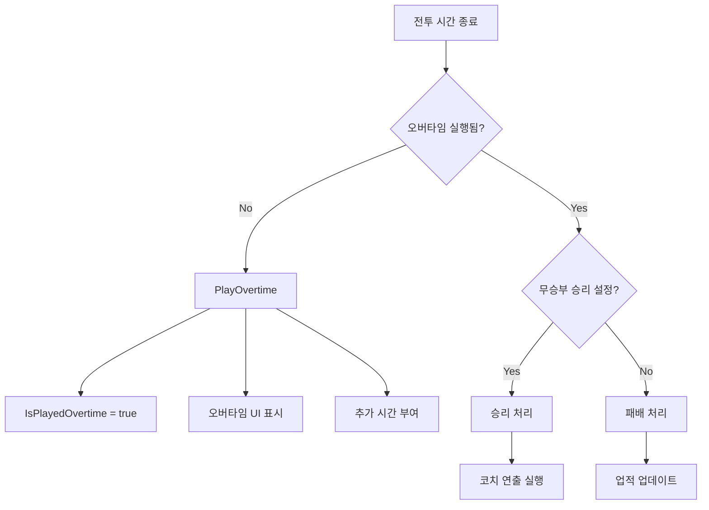

# 인게임 시스템 - 게임 관리 - 게임 매니저

## 개요

GameManager는 메토체스 인게임의 핵심 제어 시스템으로, 게임의 전체적인 흐름과 상태를 관리하는 중추적인 컴포넌트입니다. **Stage/Round/Phase 진행 관리**, **게임 모드 제어**, **UI 그룹 전환**, **전투 타이머 및 오버타임 처리**를 통합적으로 담당하여 일관되고 안정적인 게임 경험을 제공합니다.

이 시스템의 핵심 설계 원칙은 **상태 기반 관리**와 **클라이언트-서버 동기화**로, `@TargetUserSync` 속성을 통해 모든 게임 상태가 정확히 동기화되며, 각 페이즈마다 적절한 검증과 전환 로직이 수행됩니다.

## 시스템 아키텍처

### 게임 상태 계층구조



## 핵심 속성 및 구조

### 게임 진행 상태

#### 동기화 속성 (@TargetUserSync)
```lua
-- 게임 진행도
Stage: 1~8 (현재 스테이지)
Round: 1~3 (라운드)
Phase: 숫자형 페이즈 식별자
RoundType: "Battle" (라운드 타입)
PhaseType: "Ready", "Battle", "Clean" (현재 페이즈)

-- 게임 모드
ModeType: "Single", "Rank" (게임 모드)
ModeLevel: 난이도 레벨
ModeSetVersion: 모드 설정 버전
```

#### 전투 관리 속성
```lua
-- 타이머 관리
BattleTime: 전투 시간 (초)
ReadyTime: 준비 시간
IsPlayedOvertime: 오버타임 실행 여부

-- 팀 상태
MyUnitCount: 아군 유닛 수
EnemyCount: 적군 유닛 수
TeamHP_User/TeamHP_Enemy: 팀 HP
TeamHPMax_User/TeamHPMax_Enemy: 최대 팀 HP
```

### UI 그룹 관리

#### Ready Phase UI 그룹
- **UIGroup_ReadyPhase**: 준비 단계 전용 UI
- 유닛 배치 인터페이스
- 상점 시스템
- 인벤토리 관리
- 전략 계획 도구들

#### Battle Phase UI 그룹  
- **UIGroup_BattlePhase**: 전투 단계 전용 UI
- 실시간 전투 정보
- HP 바 및 상태 표시
- 전투 타이머
- 결과 패널

## 게임 흐름 관리

### 페이즈 전환 시스템

#### 전환 흐름도


### 핵심 전환 메서드

#### GoToNextPhase() - 페이즈 진행 제어
```lua
-- 검증 단계
1. Ready Phase: 배치 유닛 수 < 허용 유닛 수
2. Ready Phase: 대기석 사용량 ≤ 사용 가능 대기석
3. Battle Phase: 전투 시간 및 오버타임 처리
4. 게임 종료 조건 확인 (HP ≤ 0, 8-3 라운드 완료)

-- 전환 실행
targetPhase = currentPhase + 1
라운드 정보 테이블에서 다음 단계 데이터 조회
해당 페이즈 메서드 실행
```

#### Ready_OnClient() - 준비 단계 UI 설정
```lua
-- UI 그룹 전환
UIGroup_ReadyPhase.Enable = true
UIGroup_BattlePhase.Enable = false

-- 진행도 팝업 애니메이션
progressPopupUI.Text = "Ready"
Ease 애니메이션: 300→-300→300 (QuintEaseOut→BackEaseIn)

-- Progress Bar 확장
ui_progressBar.UITweenScale:Play()
```

#### SetBattle_OnClient() - 전투 단계 UI 설정
```lua
-- UI 그룹 전환
UIGroup_ReadyPhase.Enable = false
UIGroup_BattlePhase.Enable = true

-- 드래그 상태 정리
if (유닛 드래그 중) → 드래그 종료 & 원위치
if (아이템 드래그 중) → 마우스 추적 해제
if (룬카드 드래그 중) → 드래그 체이서 비활성화

-- 전투 팝업 애니메이션  
progressPopupUI.Text = "Battle"
```

## 게임 모드 시스템

### Single Mode (싱글 모드)
- **ModeType**: "Single" 
- **특징**: PvE 형태의 연습 모드
- **AI 상대**: 사전 정의된 적 프리셋 사용
- **진행**: 선형적 스테이지 클리어

### Rank Mode (랭크 모드)  
- **ModeType**: "Rank"
- **특징**: 경쟁 모드
- **매칭**: 플레이어 간 실시간 대전
- **보상**: 랭크 포인트 및 특별 보상

### 모드별 차별화 요소

```lua
-- 승부 판정 차이
if ModeType == "Rank" then
    -- 랭크 모드: 무승부 = 패배
    _AchievementService:UpdateAchievement("AC006005", 1, user)
    SetBattleResult(false, EnemyCount)
else
    -- 싱글 모드: 무승부 처리 로직
    if userPControl.Battle_DrawIsWin then
        SetBattleResult(true, MyUnitCount)
    end
end
```

## 전투 타이머 및 오버타임

### 타이머 관리 시스템

#### 일반 전투 타이머
```lua
BattleTime: 전투 제한 시간 (초 단위)
UI_BattleTimer: 시각적 타이머 UI

-- 매 프레임 감소
OnUpdate(delta):
    if PhaseType == "Battle":
        BattleTime -= delta
        UI 업데이트
```

#### 오버타임 시스템


#### PlayOvertime() 구현
```lua
-- 서버 사이드 오버타임 설정
IsPlayedOvertime = true
추가 전투 시간 설정

-- 클라이언트 UI 업데이트  
PlayOvertime_OnClient(userId):
    오버타임 패널 활성화
    특수 연출 및 사운드 재생
    UI 강조 효과
```

## 승부 판정 시스템

### 승리/패배 조건

#### 일반 승부 판정
```lua
SetBattleResult(isWin, remainingUnits):
    전투 통계 기록
    코치 연출 트리거
    업적 진행도 업데이트
    다음 라운드 준비
```

#### 게임 종료 조건
```lua
-- 패배 조건
if TeamManager.HP <= 0 and PhaseType == "Clean":
    SetGameOver(false) -- 게임 오버 (패배)

-- 승리 조건 (8-3 스테이지)
if Stage == 8 and Round == 3 and PhaseType == "Clean":
    8-3의 개별 라운드 중 승리 확인
    if 승리한 라운드 존재:
        SetGameOver(true) -- 게임 클리어
        BGM 변경 (승리 음악)
        시너지 승리 업적 업데이트
```

### 특수 규칙 - 8-3 라운드
```lua
-- 8-3에서는 반드시 승리해야 클리어
if winCheck == false:
    Round -= 1  -- 라운드 되돌리기
    Round8_3Num += 1  -- 재시도 횟수 증가
    "최종 라운드에서 반드시 승리해야 합니다" 메시지
```

## 데이터 로딩 및 저장

### 게임 상태 복원
```lua
-- 데이터 로딩 필요 시
NeedDataLoad: 로딩 필요 여부
NeedDataLoadVersion: 버전 정보
NeedDataLoadType: "Single"/"Rank"
NeedDataLoadLevel: 복원할 레벨
NeedDataLoadStage/Round: 복원할 진행도
NeedDataLoadPhaseType: 복원할 페이즈

-- 저장된 데이터 설정
SetSavedData: 저장 데이터 적용 여부
```

### 게임 진행 기록
```lua
PlayTime: 총 플레이 시간
PlayTimer: 플레이 타이머 ID
ReadyTimeRecord: 각 라운드별 준비 시간 기록
RewardTable: 라운드별 보상 정보
```

## 성능 최적화

### UI 전환 최적화
```lua
-- 단일 프레임에서 UI 그룹 전환
UIGroup_ReadyPhase.Enable = false
UIGroup_BattlePhase.Enable = true

-- 불필요한 UI 요소 즉시 비활성화
Text_OnFieldUnitsCount.Enable = false
_UI_Tooltip:ClearAllTooltipUI()
```

### 상태 동기화 최적화
```lua
-- @TargetUserSync로 필요한 데이터만 동기화
-- 클라이언트별 개별 전송으로 네트워크 효율성 확보
-- 서버 검증을 통한 치팅 방지
```

### 타이머 관리 최적화
```lua
-- 단일 타이머로 다중 기능 처리
PlayTimer: 게임 전체 플레이 시간 추적
TeamHPUpdateTimer: HP 바 업데이트 최적화

-- Ease 애니메이션 배치 처리
for i=1, 20 do
    _TimerService:SetTimerOnce(moveEase, 0.02*i)
end
```

## 확장 가능성

### 새로운 게임 모드 추가
```lua
-- ModeType 확장 가능
"Single", "Rank" → "Tournament", "Coop", "Challenge" 추가

-- 모드별 차별화 로직
if ModeType == "Tournament":
    토너먼트 특수 규칙 적용
elseif ModeType == "Coop":
    협동 플레이 로직
```

### 동적 페이즈 확장
```lua
-- PhaseType 확장
"Ready", "Battle", "Clean" → "Preparation", "Intermission" 추가

-- 유연한 페이즈 전환 시스템으로 새로운 단계 쉽게 추가
```

### AI 및 자동화
```lua
-- 자동 전투 모드
if AutoBattleMode:
    Ready Phase 자동 건너뛰기
    최적 전략 자동 적용

-- 관전자 모드  
if SpectatorMode:
    UI 그룹 비활성화
    정보 표시 UI만 유지
```

## 디버깅 및 개발 도구

### 개발자 치트
```lua
-- 스테이지/라운드 직접 이동
SetStage(target_stage)
SetRound(target_round)

-- 페이즈 강제 전환
ForceNextPhase()

-- 타이머 조작
SetBattleTime(seconds)
SkipOvertime()
```

### 상태 모니터링
```lua
-- 실시간 게임 상태 추적
현재 Stage-Round-Phase 표시
남은 전투 시간 및 오버타임 상태
UI 그룹 활성화 상태
동기화 속성 값들
```

## 오류 처리 및 복구

### 상태 불일치 방지
```lua
-- 클라이언트-서버 동기화 검증
@TargetUserSync 속성의 정합성 체크
잘못된 페이즈 전환 요청 차단
```

### 복구 메커니즘
```lua
-- 게임 상태 복원
데이터 로딩 시스템을 통한 이전 상태 복구
NeedDataLoad 플래그로 복구 필요성 확인
세이브 데이터 기반 정확한 상태 재현
```

## Code References

- `RootDesk/MyDesk/InGame/Managers/GameManager.mlua :: GoToNextPhase()` — 페이즈 전환 및 게임 진행 검증 로직
- `RootDesk/MyDesk/InGame/Managers/GameManager.mlua :: Ready_OnClient()` — 준비 단계 UI 그룹 설정 및 애니메이션  
- `RootDesk/MyDesk/InGame/Managers/GameManager.mlua :: SetBattle_OnClient()` — 전투 단계 UI 전환 및 드래그 상태 정리
- `RootDesk/MyDesk/InGame/Managers/GameManager.mlua :: PlayOvertime()` — 오버타임 시스템 실행 로직
- `RootDesk/MyDesk/InGame/Managers/GameManager.mlua :: SetBattleResult()` — 승부 판정 및 결과 처리
- `RootDesk/MyDesk/InGame/Managers/GameManager.mlua :: SetGameOver()` — 게임 종료 조건 및 최종 결과 처리
- `RootDesk/MyDesk/InGame/Managers/RoundInfo.userdataset` — 라운드별 진행 정보 데이터
- `RootDesk/MyDesk/InGame/Managers/MonsterRoundInfo.userdataset` — 적 라운드 정보 데이터

