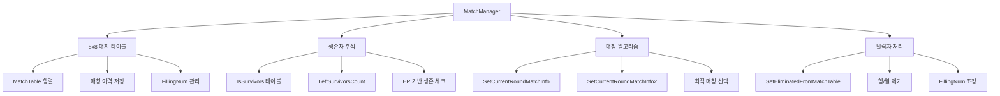

# 인게임 시스템 - 게임 관리 - 매칭 매니저

## 개요

MatchManager는 메토체스의 8명 플레이어 오토체스 게임에서 **공정하고 균형잡힌 매칭**을 제공하는 핵심 시스템입니다. **8x8 매치 테이블**을 기반으로 한 정교한 알고리즘을 통해 모든 플레이어가 비슷한 횟수로 서로 대전할 수 있도록 보장하며, **생존자 추적**, **매칭 이력 관리**, **탈락자 처리** 등을 종합적으로 관리합니다.

이 시스템의 핵심 가치는 **매칭의 공정성**과 **전략적 다양성**입니다. 단순한 랜덤 매칭이 아닌, 과거 매칭 이력을 고려한 지능적인 알고리즘으로 모든 플레이어에게 균등한 기회를 제공합니다.

## 시스템 아키텍처

### 전체 구조도



## 핵심 구성 요소

### 1. 8x8 매치 테이블 시스템

매치 테이블은 **대칭 행렬** 구조로 설계되어, 각 플레이어 간의 매칭 이력과 쿨다운을 관리합니다.

#### 테이블 구조
```lua
-- 초기화 시 8x8 행렬 생성
for i=1, 8 do
    local row = {
        ["Key"] = i,
        ["Data"] = { 0, 0, 0, 0, 0, 0, 0, 0 }
    }
    row["Data"][i] = -9999  -- 자기 자신과는 매칭 불가
    self.MatchTable[i] = row
end
```

#### 값의 의미
- **0**: 매칭 가능한 상태
- **양수**: 최근 매칭 후 쿨다운 중 (라운드별 1씩 감소)
- **-1**: 임시 매칭 제외 상태
- **-9999**: 영구 매칭 불가 (자기 자신, 탈락자)

### 2. 생존자 추적 시스템

게임 진행 중 플레이어의 생존 상태를 실시간으로 추적합니다.

#### 핵심 속성
```lua
@Description("생존자인지를 나타내는 변수")
property SyncTable<boolean> IsSurvivors
property number LeftSurvivorsCount = 0
```

#### 생존자 검사 로직
```lua
-- HP 기반 생존자 확인
for i=1, #teamManagers do
    local hp = teamManagers[i].TeamManager.HP
    if hp > 0 then
        local uniqueNumber = teamManagers[i].TeamManager.UniqueNumber
        table.insert(survivors, uniqueNumber)
    end
end
```

### 3. 매칭 알고리즘

#### 기본 매칭 (SetCurrentRoundMatchInfo)
초기 단계에서 사용하는 **단순 랜덤 매칭** 방식입니다.

```lua
-- 임시 로직: 생존자 중 랜덤 선택
local roomCount = math.floor((#survivors+1)/2)
for i=1, roomCount do
    -- 랜덤하게 두 플레이어 선택
    local randomIdx = _UtilLogic:RandomIntegerRange(1, #survivors)
    userA = survivors[randomIdx]
    table.remove(survivors, randomIdx)
    -- ... userB 선택
end
```

#### 고급 매칭 (SetCurrentRoundMatchInfo2)
**매칭 이력을 고려한 최적화된 알고리즘**으로, 핵심 매칭 로직입니다.

##### 알고리즘 단계

1. **매치 테이블 갱신**
```lua
-- 매 라운드마다 쿨다운 감소
for j=1, 8 do
    if data[j] > 0 then
        data[j] -= 1
    elseif data[j] == -1 then
        data[j] = 0  -- 임시 제외 해제
    end
end
```

2. **최적 매칭 대상 선택**
```lua
-- 매칭 가능한 상대가 가장 적은 플레이어 우선 선택
local minZeroCount_row = 999
local rowIdx = 0
for i=1, #self.MatchTable do
    local zeroCount = getRowZeroCount(i)
    if zeroCount > 0 and zeroCount < minZeroCount_row then
        minZeroCount_row = zeroCount
        rowIdx = i
    end
end
```

3. **상대방 최적화**
```lua
-- 선택된 플레이어의 가능한 상대 중 최적 선택
-- 열에서 0이 가장 적은 상대 우선 매칭
local finalCandidates = {}
local minZeroCount_column = 7
for i=1, #targetList do
    local column = targetList[i]
    local zeroCount = getColumnZeroCount(column)
    
    if zeroCount == minZeroCount_column then
        table.insert(finalCandidates, column)
    elseif zeroCount < minZeroCount_column then
        table.clear(finalCandidates)
        table.insert(finalCandidates, column)
    end
end
```

4. **매칭 이력 기록**
```lua
-- 매칭된 쌍에 FillingNum 값으로 쿨다운 설정
targetData[selectedKey] = self.FillingNum
selectedData[targetKey] = self.FillingNum
```

### 4. 탈락자 처리 시스템

플레이어 탈락 시 매치 테이블을 동적으로 재구성합니다.

#### 탈락 처리 로직 (SetEliminatedFromMatchTable)

```lua
self.LeftSurvivorsCount -= 1

-- 2명 단위로 탈락 시 테이블 정리
if self.LeftSurvivorsCount %2 == 0 then
    -- FillingNum 조정 (6명→4, 4명→3, 2명→1)
    if self.LeftSurvivorsCount == 6 then
        self.FillingNum = 4
    elseif self.LeftSurvivorsCount == 4 then  
        self.FillingNum = 3
    elseif self.LeftSurvivorsCount == 2 then
        self.FillingNum = 1
    end
end
```

#### 행/열 제거
```lua
-- 탈락자 행 제거
for i=#self.MatchTable, 1, -1 do
    local row = self.MatchTable[i]
    local key = row["Key"]
    
    if self.IsSurvivors[key] == false then
        table.remove(self.MatchTable, i)
    end
end

-- 탈락자 열 마스킹 및 쿨다운 감소
for j=1, 8 do
    if self.IsSurvivors[j] == false then
        data[j] = -9999  -- 영구 매칭 불가
    elseif data[j] > 0 then
        data[j] -= 1     -- 쿨다운 감소
    end
end
```

## 매칭 공정성 보장 메커니즘

### 1. 균등한 매칭 기회
- **0의 개수가 적은 플레이어 우선**: 매칭 가능한 상대가 적을수록 높은 우선순위
- **양방향 쿨다운 적용**: 매칭 후 양쪽 모두에게 동일한 쿨다운 부여

### 2. 전략적 다양성 보장  
- **최근 상대 회피**: FillingNum 기반 쿨다운으로 연속 매칭 방지
- **동적 FillingNum 조정**: 생존자 수에 따라 쿨다운 기간 최적화

### 3. 게임 후반 최적화
- **결승전 특별 처리**: 2명 남을 시 추가 쿨다운 감소로 즉시 매칭 가능
- **점진적 제약 완화**: 생존자 감소 시 FillingNum 축소로 매칭 유연성 증대

## 관련 파일

### 코드 참조
- `RootDesk/MyDesk/InGame/Managers/MatchManager.mlua :: OnBeginPlay()` — 8x8 매치 테이블 초기화
- `RootDesk/MyDesk/InGame/Managers/MatchManager.mlua :: SetCurrentRoundMatchInfo()` — 기본 랜덤 매칭 알고리즘
- `RootDesk/MyDesk/InGame/Managers/MatchManager.mlua :: SetCurrentRoundMatchInfo2()` — 고급 최적화 매칭 알고리즘  
- `RootDesk/MyDesk/InGame/Managers/MatchManager.mlua :: SetEliminatedFromMatchTable()` — 탈락자 처리 및 테이블 재구성
- `RootDesk/MyDesk/InGame/Managers/MatchManager.mlua :: PrintMatchTable()` — 디버그용 테이블 출력

### 연동 시스템
- `GameManager.mlua` — 라운드 진행 시 매칭 정보 요청
- `TeamManager.mlua` — 생존자 HP 정보 제공
- Confluence 참조 문서: `https://confluence.nexon.com/pages/viewpage.action?pageId=1113761835`

## 성능 및 확장성

### 시간 복잡도
- **매칭 생성**: O(n²) where n = 생존자 수 (최대 8)
- **테이블 갱신**: O(64) = O(1) (고정 8x8 행렬)
- **탈락자 처리**: O(n) where n = 생존자 수

### 메모리 효율성
- **고정 크기 행렬**: 8x8 = 64개 정수로 일정한 메모리 사용
- **동적 할당 최소화**: 사전 정의된 구조체 활용

이러한 설계로 MatchManager는 공정하고 예측 가능한 매칭을 제공하면서도, 게임의 전략적 재미를 해치지 않는 균형잡힌 시스템을 구현합니다.
