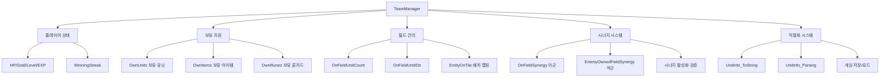
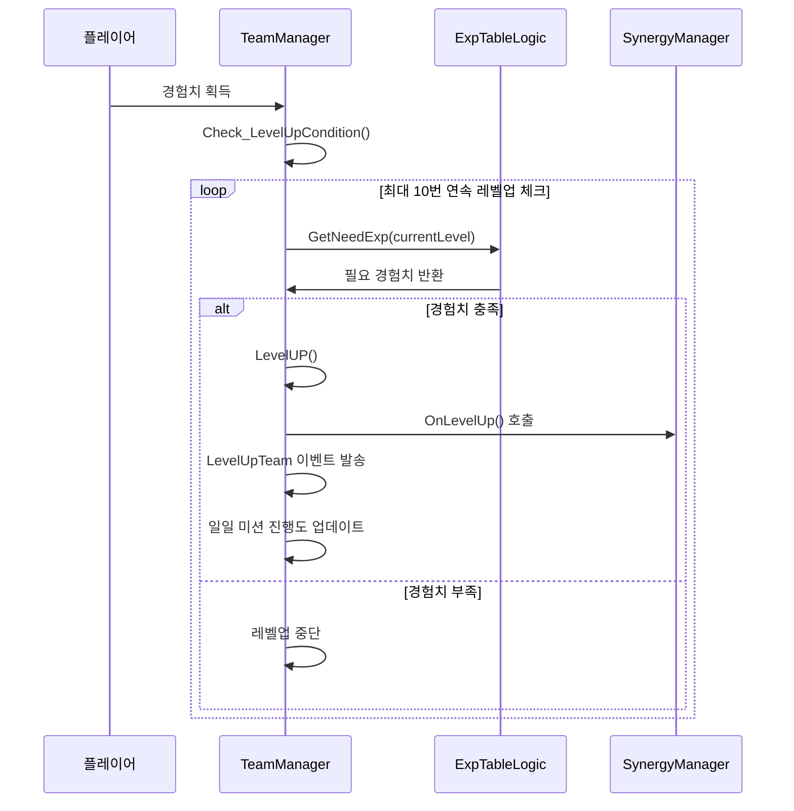
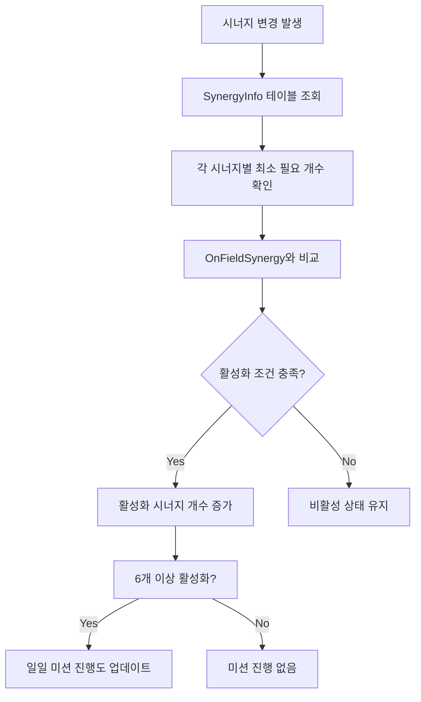

# 인게임 시스템 - 게임 관리 - 팀 매니저

## 개요

TeamManager는 메토체스에서 플레이어의 모든 게임 내 자원과 상태를 관리하는 핵심 컴포넌트입니다. **플레이어 기본 상태** (HP/Gold/Level/EXP/WinningStreak), **보유 자원 관리** (유닛/아이템/룬), **필드 배치 시스템**, **시너지 계산 엔진**, **유닛 정보 직렬화** 시스템을 통합적으로 담당하여 게임의 모든 전략적 요소들을 체계적으로 관리합니다.

이 시스템의 핵심 설계 철학은 **완전한 상태 동기화**와 **데이터 무결성 보장**입니다. `@TargetUserSync` 속성을 통해 클라이언트-서버 간 실시간 동기화를 제공하며, 복잡한 유닛 정보를 효율적으로 직렬화/파싱하여 저장과 복원이 정확하게 이루어지도록 설계되었습니다.

## 시스템 아키텍처

### 전체 구조도



## 핵심 속성 시스템

### 플레이어 기본 상태 (@TargetUserSync)

#### 생존 및 자원 관리
```lua
HP: 팀 생명력 (패배 조건과 직결)
Golds: 보유 골드 (구매 및 업그레이드 자원)
Level: 팀 레벨 (1~10, 배치 가능 유닛 수 결정)
EXP: 경험치 (레벨업 재료)
WinningStreak: 연승 기록 (보상 배율에 영향)
```

#### 골드 추적 시스템
```lua
GetGoldAmount: 획득한 총 골드량
UsedGoldAmount: 사용한 총 골드량

-- 골드 획득/사용 추적을 통한 통계 및 밸런싱 데이터 수집
```

### 보유 자원 관리 (@TargetUserSync)

#### 유닛 관리
```lua
OwnUnits: SyncTable<Entity> -- 보유한 모든 유닛 엔티티
OwnUnitsBySetID: SyncTable<string, number> -- 캐릭터ID별 보유 수량
OnFieldUnitCount: 필드에 배치된 유닛 수
OnFieldUnitIDs: SyncTable<string, number> -- 필드 배치 유닛 ID별 개수
```

#### 아이템 & 룬카드 시스템
```lua
OwnItems: SyncTable<string> -- 보유 아이템 ID 목록
OwnRunes: SyncTable<string> -- 보유 룬카드 ID 목록
OnEntityUsingToOwnedRunes: SyncTable<Entity> -- 룬카드 사용 매핑

ItemListFromBox: 아이템 박스에서 획득한 아이템 목록
```

### 필드 배치 및 적 정보

#### 배치 관리 시스템
```lua
EntityOnTile: SyncTable<Entity, Entity> -- 타일↔유닛 양방향 매핑
- Key: 타일 엔티티
- Value: 배치된 유닛 엔티티
```

#### 적군 정보 추적
```lua
EnemyUnits: 적 유닛 목록
EnemyOwnedFieldSynergy: 적군 활성화 시너지
EnemyOwnedRunes: 적군 보유 룬카드
OnEntityUsingToEnemyOwnedRunes: 적군 룬카드 사용 매핑
```

## 플레이어 상태 관리

### 레벨 시스템

#### 경험치 및 레벨업 메커니즘


#### LevelUP() 구현
```lua
Level += 1
SynergyManager_New:OnLevelUp() -- 시너지 효과 적용
SendEvent(LevelUpTeam) -- 다른 시스템에 레벨업 알림

-- 특별 조건: 10레벨 달성 시 일일 미션
if Level == 10 and GameMode == "Single":
    DailyMissionComponent:AddProgress("DM10005")
```

### 골드 관리 시스템

#### AddGolds() - 통합 골드 관리
```lua
method AddGolds(amount, cause):
    Golds += amount
    
    -- 획득/사용 통계 업데이트
    if amount >= 0:
        GetGoldAmount += amount
    else:
        UsedGoldAmount -= amount
    
    -- 원인별 처리
    if cause in ["coach", "runeCard", "item", "char", "roundResult", "synergy"]:
        일일 미션 진행도 업데이트 (싱글 모드)
        PlayCoinDirector_Text(false) -- 일반 획득 연출
    elif cause in ["start", "init", "cheat"]:
        PlayCoinDirector_Text(true) -- 시작/초기화 연출
    else:
        PlayCoinDirector_Text(false) -- 기본 연출
```

#### 골드 획득 원인 분류
- **coach**: 코치 효과로 획득
- **runeCard**: 룬카드 효과로 획득  
- **item**: 아이템 판매/효과로 획득
- **char**: 유닛 판매로 획득
- **roundResult**: 라운드 결과 보상
- **synergy**: 시너지 효과로 획득
- **repechage**: 재기전 보상
- **start/init**: 게임 시작/초기화
- **cheat**: 개발자 치트

## 시너지 관리 시스템

### 실시간 시너지 계산

#### GetOnFieldSynergyCount() - 시너지 카운트 관리
```lua
method GetOnFieldSynergyCount(synergyID, count):
    if count > 0:  -- 시너지 추가
        OnFieldSynergy[synergyID] = (기존값 or 0) + count
    else:  -- 시너지 감소
        OnFieldSynergy[synergyID] += count
        if OnFieldSynergy[synergyID] <= 0:
            OnFieldSynergy[synergyID] = nil  -- 0 이하시 제거
    
    -- 시너지 변경 이벤트 발송
    SendEvent(OnFieldSynergyCountChanged("User", synergyID, count))
    
    -- 일일 미션: 6종 이상 시너지 활성화 체크 (싱글 모드)
```

#### 시너지 활성화 검증 시스템



#### CheckActiveSynergy() - 활성 시너지 개수 확인
```lua
활성화 조건 테이블 생성:
    SynergyInfo에서 각 시너지별 NeedCount_step1~5 중 최소값 추출

활성 시너지 카운팅:
    for 각 OnFieldSynergy:
        if 현재개수 >= 최소필요개수:
            activeSynergyAmount++
            
return activeSynergyAmount
```

#### CheckSpecificSynergy() - 특정 시너지 활성화 확인
```lua
method CheckSpecificSynergy(checkSynergyID):
    SynergyInfo에서 해당 시너지 최소 필요 개수 조회
    
    if OnFieldSynergy[checkSynergyID] >= 필요개수:
        return true
    else:
        return false
```

## 유닛 정보 직렬화 시스템

### UnitInfo_ToString() - 유닛 데이터 직렬화

#### 직렬화 포맷
```
"CharID_Level_Item1/Item2/Item3_StackProperty_TilePosition"

예시: "C10001_3_I10005/I10012/0_{stat1:10,stat2:5}_2/3"
```

#### 구현 세부사항
```lua
method UnitInfo_ToString(unit):
    unitID = unit.UnitInfo.charID
    level = unit.UnitInfo.level
    
    -- 장착 아이템 ID 추출 (없으면 "0")
    itemIDs = []
    for i=1,3:
        itemIDs[i] = unit.UnitStatus.EquippedItemIDList[i] or "0"
    
    -- 스택 속성 직렬화 (테이블 → 문자열)
    stackProperty_str = _UtilLogic:TableToString(unit.UnitStatus.StackProperty)
    
    -- 타일 위치 정보
    tilePosition = "vertical/horizontal"
    
    return formatted_string
```

### UnitInfo_Parsing() - 유닛 데이터 파싱

#### 역직렬화 과정
```lua
method UnitInfo_Parsing(data, targetEntity):
    parsing = _UtilLogic:Split(data, "_")
    
    -- 기본 정보 복원
    targetEntity.UnitInfo.charID = parsing[1]
    targetEntity.UnitInfo.level = parsing[2]
    
    -- 아이템 정보 복원
    itemData = _UtilLogic:Split(parsing[3], "/")
    for i=1,3:
        if itemData[i] != "0":
            장착 아이템 복원 로직
    
    -- 스택 속성 복원
    stackProperty = _UtilLogic:StringToTable(parsing[4])
    
    -- 타일 위치 복원
    tilePos = _UtilLogic:Split(parsing[5], "/")
    vertical, horizontal = tilePos[1], tilePos[2]
```

### 활용 사례

#### 게임 저장 시
```lua
SaveCurrentGame():
    for 각 보유유닛:
        serialized_data = UnitInfo_ToString(unit)
        DB에 저장
```

#### 게임 로드 시  
```lua
LoadContinuedGame():
    saved_units = DB에서 불러오기
    for 각 saved_unit_data:
        new_unit = 유닛 엔티티 생성
        UnitInfo_Parsing(saved_unit_data, new_unit)
```

## 적군 정보 관리

### 적군 시너지 추적

#### GetEnemyOwnedFieldSynergyCount()
```lua
method GetEnemyOwnedFieldSynergyCount(synergyID, count):
    EnemyOwnedFieldSynergy[synergyID] = (기존값 or 0) + count
    
    SendEvent(OnFieldSynergyCountChanged("Enemy", synergyID, count))
    
    -- 0 이하 시 제거
    if EnemyOwnedFieldSynergy[synergyID] <= 0:
        EnemyOwnedFieldSynergy[synergyID] = nil
```

### 일회성 유닛 관리

#### DespawnOnetimeUnits() - 임시 유닛 정리
```lua
-- 아군 일회성 유닛 제거
for i = #OwnUnits downto 1:
    if OwnUnits[i].UnitInfo.IsOnetimeUnit:
        OwnUnits[i].UnitInfo:CleanCharInfo()
        table.remove(OwnUnits, i)

-- 적군 일회성 유닛 제거  
for i = #EnemyUnits downto 1:
    if EnemyUnits[i].UnitInfo.IsOnetimeUnit:
        EnemyUnits[i].UnitInfo:CleanCharInfo()
        table.remove(EnemyUnits, i)
```

## 게임 상태 저장/로드

### 지속적 게임 저장

#### SaveCurrentGame() - 현재 상태 저장
```lua
-- 게임 종료 시점별 처리
if PhaseType == "Clean":
    GameManager:GoToNextPhase()
    _InGameInfoDataLogic:SaveInGameData(userId)
    
elif PhaseType == "Battle" or "Setting":
    -- 전투 중 탈주 = 패배 처리
    if HP > 1:
        AddTeamHP(-1)  -- HP 1 감소
        골드 보상 지급
        다음 라운드로 진행
    
_InGameInfoDataLogic:SaveInGameData(userId)
```

#### LoadContinuedGame() - 게임 복원
```lua
method LoadContinuedGame():
    -- 저장된 게임 데이터 확인
    if GameManager.SetSavedData and GameManager.NeedDataLoad:
        return true  -- 복원 필요
    else:
        return false  -- 새 게임 시작
```

### 게임 초기화

#### InitNewGame() - 새 게임 설정
```lua
초기값 설정:
    HP = 모드별 시작 HP
    Level = 1
    EXP = 0
    Golds = 모드별 시작 골드
    WinningStreak = 0

컴포넌트 초기화:
    CoachManager:InitNewGameCoachSet()
    PenaltyManager:InitNewGamePenaltySet()
    ChallengeManager:InitNewGameChallengeSet()

로딩 상태 관리:
    LoadingManager.LoadedCount["GameDataLoad"] = 1
```

## 성능 최적화

### 동기화 최적화
```lua
-- @TargetUserSync로 플레이어별 개별 동기화
-- 필요한 데이터만 클라이언트에 전송
-- 서버 검증을 통한 데이터 무결성 보장
```

### 메모리 관리
```lua
-- 일회성 유닛 자동 정리로 메모리 누수 방지
-- 시너지 카운트 0일 때 테이블에서 제거
-- 직렬화된 데이터 압축으로 저장 공간 절약
```

### 계산 최적화
```lua
-- 시너지 활성화 조건 테이블 캐싱
-- 레벨업 조건 최대 10회 연속 체크로 배치 처리
-- EntityOnTile 양방향 매핑으로 빠른 검색
```

## 확장 가능성

### 새로운 자원 타입 추가
```lua
-- @TargetUserSync property로 쉬운 확장
property SyncTable<string> OwnRelics  -- 유물 시스템
property SyncTable<string> OwnPets    -- 펫 시스템
```

### 고급 시너지 시스템
```lua
-- 조건부 시너지 활성화
method CheckConditionalSynergy(synergyID, conditions):
    기본 개수 조건 + 추가 조건들 복합 체크
    
-- 시너지 단계별 효과
method GetSynergyStep(synergyID):
    현재 개수에 따른 시너지 단계 반환 (1~5단계)
```

### 통계 및 분석 강화
```lua
-- 상세 플레이 통계
property table PlayStatistics
- 라운드별 골드 사용 패턴
- 시너지 활용 빈도  
- 유닛 배치 선호도
- 아이템 사용 효율성
```

## Code References

- `RootDesk/MyDesk/InGame/Managers/TeamManager.mlua :: UnitInfo_ToString()` — 유닛 정보 직렬화 시스템
- `RootDesk/MyDesk/InGame/Managers/TeamManager.mlua :: UnitInfo_Parsing()` — 유닛 정보 파싱 및 복원
- `RootDesk/MyDesk/InGame/Managers/TeamManager.mlua :: Check_LevelUpCondition()` — 레벨업 조건 검증 및 처리
- `RootDesk/MyDesk/InGame/Managers/TeamManager.mlua :: AddGolds()` — 골드 획득/사용 관리 및 연출
- `RootDesk/MyDesk/InGame/Managers/TeamManager.mlua :: GetOnFieldSynergyCount()` — 시너지 카운트 관리 및 일일미션
- `RootDesk/MyDesk/InGame/Managers/TeamManager.mlua :: CheckActiveSynergy()` — 활성화된 시너지 개수 확인
- `RootDesk/MyDesk/InGame/Managers/TeamManager.mlua :: CheckSpecificSynergy()` — 특정 시너지 활성화 여부 확인  
- `RootDesk/MyDesk/InGame/Managers/TeamManager.mlua :: SaveCurrentGame()` — 현재 게임 상태 저장
- `RootDesk/MyDesk/InGame/Managers/TeamManager.mlua :: LoadContinuedGame()` — 저장된 게임 복원
- `RootDesk/MyDesk/InGame/Managers/TeamManager.mlua :: DespawnOnetimeUnits()` — 일회성 유닛 메모리 정리

