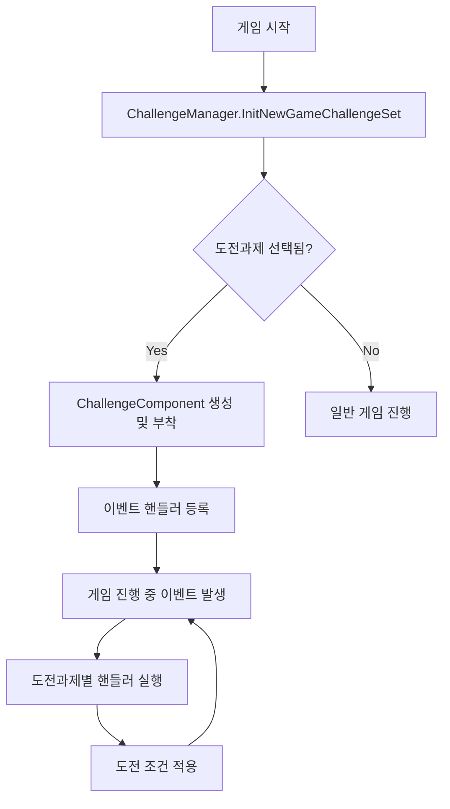

# 도전 시스템 - 도전 관리

## 개요
메토체스의 도전 시스템은 플레이어에게 특별한 게임 조건과 제약을 제공하여 다양한 게임 경험을 제공하는 시스템입니다. 각 도전과제는 고유한 룰과 시작 조건을 가지며, 플레이어의 전략적 사고와 적응력을 시험합니다.

## 핵심 컴포넌트 구조

### ChallengeManager
도전과제의 선택과 초기화를 담당하는 메인 컴포넌트입니다.

주요 기능:
- 도전과제 ID 관리 (`SetChallengeID`, `PlayChallengeID`)
- 게임 시작 시 도전 컴포넌트 자동 로딩
- 서버-클라이언트 동기화

핵심 메서드:
- `InitNewGameChallengeSet()`: 게임 시작 전 도전 컴포넌트 로딩
- `SetChallenge(number chNum)`: 도전과제 번호 설정

### ChallengeComponent
모든 도전과제의 베이스 컴포넌트로, 게임 내 다양한 이벤트를 모니터링합니다.

주요 특징:
- 게임 내 모든 주요 이벤트에 대한 핸들러 제공
- 도전과제별 스택 정보 관리
- 문자열 타입 데이터 저장 시스템

모니터링하는 이벤트들:
- 게임/스테이지/라운드 시작/종료
- 유닛 구매/판매/레벨업
- 아이템/룬카드 관련 행동
- 전투 관련 이벤트 (공격, 스킬 사용, 승부 결과)

## 도전과제 구현 방식

각 도전과제는 `ChallengeComponent`를 상속받아 특정 이벤트 핸들러를 오버라이드하는 방식으로 구현됩니다.

```
@Component
script CH10001 extends ChallengeComponent
    method void StartGameHandler(any event)
        -- 도전과제별 로직 구현
```

### 도전과제 식별 체계
- 도전과제 ID는 `CH10001` ~ `CH10010` 형식으로 관리
- 숫자 기반 선택 시 자동으로 ID 변환: `10000 + chNum`

## 데이터 구조

### ChallengeModeInfo.csv
각 도전과제의 메타데이터를 정의합니다:
- `ChallengeID`: 고유 식별자
- `CHTitle`: 도전과제 제목
- `Desc`: 상세 설명 및 규칙
- `SetSeason`: 시즌 정보
- `TitleImageRUID`: 타이틀 이미지 리소스 ID

### 도전과제 카테고리

1. **경제 제약**: 골드/이자 시스템 변경 (CH10001, CH10005)
2. **아이템 제약**: 아이템 상점/조합 제한 (CH10002, CH10004, CH10006)
3. **상점 제약**: 새로고침/룬카드 제한 (CH10003, CH10007, CH10010)
4. **유닛 변화**: 캐릭터 변경/시너지 제약 (CH10008, CH10009)

## 시스템 흐름도



## Code References
- `RootDesk/MyDesk/InGame/Challenge/ChallengeManager.mlua :: InitNewGameChallengeSet()` — 도전과제 컴포넌트 초기화
- `RootDesk/MyDesk/InGame/Challenge/ChallengeManager.mlua :: SetChallenge()` — 도전과제 ID 설정
- `RootDesk/MyDesk/InGame/Challenge/ChallengeComponent.mlua :: OnBeginPlay()` — 이벤트 핸들러 등록
- `RootDesk/MyDesk/InGame/Challenge/ChallengeComponent.mlua :: SetChallengeStackInfo()` — 스택 정보 동기화
- `RootDesk/MyDesk/InGame/Challenge/List/CH10001.mlua :: StartGameHandler()` — 개별 도전과제 구현 예시
- `RootDesk/MyDesk/InGame/Challenge/ChallengeModeInfo.csv` — 도전과제 메타데이터 정의

## 특징 및 장점

1. **모듈화된 설계**: 각 도전과제가 독립적인 컴포넌트로 구현
2. **이벤트 기반 아키텍처**: 게임의 모든 행동을 모니터링하여 유연한 제약 구현
3. **데이터 드리븐**: CSV 파일을 통한 도전과제 정보 관리
4. **확장성**: 새로운 도전과제 추가가 용이한 구조
5. **동기화**: 서버-클라이언트 간 도전 상태 자동 동기화

이 시스템을 통해 플레이어는 다양한 게임 플레이 경험을 할 수 있으며, 각 도전과제는 게임의 핵심 메커니즘을 변형하여 새로운 전략적 사고를 요구합니다.
