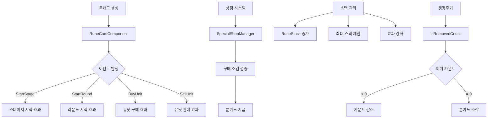

# 룬카드 관리 시스템

메토체스의 룬카드 시스템은 강력한 패시브 효과를 제공하는 전략적 요소입니다. 다양한 등급과 효과를 가진 룬카드들을 수집하고 관리하여 게임의 흐름을 크게 바꿀 수 있습니다. 이벤트 기반 활성화와 스택 시스템을 통해 복잡하면서도 흥미로운 전략적 선택을 제공합니다.

## 시스템 개요

룬카드 시스템은 다음과 같은 핵심 요소들로 구성됩니다:
- **룬카드 컴포넌트**: 개별 룬카드의 로직 처리
- **상점 시스템**: 구매/판매와 확률 관리
- **인벤토리 관리**: 보관과 정렬 시스템
- **이벤트 처리**: 게임 상황별 효과 발동
- **UI 연출**: 시각적 표현과 상호작용



## 룬카드 기본 구조

### RuneCardComponent 

모든 룬카드의 기본이 되는 핵심 컴포넌트입니다.

**주요 프로퍼티:**
- `SetRuneID`: 룬카드 고유 식별자
- `RuneStack`: 스택 누적 개수
- `IsRemovedCount`: 소각까지 남은 턴 수
- `ResellCost`: 판매 시 획득 골드
- `OnActive`: 활성화 상태

**생명주기 관리:**
```lua
@ExecSpace("ServerOnly")
method void CardRemoveCheck()
    if self.IsRemovedCount == -3 then
        -- 소각하지 않는 룬카드
    elseif self.IsRemovedCount > 0 then
        -- 턴 감소
        self:AddIsRemovedCount(-1)
    elseif self.IsRemovedCount <= 0 then
        -- 0턴 도달 시 룬카드 소각
        specialShopManager:RemoveRuneCard(self.SetRuneID, self.UID)
        _RuneCardDirector:DestroyRuneCard(index, true, user.PlayerComponent.UserId)
    end
end
```

### 이벤트 기반 활성화 시스템

룬카드는 다양한 게임 이벤트에 반응하여 효과를 발동합니다:

**주요 이벤트 핸들러:**
```lua
@ExecSpace("ServerOnly")
method void OnBeginPlay()
    -- 스테이지 시작 시
    local startStageAct = function(event)
        if self.OnActive then
            self:StartStageHandler(event)
        end
    end
    
    -- 라운드 시작 시
    local startRoundAct = function(event)
        self:CardRemoveCheck()
        if self.OnActive then
            self:StartRoundHandler(event)
        end
    end
    
    -- 유닛 구매 시
    local buyUnitAct = function(event)
        if self.OnActive then
            self:BuyUnitHandler(event)
        end
    end
end
```

**활성화 조건 관리:**
- `OnActive` 플래그로 효과 활성화/비활성화 제어
- 개별 이벤트별로 분리된 핸들러 시스템
- 조건부 실행으로 성능 최적화

### 스택 시스템

많은 룬카드가 스택을 쌓아 효과를 강화하는 시스템을 사용합니다:

```lua
@ExecSpace("ServerOnly")
method void SetRuneStackInfo(number stack)
    self.RuneStack = stack
    self:SetRuneStackInfo_OnClient(stack, self.OwnerId)
end

@ExecSpace("Client")
method void SetRuneStackInfo_OnClient(number stack)
    self.RuneStack = stack
    _UI_Inventory:RefreshUI_RuneInventory()
    
    -- 전투 중 스택 변경 시 UI 새로고침
    local user = _UserService.LocalPlayer
    if user.GameManager.PhaseType ~= "Ready" then
        _UI_Inventory:RefreshUI_BattleRuneList()
    end
end
```

## 룬카드 상점 시스템

### SpecialShopManager 연동

룬카드 구매와 판매를 담당하는 시스템입니다.

**구매 프로세스:**
```lua
@ExecSpace("Server")
method void PurchaseRunecard_Check(number slotIdx)
    -- 1. 구매 조건 검증
    local ownCoins = self.Entity.TeamManager.Golds
    local cost = self.Cost_Runes[slotIdx]
    
    if ownCoins < cost then
        log("비용이 부족해서 구매할 수 없습니다.")
        return
    end
    
    -- 2. 슬롯 유효성 검사
    if self.ShopList_Runes[slotIdx] == "" then
        log("비정상적인 구매 요청이거나, 빈 슬롯입니다.")
        return
    end
    
    -- 3. 인벤토리 공간 확인
    if #self.Entity.TeamManager.OwnRunes >= userPControl.Rune_UseRuneSlotCount then
        log("보유 룬 카드가 5장 이상입니다.")
        return
    end
    
    -- 4. 구매 처리
    local runeID = self.ShopList_Runes[slotIdx]
    self.ShopList_Runes[slotIdx] = ""
    self.Entity.TeamManager.Golds -= cost
    self:AddRCComponent(runeID, true, #teamManager.OwnRunes, slotIdx)
end
```

### 확률 시스템

**RuneShopProb 데이터셋:**
- 등급별 출현 확률 관리
- 플레이어 레벨에 따른 확률 조정
- 특수 룬카드의 희귀도 제어

**구매 후 처리:**
```lua
@ExecSpace("Server")
method void BuyThisRuneCard(string runeID)
    local runeInfoTable = _DataService:GetTable("RuneInfo")
    local row = runeInfoTable:FindRow("RuneID", runeID)
    
    self:SetResellCostInfo(tonumber(row:GetItem("ResellCost")))
    self.SetRuneID = runeID
    
    if string.sub(self.Entity.Name, 1, 10) == "PlayerRune" then
        self.SetTeamType = "User"
    else
        self.SetTeamType = "Enemy"
    end
end
```

## 룬카드 데이터 관리

### RuneInfo 데이터셋

**주요 정보:**
- `RuneID`: 룬카드 고유 식별자
- `Grade`: 등급 (1~5성)
- `PurchaseCost`: 구매 비용
- `ResellCost`: 판매 비용
- `IconRUID`: 아이콘 리소스 ID
- `Description`: 효과 설명

### 등급 시스템

**등급별 특성:**
- **1성**: 기본 효과, 낮은 비용
- **2성**: 중간 효과, 적당한 비용
- **3성**: 강력한 효과, 높은 비용
- **4성**: 매우 강력한 효과
- **5성**: 게임 체인저급 효과

### 캐릭터 추천 시스템

**CharMostItemSet 데이터셋:**
특정 캐릭터에게 효과적인 룬카드 조합을 관리합니다.

```lua
-- 캐릭터별 추천 룬카드 세트
-- 시너지 효과를 고려한 최적 조합 제안
```

## UI 연출 시스템

### RuneCardDirector

룬카드의 모든 시각적 연출을 관리하는 중앙 시스템입니다.

**주요 기능:**
- **아이콘 관리**: 등급별 아이콘 RUID 캐싱
- **위치 계산**: 인벤토리 내 룬카드 배치
- **애니메이션**: 구매/판매/소각 연출
- **상호작용**: 드래그 앤 드롭 지원

**아이콘 캐싱 시스템:**
```lua
@ExecSpace("ClientOnly")
method void OnBeginPlay()
    self.IconRUIDList = {
        "39dfb7d3137a48beb17bd428aaf3fea9",  -- 1성 아이콘들
        "b20e6d0b6e9e48abb5b293afdc836b40",
        -- ... 더 많은 아이콘 RUID들
    }
    
    -- 특별 관리가 필요한 룬카드들
    self.RuneCardManagingValue = {
        ["RC10010"] = {}, ["RC10024"] = {},
        ["RC20007"] = {}, ["RC30001"] = {},
        -- ... 복잡한 효과를 가진 룬카드들
    }
end
```

### 인벤토리 UI 통합

**UI_Inventory와의 연동:**
- 실시간 룬카드 목록 업데이트
- 스택 정보 표시
- 판매 가능 여부 확인
- 등급별 색상 구분

## 개별 룬카드 구현

### 기본 룬카드 패턴

개별 룬카드는 RuneCardComponent를 상속받아 고유한 효과를 구현합니다:

```lua
-- 예시: 골드 획득 룬카드
@ExecSpace("ServerOnly")
method void StartRoundHandler(any event)
    local user = self.Entity.Parent.Parent
    local teamManager = user.TeamManager
    
    -- 라운드 시작 시 골드 추가
    teamManager.Golds += (2 * self.RuneStack)
end
```

### 복잡한 효과 룬카드

**상황별 효과:**
- **조건부 발동**: 특정 상황에서만 활성화
- **누적 효과**: 스택에 따른 효과 증가
- **시너지 효과**: 다른 룬카드와의 상호작용

**특수 관리 룬카드:**
- 별도의 값 관리가 필요한 룬카드들
- 복잡한 계산이 필요한 효과들
- 게임 상태를 크게 변화시키는 효과들

## 사전 시스템 연동

### 룬카드 도감

**UI_dictionary_RuneCard:**
- 수집한 룬카드 목록 표시
- 즐겨찾기 기능
- 등급별 필터링

**DictionaryDataManager 연동:**
- 시즌별 룬카드 목록 관리
- 수집 진행도 추적
- 상세 정보 제공

### 정보 표시 시스템

**UI_RuneCardDictionaryInfo:**
```lua
@ExecSpace("ClientOnly")
method void UpdateInfo(string id)
    local runeData = _DictionaryDataManager.RuneDataList[id]
    local grade = runeData.Grade
    
    -- 이름과 등급 표시
    self.t_name.Text = _LocalizationService:GetText("RuneCard_"..id.."_Name")
    self.t_grade.FontColor = _UI_Color.RuneGrade[grade]
    self.t_grade.Text = _LocalizationService:GetText("Grade_"..grade)
    
    -- 아이콘 크기 조정
    local resourceinfo = _LoadResourcesInfo:GetUILocalPositionScale(runeData.IconRUID)
    self.sp_image.ImageRUID = runeData.IconRUID
    self.sp_image.LocalScale = resourceinfo["scale"]
end
```

## 성능 최적화

### 이벤트 처리 최적화

**선택적 활성화:**
- `OnActive` 플래그로 불필요한 계산 방지
- 조건부 이벤트 핸들러 실행
- 메모리 효율적인 스택 관리

### UI 갱신 최적화

**배치 업데이트:**
- 변경된 부분만 선택적 갱신
- 캐싱된 리소스 정보 활용
- 지연 로딩을 통한 초기 로딩 시간 단축

### 데이터 캐싱

**룬카드 정보 캐싱:**
- 자주 접근하는 데이터는 메모리 캐싱
- RUID와 위치 정보 사전 계산
- 현지화 텍스트 미리 로드

## 전략적 활용

### 시너지 구성

**조합 전략:**
- 동일 계열 룬카드 조합
- 상호 보완적 효과 조합
- 특정 플레이 스타일에 최적화된 구성

### 타이밍 관리

**구매 시점:**
- 경제 상황 고려
- 현재 전략과의 적합성
- 상대방 견제 효과

**소각 관리:**
- 제한된 턴 수 내 최대 효과 추출
- 교체 타이밍 결정
- 인벤토리 공간 최적화

## Code References

- `RootDesk/MyDesk/InGame/RuneCard/RuneCardComponent.mlua :: OnBeginPlay()` — 룬카드 이벤트 시스템 초기화
- `RootDesk/MyDesk/InGame/RuneCard/RuneCardComponent.mlua :: BuyThisRuneCard()` — 룬카드 구매 처리
- `RootDesk/MyDesk/InGame/Managers/SpecialShopManager.mlua :: PurchaseRunecard_Check()` — 상점 구매 검증
- `RootDesk/MyDesk/EffectFolder/Logic/RuneCardDirector.mlua :: OnBeginPlay()` — UI 연출 관리
- `RootDesk/MyDesk/Dictionary/UI_RuneCardDictionaryInfo.mlua :: UpdateInfo()` — 룬카드 정보 표시
- `RootDesk/MyDesk/InGame/RuneCard/RuneInfo.userdataset` — 룬카드 기본 데이터
- `RootDesk/MyDesk/InGame/RuneCard/RuneShopProb.userdataset` — 상점 확률 데이터
