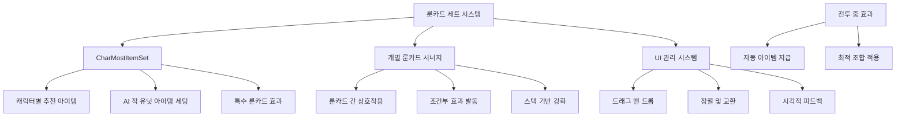

# 룬카드 세트 효과 시스템

메토체스의 룬카드 세트 효과 시스템은 특정 조합의 룬카드를 함께 사용할 때 발생하는 추가 효과와 캐릭터별 최적화된 아이템 세트를 제공하는 고급 전략 시스템입니다. CharMostItemSet을 통한 캐릭터별 추천 시스템과 개별 룬카드 간의 시너지 효과를 통해 깊이 있는 전략적 선택을 가능하게 합니다.

## 시스템 개요

룬카드 세트 효과는 다음과 같은 핵심 요소들로 구성됩니다:
- **캐릭터별 최적 아이템 세트**: CharMostItemSet 데이터 기반
- **룬카드 간 시너지**: 특정 룬카드 조합 시 추가 효과
- **조건부 효과 활성화**: 특정 상황에서의 세트 보너스
- **동적 아이템 지급**: 전투 중 최적 아이템 자동 지급
- **UI 관리 시스템**: 드래그 앤 드롭과 시각적 피드백



## CharMostItemSet 시스템

### 캐릭터별 최적 아이템 조합

각 캐릭터에게 가장 효과적인 아이템 조합을 데이터셋으로 관리하는 시스템입니다.

**데이터 구조:**
- `CharID`: 캐릭터 고유 식별자
- `ItemID_1` ~ `ItemID_8`: 8개의 추천 아이템 목록
- 캐릭터의 특성과 역할에 최적화된 조합

**AI 적 유닛에의 적용:**
```lua
-- 적 유닛 아이템 세팅
local charMostItemTable = _DataService:GetTable("CharMostItemSet")

for _, unit in pairs(teamManager.EnemyUnits) do
    local charID = unit.UnitInfo.charID
    local setItemRow = charMostItemTable:FindRow("CharID", charID)
    
    if isvalid(setItemRow) then
        table.insert(setUnits, unit)
        unit.UnitStatus:SetProperty("EquippedItemIDList", nil, "clear")
    end
end
```

### 특수 룬카드 효과와의 연동

**RC20033 룬카드 (산타 장갑 강화):**
```lua
-- RC20033 룬 활성화 시
if rc20033Checked then
    local RC20033_DataSet = _DataService:GetTable("CharMostItemSet")
    local charBestItemRow = RC20033_DataSet:FindRow("CharID", unitInfo.charID)
    
    local setItemList = {}
    for i = 1, 8 do
        table.insert(setItemList, charBestItemRow:GetItem(string.format("ItemID_%d", i)).."_copied")
    end
    
    -- 무작위 2개 아이템 지급
    for i = 1, 2 do
        local randItemIdx = _UtilLogic:RandomIntegerRange(1, #setItemList)
        local randItemID = setItemList[randItemIdx]
        self.Entity.UnitStatus:SetProperty("EquippedItemIDList", randItemID, "insert,-1")
        table.remove(setItemList, randItemIdx)
    end
end
```

## 동적 아이템 지급 시스템

### 전투 중 최적 아이템 지급

특정 시너지나 룬카드 효과에 의해 전투 중 자동으로 최적 아이템이 지급되는 시스템입니다.

**시간 기반 지급:**
```lua
local function setItemFnc()
    -- 전투 중인지 확인
    if self.Entity.GameManager.PhaseType ~= "Battle" then
        _TimerService:ClearTimer(fncTimer)
        return
    end
    
    -- 아이템 지급 가능한 유닛 찾기
    local checkUnits = {}
    for _, unit in pairs(t_Units) do
        if #unit.UnitStatus.EquippedItemIDList < 3 then
            table.insert(checkUnits, unit)
        end
    end
    
    -- 무작위 유닛에게 최적 아이템 지급
    local setUnit = checkUnits[_UtilLogic:RandomIntegerRange(1, #checkUnits)]
    if isvalid(setUnit) then
        local charID = setUnit.UnitInfo.charID
        local charBestItemRow = mostItemSet:FindRow("CharID", charID)
        
        local setItemList = {}
        for i = 1, 8 do
            table.insert(setItemList, charBestItemRow:GetItem(string.format("ItemID_%d", i)).."_copied")
        end
        
        local randItemIdx = _UtilLogic:RandomIntegerRange(1, #setItemList)
        local randItemID = setItemList[randItemIdx]
        setUnit.UnitStatus:SetProperty("EquippedItemIDList", randItemID, "insert,-1")
    end
end

-- 12초마다 반복 실행
fncTimer = _TimerService:SetTimerRepeat(setItemFnc, 12, 0)
```

### 세트 효과 발동 조건

**캐릭터 특화 효과:**
- 특정 캐릭터 + 추천 아이템 조합 시
- 동일 계열 룬카드 다수 보유 시
- 특수 조건 달성 시 (특정 라운드, 상황 등)

## 룬카드 UI 관리 시스템

### 드래그 앤 드롭 시스템

**RuneCardSetLogic의 드래그 관리:**
```lua
@ExecSpace("Client")
method void SetDraggingEntity(Entity draggingEntity)
    -- 드래그 시작 처리
    self.CurrentDraggingEntity = draggingEntity
    
    -- DragChaser에 드래그 중인 카드 정보 복사
    local ui_sprite = self.DragChaser:GetChildByName("Sprite_ProductBg"):GetChildByName("Sprite_Product")
    local ui_cost = self.DragChaser:GetChildByName("Text_Cost")
    
    self.DragChaser.SpriteGUIRendererComponent.Color = draggingEntity:GetChildByName("CardBound").SpriteGUIRendererComponent.Color
    ui_sprite.SpriteGUIRendererComponent.ImageRUID = draggingEntity:GetChildByName("Sprite_ProductBg"):GetChildByName("Sprite_Product").SpriteGUIRendererComponent.ImageRUID
    
    -- DragChaser 활성화
    self.DragChaser.Enable = true
    draggingEntity.Visible = false
    
    -- 판매 UI 활성화
    local ui_sell = _EntityService:GetEntityByPath("/ui/Arena_ReadyPhase/Panel_SellCharacter")
    ui_sell.Enable = true
end
```

### 룬카드 정렬 및 교환

**위치 교환 애니메이션:**
```lua
@ExecSpace("Client")
method void SwapUIPositionOnDrag(Entity swapEntity)
    -- 부드러운 위치 교환 애니메이션
    local tweenDuration = 0.1
    
    -- 원본 카드 이동
    local startPos = self.CurrentDraggingEntity.UITransformComponent.anchoredPosition.x
    local targetPos = swapEntity.UITransformComponent.anchoredPosition.x
    
    local moveDraggingCard = function()
        local x1 = _TweenLogic:Ease(startPos, targetPos, tweenDuration, EaseType.BackEaseInOut, t1)
        self.CurrentDraggingEntity.UITransformComponent.anchoredPosition.x = x1
    end
    
    -- 10단계로 나누어 부드러운 애니메이션 실행
    for i=1, 10 do
        _TimerService:SetTimerOnce(moveDraggingCard, tweenDuration * i * 0.1)
    end
end
```

### 판매 시스템 연동

**드래그를 통한 판매:**
```lua
@ExecSpace("Client")
method void OnDraggingEnd()
    -- 판매 존에 드롭했는지 확인
    local simulator = _CollisionService:GetSimulator(_UserService.LocalPlayer.CurrentMapName)
    local worldpoint = _InputService:GetCursorPosition()
    worldpoint = _UILogic:ScreenToWorldPosition(worldpoint)
    
    local components = simulator:OverlapPointAll(CollisionGroups.TriggerBox, worldpoint)
    local sold = false
    
    for i=1, #components do
        local selectEntity = components[i].Entity
        if isvalid(selectEntity.SellZoneComponent) == true then
            local cardIdx = tonumber(string.sub(self.CurrentDraggingEntity.Name, 6, -1))
            _UserService.LocalPlayer.SpecialShopManager:ResellRuneCard_Check(cardIdx)
            sold = true
        end
    end
    
    -- 판매하지 않은 경우 순서 변경 처리
    if sold == false then
        if isvalid(self.CurrentDraggingEntity) == true and self.MouseHoveringSlotIdx ~= 0 then
            local indexA = tonumber(string.sub(self.CurrentDraggingEntity.Name, 6, -1))
            local indexB = self.MouseHoveringSlotIdx
            _UserService.LocalPlayer.TeamManager:SwapRuneCardIndex(indexA, indexB)
        end
    end
end
```

## 개별 룬카드 세트 시너지

### 조건부 세트 효과

**특정 룬카드 조합 시:**
- 동일 계열 룬카드 2개 이상 보유 시 추가 효과
- 상호 보완적인 룬카드 조합 시 시너지 효과
- 특정 상황에서만 발동하는 조건부 효과

### 스택 기반 세트 효과

**누적 효과 강화:**
- 동일한 효과의 룬카드 여러 개 보유 시
- 스택당 추가 보너스 지급
- 최대 스택 제한과 균형 조절

### 캐릭터 특화 시너지

**캐릭터별 최적화:**
```lua
-- 특정 캐릭터와 특정 룬카드 조합 시 특별 효과
local charID = unit.UnitInfo.charID
if charID == "C30001" and hasRuneCard("RC10005") then
    -- 특별한 세트 효과 발동
    applySpecialSetEffect(unit)
end
```

## 룬카드 목록 관리

### 시즌별 룻카드 필터링

**GetRuneCardList 시스템:**
```lua
@ExecSpace("ServerOnly")
method table GetRuneCardList(string userId, string rGrade, boolean getRuneCheck, boolean shopRuneCheck)
    local user = _UserService:GetUserEntityByUserId(userId)
    local setVersion = string.format("%.1f", gameManager.ModeSetVersion)
    
    local runeTable = {}
    for i=1, runeDataSet:GetRowCount() do
        local row = runeDataSet:GetRow(i)
        local grade = row:GetItem("Grade")
        local runeID = row:GetItem("RuneID")
        local checked = runeSeasonCheckTable:FindRow("RuneID", runeID):GetItem(setVersion)
        
        -- 조건에 맞는 룬카드만 필터링
        if checked == "TRUE" and (grade == rGrade or rGrade == "All") then
            -- 보유/상점 중복 체크
            local insert = true
            if getRuneCheck and (getCount > 0) then
                insert = false
            end
            if shopRuneCheck and isInShop(runeID) then
                insert = false
            end
            
            if insert then
                table.insert(runeTable, runeID)
            end
        end
    end
    
    return runeTable
end
```

## 전략적 활용

### 세트 구성 전략

**효율적인 조합:**
- **동일 계열 집중**: 한 계열 룬카드로 집중 구성
- **밸런스형**: 다양한 효과의 룬카드 균형 배치
- **특화형**: 특정 캐릭터나 전략에 특화된 구성

### 상황별 세트 선택

**게임 상황에 따른 적응:**
- **초반**: 경제 효과 중심 룬카드
- **중반**: 전투력 강화 룬카드
- **후반**: 게임 체인저급 고급 룬카드

### 상대방 견제

**메타 대응:**
- 상대방 전략 파악 후 카운터 세트 구성
- 범용성 높은 세트로 다양한 상황 대응
- 특정 세트 효과로 상대방 전략 무력화

## 성능 최적화

### 데이터 캐싱

**CharMostItemSet 캐싱:**
- 자주 참조되는 캐릭터별 아이템 데이터 캐싱
- 메모리 효율적인 데이터 구조 사용
- 필요할 때만 데이터베이스 접근

### UI 최적화

**드래그 앤 드롭 최적화:**
- 부드러운 애니메이션을 위한 타이머 활용
- 불필요한 UI 업데이트 방지
- 메모리 누수 방지를 위한 적극적인 정리

### 계산 최적화

**세트 효과 계산:**
- 변경된 부분만 재계산
- 캐시된 결과 재사용
- 조건부 계산으로 불필요한 연산 방지

## Code References

- `RootDesk/MyDesk/InGame/System/RuneCardSetLogic.mlua :: SetDraggingEntity()` — 룬카드 드래그 시작 처리
- `RootDesk/MyDesk/InGame/System/RuneCardSetLogic.mlua :: GetRuneCardList()` — 시즌별 룬카드 필터링
- `RootDesk/MyDesk/InGame/Unit/01_UnitComponent/UnitItem.mlua :: UseItemAbility_NI10033()` — 산타 장갑과 RC20033 세트 효과
- `RootDesk/MyDesk/InGame/System/UnitSetLogic_New.mlua :: AI 아이템 세팅` — CharMostItemSet 기반 아이템 배치
- `RootDesk/MyDesk/InGame/Managers/SynergyManager_New.mlua :: 동적 아이템 지급` — 전투 중 자동 아이템 지급
- `RootDesk/MyDesk/InGame/RuneCard/CharMostItemSet.userdataset` — 캐릭터별 추천 아이템 데이터
