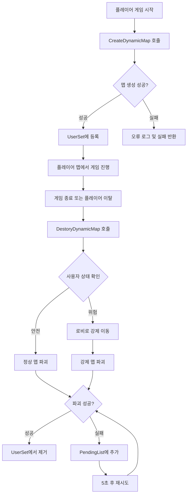

# 시스템 로직 - 동적 맵 시스템

## 개요
메토체스의 동적 맵 시스템은 각 플레이어에게 독립적인 게임 환경을 제공하기 위해 실시간으로 맵을 생성하고 관리하는 시스템입니다. `DynamicMapSystemLogic`을 통해 플레이어별로 전용 아레나 맵을 생성하고, 게임 종료 시 안전하게 정리하여 서버 리소스를 효율적으로 관리합니다.

## 핵심 기능 및 구조

### 동적 맵 생성 시스템

#### 맵 이름 생성 규칙
```lua
local targetMapName = self.SourceMapName .. userId
-- 예: "Arena" + "12345" = "Arena12345"
```

각 플레이어는 `Arena[UserId]` 형식의 고유한 맵을 할당받습니다:
- **SourceMapName**: 기본 템플릿 맵 ("Arena")  
- **UserId**: 플레이어 고유 식별자
- **결과**: 플레이어 전용 독립 맵 공간

#### 맵 생성 프로세스
```lua
-- DynamicMapSystemLogic :: CreateDynamicMap()
local dynamicMapResult = _DynamicMapService:CreateDynamicMap("Arena", targetMapName)

if dynamicMapResult ~= DynamicMapResultCode.Success then
    log_error("Dynamic Map create error!!! resultCode : " .. tostring(dynamicMapResult))
    return false
end

self.UserSet[userId] = true -- 생성된 맵 추적
```

### 맵 생명주기 관리

#### 사용자 맵 추적 시스템
- **UserSet**: 현재 생성된 동적 맵들의 목록 관리
- **실시간 모니터링**: 각 플레이어의 맵 사용 상태 추적
- **중복 생성 방지**: 동일 사용자에 대한 중복 맵 생성 차단

#### 맵 파괴 시스템
동적 맵의 안전한 제거를 위한 다단계 검증 시스템:

```lua
-- DynamicMapSystemLogic :: DestoryDynamicMap()
-- 1단계: 맵 존재 여부 확인
if not self.UserSet[userId] then
    return -- 이미 제거된 맵
end

-- 2단계: 사용자 상태 확인
local userEntity = _UserService:GetUserEntityByUserId(userId)
local targetMapName = self.SourceMapName .. userId

-- 3단계: 안전한 파괴 조건 확인
if userEntity == nil or userEntity.CurrentMap.MapComponent.IsDynamicMap == false then
    -- 정상적인 파괴 프로세스
    local dynamicMapResult = _DynamicMapService:DestroyDynamicMap(targetMapName)
else
    -- 비정상 상황: 강제 이동 후 파괴
    _TeleportService:TeleportToMapPosition(userEntity, Vector3(-1, 3.5, 1), self.LobbyMapName)
    local dynamicMapResult = _DynamicMapService:DestroyDynamicMap(targetMapName)
end
```

### 오류 처리 및 복구 시스템

#### Pending 시스템
맵 파괴에 실패한 경우의 복구 메커니즘:

```lua
-- 파괴 실패 시 대기 목록에 추가
method void PendingUserId(string userId)
    table.insert(self.PendingList, userId)
end

-- 주기적 재시도 (5초마다)
method void TryDestroyPendingMap()
    for i=1, count do
        local userId = self.PendingList[i]
        local dynamicMapResult = _DynamicMapService:DestroyDynamicMap(targetMapName)
        if dynamicMapResult == DynamicMapResultCode.Success then
            table.remove(self.PendingList, i)
        end
    end
end
```

#### 강제 정리 메커니즘
- **사용자 강제 이동**: 로비로 텔레포트 후 맵 파괴
- **주기적 재시도**: 5초 간격으로 실패한 맵 파괴 재시도
- **오류 로깅**: 모든 오류 상황에 대한 상세한 로그 기록

## 시스템 모니터링

### 개발 환경 모니터링
```lua
-- OnBeginPlay()에서 설정 (개발 환경에서만)
if not Environment:IsPublishedPlay() then
    local logFunc = function()
        local list = _DynamicMapService:GetDynamicMapNameList()
        log("DynamicMap Count : " .. tostring(#list))
    end
    self._T.logTimer = _TimerService:SetTimerRepeat(logFunc, 5, 5)
end
```

### 실시간 추적 데이터
- **생성된 맵 수**: 전체 동적 맵 개수
- **대기 중인 파괴**: 파괴 실패로 대기 중인 맵들
- **사용자 맵 매핑**: UserID와 맵 이름의 연결 상태

## 맵 시스템 플로우



## 기술적 특징

### 리소스 관리 최적화
1. **메모리 효율성**: 사용 완료된 맵의 즉시 정리로 메모리 사용량 최소화
2. **CPU 최적화**: 불필요한 맵 프로세싱 제거
3. **네트워크 효율성**: 플레이어별 독립 맵으로 네트워크 트래픽 분산

### 안정성 보장
1. **다중 검증**: 맵 파괴 전 사용자 상태의 다단계 확인
2. **복구 시스템**: 실패한 작업에 대한 자동 재시도
3. **강제 정리**: 비정상 상황에서의 안전한 리소스 정리

### 확장성 고려
1. **템플릿 기반**: 다양한 맵 템플릿을 동적으로 생성 가능
2. **모듈화**: 독립적인 로직으로 다른 시스템과의 결합도 최소화
3. **설정 가능**: SourceMapName, LobbyMapName 등 설정 변경 용이

## 주요 사용 시나리오

### 정상적인 게임 흐름
1. **게임 시작**: 플레이어가 인게임 모드 선택
2. **맵 할당**: 전용 아레나 맵 생성 및 텔레포트
3. **게임 진행**: 독립된 환경에서 게임 플레이
4. **게임 종료**: 로비 복귀 및 맵 자동 정리

### 비정상 상황 처리
1. **연결 끊김**: 플레이어 연결 해제 시 맵 자동 정리
2. **서버 오류**: 맵 파괴 실패 시 대기열 시스템 동작
3. **강제 종료**: 응답 없는 맵의 강제 정리

## Code References
- `RootDesk/MyDesk/InGame/System/DynamicMapSystemLogic.mlua :: CreateDynamicMap()` — 동적 맵 생성 로직
- `RootDesk/MyDesk/InGame/System/DynamicMapSystemLogic.mlua :: DestoryDynamicMap()` — 안전한 맵 파괴 시스템
- `RootDesk/MyDesk/InGame/System/DynamicMapSystemLogic.mlua :: TryDestroyPendingMap()` — 실패한 맵 파괴 재시도
- `RootDesk/MyDesk/InGame/System/DynamicMapSystemLogic.mlua :: PendingUserId()` — 대기 목록 관리
- `RootDesk/MyDesk/InGame/System/DynamicMapSystemLogic.mlua :: OnBeginPlay()` — 시스템 초기화 및 모니터링 설정

## 특징 및 장점

1. **독립성**: 각 플레이어가 완전히 독립된 게임 환경을 가짐
2. **효율성**: 필요할 때만 맵을 생성하고 사용 완료 시 즉시 정리
3. **안정성**: 다중 검증과 복구 시스템으로 높은 안정성 보장
4. **확장성**: 새로운 맵 타입이나 기능 추가가 용이한 구조
5. **모니터링**: 개발 환경에서의 상세한 시스템 상태 추적
6. **오류 처리**: 모든 예외 상황에 대한 체계적인 처리 방안

동적 맵 시스템은 메토체스에서 각 플레이어에게 개인화된 게임 경험을 제공하는 동시에, 서버 리소스를 효율적으로 관리하여 다수의 동시 사용자를 지원할 수 있게 해주는 핵심 시스템입니다.
