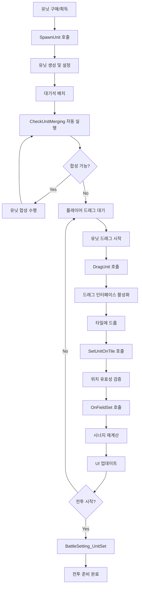

# 시스템 로직 - 유닛 세팅

## 개요
메토체스의 유닛 세팅 시스템은 `UnitSetLogic_New`와 `UnitInfoUILogic`을 통해 유닛의 생성, 배치, 이동, 합성, 그리고 시너지 계산을 통합 관리하는 핵심 시스템입니다. 플레이어의 전략적 유닛 배치부터 자동 합성 시스템, 실시간 UI 업데이트까지 모든 유닛 관련 로직을 담당합니다.

## 핵심 컴포넌트 구조

### UnitSetLogic_New - 메인 유닛 관리 시스템

#### 주요 프로퍼티
```lua
property Entity ArenaMap  -- 아레나 맵 참조
property Entity UnitsSample  -- 유닛 샘플 템플릿
property Entity ProjectilesSample  -- 투사체 샘플 템플릿
property SyncTable<string, Entity> UnitsParentEntity  -- 유저별 유닛 컨테이너
property SyncTable<string, Entity> RoomTile  -- 맵 타일 정보
property Entity SelectUnit  -- 현재 선택된 유닛
property Entity SelectTile  -- 현재 선택된 타일
```

#### 핵심 기능 영역
1. **타일 시스템 초기화**: 게임판과 대기석의 타일 설정
2. **드래그 앤 드롭**: 유닛 이동 및 배치 인터페이스
3. **유닛 합성**: 자동 레벨업 시스템
4. **시너지 관리**: 실시간 시너지 계산 및 적용
5. **전투 준비**: 전투 시작 전 유닛 상태 설정

### UnitInfoUILogic - 유닛 정보 UI 시스템

#### 주요 기능
- **상태바 관리**: HP/MP/실드 바 실시간 업데이트
- **바코드 시스템**: 세밀한 체력 표시
- **시너지 UI**: 시너지 목록 및 활성화 상태 표시

## 타일 시스템 및 배치

### 타일 초기화 시스템
```lua
-- SettingTile() - 게임판 타일 설정
for i = 1, 7 do  -- 7개 라인
    local tileLine = currentMap:GetChildByName("Line_" .. i)
    local jMax = 8 + (i%2)  -- 홀수 라인은 9칸, 짝수 라인은 8칸
    
    for j = 1, jMax do
        local tile = tileLine:GetChildByName("Tile_" .. j)
        -- 팀별 타일 구역 설정
        if j <= 4 then
            tile.TileComponent_New:TileSet("User", "Unit", j, i)
        elseif j >= 5 then
            tile.TileComponent_New:TileSet("Enemy", "Unit", j, i)
        end
    end
end
```

### 좌표 시스템
- **육각형 좌표**: `jNum = j * 2 - (i%2)` 공식으로 실제 게임 좌표 계산
- **타일 키**: `"x,y"` 형식으로 타일 위치를 문자열 키로 관리
- **대기석**: `"i,0"` 좌표로 대기석 타일 구분

## 드래그 앤 드롭 시스템

### 유닛 선택 및 드래그 시작
```lua
-- DragUnit() - 유닛 드래그 시작
method void DragUnit(Entity selectUnit, string selectUnitID)
    if isvalid(self.SelectUnit) then
        return  -- 이미 다른 유닛을 잡고 있는 경우
    end
    
    self.SelectUnit = selectUnit
    selectUnit.Visible = false  -- 원본 유닛 숨김
    
    -- 드래그 샘플에 유닛 외형 복사
    self.DragSample.SpriteRendererComponent.SpriteRUID = selectUnit.UnitInfo.spriteRenderer.SpriteRendererComponent.SpriteRUID
    
    -- 입력 이벤트 연결
    self.Handler = _InputService:ConnectEvent(ScreenTouchHoldEvent, self.Drag)
end
```

### 유닛 배치 시스템
- **위치 검증**: 배치 가능한 타일인지 확인
- **중복 처리**: 이미 유닛이 있는 타일에 배치 시 위치 교환
- **시너지 갱신**: 배치 변경 시 자동으로 시너지 계산 업데이트
- **특수 유닛**: 오르비스 스톤 등 특수 유닛의 추가 처리

## 유닛 생성 및 관리

### 일반 유닛 생성
```lua
-- SpawnUnit() - 유닛 생성
method Entity SpawnUnit(string userId, string unitID, number unitLevel, number cost)
    -- 유닛 엔티티 복제
    local unit = _ReplicateService:ReplicateEntity(sample)
    
    -- 기본 속성 설정
    unit.UnitInfo.IsMergableUnit = true
    unit.UnitInfo:SetPropertyToServer("IsItemEquippable", true, "", true)
    unit.UnitInfo.IsMovableByPlayer = true
    unit.UnitInfo.IsAppliableSynergy = true
    unit.UnitInfo:SetPropertyToServer("IsSettableOnWatingField", true, "", true)
    
    -- 캐릭터 정보 설정
    unit.UnitInfo:SetCharInfo(unitID, unitLevel, cost)
    
    -- 자동 합성 체크 예약
    _TimerService:SetTimerOnce(function() self:CheckUnitMerging(userId) end, 0.2)
    
    return unit
```

### 특수 유닛 생성
```lua
-- SpawnOnetimeUnit() - 일회성 유닛 생성
method Entity SpawnOnetimeUnit(string userId, string unitID, Entity summonTile, number unitLevel, string teamType, boolean isApplyingSynergy)
    -- 전투 중에만 존재하는 임시 유닛
    unitInfo.IsOnetimeUnit = true
    unitInfo.IsAppliableSynergy = isApplyingSynergy
```

## 자동 유닛 합성 시스템

### 합성 조건 검사
```lua
-- CheckUnitMerging() - 유닛 합성 체크
method void CheckUnitMerging(string userId)
    -- 1. 동일한 캐릭터 ID의 유닛들을 그룹핑
    -- 2. 동일 레벨 유닛이 3개 이상인지 확인
    -- 3. 합성 실행 후 재귀 호출로 추가 합성 확인
    
    if 합성_가능 then
        -- 합성 실행
        local mainUnit = 대표유닛선택()
        local subUnits = 재료유닛들선택()
        
        -- 스탯 및 아이템 통합
        합성처리(mainUnit, subUnits)
        
        -- 재귀 호출로 추가 합성 확인
        _TimerService:SetTimerOnce(function()
            self:CheckUnitMerging(userId)
        end, 1.8)
    end
```

### 합성 시 데이터 통합
- **스택 능력치**: 모든 유닛의 스택 스탯을 메인 유닛에 통합
- **아이템 처리**: 장착된 아이템들의 적절한 처리
- **시너지 갱신**: 유닛 수 변화에 따른 시너지 재계산

## 시너지 관리 시스템

### 필드 시너지 계산
```lua
-- OnFieldSet() - 유닛이 필드에 배치/제거될 때
method void OnFieldSet(Entity unit, boolean on, boolean countCheck)
    local charSynergyDBRow = _DataService:GetTable("CharacterSynergy"):FindRow("CharID", charID)
    
    if on then  -- 필드 진입
        -- 시너지 카운트 증가
        for i = 1, 3 do
            local synergyID = charSynergyDBRow:GetItem("Synergy_" .. i)
            if synergyID ~= "" then
                teamManager:GetOnFieldSynergyCount(synergyID, 1)
            end
        end
    else  -- 필드 이탈
        -- 시너지 카운트 감소
        for i = 1, 3 do
            local synergy = charSynergyDBRow:GetItem("Synergy_" .. i)
            if synergy ~= "" then
                teamManager:GetOnFieldSynergyCount(synergy, -1)
            end
        end
    end
    
    -- 시너지 변경 이벤트 발생
    teamManager.Entity.SynergyManager_New:OnFieldUnitCountChanged()
end
```

### 시너지 중복 처리
- **동일 캐릭터**: 같은 캐릭터 여러 마리의 시너지 중첩 계산
- **아이템 시너지**: 메달 아이템을 통한 추가 시너지 활성화
- **특수 조건**: 특정 룬카드나 효과에 의한 시너지 변화

## 전투 준비 시스템

### BattleSetting_UnitSet
```lua
-- 전투 단계별 유닛 설정
method void BattleSetting_UnitSet(string userId, string phaseType)
    if phaseType == "Setting" then
        -- 적 유닛 생성
        enemyUnitCount = self:BattleSetting_EnemyUnit(userId, ...)
        
        -- 적 시너지 계산
        self:BattleSetting_EnemySynergyCheck(userId)
        
        -- 전장 내 유닛 수 계산
        gameManager.MyUnitCount = myUnitCount
        gameManager.EnemyCount = enemyUnitCount
        
    elseif phaseType == "Clean" then
        -- 전투 종료 후 정리
        -- 적 유닛 제거
        -- 임시 효과 초기화
        -- 상태 리셋
    end
```

### BattleSetting_OnBattlePhase
```lua
-- 전투 시작 시 유닛 활성화
method void BattleSetting_OnBattlePhase(string userId)
    -- 전투 통계 초기화
    user.TeamBattleStatistics:RoundPropertyInitialize()
    
    -- 유닛 AI 활성화
    for _, unit in pairs(units.Children) do
        if unitInfo:IsOnFieldUnit() then
            unit.UnitStatus.Target = nil
            unit.UnitAIWanderComponent.Enable = true
            unit.UnitAIWanderComponent.setBattle = true
        end
    end
    
    -- 아이템 효과 적용
    -- 시너지 효과 적용
```

## UI 시스템 통합

### 상태바 시스템
```lua
-- SetBar() - HP/MP 바 업데이트
method void SetBar(Entity unit)
    local unitStatus = unit.UnitStatus
    
    -- HP와 실드 관계 계산
    if unitStatus.HP + unitStatus.Shield > unitStatus.MaxHP then
        shieldBar.SpriteGUIRendererComponent.FillAmount = 1
        hpBar.SpriteGUIRendererComponent.FillAmount = unitStatus.HP / (unitStatus.MaxHP + unitStatus.Shield)
    else
        shieldBar.SpriteGUIRendererComponent.FillAmount = (unitStatus.HP + unitStatus.Shield) / unitStatus.MaxHP
        hpBar.SpriteGUIRendererComponent.FillAmount = unitStatus.HP / unitStatus.MaxHP
    end
    
    -- MP 바 설정
    mpBar.SpriteGUIRendererComponent.FillAmount = unitStatus.MP / unitStatus.MaxMP
```

### 바코드 시스템
세밀한 체력 단위를 시각적으로 표시하는 시스템:
- **HP 바코드**: 체력을 작은 단위로 나누어 바 형태로 표시
- **MP 바코드**: 마나를 단위별로 시각화
- **동적 계산**: 현재 상태에 따른 실시간 바코드 업데이트

## 시스템 흐름도



## Code References
- `RootDesk/MyDesk/InGame/System/UnitSetLogic_New.mlua :: SpawnUnit()` — 유닛 생성 및 초기 설정
- `RootDesk/MyDesk/InGame/System/UnitSetLogic_New.mlua :: CheckUnitMerging()` — 자동 유닛 합성 시스템
- `RootDesk/MyDesk/InGame/System/UnitSetLogic_New.mlua :: OnFieldSet()` — 시너지 계산 및 필드 상태 관리
- `RootDesk/MyDesk/InGame/System/UnitSetLogic_New.mlua :: DragUnit()` — 드래그 앤 드롭 시스템
- `RootDesk/MyDesk/InGame/System/UnitSetLogic_New.mlua :: BattleSetting_OnBattlePhase()` — 전투 시작 시 유닛 활성화
- `RootDesk/MyDesk/InGame/System/UnitInfoUILogic.mlua :: SetBar()` — 유닛 상태바 UI 업데이트
- `RootDesk/MyDesk/InGame/System/UnitInfoUILogic.mlua :: SetBarcode()` — 세밀한 체력 표시 시스템

## 특징 및 장점

1. **통합 관리**: 유닛 생성부터 배치, 합성까지 모든 과정의 일원화된 관리
2. **자동화 시스템**: 합성과 시너지 계산의 자동 처리로 플레이어 편의성 향상
3. **실시간 피드백**: 모든 변경사항의 즉각적인 UI 반영
4. **유연한 배치**: 직관적인 드래그 앤 드롭 인터페이스
5. **정확한 계산**: 복잡한 시너지와 스탯 계산의 정확한 처리
6. **확장성**: 새로운 유닛 타입이나 시너지 추가가 용이한 구조

이 시스템을 통해 메토체스는 복잡한 유닛 관리를 플레이어 친화적인 인터페이스로 제공하면서도, 내부적으로는 정확하고 효율적인 데이터 처리를 보장합니다.
