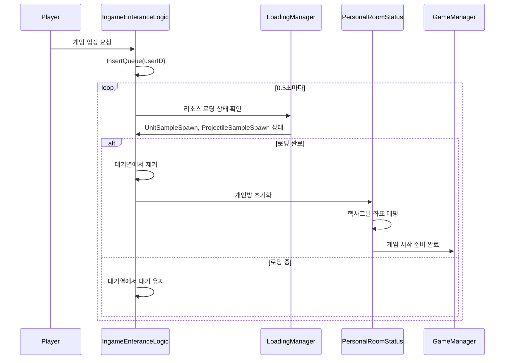

# 시스템 로직 - 입장 및 맵 관리

## 개요
메토체스의 입장 및 맵 관리 시스템은 플레이어가 인게임에 진입할 때의 대기열 관리, 리소스 로딩 완료 체크, 그리고 개인방의 헥사고날 타일 좌표계를 관리하는 시스템입니다. `IngameEnteranceLogic`과 `PersonalRoomStatus`를 통해 안정적인 게임 진입과 정확한 공간 관리를 제공합니다.

## 핵심 컴포넌트 구조

### IngameEnteranceLogic - 입장 대기열 관리

#### 주요 기능
인게임 진입 시 리소스 로딩이 완료될 때까지 플레이어를 대기시키고, 로딩 완료 시 순차적으로 입장을 허용하는 시스템입니다.

#### 핵심 프로퍼티
```lua
property SyncTable<string> WaitQueue  -- 입장 대기 중인 플레이어 목록
property number CheckTimer = 0        -- 로딩 완료 체크 타이머
```

#### 대기열 시스템
```lua
-- InsertQueue() - 플레이어를 대기열에 추가
method void InsertQueue(string userID)
    table.insert(self.WaitQueue, userID)
end
```

- **선입선출**: 먼저 요청한 플레이어가 먼저 입장
- **자동 정리**: 연결이 끊긴 플레이어는 자동으로 대기열에서 제거
- **실시간 모니터링**: 0.5초마다 로딩 상태 확인

### PersonalRoomStatus - 개인방 상태 관리

#### 헥사고날 타일 좌표계
개인방에서 사용하는 육각형 기반의 타일 시스템으로, 전략적 유닛 배치를 위한 공간 관리를 담당합니다.

#### 핵심 프로퍼티
```lua
property string userID = ""           -- 개인방 소유자 ID
property table Tiles = {}             -- 헥사고날 타일 좌표 매핑
property table CharOnTile = {}        -- 타일별 캐릭터 배치 정보
```

## 입장 프로세스 관리

### 로딩 완료 체크 시스템
```lua
-- CheckUserLoadComplete() - 대기열의 플레이어 로딩 상태 확인
method void CheckUserLoadComplete()
    if #self.WaitQueue > 0 then
        local user = _UserService:GetUserEntityByUserId(self.WaitQueue[1])
        
        -- 플레이어 연결 상태 확인
        if isvalid(user) == false then
            table.remove(self.WaitQueue, 1)  -- 연결 끊긴 플레이어 제거
        else
            local loadingManager = user.LoadingManager
            
            -- 필수 리소스 로딩 완료 확인
            if loadingManager.LoadedCount["UnitSampleSpawn"] == 1 and 
               loadingManager.LoadedCount["ProjectileSampleSpawn"] == 1 then
                table.remove(self.WaitQueue, 1)  -- 입장 허용
            end
        end
    end
end
```

### 필수 리소스 체크
입장 전 반드시 로딩되어야 하는 핵심 리소스들:
- **UnitSampleSpawn**: 유닛 샘플 로딩 완료
- **ProjectileSampleSpawn**: 투사체 샘플 로딩 완료

### 실시간 모니터링
```lua
-- OnUpdate() - 0.5초마다 대기열 상태 확인
method void OnUpdate(number delta)
    if self.CheckTimer >= 0.5 then
        self:CheckUserLoadComplete()
    end
end
```

## 개인방 헥사고날 좌표 시스템

### 타일 좌표 초기화
```lua
-- OnBeginPlay() - 헥사고날 타일 좌표 매핑 초기화
method void OnBeginPlay()
    for i = 1, 9 do  -- 9개 라인
        local hexTileLine = self.Entity:GetChildByName("HexTileLine_" .. i)
        for j = 1, 7 do  -- 라인당 7개 타일
            local hexaTile = hexTileLine:GetChildByName("HexaTile_" .. j)
            
            -- 홀수/짝수 라인에 따른 오프셋 적용
            if i%2 == 1 then
                self.Tiles[{i, j*2}] = hexaTile      -- 홀수 라인
            else
                self.Tiles[{i, j*2-1}] = hexaTile    -- 짝수 라인 (오프셋)
            end
        end
    end
end
```

### 헥사고날 좌표 특징
1. **오프셋 시스템**: 홀수와 짝수 라인이 서로 다른 X 좌표 오프셋
2. **전략적 배치**: 육각형 구조로 인한 6방향 이동과 인접성
3. **유연한 전술**: 직사각형 그리드보다 다양한 배치 전략 제공

### 좌표 변환 공식
- **홀수 라인 (i%2 == 1)**: X = j * 2
- **짝수 라인 (i%2 == 0)**: X = j * 2 - 1
- **Y 좌표**: 라인 번호 i 그대로 사용

## 캐릭터 배치 관리

### 위치 설정 시스템
```lua
-- CharLocationSet() - 캐릭터의 타일 위치 설정
method void CharLocationSet(Entity char, table location)
    if isvalid(self.CharOnTile) then
        local currentChar = self.CharOnTile
        local changeLocation = self.CharOnTile[char]
        
        -- 위치 교환 처리
        self.CharOnTile[currentChar] = changeLocation
        self.CharOnTile[char] = location
    else
        -- 새로운 배치
        self.CharOnTile[char] = location
    end
end
```

### 배치 제약 관리
- **인원 제한**: 타일당 최대 배치 가능한 캐릭터 수 제한
- **위치 교환**: 이미 점유된 타일에 배치 시 자동 위치 교환
- **유효성 검증**: 배치 전 규칙 위반 여부 확인

## 시스템 통합 아키텍처

### 입장 프로세스 흐름


### 좌표계 매핑 흐름
```mermaid
flowchart TD
    A[PersonalRoomStatus 초기화] --> B[HexTileLine_1~9 스캔]
    B --> C[각 라인의 HexaTile_1~7 검색]
    C --> D{라인 번호 홀짝 판정}
    D -->|홀수 라인| E[X = j * 2]
    D -->|짝수 라인| F[X = j * 2 - 1]
    E --> G[좌표 {i, X}로 타일 매핑]
    F --> G
    G --> H[Tiles 테이블에 저장]
    H --> I{모든 라인 완료?}
    I -->|No| C
    I -->|Yes| J[좌표계 매핑 완료]
```

## 성능 및 안정성 보장

### 효율적인 대기열 관리
- **순차 처리**: 한 번에 하나의 플레이어만 로딩 상태 확인
- **자동 정리**: 비활성 플레이어 자동 제거로 메모리 누수 방지
- **적은 오버헤드**: 0.5초 간격의 적절한 체크 주기

### 메모리 최적화
- **지연 초기화**: 실제 사용 시점에 리소스 로딩
- **참조 기반**: 엔티티 직접 저장이 아닌 참조 관리
- **가비지 컬렉션**: 사용 완료된 객체들의 적절한 해제

### 오류 처리 및 복구
- **연결 해제 감지**: `isvalid()` 체크를 통한 비정상 상황 감지
- **상태 복구**: 비정상 종료된 플레이어의 대기열 자동 정리
- **로딩 실패 처리**: 리소스 로딩 실패 시 재시도 메커니즘

## 고급 기능 및 확장성

### 다중 맵 지원 준비
현재 시스템은 향후 다양한 맵 타입을 지원할 수 있도록 설계되어 있습니다:
- **모듈화된 좌표계**: 맵별 다른 좌표 시스템 적용 가능
- **확장 가능한 리소스 체크**: 새로운 리소스 타입 추가 용이
- **유연한 대기열**: 다양한 게임 모드별 대기열 관리

### 개인방 확장 가능성
- **방 크기 조절**: 타일 수 동적 변경 지원
- **다양한 레이아웃**: 헥사고날 외 다른 좌표계 지원 준비
- **멀티플레이어**: 개인방에서 협동 플레이 확장 가능

## Code References
- `RootDesk/MyDesk/InGame/System/IngameEnteranceLogic.mlua :: InsertQueue()` — 플레이어 대기열 추가
- `RootDesk/MyDesk/InGame/System/IngameEnteranceLogic.mlua :: CheckUserLoadComplete()` — 로딩 완료 상태 확인
- `RootDesk/MyDesk/InGame/PersonalRoomStatus.mlua :: OnBeginPlay()` — 헥사고날 좌표 매핑 초기화
- `RootDesk/MyDesk/InGame/PersonalRoomStatus.mlua :: CharLocationSet()` — 캐릭터 위치 설정 및 교환
- `RootDesk/MyDesk/InGame/PersonalRoomStatus.mlua :: GetUserID()` — 개인방 소유자 설정

## 특징 및 장점

1. **안정적인 입장**: 리소스 로딩 완료 보장으로 게임 시작 시 오류 방지
2. **순차적 처리**: 대기열 시스템으로 서버 부하 분산
3. **정확한 좌표계**: 헥사고날 시스템으로 전략적 깊이 제공
4. **자동 정리**: 비정상 상황에서의 자동 복구 기능
5. **확장성**: 새로운 맵 타입이나 게임 모드 추가가 용이한 구조
6. **성능 최적화**: 효율적인 메모리 사용과 적절한 체크 주기

이 시스템을 통해 메토체스는 플레이어에게 안정적인 게임 진입 경험을 제공하고, 정교한 헥사고날 좌표계를 통해 깊이 있는 전략적 플레이를 가능하게 합니다.
