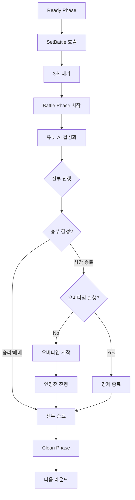

# 시스템 로직 - 전투 시스템

## 개요
메토체스의 전투 시스템은 턴제 자동 전투를 기반으로 하며, AI 행동트리, 경로탐색, 스킬 시스템, 상태효과 관리를 통합한 복합적인 실시간 전투 시스템입니다. 모든 유닛이 독립적인 AI를 가지고 자동으로 전투를 진행하며, 플레이어는 사전 배치와 장비를 통해 결과에 영향을 미칩니다.

## 핵심 컴포넌트 구조

### BTLogic_New - 행동트리 및 경로탐색
전투 중 유닛들의 이동과 행동 결정을 담당하는 핵심 로직입니다.

주요 기능:
- **경로탐색 알고리즘**: 육각형 타일 기반의 최적 경로 계산
- **행동 우선순위**: 공격, 스킬, 이동의 우선순위 결정
- **타겟팅 시스템**: 가장 적합한 공격 대상 선택

핵심 메서드:
- `GetPath(startNode, endNode, moveEntity, targetEntity, userId)`: A* 기반 경로 계산
- 육각형 좌표계에서의 최적 이동 방향 결정

```lua
-- 경로 우선순위 결정 (타일 간격 기준)
local xGap = (endNode[1] - startNode[1]) / 2  -- 가로
local yGap = endNode[2] - startNode[2]        -- 세로

-- 가로/세로 거리에 따른 이동 방향 우선순위 설정
if math.abs(xGap) >= math.abs(yGap) then
    -- 가로 우선 이동 로직
else
    -- 세로 우선 이동 로직
```

### StatusChangeLogic - 상태 및 데미지 관리
전투 중 발생하는 모든 상태 변화와 데미지 계산을 담당합니다.

주요 기능:
- **데미지 계산**: 물리/마법/고정 데미지 처리
- **상태 변경**: HP/MP 변동 관리
- **버프/디버프**: 임시 스탯 변화 적용
- **전투 통계**: 실시간 전투 데이터 수집

핵심 메서드:
- `CheckDamage(setDamage, attackUnit, targetUnit, trueDamagePer, damageType)`: 데미지 계산
- `SetVariableStatus(unit, targetUnit, statusName, amount, type)`: 상태값 변경
- `GetBuff(targetEntity, statusName, amount, time)`: 버프/디버프 적용

### CustomizedBattleEffectService - 전투 연출
전투 중 시각적 효과와 데미지 스킨을 관리합니다.

주요 기능:
- **데미지 스킨**: 데미지 타입별 시각적 표현
- **이펙트 재생**: 스킬 및 공격 이펙트
- **투명도 제어**: 설정에 따른 이펙트 알파값 조절

데미지 타입별 스킨 ID:
```lua
local skinID = {
    ["Physic"] = "88d7500488834120bccf333534373687", 
    ["Magic"] = "db86f25624e8440aa0bc32994a108c6d", 
    ["True"] = "3b53c80e9d7a4e658e0afdfe962506e0",
    ["Heal"] = "4519a6e127d148d984d565f4bb0d176b"
}
```

## 전투 단계별 처리

### Phase 1: SetBattle (전투 설정 단계)

#### 주요 프로세스
1. **BattleSet 이벤트 발생**: 모든 전투 참여자에게 전투 시작 알림
2. **유닛 배치 확정**: 준비 단계에서 배치된 유닛들의 위치 고정
3. **시너지 효과 적용**: 팀 시너지 계산 및 적용
4. **팀 체력 계산**: 전체 팀 HP 합산

```lua
-- GameManager :: SetBattle()
self.Entity:SendEvent(BattleSet(self.RoundType))
_TimerService:SetTimerOnce(self.GoToNextPhase, 3) -- 3초 후 전투 시작

-- 팀 체력 계산
local calculateTotalHP = function(targetFrom)
    local totalValue = 0
    for _, unit in pairs(targetFrom) do
        if unit.UnitInfo:IsOnFieldUnit() then
            totalValue += unit.UnitStatus.MaxHP
        end
    end
    return totalValue
end
```

#### 전투 준비 설정
- **UnitSetLogic_New :: BattleSetting_UnitSet()**: 유닛 전투 상태 설정
- **SynergyManager :: OnBattleSettingPhase()**: 시너지 효과 최종 적용
- **아이템 효과**: 전투 시작 시 발동되는 아이템 효과 적용

### Phase 2: Battle (전투 진행 단계)

#### 유닛 활성화 시스템
```lua
-- UnitSetLogic_New :: BattleSetting_OnBattlePhase()
for _, unit in pairs(units.Children) do
    if unitInfo:IsOnFieldUnit() then
        unit.UnitStatus.Target = nil
        unit.UnitAIWanderComponent.Enable = true
        unit.UnitAIWanderComponent.setBattle = true
    end
end
```

#### 실시간 전투 로직
- **AI 행동트리**: 각 유닛이 독립적으로 행동 결정
- **타겟팅**: 가장 가까운/우선순위가 높은 적 선택
- **스킬 시스템**: MP 축적 및 스킬 발동 조건 확인
- **투사체 처리**: 원거리 공격의 궤적 및 충돌 처리

#### 전투 종료 조건 확인
```lua
-- GameManager :: OnUpdate() - Battle Phase
if self.PhaseType == "Battle" then
    if self.EnemyCount <= 0 then
        self:SetBattleResult(true, self.MyUnitCount)  -- 승리
    elseif self.MyUnitCount <= 0 then
        self:SetBattleResult(false, self.EnemyCount)  -- 패배
    elseif self.BattleTime <= 0 then
        self:GoToNextPhase()  -- 오버타임/무승부
    end
end
```

### Phase 3: 오버타임 시스템

#### 오버타임 진입 조건
- 제한 시간 내에 승부가 나지 않은 경우
- `PlayOvertime()` 메서드를 통한 연장전 시작
- 양 팀 모두 생존한 상태에서만 발생

#### 오버타임 특징
- 더 빠른 전투 진행
- 추가 시간 제한
- 강제 결과 도출 메커니즘

## AI 행동 시스템

### 행동 우선순위 결정
1. **생존 확인**: 유닛이 살아있고 전투 가능한 상태인지 확인
2. **타겟 선택**: 공격 가능한 적 중 우선순위 결정
3. **행동 선택**: 공격/스킬/이동 중 최적 행동 결정
4. **경로 계산**: 목적지까지의 최적 경로 탐색

### 타겟팅 알고리즘
- **거리 기반**: 가장 가까운 적 우선
- **위협도 평가**: 데미지 딜러 우선 타겟
- **전략적 고려**: 힐러나 서포터 우선 제거
- **사거리 고려**: 공격 가능 범위 내의 적만 타겟팅

### 경로탐색 최적화
- **육각형 좌표계**: 실제 게임 보드와 일치하는 좌표 시스템
- **방향 우선순위**: 목적지까지의 최단 경로 우선
- **장애물 회피**: 다른 유닛이나 벽 우회 경로
- **동적 재계산**: 전투 상황 변화 시 경로 업데이트

## 상태효과 시스템

### 버프/디버프 관리
```lua
-- StatusChangeLogic :: GetBuff()
-- 임시 스탯 변화 적용
_StatusChangeLogic:GetBuff(unit, "Multi_PhysicalAttack", 15, -1) -- 15% 공격력 증가, 영구
_StatusChangeLogic:GetBuff(unit, "Add_MoveSpeed", 2, 10) -- 이동속도 +2, 10초간
```

### 지속효과 처리
- **시간 기반**: 일정 시간 후 자동 해제
- **영구 효과**: duration = -1로 설정된 효과
- **스택 시스템**: 동일 효과의 중첩 허용
- **상호작용**: 서로 상쇄되는 효과들의 처리

## 전투 통계 시스템

### 실시간 데이터 수집
- **개별 유닛 통계**: 각 유닛의 전투 기여도 측정
- **팀 통계**: 전체 팀의 전투 성과
- **라운드별 기록**: 각 라운드의 상세 전투 데이터
- **시즌 통계**: 장기간 누적 데이터

### 수집 데이터 항목
- 가한 데미지 / 받은 데미지
- 스킬 사용 횟수 / 명중률
- 생존 시간 / 킬/데스 수
- 힐량 / 차단한 데미지

## 시스템 흐름도



## 최적화 기술 요소

### 성능 최적화
- **LOD 시스템**: 멀리 있는 유닛의 AI 처리 간소화
- **배치 처리**: 다수 유닛의 동시 처리
- **메모리 풀링**: 이펙트와 투사체 객체 재사용
- **선택적 업데이트**: 필요한 경우에만 AI 로직 실행

### 네트워크 최적화
- **상태 동기화**: 중요한 상태 변화만 클라이언트 전송
- **예측 시스템**: 클라이언트 측 결과 예측 및 보정
- **압축**: 전투 데이터의 효율적 압축 전송

## Code References
- `RootDesk/MyDesk/InGame/System/BTLogic_New.mlua :: GetPath()` — A* 기반 경로탐색 알고리즘
- `RootDesk/MyDesk/InGame/System/StatusChangeLogic.mlua :: CheckDamage()` — 데미지 계산 로직
- `RootDesk/MyDesk/InGame/System/StatusChangeLogic.mlua :: SetVariableStatus()` — HP/MP 상태 변경
- `RootDesk/MyDesk/InGame/System/CustomizedBattleEffectService.mlua :: PlayDamageSkin()` — 데미지 시각 효과
- `RootDesk/MyDesk/InGame/System/UnitSetLogic_New.mlua :: BattleSetting_OnBattlePhase()` — 전투 시작 설정
- `RootDesk/MyDesk/InGame/Managers/GameManager.mlua :: SetBattle()` — 전투 단계 전환
- `RootDesk/MyDesk/InGame/Managers/GameManager.mlua :: OnUpdate()` — 실시간 전투 상태 확인

## 특징 및 장점

1. **자동화된 전투**: 플레이어의 실시간 조작 없이 진행되는 전략적 전투
2. **복합 AI 시스템**: 행동트리, 경로탐색, 타겟팅이 통합된 지능형 AI
3. **실시간 처리**: 매 프레임 전투 상황을 실시간으로 계산하고 업데이트
4. **확장 가능성**: 새로운 스킬이나 상태효과 추가가 용이한 모듈 구조
5. **성능 최적화**: 대규모 전투에서도 안정적인 성능을 보장하는 최적화 기법
6. **데이터 드리븐**: 전투 결과의 상세한 통계 수집 및 분석

이 전투 시스템을 통해 메토체스는 전략적 깊이와 실시간 액션을 동시에 제공하며, 플레이어는 사전 준비를 통해 전투 결과에 영향을 미칠 수 있습니다.
