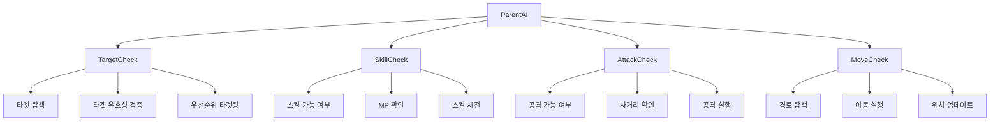
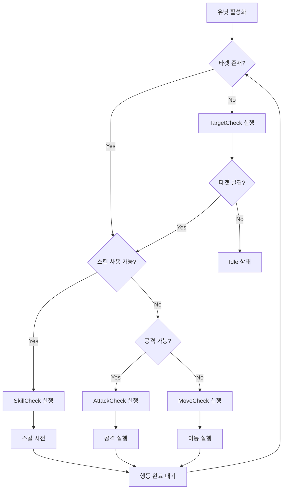

# 시스템 로직 - 행동 트리 시스템

## 개요
메토체스의 행동 트리(Behavior Tree) 시스템은 모든 유닛의 자동 AI 행동을 제어하는 핵심 시스템입니다. `TargetCheck`, `AttackCheck`, `SkillCheck`, `MoveCheck` 네 개의 핵심 BT 노드들이 협력하여 유닛이 상황에 맞는 최적의 행동을 결정하고 실행하도록 합니다.

## 행동 트리 구조

### BT 노드 계층구조


### BT 노드 실행 순서
1. **TargetCheck**: 공격 대상 선정 및 유효성 검증
2. **SkillCheck**: 스킬 사용 가능 여부 확인 및 시전
3. **AttackCheck**: 일반 공격 가능 여부 확인 및 실행
4. **MoveCheck**: 목표 위치로의 이동 경로 계산 및 이동

## 핵심 BT 노드 분석

### TargetCheck - 타겟팅 시스템

#### 주요 기능
적 유닛을 탐색하고 공격 우선순위를 결정하는 최상위 노드입니다.

```lua
-- 타겟 탐색 쿨타임 (0.5초마다)
property number targetFindCoolTime = 0.5

-- 기본 타겟팅 로직
if unitInfo.TeamType == "Enemy" then
    attackableEnemy = _BTLogic_New:getEntities(teamManager.OwnUnits, "AttackAble")
elseif unitInfo.TeamType == "User" then
    attackableEnemy = _BTLogic_New:getEntities(teamManager.EnemyUnits, "AttackAble")
end
```

#### 타겟 선정 알고리즘

##### 1. 일반 타겟팅 (기본)
```lua
-- 가장 가까운 적을 우선 타겟
unitStatus.Target = _BTLogic_New:getTarget(unitInfo.setTile, attackableEnemy, "Nearest")
```

##### 2. 추격자 시너지 (S10008) 타겟팅
```lua
-- 추격자 시너지 활성화 시
if self.ParentAI.Entity.UnitInfo:DoesHaveSynergy("S10008") then
    if runeS10008Checked then
        unitStatus.Target = _BTLogic_New:getTarget(unitInfo.setTile, attackableEnemy, "HP_Low")
    else
        unitStatus.Target = _BTLogic_New:getTarget(unitInfo.setTile, attackableEnemy, "MagicResistance_Low")
    end
end
```

#### 타겟 유효성 검증
- **거리 검사**: 사거리 내의 적만 타겟 가능
- **상태 검사**: 무적, 은신 상태의 적은 타겟 불가
- **생존 검사**: HP가 0 이하인 적은 타겟에서 제외
- **도발 상태**: 도발에 걸린 경우 타겟 변경 불가

### SkillCheck - 스킬 시스템

#### 스킬 사용 조건 검증
```lua
-- MP 확인
if unitStatus.MP >= unitInfo.SkillComponent.SkillCost then
    -- 스킬 사거리 확인
    if unitStatus.SkillRange >= distanceInfo[1] then
        -- 스킬 시전 가능
        unitInfo.SkillComponent:SkillStart(target, userId)
        self.Use = true
    end
end
```

#### 스킬 쿨다운 관리
```lua
-- 스킬 시전 시간 계산
local checkTime = 1.1 / _BTLogic_New.SSpeedValue
if isvalid(unitInfo.SkillComponent.SkillTime) then
    checkTime = 1.1 * unitInfo.SkillComponent.SkillTime
end

-- 스킬 완료 대기
if self.SkillTime > checkTime and unitStatus.ActionTimer == 0 then
    self.Use = false
    self.SkillTime = 0
end
```

#### 스킬 우선순위
- **MP 충족**: 스킬 사용에 필요한 MP 보유
- **사거리 확인**: 스킬 사거리 내의 타겟 존재
- **쿨다운 확인**: 이전 스킬 사용 완료 여부
- **상태효과**: 침묵 등 스킬 사용 불가 상태 검사

### AttackCheck - 공격 시스템

#### 일반 공격 실행 조건
```lua
-- 공격 가능 여부 확인
if isvalid(target) and isvalid(targetTile) then
    local distanceInfo = _BTLogic_New:getDistance(tileNode, targetTileNode)
    
    -- 사거리 내 확인
    if unitStatus.AttackRange >= distanceInfo[1] then
        -- 공격 실행
        unitInfo.AttackComponent:AttackStart(target, userId)
        self.Use = true
    end
end
```

#### 공격 타이밍 제어
```lua
-- 공격 속도에 따른 대기 시간
if self.checkedAttackSpeed == 0 then
    self.checkedAttackSpeed = 2.5  -- 기본 공격 속도
end

-- 공격 완료 확인
if self.attackTime > (1 / self.checkedAttackSpeed) and unitStatus.ActionTimer == 0 then
    self.Use = false
    self.attackTime = 0
end
```

#### 공격 우선순위
- **타겟 존재**: 유효한 공격 대상 보유
- **사거리 확인**: 공격 사거리 내의 타겟
- **공격 쿨다운**: 이전 공격 완료 대기
- **상태효과**: 기절, 침묵 등 공격 불가 상태 검사

### MoveCheck - 이동 시스템

#### 이동 필요성 판단
```lua
-- 현재 타겟과의 거리 확인
local distanceInfo = _BTLogic_New:getDistance(tileNode, targetTileNode)

-- 공격 가능 거리 확인
if unitStatus.AttackRange < distanceInfo[1] then
    -- 이동 필요
    local path = _BTLogic_New:GetPath(tileNode, targetTileNode, myUnit, target, userId)
    if path then
        -- 이동 실행
        self:ExecuteMove(path[1])
    end
end
```

#### A* 경로 탐색 연동
```lua
-- BTLogic_New :: GetPath() 활용
-- 육각형 타일 기반의 최적 경로 계산
-- 장애물 회피 및 최단 거리 경로 제공
```

#### 이동 쿨다운 관리
```lua
property number setGetPathTime = 0.3  -- 경로 탐색 쿨타임

-- 이동 완료 대기
if self.getPathTime > self.setGetPathTime and unitStatus.ActionTimer == 0 then
    self.Use = false
    self.getPathTime = 0
end
```

## 행동 결정 알고리즘

### 상태 우선순위 시스템


### BT 노드 상태 관리
각 BT 노드는 다음 상태들을 반환합니다:
- **Success**: 행동 성공적으로 실행 중 또는 완료
- **Failure**: 행동 실행 불가능 또는 실패
- **Running**: 행동 실행 중 (다음 프레임까지 대기)

## 특수 시너지 및 상태효과 처리

### 시너지 기반 행동 변경
- **추격자(S10008)**: 특수 타겟팅 알고리즘 적용
- **기타 시너지**: 이동속도, 공격속도, 사거리 등 수치 변경

### 상태효과 대응
- **SE0002 (은신)**: 타겟에서 제외
- **SE0020 (도발)**: 타겟 변경 불가
- **기절/침묵**: 해당 행동 비활성화

## 성능 최적화

### 쿨다운 시스템
```lua
-- 각 노드별 독립적인 쿨다운
TargetCheck: 0.5초 쿨타임
SkillCheck: 스킬별 개별 쿨다운
AttackCheck: 공격속도 기반 쿨다운
MoveCheck: 0.3초 경로탐색 쿨타임
```

### 조기 종료 최적화
- 조건 미충족 시 즉시 Failure 반환
- 불필요한 계산 과정 건너뛰기
- 유효성 검사 우선 실행

### 메모리 효율성
- 경로 탐색 결과 캐싱
- 타겟 정보 재사용
- 상태 변경 시에만 재계산

## Code References
- `RootDesk/MyDesk/InGame/Unit/BT/TargetCheck.mlua :: OnBehave()` — 타겟 탐색 및 선정 로직
- `RootDesk/MyDesk/InGame/Unit/BT/SkillCheck.mlua :: OnBehave()` — 스킬 사용 조건 확인 및 시전
- `RootDesk/MyDesk/InGame/Unit/BT/AttackCheck.mlua :: OnBehave()` — 일반 공격 실행 및 쿨다운 관리
- `RootDesk/MyDesk/InGame/Unit/BT/MoveCheck.mlua :: OnBehave()` — 이동 필요성 판단 및 경로 탐색
- `RootDesk/MyDesk/InGame/System/BTLogic_New.mlua :: GetPath()` — A* 경로탐색 알고리즘 연동
- `RootDesk/MyDesk/InGame/System/BTLogic_New.mlua :: getTarget()` — 타겟 선정 알고리즘

## 특징 및 장점

1. **모듈화된 설계**: 각 행동이 독립적인 노드로 분리되어 유지보수 용이
2. **우선순위 시스템**: 상황에 맞는 최적의 행동 자동 선택
3. **실시간 반응**: 매 프레임 상황 변화에 즉각 대응
4. **확장성**: 새로운 행동 패턴이나 시너지 추가가 용이
5. **성능 최적화**: 쿨다운과 조기 종료로 CPU 사용량 최소화
6. **전략적 깊이**: 다양한 타겟팅 전략과 행동 패턴 제공

행동 트리 시스템은 메토체스에서 수십 개의 유닛이 동시에 지능적으로 행동할 수 있게 해주는 핵심 AI 시스템으로, 플레이어에게 전략적이고 예측 가능하면서도 흥미로운 전투 경험을 제공합니다.
