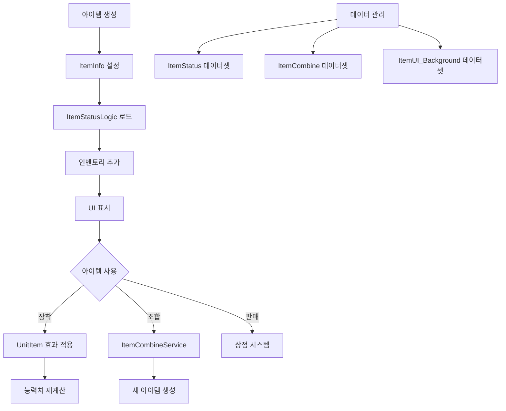

# 아이템 관리 시스템

메토체스의 아이템 시스템은 유닛의 능력치를 강화하고 전략적 깊이를 더하는 핵심 요소입니다. 아이템 획득부터 장착, 조합까지의 전체 라이프사이클을 관리하며, 직관적인 UI와 강력한 데이터 관리 시스템을 제공합니다.

## 시스템 개요

아이템 시스템은 여러 레이어로 구성된 복합적인 시스템입니다:
- **아이템 정보 관리**: 기본 정보와 메타데이터
- **스탯 효과 처리**: 능력치 계산과 적용
- **인벤토리 관리**: 보관과 UI 연동
- **조합 시스템**: 재료 아이템을 통한 업그레이드
- **유닛 연동**: 장착과 효과 적용



## 아이템 기본 정보 시스템

### ItemInfo 컴포넌트

모든 아이템 엔티티의 기본 정보를 관리하는 핵심 컴포넌트입니다.

**주요 프로퍼티:**
- `itemID`: 아이템의 고유 식별자
- `itemName`: 현지화된 아이템 이름
- `setTile`: 아이템이 위치한 타일
- `itemOwnerID`: 아이템 소유자 ID

**아이템 초기화:**
```lua
@ExecSpace("Server")
method void SetItemID(string setItemID)
    self.itemID = setItemID
    local itemDBrow = _DataService:GetTable("ItemStatus"):FindRow("ItemID", self.itemID)
    self.Entity.SpriteRendererComponent.SpriteRUID = itemDBrow:GetItem("RUID")
    self.itemName = itemDBrow:GetItem("Name")
end
```

### 터치 상호작용 시스템

아이템과의 직접적인 상호작용을 처리합니다:

**터치 감지:**
```lua
@ExecSpace("Server")
method void TouchCheck(string userId)
    if (userId == self.itemOwnerID) then
        _ItemSetLogic:SetSelectItem(userId, self.Entity)
        _ItemSetLogic:DragItem(self.Entity, userId)
    end
end
```

**드래그 앤 드롭:**
- 터치 시작: 아이템 선택과 드래그 시작
- 터치 해제: 타일 선택과 배치 처리
- 소유권 검증을 통한 보안 처리

## 아이템 스탯 관리 시스템

### ItemStatusLogic

모든 아이템의 능력치 정보를 중앙에서 관리하는 로직입니다.

**지원하는 스탯 타입:**
- **기본 능력치**: HP, MP, 공격력, 마력
- **방어 능력치**: 물리/마법 방어력
- **전투 특성**: 공격속도, 사거리, 크리티컬
- **특수 효과**: 흡혈, 이동속도, MP 회복

**스탯 계산 방식:**
```lua
method SyncTable<string, string> GetItemStatusCalculatingType()
    local CalculatingType = {
        ["MaxHP"] = "int",           -- 정수 덧셈
        ["PhysicalAttack"] = "multi", -- 배율 적용
        ["AttackSpeed"] = "multi",    -- 배율 적용
        ["Defence"] = "int",          -- 정수 덧셈
    }
    return CalculatingType
end
```

### 데이터 초기화 과정

게임 시작 시 모든 아이템 스탯을 메모리에 로드:

```lua
method void OnBeginPlay()
    local itemTable = _DataService:GetTable("ItemStatus")
    
    for i=1, itemTable:GetRowCount() do
        local row = itemTable:GetRow(i)
        local key = row:GetItem("ItemID")
        local valueTable = {}
        
        -- 모든 스탯 타입에 대해 수치 로드
        for j=1, #statusType do
            local status = row:GetItem(statusType[j])
            valueTable[statusType[j]] = tonumber(status) or 0
        end
        
        self.ItemStatus[key] = valueTable
    end
end
```

## 유닛 아이템 연동 시스템

### UnitItem 컴포넌트

유닛이 장착한 아이템들의 효과를 통합 관리합니다.

**효과 관리 테이블:**
- `AddedStatus`: 정수 덧셈 방식 효과
- `MultiplyStatus`: 배율 적용 방식 효과
- `ItemAbilityStacks`: 아이템별 능력 스택
- `InBattleAbilityStacks`: 전투 중 임시 효과

**스탯 적용 방식:**
```lua
@ExecSpace("ServerOnly")
method void RefreshItemStatus()
    -- 기본값으로 리셋
    for i=1, #statusType do
        self.AddedStatus[statusType[i]] = 0
        self.MultiplyStatus[statusType[i]] = 0
    end
    
    -- 장착된 모든 아이템의 효과 누적
    -- 각 아이템별로 스탯 계산 후 합산
end
```

### 아이템 효과 누적 시스템

**단계별 처리:**
1. 기본 유닛 스탯 로드
2. 장착된 아이템 목록 확인
3. 각 아이템의 스탯 효과 계산
4. 덧셈/곱셈 방식에 따라 누적 적용
5. 최종 능력치 유닛에 반영

## 아이템 조합 시스템

### ItemCombineService

재료 아이템을 조합하여 상위 아이템을 만드는 시스템입니다.

**데이터 구조:**
```lua
property table CombineData = {}
-- value = {items = {itemId1, itemId2}, result = combinedItem}
```

**조합 데이터 로드:**
```lua
method void LoadData()
    local data = _DataService:GetTable("ItemCombine"):GetAllRow()
    
    for _, row in pairs(data) do
        local itemId1 = row:GetItem("ItemId1") 
        local itemId2 = row:GetItem("ItemId2")
        local combinedItem = row:GetItem("CombinedItem")
        
        local tmp = {items = {itemId1, itemId2}, result = combinedItem}
        table.insert(self.CombineData, tmp)
    end
end
```

### 조합 가능성 검사

**재료 매칭:**
```lua
method string GetNormalItemIDByMaterialItemIDs(string itemId1, string itemId2, Entity user)
    for _, data in pairs(self.CombineData) do
        if (data['items'][1] == itemId1 and data['items'][2] == itemId2) or
           (data['items'][1] == itemId2 and data['items'][2] == itemId1) then
            return data['result']
        end
    end
    return nil
end
```

**특수 조합 조건:**
- 도전과제 완료 시 특별 아이템 조합 가능
- 유닛 장착 아이템에서 재료 아이템 자동 탐지
- 순서 무관 매칭 시스템

### 조합 툴팁 시스템

**동적 조합표 생성:**
```lua
@ExecSpace("ClientOnly")
method void ShowCombineTableTooltip(string itemID, string showType)
    -- 재료 아이템과 상자 아이템만 조합표 표시 가능
    local keyType = string.sub(itemID, 1, 2)
    if keyType == "MI" or (keyType == "IB" and boxIdx >= 5) then
        -- 8가지 기본 재료와의 조합 결과 표시
        -- 보유 개수 확인하여 조합 가능성 표시
    end
end
```

## 인벤토리 UI 시스템

### UI_Inventory 로직

인벤토리 화면의 모든 UI 요소를 관리합니다.

**캐싱 시스템:**
```lua
@ExecSpace("Client")
method void ResistCache()
    local itemInfoTable = _DataService:GetTable("ItemStatus")
    
    -- 아이템 아이콘과 타입 정보 캐싱
    for i=1, itemInfoTable:GetRowCount() do
        local row = itemInfoTable:GetRow(i)
        local key = row:GetItem("ItemID")
        
        self.IconRUID[key] = row:GetItem("RUID")
        self.ItemType[key] = row:GetItem("Type")
        self.ItemName[key] = _LocalizationService:GetText("Item_"..key.."_Name")
    end
end
```

**동적 UI 업데이트:**
- 페이지 기반 아이템 목록 표시
- 실시간 보유 개수 반영
- 타입별 배경 색상 적용
- 드래그 앤 드롭 지원

### 아이템 슬롯 관리

**슬롯별 정보 표시:**
- 아이템 아이콘과 배경
- 보유 개수 표시
- 조합 가능 상태 표시
- 호버 툴팁 연동

## 아이템 상점 시스템

### 상점 연동

**아이템 구매 처리:**
- 골드 차감과 아이템 추가
- 인벤토리 용량 검사
- 구매 이력 기록

**상점 UI 연동:**
- 실시간 가격 표시
- 보유 골드 확인
- 구매 가능성 체크

## 성능 최적화

### 데이터 캐싱

**아이템 정보 캐싱:**
- 게임 시작 시 모든 아이템 정보 메모리 로드
- RUID와 타입 정보 사전 캐싱
- 현지화 텍스트 미리 로드

**UI 최적화:**
- 페이지 단위 렌더링
- 변경된 부분만 업데이트
- 메모리 풀링 활용

### 계산 최적화

**스탯 계산:**
- 배치 처리를 통한 효율적 계산
- 불필요한 재계산 방지
- 캐시된 결과 재사용

## 데이터 구조

### 주요 데이터셋

**ItemStatus**: 아이템 기본 정보
- ItemID, Name, Type, RUID
- 모든 능력치 수치
- 특수 태그와 속성

**ItemCombine**: 조합 공식
- ItemId1, ItemId2, CombinedItem
- 순서 무관 매칭 지원

**ItemUI_Background**: UI 표시 정보
- Type, RUID, ColorCode
- 아이템 등급별 시각적 구분

## Code References

- `RootDesk/MyDesk/InGame/Item/ItemInfo.mlua :: SetItemID()` — 아이템 기본 정보 설정
- `RootDesk/MyDesk/InGame/Item/ItemStatusLogic.mlua :: GetItemStatus()` — 아이템 스탯 조회
- `RootDesk/MyDesk/InGame/Unit/01_UnitComponent/UnitItem.mlua :: RefreshItemStatus()` — 유닛 아이템 효과 적용
- `RootDesk/MyDesk/InGame/Item/ItemCombineService.mlua :: GetNormalItemIDByMaterialItemIDs()` — 아이템 조합 처리
- `RootDesk/MyDesk/UIComponents/UI_Ingame/UI_Inventory.mlua :: ResistCache()` — 인벤토리 UI 캐싱
- `RootDesk/MyDesk/InGame/Item/ItemSample.model` — 아이템 엔티티 모델
