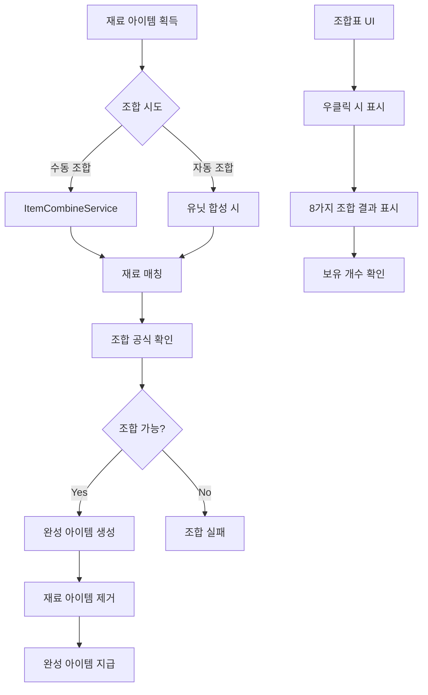

# 아이템 조합 시스템

메토체스의 아이템 조합 시스템은 재료 아이템(Material Item)을 조합하여 더 강력한 일반 아이템(Normal Item)을 만드는 전략적 시스템입니다. 8가지 기본 재료 아이템과 다양한 조합 공식을 통해 유닛의 능력을 크게 향상시킬 수 있습니다.

## 시스템 개요

조합 시스템은 단순한 아이템 제작을 넘어서 전략적 선택을 요구하는 깊이 있는 메커니즘입니다:
- **재료 수집**: 8가지 기본 재료 아이템 획득
- **조합 공식**: 특정 재료 조합으로 완성품 제작
- **자동 조합**: 유닛 합성 시 자동 처리
- **조합표 UI**: 실시간 조합 가능성 표시
- **특수 조합**: 도전과제 연동 특별 아이템



## 핵심 조합 로직

### ItemCombineService 구조

모든 조합 처리의 중심이 되는 서비스입니다.

**데이터 구조:**
```lua
@Description([[ItemCombine데이터셋의 데이터입니다. 
value(table) = {items = {itemId1, itemId2}, result = combinedItem}
]])
property table CombineData = {}
```

**조합 데이터 초기화:**
```lua
method void LoadData()
    local data = _DataService:GetTable("ItemCombine"):GetAllRow()
    
    for _, row in pairs(data) do
        local itemId1 = row:GetItem("ItemId1") 
        local itemId2 = row:GetItem("ItemId2")
        local combinedItem = row:GetItem("CombinedItem")
        
        local tmp = {items = {itemId1, itemId2}, result = combinedItem}
        table.insert(self.CombineData, tmp)
    end
end
```

### 조합 매칭 알고리즘

**순서 무관 매칭:**
```lua
method string GetNormalItemIDByMaterialItemIDs(string itemId1, string itemId2, Entity user)
    for _, data in pairs(self.CombineData) do
        if (data['items'][1] == itemId1 and data['items'][2] == itemId2) or
           (data['items'][1] == itemId2 and data['items'][2] == itemId1) then
            return data['result']
        end
    end
    return nil
end
```

**특수 조합 조건:**
```lua
-- 도전과제 완료 시 특별 아이템 조합
if isvalid(user) then
    if user.TM_PropertyControl.Challenge_SetCheck["CH10002"] >= 1 then
        return "NI10033"  -- 산타 장갑 (특별 아이템)
    end
end
```

## 재료 아이템 시스템

### 8가지 기본 재료

**재료 아이템 목록:**
```lua
local ingredientItems = {
    "MI10001", "MI10002", "MI10003", "MI10004",
    "MI10005", "MI10006", "MI10007", "MI10008"
}
```

**재료 아이템 식별:**
```lua
method string GetMateiralIDinUnitEquippedItems(table unitItems)
    for _, itemId in pairs(unitItems) do
        if string.sub(itemId, 1, 2) == "MI" then  -- 재료 아이템이라면
            return itemId
        end
    end
    return nil
end
```

### 재료 아이템 특성

- **ID 패턴**: "MI" 접두사로 시작
- **조합 우선순위**: 유닛 장착 시 자동 조합 처리
- **보유 제한**: 인벤토리 공간 고려한 수집 전략 필요

## 수동 조합 시스템

### 유닛 장착 시 조합

유닛에 재료 아이템 장착 시 자동으로 조합을 시도합니다:

```lua
-- 이미 장착한 재료 아이템 찾기
local materialItemID = _ItemCombineService:GetMateiralIDinUnitEquippedItems(equippedItemList)

if isvalid(materialItemID) then
    -- 조합 결과 확인
    local normalItemID = _ItemCombineService:GetNormalItemIDByMaterialItemIDs(
        itemID, materialItemID, user)
    
    if isvalid(normalItemID) then
        -- 조합 처리
        targetUnit.UnitStatus:SetProperty("EquippedItemIDList", 
            normalItemID, string.format("replace,%d", idx))
        table.remove(user.TeamManager.OwnItems, itemIdx)
        
        -- 조합 완료 이벤트
        user:SendEvent(CombinationItem(normalItemID))
    end
end
```

### 특수 아이템 예외 처리

**산타 장갑 특별 규칙:**
```lua
-- 산타 장갑은 단독 장착만 가능
if normalItemID == "NI10033" and #equippedItemList > 1 then
    -- 조합 취소하고 인벤토리로 반환
    targetUnit.UnitStatus:SetProperty("EquippedItemIDList", 
        normalItemID, string.format("remove,%d", idx))
    table.insert(user.TeamManager.OwnItems, normalItemID)
end
```

## 자동 조합 시스템

### 유닛 합성 시 조합

3성 유닛 합성 시 자동으로 재료 아이템을 조합 처리:

```lua
-- 재료 아이템 2개를 가지고 있는가?
local materialIdx = {}
for idx, id in pairs(items) do
    if string.sub(id, 1, 2) == "MI" then
        table.insert(materialIdx, idx)
    end
end

-- 재료 아이템 2개를 완성 아이템으로 조합
if #materialIdx == 2 then
    local materialItem1 = items[materialIdx[1]]
    local materialItem2 = items[materialIdx[2]]
    
    -- 조합 아이템 생성
    local combineID = _ItemCombineService:GetNormalItemIDByMaterialItemIDs(
        materialItem1, materialItem2, user)
    table.insert(items, combineID)
    
    -- 재료 아이템 제거
    table.remove(items, materialIdx[2])
    table.remove(items, materialIdx[1])
end
```

### 자동 조합의 장점

- **편의성**: 수동 조합 과정 생략
- **효율성**: 유닛 합성과 동시 처리
- **전략성**: 재료 수집 계획의 중요성 증대

## 조합표 UI 시스템

### 우클릭 조합표

재료 아이템이나 특정 상자 아이템에서 우클릭 시 조합표 표시:

```lua
@ExecSpace("ClientOnly")
method void ShowCombineTableTooltip(string itemID, string showType)
    -- 재료 아이템과 일부 아이템 상자만 표시 가능
    local keyType = string.sub(itemID, 1, 2)
    local showable = false
    
    if keyType == "MI" then
        showable = true
    elseif keyType == "IB" then
        local boxIdx = tonumber(string.sub(itemID, -2, -1))
        if boxIdx >= 5 and boxIdx <= 12 then
            showable = true
        end
    end
    
    if showable == false then
        return
    end
    
    self.IsShowingCombineTableUI = true
end
```

### 조합 가능성 표시

**실시간 보유량 계산:**
```lua
-- 보유 아이템 개수 계산
local ownItemCount = {}
-- 인벤토리 아이템
for i=1, #ownItems do
    if isvalid(ownItemCount[ownItems[i]]) then
        ownItemCount[ownItems[i]] += 1
    else
        ownItemCount[ownItems[i]] = 1
    end
end

-- 장착된 아이템도 포함
local ownUnits = _UserService.LocalPlayer.TeamManager.OwnUnits
for i=1, #ownUnits do
    local equippedItems = ownUnits[i].UnitStatus.EquippedItemIDList
    for j=1, #equippedItems do
        if isvalid(ownItemCount[equippedItems[j]]) then
            ownItemCount[equippedItems[j]] += 1
        else
            ownItemCount[equippedItems[j]] = 1
        end
    end
end
```

### UI 구성 요소

**조합표 슬롯 구조:**
- `IsCombinable`: 조합 가능 여부 표시
- `Result_OutlineBG`: 결과 아이템 배경
- `Icon`: 결과 아이템 아이콘
- `Text_ResultName`: 결과 아이템 이름

**동적 UI 업데이트:**
```lua
for i=1, 8 do
    local ui_slot = ui_table:GetChildByName(string.format("Slot_%d", i))
    
    -- 조합 결과 확인
    local targetItemID = ingredientItems[i]
    local resultItemID = self:GetNormalItemIDByMaterialItemIDs(baseItemID, targetItemID, nil)
    
    -- 조합 가능 여부
    local isCombinable = false
    if itemType == "MaterialItem" then
        if isvalid(ownItemCount[targetItemID]) == true and ownItemCount[targetItemID] >= 1 then
            isCombinable = true
        end
    end
    
    -- UI 갱신
    ui_isCombinable.Enable = isCombinable
    ui_resultItemIcon.SpriteGUIRendererComponent.ImageRUID = resultItemRow:GetItem("RUID")
    ui_resultItemName.TextComponent.Text = _LocalizationService:GetText("Item_"..resultItemID.."_Name")
end
```

## UI 상호작용 처리

### 마우스 이벤트 처리

**조합표 닫기:**
```lua
@EventSender("Service", "InputService")
handler HandleKeyDownEvent(KeyDownEvent event)
    local key = event.key
    
    if key == KeyboardKey.Mouse0 then
        if self.IsShowingCombineTableUI == true then
            local ui_tooltip = _EntityService:GetEntityByPath("/ui/HoverPopupGroup/HoverUI_ItemCombineTable")
            if ui_tooltip.Enable == true and _InputService:IsPointerOverUI() == false then
                ui_tooltip.Enable = false
                self.IsShowingCombineTableUI = false
            end
        end
    end
end
```

### 컨텍스트 추적

**UI 컨텍스트 관리:**
- `WatchingUI`: 현재 보고 있는 UI 창 (Shop, Inventory, UnitInfo 등)
- `WatchingItemID`: 조합표를 표시 중인 아이템 ID
- `IsShowingCombineTableUI`: 조합표 표시 상태

## 조합 전략과 팁

### 효율적인 재료 수집

**우선순위 기반 수집:**
1. 자주 사용되는 조합 공식의 재료 우선
2. 인벤토리 공간 고려한 선택적 수집
3. 유닛 합성 타이밍과 조합 시점 조율

### 조합 타이밍

**최적 조합 시점:**
- 3성 유닛 합성 직전 (자동 조합 활용)
- 인벤토리 공간 부족 시 (공간 확보)
- 강력한 완성 아이템 필요 시

### 특수 아이템 고려사항

**산타 장갑(NI10033):**
- 도전과제 완료 시에만 조합 가능
- 단독 장착 아이템으로 전략적 활용 필요
- 다른 아이템과 함께 장착 시 자동 해제

## 성능 최적화

### 데이터 캐싱

**조합 데이터 캐싱:**
- 게임 시작 시 한 번만 로드
- 메모리 내 고속 검색 지원
- O(n) 복잡도의 선형 검색

### UI 최적화

**조합표 표시 최적화:**
- 필요할 때만 동적 생성
- 마우스 클릭으로 즉시 닫기
- 메모리 누수 방지를 위한 적극적 정리

## 데이터 구조

### ItemCombine 데이터셋

**필수 컬럼:**
- `ItemId1`: 첫 번째 재료 아이템 ID
- `ItemId2`: 두 번째 재료 아이템 ID
- `CombinedItem`: 조합 결과 아이템 ID

**조합 규칙:**
- 순서 무관: (A, B) = (B, A)
- 1:1:1 조합: 재료 2개 → 완성품 1개
- 중복 조합: 같은 재료 2개 조합 가능

## Code References

- `RootDesk/MyDesk/InGame/Item/ItemCombineService.mlua :: GetNormalItemIDByMaterialItemIDs()` — 조합 매칭 로직
- `RootDesk/MyDesk/InGame/Item/ItemCombineService.mlua :: ShowCombineTableTooltip()` — 조합표 UI 표시
- `RootDesk/MyDesk/InGame/System/ItemSetLogic.mlua :: 수동 조합 처리` — 유닛 장착 시 조합
- `RootDesk/MyDesk/InGame/System/UnitSetLogic_New.mlua :: 자동 조합 처리` — 유닛 합성 시 조합
- `RootDesk/MyDesk/UIComponents/UI_Ingame/UI_ItemSelect_ItemSlot.mlua :: HandleUITouchDownEvent()` — 우클릭 조합표
- `RootDesk/MyDesk/InGame/Item/ItemCombine.userdataset` — 조합 공식 데이터
