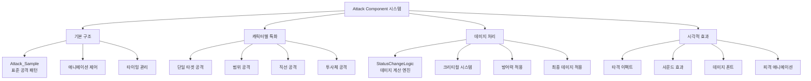

# 인게임 시스템 - 유닛 시스템 - 공격 컴포넌트

## 개요

Attack Component 시스템은 메토체스에서 **유닛의 기본 공격 행동**을 정의하고 실행하는 핵심 전투 시스템입니다. **표준화된 Attack_Sample**을 기반으로 **캐릭터별 특화 공격 패턴**을 구현하며, **StatusChangeLogic**과 연동하여 **정교한 데미지 계산**과 **다양한 타겟팅 시스템**을 제공합니다.

이 시스템의 핵심 설계 철학은 **모듈화된 확장성**과 **일관된 인터페이스**입니다. 모든 공격 컴포넌트는 **동일한 기본 구조**를 유지하면서도, 각 캐릭터의 **고유한 전투 특성**을 표현할 수 있도록 **유연한 커스터마이징**이 가능합니다.

## 시스템 아키텍처

### 전체 구조도



## 기본 공격 구조

### Attack_Sample - 표준 공격 패턴

모든 공격 컴포넌트의 **기본 템플릿** 역할을 하는 표준 구현입니다.

#### 핵심 속성

```lua
@Component
script Attack_Sample extends Component
    @Sync
    property number playRate = 0                        -- 애니메이션 재생 속도
    property string hitEffectRUID = "..."              -- 타격 이펙트 RUID
```

#### 공격 실행 플로우

```lua
@ExecSpace("Server")
method void Attack(Entity targetUnit)
    local myUnit = self.Entity
    local unitInfo = myUnit.UnitInfo
    local unitStatus = myUnit.UnitStatus
    local animComponent = myUnit.UnitAnimationComponent
    
    -- 1. 애니메이션 재생 속도 계산
    self.playRate = (unitStatus.AttackSpeed * 1.02) * _BTLogic_New.ASpeedValue
    
    -- 2. 공격 애니메이션 재생
    animComponent:PlayAnimation(self.playRate, "Attack", targetUnit, unitInfo.OwnerId)
    
    -- 3. 데미지 적용 타이밍 설정
    local function damage()
        self:SetDamage(targetUnit)
    end
    _TimerService:SetTimerOnce(damage, 0.4 / self.playRate)
    
    -- 4. 유닛 상태 변경
    unitStatus:SetProperty("state", "Attack", "")
end
```

#### 데미지 적용 시스템

```lua
@ExecSpace("Server")
method void SetDamage(Entity targetUnit)
    if isvalid(targetUnit) then
        local myUnit = self.Entity
        local unitStatus = myUnit.UnitStatus
        
        -- 1. 타격 이펙트 재생
        self:HitEffect(targetUnit, unitInfo.OwnerId)
        
        -- 2. 데미지 계산
        local damageInfo = _StatusChangeLogic:CheckDamage(
            unitStatus.PhysicalAttack,  -- 기본 공격력
            myUnit,                     -- 공격자
            targetUnit,                 -- 피격자
            0,                         -- 고정 피해 비율
            "Physical"                 -- 피해 타입
        )
        
        -- 3. 최종 데미지 적용
        _StatusChangeLogic:HitDamage(
            myUnit,                    -- 공격자
            targetUnit,                -- 피격자
            damageInfo[1],             -- 물리 피해
            0,                         -- 마법 피해
            damageInfo[2],             -- 고정 피해
            "defaultAttack"            -- 공격 타입
        )
    end
end
```

## 캐릭터별 특화 공격 패턴

### 1. 단일 타겟 공격 (표준형)

대부분의 캐릭터가 사용하는 **기본적인 1:1 공격** 패턴입니다.

#### 예시: C30017_UnknownSnackBar_Attack

```lua
-- 특징: 애니메이션 속도와 타이밍 조정
self.playRate = (unitStatus.AttackSpeed * 1.32) * _BTLogic_New.ASpeedValue
animComponent:PlayAnimation(self.playRate, "Attack", targetUnit, unitInfo.OwnerId)

-- 데미지 적용 타이밍
_TimerService:SetTimerOnce(damage, 0.5 / self.playRate)

-- 공격 가능 여부 체크 추가
if _BTLogic_New:CheckAttackAble(myUnit, targetUnit, "Attack") then
    self:SetDamage(targetUnit)
end
```

### 2. 범위 공격 (AoE)

**주변 다수의 적**을 동시에 공격하는 패턴입니다.

#### 예시: C50001_PinkBean_Attack

```lua
@ExecSpace("Server")
method void Attack(Entity targetUnit)
    -- 기본 설정
    self.playRate = (unitStatus.AttackSpeed * 2.28) * _BTLogic_New.ASpeedValue
    
    local function damage()
        -- 1. 공격 가능한 적들 탐색
        local enemies = {}
        if unitInfo.TeamType == "User" then
            enemies = teamManager.EnemyUnits
        elseif unitInfo.TeamType == "Enemy" then
            enemies = teamManager.OwnUnits
        end
        
        -- 2. 범위 내 타겟들 선별
        local attackEnemies = _BTLogic_New:getTargets(
            unitInfo.setTile,                                    -- 기준 위치
            enemies,                                             -- 대상 목록
            string.format("Around_1_%d", unitStatus.AttackRange) -- 범위 패턴
        )
        attackEnemies = _BTLogic_New:getEntities(attackEnemies, "AttackAble")
        
        -- 3. 모든 대상에게 데미지 적용
        for _, enemy in pairs(attackEnemies) do
            if _BTLogic_New:CheckAttackAble(myUnit, enemy, "Attack") then
                self:SetDamage(enemy)
            end
        end
        
        -- 4. 범위 공격 이펙트
        self:AttackEffect(unitInfo.OwnerId)
    end
    
    _TimerService:SetTimerOnce(damage, 0.7 / self.playRate)
end
```

#### 복합 데미지 시스템

```lua
method void SetDamage(Entity targetUnit)
    -- 물리 피해 계산
    local physicalDamage = unitStatus.PhysicalAttack
    local physicalDamageInfo = _StatusChangeLogic:CheckDamage(
        physicalDamage, myUnit, targetUnit, 0, "Physical"
    )
    
    -- 마법 피해 계산 (스킬 설명서 기반)
    local magicalDamage = unitStatus.MagicalAttack * 
                         _S01_SkillDescLogic.C50001_Passive_Attack_Magic[unitInfo.level]
    local magicalDamageInfo = _StatusChangeLogic:CheckDamage(
        magicalDamage, myUnit, targetUnit, 0, "Magical"
    )
    
    -- 복합 데미지 적용
    _StatusChangeLogic:HitDamage(
        myUnit, targetUnit,
        physicalDamageInfo[1],                              -- 물리 피해
        magicalDamageInfo[1],                               -- 마법 피해
        physicalDamageInfo[2] + magicalDamageInfo[2],       -- 고정 피해 합산
        "defaultAttack"
    )
end
```

### 3. 직선 공격 (Line Attack)

**직선상의 모든 적**을 관통하여 공격하는 패턴입니다.

#### 특징
- **순차적 타격**: 타일을 하나씩 진행하며 공격
- **시간 차 공격**: 각 타일마다 시간 간격을 두고 공격
- **관통 효과**: 중간에 적이 있어도 계속 진행

## 데미지 계산 시스템

### StatusChangeLogic 엔진

모든 공격의 **데미지 계산과 적용**을 담당하는 중앙 시스템입니다.

#### 1단계: CheckDamage - 기본 데미지 계산

```lua
@ExecSpace("Server")
method SyncTable<number> CheckDamage(number setDamage, Entity attackUnit, Entity targetUnit, 
                                     number trueDamagePer, string damageType)
    -- 고정 피해와 일반 피해 분리
    local trueDamage = setDamage * trueDamagePer
    local damage = setDamage - trueDamage
    
    return {damage, trueDamage}
end
```

#### 2단계: HitDamage - 종합 데미지 처리

복잡한 **7단계 데미지 처리 파이프라인**을 통해 최종 데미지를 계산합니다.

##### 1) 상태 효과 검사
```lua
-- 평타 공격 시 실명 효과 체크
if attackType == "defaultAttack" and attackUnitStatus.StatusEffect["SE0007"] == true then
    physicalDamage = 0
    magicalDamage = 0
    trueDamage = 0
end
```

##### 2) 공격자 보정 적용
```lua
-- 데미지 증감율 적용
local dealingDamageRate = attackUnitStatus.DealingDamageRate
physicalDamage *= dealingDamageRate/100
magicalDamage *= dealingDamageRate/100
trueDamage *= dealingDamageRate/100
```

##### 3) 크리티컬 시스템
```lua
-- 크리티컬 확률 계산
local criticalPercent = attackUnitStatus.CriticalPercent
local criticalDamagePercent = attackUnitStatus.CriticalDamagePercent
local randomValue = _UtilLogic:RandomIntegerRange(1, 100)

-- 특수 시너지 처리: 추격자 시너지
if attackUnit.UnitInfo:DoesHaveSynergy("S10008") then
    local HPRateCondition = 0
    if onFieldSynCount_S10008 >= 2 then
        HPRateCondition = 0.35  -- 35% 미만 적에게 크리티컬
    elseif onFieldSynCount_S10008 >= 4 then
        HPRateCondition = 0.7   -- 70% 미만 적에게 크리티컬
    elseif onFieldSynCount_S10008 >= 6 then
        HPRateCondition = 1.1   -- 무조건 크리티컬
    end
    
    if targetUnit.UnitStatus.HP / targetUnit.UnitStatus.MaxHP < HPRateCondition then
        randomValue = -1  -- 강제 크리티컬
    end
end

-- 크리티컬 데미지 적용
if randomValue < criticalPercent then
    isCriticalHit = true
    physicalDamage *= criticalDamagePercent/100
    magicalDamage *= criticalDamagePercent/100
    trueDamage *= criticalDamagePercent/100
end
```

##### 4) 방어력 적용
```lua
-- 물리 방어력 적용
local def = targetUnitStatus.Defence
if def < 0 then def = 0 end
physicalDamage = physicalDamage * (1 - (def / (100 + def)))

-- 마법 저항력 적용
local mr = targetUnitStatus.MagicalResistance
if mr < 0 then mr = 0 end
magicalDamage = magicalDamage * (1 - (mr / (100 + mr)))
```

##### 5) 피해 감소 시스템
```lua
-- 다양한 피해 감소 효과 적용
local damageDecrease = targetUnitStatus.DamageDecrease

-- 퍼센트 감소
local damageDecreaseRate = 0
damageDecreaseRate += damageDecrease["Per"]                                -- 기본 감소
damageDecreaseRate += damageDecrease["Physic_Per"] * targetUnitStatus.PhysicalAttack  -- 공격력 비례
damageDecreaseRate += damageDecrease["Magic_Per"] * targetUnitStatus.MagicalAttack    -- 마력 비례
damageDecreaseRate += damageDecrease["MaxHP_Per"] * targetUnitStatus.MaxHP           -- 최대 체력 비례

physicalDamage *= (1 - damageDecreaseRate/100)
magicalDamage *= (1 - damageDecreaseRate/100)

-- 정수 감소
physicalDamage -= damageDecrease["Num"]
magicalDamage -= damageDecrease["Num"]
trueDamage -= damageDecrease["True_Num"]
```

##### 6) 무적 상태 처리
```lua
-- 무적 효과 체크
if targetUnit.UnitStatus.StatusEffect["SE0001"] == true then
    targetUnitStatistics:SetProperty("PhysicalDamageAbsorbed", math.max(0, physicalDamage), true)
    targetUnitStatistics:SetProperty("MagicalDamageAbsorbed", math.max(0, magicalDamage), true)
    targetUnitStatistics:SetProperty("TrueDamageAbsorbed", math.max(0, trueDamage), true)
    trueDamage, physicalDamage, magicalDamage = 0, 0, 0
end
```

##### 7) 최종 적용 및 이벤트 발생
```lua
-- 데미지 폰트 표시
if physicalDamage > 0 then
    _CustomizedBattleEffectService:PlayDamageSkin(
        targetUnit, "Physic", physicalDamage, isCriticalHit, userID
    )
end

if magicalDamage > 0 then
    _CustomizedBattleEffectService:PlayDamageSkin(
        targetUnit, "Magic", magicalDamage, isCriticalHit, userID
    )
end

if trueDamage > 0 then
    _CustomizedBattleEffectService:PlayDamageSkin(
        targetUnit, "True", trueDamage, isCriticalHit, userID
    )
end

-- 피격 애니메이션
targetUnit.UnitAnimationComponent:PlayHitDirection(userID)

-- 이벤트 발생
targetUnit:SendEvent(Attacked({
    Attacker = attackUnit,
    Target = targetUnit,
    InitialDamages = initialDamage,
    FinalDamages = finalDamage,
    IsCritical = isCriticalHit,
    AttackType = attackType
}))
```

## 타겟팅 시스템

### BTLogic_New를 통한 고급 타겟팅

다양한 **범위 패턴**과 **타겟 선별 조건**을 지원하는 시스템입니다.

#### 범위 패턴 종류

```lua
-- 원형 범위 (반지름 기반)
"Around_1_3"        -- 반지름 3 범위의 원형 공격

-- 직선 범위 (관통 공격)
"StraightLine_1"    -- 직선 관통 공격

-- 사거리 기반 범위
string.format("Around_1_%d", unitStatus.AttackRange)  -- 유닛 사거리만큼 원형 범위
```

#### 타겟 선별 시스템

```lua
-- 1. 기본 타겟 탐색
local attackEnemies = _BTLogic_New:getTargets(
    unitInfo.setTile,     -- 기준 위치
    enemies,              -- 대상 후보 목록
    rangePattern          -- 범위 패턴
)

-- 2. 공격 가능한 타겟만 필터링
attackEnemies = _BTLogic_New:getEntities(attackEnemies, "AttackAble")

-- 3. 개별 공격 가능 여부 체크
for _, enemy in pairs(attackEnemies) do
    if _BTLogic_New:CheckAttackAble(myUnit, enemy, "Attack") then
        -- 공격 실행
    end
end
```

## 시각적 및 청각적 효과 시스템

### 이펙트 관리

#### 타격 이펙트
```lua
@ExecSpace("Client")
method void HitEffect(Entity targetUnit)
    local myUnit = self.Entity
    local unitInfo = myUnit.UnitInfo
    
    -- 방향 설정 (좌우 반전)
    local filpX = unitInfo.spriteRenderer.SpriteRendererComponent.FlipX
    
    -- 이펙트 옵션 설정
    local options = {
        ["FlipX"] = filpX,
        ["Color"] = Color(1,1,1, _ESCMenuService.skillEffectAlpha/100)
    }
    
    -- 이펙트 재생 (타겟에 붙어서 재생)
    _EffectService:PlayEffectAttached(
        self.hitEffectRUID,      -- 이펙트 RUID
        targetUnit,              -- 붙일 대상
        Vector3(0, 0.3, 0),      -- 오프셋 위치
        0,                       -- 회전
        Vector3(1.5, 1.5, 1.5),  -- 스케일
        false,                   -- 월드 좌표 여부
        options                  -- 추가 옵션
    )
end
```

#### 사운드 효과
```lua
-- 공격 시작 시 사운드
_PlaySoundLogic:PlaySound("M0038", self.Entity.UnitInfo.OwnerId)

-- 타격 시 사운드
_PlaySoundLogic:PlaySound("M0126")
```

## 성능 최적화 및 확장성

### 1. 타이밍 최적화
- **애니메이션 속도 기반 타이밍**: 공격 속도에 따른 동적 타이밍 조정
- **프레임 기반 계산**: 정확한 타이밍 동기화

### 2. 메모리 효율성
- **이펙트 RUID 캐싱**: 런타임 중 이펙트 리소스 재사용
- **타이머 관리**: 불필요한 타이머 정리로 메모리 누수 방지

### 3. 확장 가능성
- **모듈형 설계**: 새로운 공격 패턴 쉽게 추가 가능
- **표준화된 인터페이스**: 일관된 구현 규칙
- **데이터 기반 밸런싱**: CSV 데이터를 통한 수치 조정

### 4. 디버깅 및 모니터링
- **전투 통계 연동**: 모든 공격이 자동으로 통계에 기록
- **이벤트 시스템**: 공격 행동의 완전한 추적 가능

## 관련 파일

### 코드 참조
- `RootDesk/MyDesk/InGame/Unit/00_AttackComponent/Attack_Sample.mlua :: Attack()` — 표준 공격 패턴 구현
- `RootDesk/MyDesk/InGame/Unit/00_AttackComponent/Attack_Sample.mlua :: SetDamage()` — 기본 데미지 적용 로직
- `RootDesk/MyDesk/InGame/System/StatusChangeLogic.mlua :: CheckDamage()` — 데미지 기본 계산
- `RootDesk/MyDesk/InGame/System/StatusChangeLogic.mlua :: HitDamage()` — 종합 데미지 처리 시스템
- `RootDesk/MyDesk/InGame/Unit/00_AttackComponent/C50001_PinkBean_Attack.mlua :: Attack()` — 범위 공격 패턴 예시
- `RootDesk/MyDesk/InGame/Unit/00_AttackComponent/C30017_UnknownSnackBar_Attack.mlua` — 단일 타겟 공격 변형 예시

### 캐릭터별 공격 컴포넌트
- `RootDesk/MyDesk/InGame/Unit/00_AttackComponent/` 폴더의 모든 캐릭터별 공격 구현들

### 연동 시스템
- `BTLogic_New.mlua` — 타겟팅 및 범위 계산 시스템
- `UnitAnimationComponent.mlua` — 공격 애니메이션 제어
- `UnitBattleStatistics.mlua` — 공격 통계 기록
- `CustomizedBattleEffectService.mlua` — 데미지 폰트 및 이펙트
- `EffectService` — 시각적 이펙트 재생
- `PlaySoundLogic.mlua` — 사운드 효과

### 이벤트 연동
- `Events/UnitBehaviorEvents/` — 공격 관련 이벤트 정의
- `DefaultAttack`, `DefaultAttackHit`, `Attacked` 이벤트

이러한 체계적인 공격 컴포넌트 시스템을 통해 메토체스는 **다양하고 흥미로운 전투 메커니즘**을 제공하면서도, **성능과 확장성을 모두 보장**하는 견고한 전투 시스템을 구축했습니다. **표준화된 구조** 위에서 **무한한 창의성**을 발휘할 수 있는 유연한 아키텍처가 이 시스템의 가장 큰 장점입니다.
