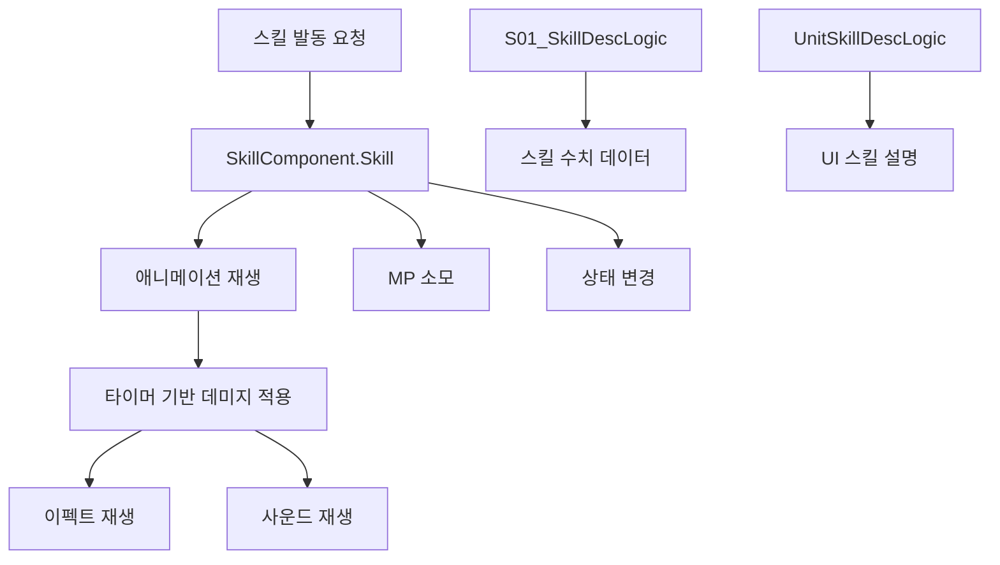

# 스킬 컴포넌트

메토체스의 스킬 시스템은 각 유닛이 가진 고유한 능력을 관리하는 핵심 시스템입니다. 기본적인 공격과는 별도로 MP를 소모하여 발동하는 특수 능력들을 구현하고 관리합니다.

## 시스템 개요

스킬 시스템은 크게 세 가지 요소로 구성됩니다:
- **스킬 컴포넌트**: 실제 스킬 로직을 담당
- **스킬 데이터 관리**: 수치와 설명 정보를 관리
- **스킬 UI 연동**: 게임 내에서 스킬 정보를 표시



## 기본 스킬 컴포넌트

### SkillComponent 구조

모든 스킬의 기본이 되는 베이스 컴포넌트입니다.

**주요 프로퍼티:**
- `SkillType`: 스킬 타입 구분
- `SkillAnimLength`: 스킬 애니메이션 길이
- `AttackEffectRUID`: 공격 이펙트 RUID
- `HitEffectRUID`: 적중 이펙트 RUID
- `SkillSoundID`: 스킬 사운드 ID

**핵심 메서드:**
```lua
@ExecSpace("Server")
method void Skill(Entity targetUnit)
```

## 개별 스킬 구현

각 캐릭터마다 고유한 스킬 컴포넌트를 가지며, 기본 패턴을 따라 구현됩니다.

### 스킬 실행 흐름

1. **기본 정보 수집**
   ```lua
   local myUnit = self.Entity
   local unitInfo = myUnit.UnitInfo
   local unitStatus = myUnit.UnitStatus
   local targetInfo = targetUnit.UnitInfo
   ```

2. **애니메이션과 상태 처리**
   ```lua
   animComponent:PlayAnimation(skillRate, "Skill", targetUnit, unitInfo.OwnerId)
   unitStatus:SetProperty("state", "Skill", "")
   ```

3. **MP 소모**
   ```lua
   _StatusChangeLogic:SetVariableStatus(myUnit, myUnit, "MP", -1000, "useskill")
   ```

4. **지연된 데미지 적용**
   ```lua
   local function hitSkill()
       self:SetSkillDamage(targetUnit)
   end
   _TimerService:SetTimerOnce(hitSkill, 0.5)
   ```

### 캐릭터별 스킬 예시

**C30001_Yeti_Skill** (회복형 스킬):
- 자가 회복 스킬
- HP 회복량 = 고정값 + 최대HP 비례값
- 짧은 애니메이션 시간 (0.9초)

**C30005_SoulMaster_Skill** (복잡한 공격 스킬):
- 다단계 공격 패턴
- 위치 기반 타겟팅
- 다중 이펙트 사용

**C00001_YetiAndPepe_Skill** (특수 효과 스킬):
- 받은 피해량 기반 데미지 계산
- 긴 애니메이션과 복잡한 이펙트
- 라운드별 통계 데이터 활용

## 스킬 데이터 관리 시스템

### S01_SkillDescLogic

모든 스킬의 수치 데이터를 관리하는 중앙화된 로직입니다.

**데이터 구조:**
- 각 캐릭터별로 레벨당 수치 배열 관리
- Active/Passive 스킬 구분
- 다양한 데미지 타입별 계수 관리

**초기화 방식:**
```lua
method void OnBeginPlay()
    self:SkillDescC1()  -- C10000번대 캐릭터
    self:SkillDescC2()  -- C20000번대 캐릭터
    self:SkillDescC3()  -- C30000번대 캐릭터
    self:SkillDescC4()  -- C40000번대 캐릭터
    self:SkillDescC5()  -- C50000번대 캐릭터
    self:SkillDescC0()  -- C00000번대 특수 캐릭터
end
```

### 수치 데이터 활용

스킬 구현에서 실제 수치를 가져와 사용하는 방식:
```lua
local getHP = _S01_SkillDescLogic.C30001_Active_GetHP_Int[unitInfo.level] + 
              unitStatus.MaxHP * _S01_SkillDescLogic.C30001_Active_GetHP_MaxHPPer[unitInfo.level]
```

## 스킬 설명 UI 시스템

### UnitSkillDescLogic

게임 UI에서 스킬 설명을 동적으로 생성하는 시스템입니다.

**주요 기능:**
- 로컬라이제이션 키를 통한 기본 설명 로드
- 현재 유닛 상태에 따른 실시간 수치 계산
- 표준화된 수치 표시 (상점 등에서 사용)

**설명 생성 과정:**
1. 캐릭터 ID와 스킬 타입으로 키 생성
2. 로컬라이제이션에서 기본 텍스트 획득
3. 현재 유닛 스탯으로 실제 수치 계산
4. 템플릿에 수치 값 삽입

## 스킬과 전투 시스템 연동

### 스킬 발동 조건

- **MP 요구량**: 대부분 스킬은 1000 MP 소모 (만피)
- **타겟 존재**: 적절한 타겟이 있을 때만 발동
- **상태 체크**: `_BTLogic_New:CheckAttackAble()` 검증

### 애니메이션과 타이밍

- **skillAnimLength**: 스킬 애니메이션 총 시간
- **_BTLogic_New.SSpeedValue**: 전투 속도 배율 적용
- **타이머 기반 적중**: 애니메이션과 실제 효과 분리

## 이펙트와 사운드

### 이펙트 시스템

- **AttackEffect**: 스킬 시전 시 시각 효과
- **HitEffect**: 타겟 적중 시 시각 효과
- **다중 이펙트**: 복잡한 스킬의 경우 여러 이펙트 조합

### 사운드 재생

```lua
if self.SkillSoundID ~= "" then
    _PlaySoundLogic:PlaySound(self.SkillSoundID, unitInfo.OwnerId)
end
```

## 특수 스킬 패턴

### 지속 효과 스킬

일부 스킬은 즉시 효과가 아닌 지속적인 효과를 가집니다:
- 상태 이상 부여 (`_StatusChangeLogic:SetStatus`)
- 버프/디버프 적용
- 시간 기반 효과

### 범위 스킬

다중 타겟을 대상으로 하는 스킬의 구현:
- 주변 유닛 탐색
- 범위 내 모든 적에게 효과 적용
- 복잡한 타겟팅 로직

## 성능 고려사항

### 데이터 캐싱

- 스킬 계수 데이터는 게임 시작 시 한 번만 로드
- 레벨별 수치는 배열로 미리 계산하여 저장

### 타이머 활용

- 즉시 실행이 아닌 타이머 기반 지연 실행
- 애니메이션과 실제 효과의 동기화
- 서버 부하 분산

## Code References

- `RootDesk/MyDesk/InGame/Unit/00_ SkillComponent/SkillComponent.mlua :: Skill()` — 기본 스킬 실행 로직
- `RootDesk/MyDesk/InGame/Unit/00_ SkillComponent/Skill_Sample.mlua :: SetSkillDamage()` — 데미지 적용 샘플
- `RootDesk/MyDesk/InGame/Unit/00_ SkillComponent/C30001_Yeti_Skill.mlua :: Skill()` — 회복 스킬 구현
- `RootDesk/MyDesk/InGame/System/S01_SkillDescLogic.mlua :: SkillDescC1()` — 스킬 데이터 초기화
- `RootDesk/MyDesk/UIComponents/UnitSkillDescLogic.mlua :: GetDefaultDesc()` — 스킬 설명 생성
- `RootDesk/MyDesk/InGame/Unit/00_ SkillComponent/C00001_YetiAndPepe_Skill.mlua :: Skill()` — 복잡한 스킬 구현 예시
