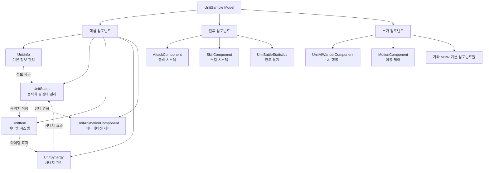
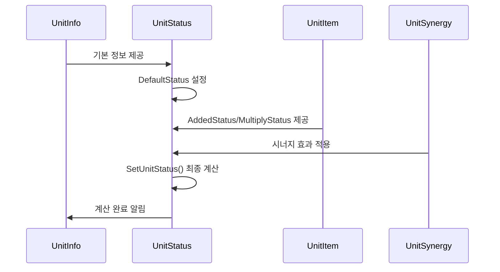
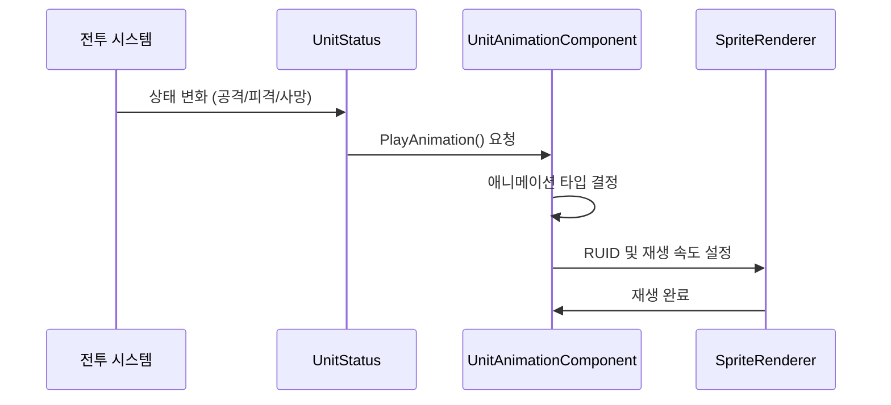
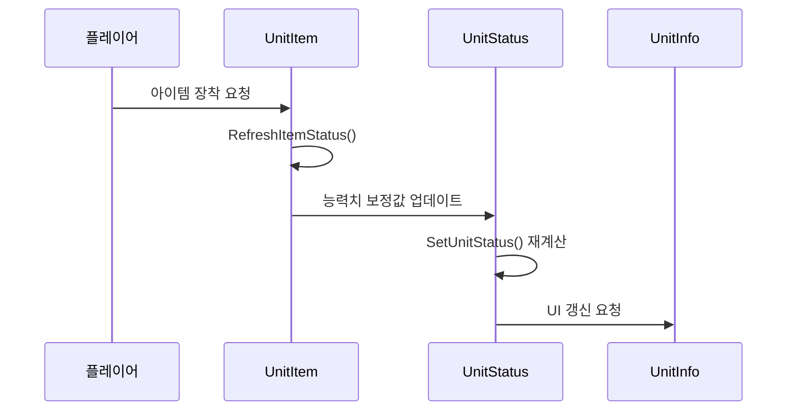

# 인게임 시스템 - 유닛 시스템 - 유닛 컴포넌트

## 개요

Unit Component 시스템은 메토체스의 **모든 유닛 엔티티**에 **표준화된 컴포넌트 구조**를 제공하는 핵심 아키텍처입니다. **UnitSample 모델**을 기반으로 **15개의 통합 컴포넌트**가 유기적으로 연결되어, 유닛의 **정보 관리**, **능력치 계산**, **애니메이션 제어**, **전투 행동**, **시너지 효과** 등을 체계적으로 처리합니다.

이 시스템의 핵심 설계 철학은 **모듈화**와 **확장성**입니다. 각 컴포넌트는 독립적인 역할을 수행하면서도, **표준화된 인터페이스**를 통해 서로 긴밀하게 협력하여 복잡한 유닛 시스템을 구현합니다. 이를 통해 새로운 캐릭터나 기능 추가 시에도 **일관된 구조**를 유지할 수 있습니다.

## 시스템 아키텍처

### 전체 구조도



### UnitSample 모델 구성

```lua
-- UnitSample.model의 표준 컴포넌트 구성
{
  "EntryKey": "model://b8e0687e-a1ea-472d-aacc-c2bc11fd79e8",
  "Components": [
    "MOD.Core.TransformComponent",           -- 위치/회전/스케일
    "MOD.Core.SpriteRendererComponent",      -- 스프라이트 렌더링
    "MOD.Core.TouchReceiveComponent",        -- 터치 이벤트
    "MOD.Core.StateComponent",               -- 상태 관리
    "MOD.Core.TriggerComponent",             -- 충돌 감지
    "script.UnitAnimationComponent",         -- 애니메이션 제어
    "script.UnitItem",                       -- 아이템 시스템
    "script.UnitSynergy",                    -- 시너지 관리
    "script.UnitAIWanderComponent",          -- AI 행동
    "script.UnitBattleStatistics",           -- 전투 통계
    "script.UnitInfo",                       -- 기본 정보
    "script.UnitStatus"                      -- 능력치 & 상태
  ]
}
```

## 핵심 컴포넌트 시스템

### 1. UnitInfo - 기본 정보 관리자

**유닛의 신원과 기본 특성**을 담당하는 핵심 컴포넌트입니다.

#### 주요 속성

##### 신원 정보
```lua
property boolean use = false              -- 유닛 활성화 상태
property string charID = "C10001"         -- 캐릭터 고유 ID
property string unitName = ""             -- 유닛 이름
property number level = 1                 -- 유닛 등급 (1~3성)
property number cost = 1                  -- 구매/판매 비용
property string OwnerId = ""              -- 소유자 ID
property string TeamType = ""             -- "User" 또는 "Enemy"
```

##### 배치 및 위치 정보
```lua
property Entity setTile = nil                    -- 현재 배치된 타일
property number setTileVerticalNum = 0           -- 세로 위치 (0=대기석)
property number setTileHorizontalNum = 0         -- 가로 위치
property SyncTable<string, number> OnTileNum     -- 타일별 배치 정보
```

##### 시너지 및 특성
```lua
property SyncTable<string> synergyList           -- 보유 시너지 목록
property number unitPhaseNumber = 1              -- 진화 단계 (1=기본, 2=진화)
```

#### 핵심 기능

##### 필드/대기석 판별
```lua
method boolean IsOnFieldUnit()
    -- 전장 배치 여부 확인
    if self.setTileVerticalNum == 0 then
        return false  -- 대기석
    else
        return true   -- 전장
    end
end
```

##### 시너지 보유 검사
```lua
method boolean DoesHaveSynergy(string synergyID)
    -- 1) 기본 시너지 검사
    for i=1, #self.synergyList do
        if self.synergyList[i] == synergyID then
            return true
        end
    end
    
    -- 2) 상징(EI) 아이템을 통한 시너지 검사
    local equippedItems = self.Entity.UnitStatus.EquippedItemIDList
    for i=1, #equippedItems do
        local itemID = _UtilLogic:Split(equippedItems[i], "_")[1]
        local keyHead = string.sub(itemID, 1, 2)
        local keyTail = string.sub(itemID, 3, -1)
        
        if keyHead == "EI" then
            if synergyID == "S"..keyTail then
                return true
            end
        end
    end
    
    return false
end
```

#### 유닛 제어 플래그 시스템

```lua
-- 유닛 행동 제한 관리
property boolean IsOnetimeUnit = false            -- 일회성 유닛 여부
property boolean IsMergableUnit = true            -- 합성 가능 여부
property boolean IsItemEquippable = true          -- 아이템 장착 가능 여부
property boolean IsSettableOnWatingField = true   -- 대기석 배치 가능 여부
property boolean IsMovableByPlayer = true         -- 플레이어 이동 가능 여부
property boolean IsResellable = true              -- 재판매 가능 여부
property boolean IsAppliableSynergy = true        -- 시너지 적용 가능 여부
```

### 2. UnitStatus - 능력치 및 상태 관리자

**유닛의 모든 능력치 계산과 상태 관리**를 담당하는 중앙 처리 컴포넌트입니다.

#### 기본 능력치 속성

##### 생존력 관련
```lua
property number MaxHP = 0                  -- 최대 체력
property number HP = 100                   -- 현재 체력
property number MaxMP = 0                  -- 최대 마나
property number MP = 0                     -- 현재 마나
property number Shield = 0                 -- 보호막
```

##### 공격력 관련
```lua
property number PhysicalAttack = 0         -- 물리 공격력
property number MagicalAttack = 0          -- 마법 공격력
property number CriticalPercent = 0        -- 치명타 확률
property number CriticalDamagePercent = 140 -- 치명타 데미지 (기본 140%)
property number BloodAbsorptionPercent = 0 -- 흡혈률
property number DealingDamageRate = 100    -- 가해 피해량 비율
```

##### 방어력 관련
```lua
property number Defence = 0                -- 물리 방어력
property number MagicalResistance = 0      -- 마법 방어력
```

##### 기타 능력치
```lua
property number AttackSpeed = 0            -- 공격속도
property number AttackRange = 0            -- 공격 사거리
property number SkillRange = 0             -- 스킬 사거리
property number MoveSpeed = 1              -- 이동속도
property number MPBonusWhenAttack = 0      -- 공격 시 마나 획득
property number MPBonusWhenBeAttacked = 0  -- 피격 시 마나 획득
property number HPRecoverRate = 100        -- 체력 회복 효과율
property number StatusEffectRemainTimeRate = 100 -- 상태이상 지속시간 비율
```

#### 능력치 계산 시스템

메토체스의 능력치 계산은 **4단계 계층 구조**로 이루어집니다:

```lua
-- 최종 스탯 = (캐릭터 기본값 + 정수 증가분) × (1 + 배율 증가분)
method void SetUnitStatus(boolean isBattleUnit)
    -- (1) 캐릭터 기본값 (DefaultStatus): CSV 데이터 기반
    -- (2) 정수 증가분 (AddedStatus): 아이템, 시너지 등에서 제공
    -- (3) 배율 증가분 (MultiplyStatus): 퍼센트 증가 효과
    -- (4) 최종 적용: 계층별 순서대로 계산
    
    local statusType = {
        "MaxHP", "MaxMP", "MP", "PhysicalAttack", "MagicalAttack",
        "Defence", "MagicalResistance", "AttackSpeed", "AttackRange",
        "SkillRange", "CriticalPercent", "CriticalDamagePercent",
        "BloodAbsorptionPercent", "MoveSpeed", "DealingDamageRate",
        "MPBonusWhenAttack", "MPBonusWhenBeAttacked", "HPRecoverRate",
        "StatusEffectRemainTimeRate"
    }
    
    for i=1, #statusType do
        local stat = statusType[i]
        local finalValue = (self.DefaultStatus[stat] + self.AddedStatus[stat]) * 
                          (1 + self.MultiplyStatus[stat]/100)
        self[stat] = finalValue
    end
end
```

#### 상태 효과 관리 시스템

```lua
-- 상태이상 관리
property SyncTable<string, boolean> StatusEffect    -- 상태이상 활성화 여부
property SyncTable<string, number> StatusTime       -- 상태이상 지속시간

-- 스택 기반 효과
property SyncTable<string, number> StackProperty    -- 중첩 가능한 효과들

-- 피해 감소 시스템
property SyncTable<string, number> DamageDecrease   -- 피해 감소 효과들
```

### 3. UnitItem - 아이템 시스템 관리자

**아이템 장착과 능력치 보정**을 전담하는 컴포넌트입니다.

#### 주요 속성

```lua
property SyncTable<string, number> ItemAbilityStacks      -- 아이템 특수 효과 스택
property SyncTable<number> InBattleAbilityStacks          -- 전투 중 특수 효과
property boolean IsBattlePhase = false                     -- 전투 단계 여부
property SyncTable<string, number> AddedStatus            -- 정수 증가 보정
property SyncTable<string, number> MultiplyStatus         -- 배율 증가 보정
```

#### 아이템 능력치 적용 시스템

```lua
-- 19가지 능력치에 대한 표준화된 처리
local statusType = {
    "MaxHP", "MaxMP", "MP", "PhysicalAttack", "MagicalAttack",
    "Defence", "MagicalResistance", "AttackSpeed", "AttackRange", 
    "SkillRange", "CriticalPercent", "CriticalDamagePercent",
    "BloodAbsorptionPercent", "MoveSpeed", "DealingDamageRate",
    "MPBonusWhenAttack", "MPBonusWhenBeAttacked", 
    "HPRecoverRate", "StatusEffectRemainTimeRate"
}

-- 초기화 시 모든 보정값을 0으로 리셋
method void OnBeginPlay()
    for i=1, #statusType do
        self.AddedStatus[statusType[i]] = 0
        self.MultiplyStatus[statusType[i]] = 0
    end
end
```

### 4. UnitSynergy - 시너지 효과 관리자

**개별 유닛 단위의 시너지 효과**를 처리하는 컴포넌트입니다.

#### 주요 속성

```lua
property SyncTable<string, number> SynergyStack    -- 시너지 효과별 스택 수치
```

#### 시너지 처리 원칙

```lua
method void README()
    --[[
    [작성 규칙]
    1) On~ 함수에서 '이 유닛이 보유한 시너지'를 체크하고, 실행합니다.
    2) 실행한 함수 안에서 '현재 활성화된 시너지 효과 단계(3>6>9 같은..)'를 체크합니다.
    3) 2단계에서 활성화에 필요한 인원수가 충족되지 않으면 return 시켜버립니다.
    ]]
end
```

#### 시너지 스택 초기화 예시

```lua
method void InitAllProperties()
    self.SynergyStack["S10003_Taunt"] = 2     -- 선봉장: 전투 시작 및 체력 50% 미만 시 도발
    -- 기타 시너지 효과들의 기본값 설정
end
```

### 5. UnitAnimationComponent - 애니메이션 제어자

**유닛의 시각적 표현**을 담당하는 애니메이션 시스템입니다.

#### 주요 속성

```lua
property SyncTable<string, string> animRUID        -- 애니메이션별 RUID 매핑
property Color SpriteColor = Color(1,1,1,1)        -- 스프라이트 색상
property string SetAnimType = ""                    -- 현재 애니메이션 타입
property integer TimerID_HitDirection = 0          -- 피격 방향 타이머
```

#### 애니메이션 RUID 설정

```lua
method void SetAnimRUID(string charID)
    local unitRUIDTable = self.unitRUIDs
    local row = unitRUIDTable:FindRow("CharID", charID)
    
    self.animRUID["Idle"] = row:GetItem("IdleRUID")      -- 대기
    self.animRUID["Move"] = row:GetItem("MoveRUID")      -- 이동
    self.animRUID["Attack"] = row:GetItem("AttackRUID")  -- 공격
    self.animRUID["Skill"] = row:GetItem("SkillRUID")    -- 스킬
    self.animRUID["Dead"] = row:GetItem("DeadRUID")      -- 사망
    
    -- 진화형 애니메이션 (charID_2)
    local row2 = unitRUIDTable:FindRow("CharID", charID .. "_2")
    if isvalid(row2) then
        self.animRUID["Idle2"] = row2:GetItem("IdleRUID")
        self.animRUID["Move2"] = row2:GetItem("MoveRUID")
        self.animRUID["Attack2"] = row2:GetItem("AttackRUID")
        self.animRUID["Skill2"] = row2:GetItem("SkillRUID")
    end
end
```

#### 애니메이션 재생 시스템

```lua
method void PlayAnimation(number playRate, string anim, Entity targetUnit)
    local unitInfo = self.Entity.UnitInfo
    local spriteRenderer = unitInfo.spriteRenderer
    
    -- 사망 상태 체크
    if unitStatus.HP <= 0 and self.SetAnimType == "Dead" then
        return
    end
    
    -- 진화 단계별 애니메이션 선택
    if unitInfo.unitPhaseNumber == 1 then
        spriteRenderer.SpriteRendererComponent.SpriteRUID = self.animRUID[anim]
    elseif unitInfo.unitPhaseNumber == 2 then
        spriteRenderer.SpriteRendererComponent.SpriteRUID = self.animRUID[anim.."2"]
    end
    
    -- 재생 속도 적용
    spriteRenderer.SpriteRendererComponent.PlayRate = playRate
    
    -- 사망 시 UI 처리
    if anim == "Dead" then 
        self.Entity:GetChildByName("StatInfo").Enable = false
        self.Entity:GetChildByName("Shadow").Visible = false
    end
    
    -- 방향 설정 (타겟 기반 또는 팀 기반)
    if isvalid(targetUnit) then
        local targetPosX = targetUnit.TransformComponent.WorldPosition.x
        local entityPosX = self.Entity.TransformComponent.WorldPosition.x
        
        if targetPosX > entityPosX then
            spriteRenderer.SpriteRendererComponent.FlipX = true
        elseif targetPosX < entityPosX then
            spriteRenderer.SpriteRendererComponent.FlipX = false
        end
    end
end
```

## 부가 컴포넌트 시스템

### 1. UnitBattleStatistics - 전투 통계 수집자

각 유닛의 **전투 중 모든 행동을 기록**하는 데이터 수집 컴포넌트입니다.

#### 주요 기능
- **19가지 전투 통계** 실시간 수집
- **라운드별 세분화** 데이터 저장
- **서버-클라이언트 동기화**

### 2. UnitAIWanderComponent - AI 행동 제어자

**대기 상태 유닛의 자연스러운 배회**를 담당하는 AI 컴포넌트입니다.

#### 주요 기능
- 무작위 방향 이동
- 자연스러운 배회 패턴
- 대기 시간 관리

### 3. MotionComponent - 이동 제어자

**유닛의 이동 상태**를 관리하는 간단한 컴포넌트입니다.

#### 주요 기능
- 이동 중 상태 체크
- 이동 애니메이션 연동
- 이동 속도 조절

## 컴포넌트 간 상호작용 플로우

### 능력치 계산 플로우


### 애니메이션 제어 플로우


### 아이템 장착 플로우


## 확장성 및 모듈화

### 새로운 컴포넌트 추가
1. **UnitSample.model**에 새 컴포넌트 등록
2. **표준 인터페이스** 구현
3. **기존 컴포넌트와의 연동** 정의

### 새로운 능력치 추가
1. **UnitStatus**의 statusType 배열에 추가
2. **UnitItem**의 보정 시스템에 반영
3. **계산 공식** 업데이트

### 새로운 애니메이션 상태 추가
1. **CSV 데이터**에 RUID 추가
2. **UnitAnimationComponent**에 재생 로직 구현
3. **상태 전환 규칙** 정의

## 관련 파일

### 코드 참조
- `RootDesk/MyDesk/InGame/Unit/01_UnitComponent/UnitInfo.mlua :: IsOnFieldUnit()` — 필드 배치 여부 판별
- `RootDesk/MyDesk/InGame/Unit/01_UnitComponent/UnitInfo.mlua :: DoesHaveSynergy()` — 시너지 보유 검사
- `RootDesk/MyDesk/InGame/Unit/01_UnitComponent/UnitStatus.mlua :: SetUnitStatus()` — 능력치 종합 계산
- `RootDesk/MyDesk/InGame/Unit/01_UnitComponent/UnitItem.mlua :: RefreshItemStatus()` — 아이템 능력치 적용
- `RootDesk/MyDesk/InGame/Unit/01_UnitComponent/UnitAnimationComponent.mlua :: PlayAnimation()` — 애니메이션 재생 제어
- `RootDesk/MyDesk/InGame/Unit/01_UnitComponent/UnitSynergy.mlua :: InitAllProperties()` — 시너지 스택 초기화

### 모델 및 데이터
- `RootDesk/MyDesk/InGame/Unit/01_UnitComponent/UnitSample.model` — 표준 유닛 컴포넌트 구성
- `CharacterInfo` CSV — 캐릭터별 애니메이션 RUID 및 기본 정보

### 연동 시스템
- `TeamManager.mlua` — 유닛 소유권 및 배치 관리
- `SynergyManager_New.mlua` — 팀 단위 시너지 계산
- `UnitSetLogic_New.mlua` — 유닛 생성 및 배치 로직
- `StatusChangeLogic.mlua` — 상태 효과 애니메이션 연동

이러한 체계적인 컴포넌트 구조를 통해 메토체스는 **복잡한 유닛 시스템을 일관성 있게 관리**하면서도, **새로운 기능 추가 시 높은 확장성**을 제공합니다. 각 컴포넌트의 **명확한 역할 분담**과 **표준화된 상호작용**은 개발 효율성과 코드 품질을 동시에 보장하는 핵심 아키텍처입니다.
