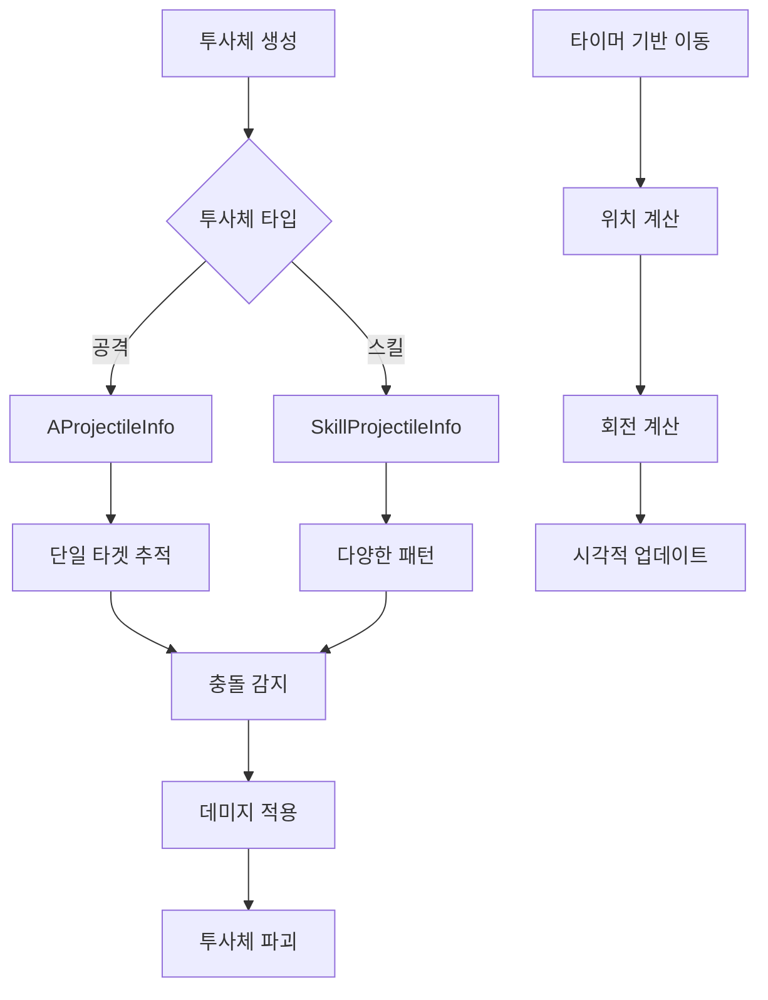

# 투사체 시스템

메토체스의 투사체 시스템은 원거리 공격과 스킬에서 발사되는 모든 투사체의 물리적 이동, 충돌 감지, 시각적 효과를 담당하는 핵심 시스템입니다. 실시간으로 타겟을 추적하고 정교한 궤적 계산을 통해 자연스러운 전투 경험을 제공합니다.

## 시스템 개요

투사체 시스템은 두 가지 주요 타입으로 구분됩니다:
- **공격 투사체**: 기본 원거리 공격용
- **스킬 투사체**: 스킬 전용 특수 투사체



## 기본 공격 투사체

### AProjectileInfo 구조

모든 일반 공격 투사체의 기본이 되는 컴포넌트입니다.

**핵심 프로퍼티:**
- `onwerUnit`: 투사체 발사 유닛
- `targetUnit`: 추적할 대상 유닛
- `projectile_speed`: 투사체 이동 속도
- `moveVec`: 현재 이동 방향 벡터
- `setPos`: 현재 위치 좌표

**생명주기 관리:**
- `Shots`: 투사체 활성 상태
- `destroyTime`: 생존 시간 (최대 10초)
- `ShotTimer`: 이동 처리용 타이머

### 투사체 초기화

```lua
@ExecSpace("Server")
method void SetProjectile(Entity onwerUnit, Entity targetUnit, number speed, number scale, number vecY, number targetY)
```

**초기화 과정:**
1. 투사체 활성화 및 기본 설정
2. 속도와 스케일 적용
3. 시작 위치 설정
4. FlipX 방향 계산
5. 타이머 기반 이동 시작

### 실시간 추적 시스템

투사체는 0.01초마다 타겟의 위치를 확인하며 추적합니다:

```lua
local function ShotsFnc()
    -- 생존 시간 체크
    self.destroyTime += interval
    if self.destroyTime >= 10 then
        self:Destroy()
        return
    end
    
    -- 타겟 유효성 검사
    if isvalid(self.targetUnit) and self.targetUnit.UnitStatus.HP > 0 then
        -- 충돌 감지
        if Vector2.Distance(targetVec2, selfVec2) <= 0.5 then
            -- 데미지 적용
            self.onwerUnit.UnitInfo.AttackComponent:SetDamage(self.targetUnit)
            self:Destroy()
        else
            -- 이동 방향 계산 및 위치 업데이트
        end
    end
end
```

### 물리적 이동 계산

**방향 벡터 계산:**
```lua
self.moveVec = Vector2.Normalize(targetVec2 - selfVec2)
```

**회전 각도 계산:**
```lua
local zRotation = 0
if self.moveVec.y >= 0 then
    zRotation = Vector2.Angle(Vector2(1,0), self.moveVec)
else
    zRotation = -Vector2.Angle(Vector2(1,0), self.moveVec)
end
```

**위치 업데이트:**
```lua
local posX = selfVec2.x + (self.moveVec.x * self.projectile_speed * interval * 20)
local posY = selfVec2.y + (self.moveVec.y * self.projectile_speed * interval * 20)
```

## 스킬 투사체 시스템

### SkillProjectileInfo 구조

스킬 전용 투사체로 더 복잡한 동작 패턴을 지원합니다.

**주요 차이점:**
- 스킬 데미지 적용 방식
- 다양한 특수 효과
- 복잡한 충돌 감지

**데미지 적용:**
```lua
if Vector2.Distance(targetVec2, selfVec2) <= 0.5 then
    self.onwerUnit.UnitInfo.SkillComponent:SetSkillDamage(self.targetUnit)
    self:Destroy()
end
```

### 특수 투사체 패턴

#### 관통형 투사체 (C20011_Archer)

직선으로 이동하며 경로상의 모든 적을 공격하는 투사체:

```lua
-- 모든 상대 체크
local checkEnemy = _BTLogic_New:getEntities(self.Enemies, "AttackAble")
for _, enemy in pairs(checkEnemy) do
    local dis = Vector2.Distance(enemyVec2, selfVec2)
    if dis <= 0.5 and not isvalid(self.AttackedEnemy[enemy]) then
        self.AttackedEnemy[enemy] = true  -- 중복 공격 방지
        self.onwerUnit.UnitInfo.SkillComponent:SetSkillDamage(enemy)
    end
end
```

**특징:**
- 한 번 공격한 적은 `AttackedEnemy` 테이블로 관리
- 중복 피해 방지 시스템
- 직선 이동 패턴

#### 다중 타겟 투사체

여러 적을 동시에 추적하거나 범위 피해를 주는 투사체:

- **범위 검색**: `_BTLogic_New:getEntities()` 활용
- **거리 기반 감지**: 일정 반경 내 모든 적 대상
- **연쇄 효과**: 첫 번째 타겟 적중 후 주변 적들에게 확산

## 충돌 감지 시스템

### 기본 충돌 감지

**거리 기반 감지:**
- 임계값: 0.5 유닛 거리
- `Vector2.Distance()` 함수 활용
- 실시간 위치 비교

### 고급 충돌 감지

**다중 타겟 감지:**
```lua
for _, enemy in pairs(checkEnemy) do
    local dis = Vector2.Distance(enemyVec2, selfVec2)
    if dis <= detectionRadius then
        -- 충돌 처리
    end
end
```

**상태 기반 필터링:**
- 생존 상태 확인: `HP > 0`
- 활성 상태 확인: `enemy.Enable`
- 공격 가능 상태: `"AttackAble"` 엔티티

## 시각적 효과 시스템

### 회전과 방향

**FlipX 처리:**
투사체가 발사 방향에 따라 좌우 반전됩니다.

**회전 계산:**
투사체는 이동 방향에 따라 실시간으로 회전합니다:
- X축 기준 각도 계산
- Y축 방향에 따른 음/양 판정
- 자연스러운 궤적 표현

### 크기 조정

```lua
self.Entity.TransformComponent.Scale = Vector3(scale/2, scale/2, scale/2)
```

투사체 크기는 발사 시 설정되며, 시각적 일관성을 위해 동일한 비율로 조정됩니다.

## 성능 최적화

### 타이머 관리

**효율적인 업데이트:**
- 0.01초 간격으로 위치 업데이트
- 필요 없어진 타이머는 즉시 해제
- `_TimerService:ClearTimer()` 적극 활용

### 메모리 관리

**투사체 생명주기:**
1. **생성**: `SetProjectile()` 호출
2. **활성화**: `SetEnable(true)` 상태
3. **이동**: 타이머 기반 지속 업데이트
4. **충돌**: 데미지 적용
5. **파괴**: `Destroy()` 호출하여 정리

**자동 정리 시스템:**
```lua
if self.destroyTime >= 10 then
    _TimerService:ClearTimer(self.ShotTimer)
    self:Destroy()
    return
end
```

### 예외 상황 처리

**타겟 무효화:**
- 타겟이 죽었을 때
- 전투가 종료되었을 때
- 타겟이 비활성화되었을 때

**투사체 무효화:**
- 최대 생존 시간 초과
- 소유자 유닛 삭제
- 맵 경계 초과

## 전투 시스템과의 연동

### 속도 배율 적용

```lua
self.projectile_speed = speed * _BTLogic_New.ASpeedValue
```

투사체 속도는 전투 시스템의 속도 배율을 반영하여 조정됩니다.

### 데미지 시스템 연동

**공격 투사체:**
- `AttackComponent:SetDamage()` 호출
- 일반 공격 데미지 계산 적용

**스킬 투사체:**
- `SkillComponent:SetSkillDamage()` 호출
- 스킬별 특수 데미지 계산 적용

## Code References

- `RootDesk/MyDesk/InGame/Unit/00_ProjectileComponent/AProjectileInfo.mlua :: SetProjectile()` — 기본 투사체 초기화
- `RootDesk/MyDesk/InGame/Unit/00_ProjectileComponent/SkillProjectile/SkillProjectileInfo.mlua :: SetProjectile()` — 스킬 투사체 초기화
- `RootDesk/MyDesk/InGame/Unit/00_ProjectileComponent/SkillProjectile/C20011_Archer_SkillprojectileInfo.mlua :: ShotsFnc()` — 관통 투사체 구현
- `RootDesk/MyDesk/InGame/Unit/00_ProjectileComponent/SkillProjectile/SkillShotCheckComponent.mlua :: SetOwnerID()` — 스킬 투사체 소유자 설정
- `RootDesk/MyDesk/InGame/Unit/00_ProjectileComponent/AttackProjectileSample.model` — 공격 투사체 모델
- `RootDesk/MyDesk/InGame/Unit/00_ProjectileComponent/SkillProjectileSample.model` — 스킬 투사체 모델
