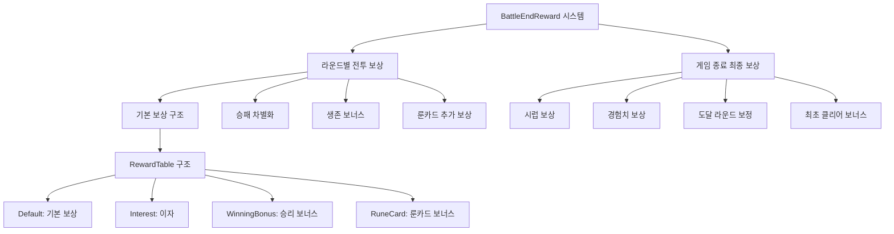
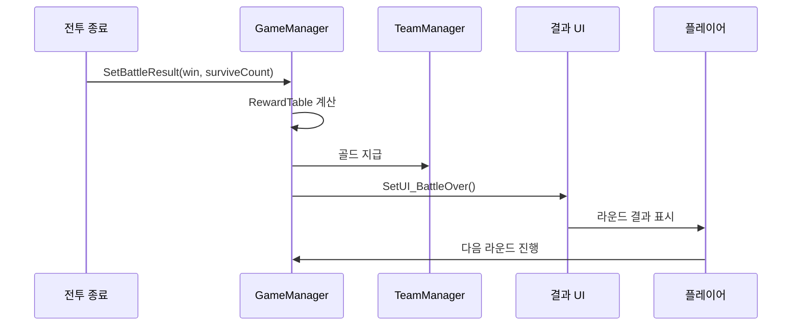
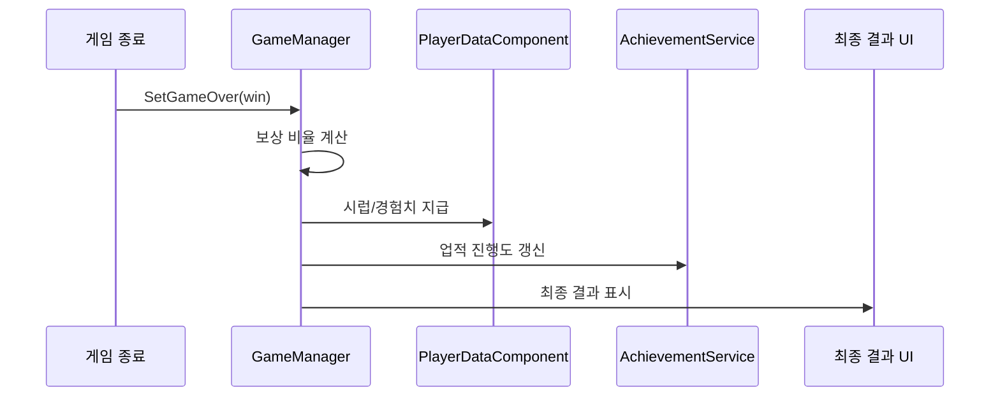

# 인게임 시스템 - 전투 시스템 - 전투 종료 보상

## 개요

BattleEndReward 시스템은 메토체스에서 **전투 결과에 따른 보상을 공정하고 체계적으로 지급**하는 핵심 경제 시스템입니다. **라운드별 전투 보상**과 **게임 종료 시 최종 보상**으로 이원화되어 있으며, **승리/패배 상황**, **생존 유닛 수**, **룬카드 효과**, **게임 진행도** 등 다양한 요소를 종합적으로 고려하여 **차별화된 보상**을 제공합니다.

이 시스템의 핵심 설계 철학은 **성과 기반 보상**과 **지속적인 동기부여**입니다. 단순히 승부 결과만이 아닌, 플레이어의 전략적 선택과 게임 진행도에 따라 **세밀하게 차등화된 보상**을 통해 다양한 플레이 스타일을 장려하고 재도전 의욕을 높입니다.

## 시스템 아키텍처

### 전체 구조도



## 핵심 구성 요소

### 1. 라운드별 전투 보상 시스템

각 라운드 종료 시 **4가지 카테고리**로 구분된 **RewardTable**을 통해 골드 보상을 지급합니다.

#### 보상 구조 (RewardTable)

```lua
-- 승리 시 기본 보상 테이블
self.RewardTable = {
    ["Default"] = userPControl.Golds_baseReward,           -- 기본 보상 (고정)
    ["Interest"] = math.min(                               -- 이자 보상 (소지금 기반)
        math.max(0, userPControl.Golds_MaxInterestReward),
        math.floor(teamManager.Golds/5)
    ),
    ["WinningBonus"] = 0,                                 -- 생존 유닛 보너스
    ["RuneCard"] = userPControl.Golds_BattleReward_Win +  -- 룬카드 보너스
                   userPControl.Golds_BattleReward
}
```

#### 승리 vs 패배 차별화

##### 승리 시
```lua
if win then
    -- 승리 보너스 포함한 전체 보상
    self.RewardTable["RuneCard"] = userPControl.Golds_BattleReward_Win + 
                                   userPControl.Golds_BattleReward
    
    -- 코치 전적 기록
    coachManager:SetBattleResultRUID(true, user.OwnerId)
    
    -- 전투 통계 기록
    user.TeamBattleStatistics:SetProperty("SetRoundResult", "W")
    
    -- 승리 이벤트 발생
    user:SendEvent(BattleWin(surviveUnitCount))
end
```

##### 패배 시
```lua
if not win then
    -- 패배 시 룬카드 보너스 감소
    self.RewardTable["RuneCard"] = userPControl.Golds_BattleReward_Lose + 
                                   userPControl.Golds_BattleReward
    
    -- 코치 패배 기록
    coachManager:SetBattleResultRUID(false, user.OwnerId)
end
```

### 2. 생존 유닛 기반 보너스 시스템

**승리 시에만** 필드에 생존한 유닛 수에 비례하여 추가 골드를 지급합니다.

#### 생존 유닛 계산
```lua
local survivorBonusCount = 0
local unitsParent = _UnitSetLogic_New.UnitsParentEntity[self.Entity.OwnerId]

for _, unit in pairs(unitsParent.Children) do
    if unit.UnitInfo.TeamType == "User" 
    and unit.UnitInfo.use
    and unit.UnitStatus.HP > 0
    and not unit.UnitInfo.IsOnetimeUnit    -- 일회성 유닛 제외
    and unit.UnitInfo:IsOnFieldUnit()       -- 필드 배치 유닛만
    and unit.UnitInfo.IsResellable then     -- 재판매 가능 유닛만
        survivorBonusCount += 1
    end
end

-- 생존 유닛 수 = 승리 보너스 골드
self.RewardTable["WinningBonus"] = survivorBonusCount
```

### 3. 룬카드 특수 보상 시스템

특정 룬카드 장착 시 **조건부 추가 보상**을 지급합니다.

#### 라나(RC20036) 룬카드 보상
```lua
if survivorBonusCount >= 3 then
    -- 아군 유닛 3마리 이상 생존 시 라나 룬카드 효과
    local checkCount = teamManager:GetRuneCardCount("RC20036")
    if checkCount > 0 then
        self.RewardTable["RuneCard"] += 10 * checkCount
        
        -- 결과 화면 연출용 데이터 저장
        _GeneralDirectorLogic:SetResultCoinTable(true, "RC20036", 
                                               10 * checkCount, user.PlayerComponent.UserId)
    end
    
    -- 팬텀(RC40003) + 라나 조합 효과
    if teamManager:GetRuneCardCount("RC40003") > 0 then
        local runeCardParent = self.Entity:GetChildByName("RuneCardParent")
        for i=1, 5 do
            local playerRune = runeCardParent:GetChildByName(string.format("PlayerRune%d", i))
            if isvalid(playerRune.RC40003) and playerRune.RC40003.CopyRuneID == "RC20036" then
                self.RewardTable["RuneCard"] += 10
                
                -- 팬텀으로 복사된 라나 효과 연출
                _GeneralDirectorLogic:SetResultCoinTable(true, "RC40003", 10, 
                                                       user.PlayerComponent.UserId)
            end
        end
    end
end
```

### 4. 페널티 및 특수 효과

#### PEN10006 페널티 효과
```lua
-- "더 이상 이자를 받지 못하고, 대신 생존한 아군 수의 비례한 보상이 100% 증가"
if userPControl.Penalty_SetCheck["PEN10006"] > 0 then
    self.RewardTable["WinningBonus"] *= 2  -- 생존 보너스 2배
    self.RewardTable["Interest"] = 0        -- 이자 없음
end
```

### 5. 게임 종료 시 최종 보상 시스템

게임 완전 종료 시(클리어 또는 탈락) **시럽**과 **경험치** 보상을 지급합니다.

#### 보상 비율 계산 시스템

##### 승리 시 (완전 클리어)
```lua
local rewardRate = 1  -- 100% 보상
```

##### 패배 시 (도달 라운드 기반)
```lua
if win == false then
    if self.Stage < 4 then
        rewardRate = 0  -- Stage 4 미만 시 보상 없음
    else
        -- CSV 데이터 기반 보상 비율 조회
        local rewardRateTable = _DataService:GetTable("GameRewardRateByClearRound")
        local row = rewardRateTable:FindRow("Round", string.format("%d-%d", self.Stage, self.Round))
        rewardRate = tonumber(row:GetItem("RewardRate"))
    end
end
```

#### 시럽(Syrup) 보상 계산
```lua
-- 기본 시럽 보상 (200개 고정)
local syrup_default = math.floor(200 * rewardRate)

local syrup_extra = 0
-- 최초 클리어 시 240% 추가 보상
if isInitClear == true then
    syrup_extra = syrup_default * 2.4  -- 기본의 2.4배 추가
end

-- 최종 시럽 지급
playerDataCompo:AddSyrup("Syrup", syrup_default + syrup_extra, "PlayGame")
```

#### 경험치 보상 계산
```lua
-- 모드별/난이도별 기본 경험치 조회
local exp_default = _PlayerLevelLogic:GetRewardEXPAmount(self.ModeType, self.ModeLevel) * rewardRate

local exp_extra = 0
-- 최초 클리어 보너스
if isInitClear == true then
    exp_extra = exp_default * 2.4
end

-- 경험치 지급 및 레벨업 처리
local expInfo = {
    ["BeforeLevel"] = playerDataCompo.Level,
    -- ... 레벨업 관련 정보
}
```

### 6. 모드별/난이도별 경험치 시스템

PlayerLevelLogic을 통해 **게임 모드**와 **난이도**에 따른 **차등 경험치**를 지급합니다.

#### 경험치 계산 로직
```lua
@ExecSpace("ServerOnly")
method integer GetRewardEXPAmount(string mode, integer level)
    -- 모드명에서 메인 타입 추출 (예: "Single_Easy" → "Single")
    mode = _UtilLogic:Split(mode, "_")[1]
    
    -- CSV 데이터에서 모드별/레벨별 경험치 조회
    local expTable = _DataService:GetTable("EXPRewardByModeNLevel")
    local row = expTable:FindRow("Level", string.format("%d", level))
    local exp = tonumber(row:GetItem(mode))
    
    return exp
end
```

### 7. 업적 및 통계 연동

전투 종료 시 **다양한 업적**과 **전투 통계**를 동시에 처리합니다.

#### 업적 진행도 갱신
```lua
-- 전투 종료 후 업적 처리
_AchievementService:BattleEnd(win, self.ModeType, self.ModeLevel, 
                             self.Stage, self.Round, self.Round8_3Num, user)

-- 카테고리별 업적 분류 예시
-- - 올스타리그 졸업생
-- - 싱글 모드 전용 업적
-- - 랭크 모드 전용 업적  
-- - 전투의 달인
-- - 룬카드 관련 업적
```

#### 전투 통계 기록
```lua
-- 생존 유닛 통계 기록
user.TeamBattleStatistics:SetRankCountProperty("CT10004", survivorBonusCount, "Add")

-- 라운드 결과 기록
user.TeamBattleStatistics:SetProperty("SetRoundResult", "W") -- 승리 시
```

## 보상 지급 플로우

### 라운드 종료 시 플로우


### 게임 종료 시 플로우


## 데이터 테이블 연동

### 주요 CSV 데이터
- `GameRewardRateByClearRound`: 도달 라운드별 보상 비율
- `EXPRewardByModeNLevel`: 모드별/난이도별 경험치 보상표
- 룬카드 관련 보상 데이터

### TM_PropertyControl 설정값
```lua
-- 기본 보상 관련
property number Golds_baseReward              -- 기본 골드 보상
property number Golds_MaxInterestReward       -- 최대 이자 보상
property number Golds_BattleReward_Win        -- 승리 시 룬카드 보너스
property number Golds_BattleReward_Lose       -- 패배 시 룬카드 보너스
property number Golds_BattleReward            -- 공통 룬카드 보너스
```

## 성능 최적화 및 확장성

### 1. 보상 계산 최적화
- **사전 계산된 테이블 활용**: CSV 데이터 기반 룩업 테이블
- **조건부 계산**: 필요한 경우에만 복잡한 로직 실행
- **배치 처리**: 여러 보상을 한 번에 지급

### 2. 확장 가능성
- **모듈형 보상 구조**: 새로운 보상 타입 쉽게 추가
- **룬카드 확장**: 새로운 룬카드 보상 효과 시스템적 지원
- **다양한 게임 모드**: 모드별 차등 보상 체계

### 3. 밸런싱 유연성
- **CSV 기반 수치 조정**: 코드 수정 없이 밸런스 패치 가능
- **A/B 테스트 지원**: 다양한 보상 구조 실험 가능

## 관련 파일

### 코드 참조
- `RootDesk/MyDesk/InGame/Managers/GameManager.mlua :: SetBattleResult()` — 라운드별 전투 보상 계산 및 지급
- `RootDesk/MyDesk/InGame/Managers/GameManager.mlua :: SetGameOver()` — 게임 종료 시 최종 보상 처리
- `RootDesk/MyDesk/Player/PlayerLevelLogic.mlua :: GetRewardEXPAmount()` — 모드별/난이도별 경험치 계산
- `RootDesk/MyDesk/InGame/Managers/TM_PropertyControl.mlua` — 보상 관련 기본 설정값 관리
- `RootDesk/MyDesk/DataStorage/PlayerDataComponent.mlua :: AddSyrup()` — 시럽 보상 지급
- `RootDesk/MyDesk/OutGame/Achievement/AchievementService.mlua :: BattleEnd()` — 전투 종료 후 업적 처리

### 데이터 연동
- `GameRewardRateByClearRound` CSV — 도달 라운드별 보상 비율 테이블
- `EXPRewardByModeNLevel` CSV — 모드별/난이도별 경험치 보상표
- 각종 룬카드 정의 파일들

### 연동 시스템
- `TeamManager.mlua` — 골드 지급 및 룬카드 개수 확인
- `CoachManager.mlua` — 코치 전적 기록
- `TeamBattleStatistics.mlua` — 전투 통계 기록
- `AchievementManager.mlua` — 업적 진행도 관리
- `GeneralDirectorLogic.mlua` — 결과 화면 연출

이러한 종합적인 설계로 BattleEndReward 시스템은 플레이어의 성과를 공정하게 평가하고 적절한 보상을 제공함으로써, 지속적인 게임 참여 동기를 부여하고 다양한 전략적 선택을 장려합니다.
