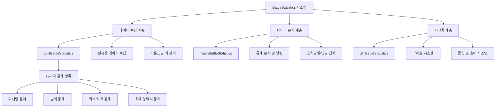
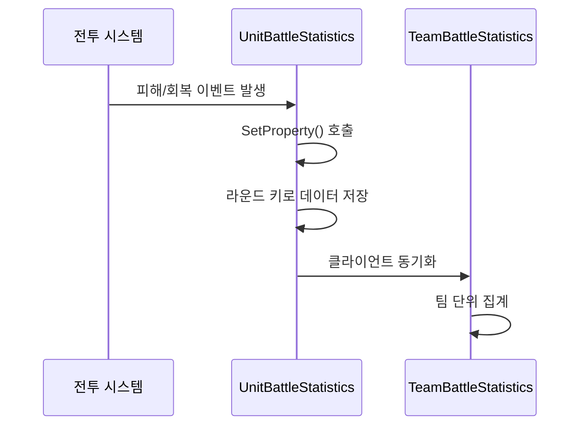
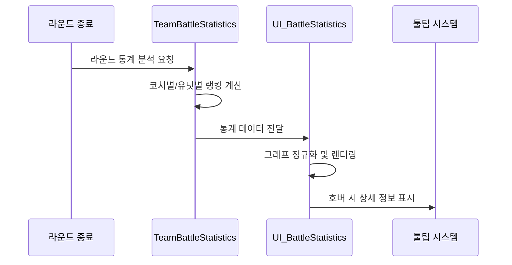

# 인게임 시스템 - 전투 시스템 - 전투 통계

## 개요

BattleStatistics 시스템은 메토체스에서 **전투 중 발생하는 모든 수치를 실시간으로 수집**하고, **상세하게 분석**하여 플레이어에게 **직관적인 시각적 피드백**을 제공하는 종합 전투 데이터 관리 시스템입니다. **유닛별**, **팀별**, **라운드별** 통계를 체계적으로 관리하며, **그래프와 툴팁**을 통해 복잡한 전투 데이터를 쉽게 이해할 수 있도록 시각화합니다.

이 시스템의 핵심 가치는 **전략적 인사이트 제공**과 **성과 추적**입니다. 플레이어는 자신의 전술이 실제로 얼마나 효과적이었는지 구체적인 수치로 확인할 수 있으며, 이를 바탕으로 다음 라운드의 전략을 개선할 수 있습니다.

## 시스템 아키텍처

### 전체 구조도



## 핵심 구성 요소

### 1. 데이터 수집 시스템 (UnitBattleStatistics)

각 유닛의 **모든 전투 행동을 실시간으로 추적**하며, **라운드별로 세분화**하여 저장합니다.

#### 핵심 통계 항목 (19가지)

##### 피해량 관련 통계
```lua
-- 가한 피해량 (3종류)
property SyncTable<string, number> PhysicalDamageDealt    -- 물리 피해
property SyncTable<string, number> MagicalDamageDealt     -- 마법 피해  
property SyncTable<string, number> TrueDamageDealt        -- 고정 피해

-- 받은 피해량 (3종류)
property SyncTable<string, number> PhysicalDamageTaken    -- 받은 물리 피해
property SyncTable<string, number> MagicalDamageTaken     -- 받은 마법 피해
property SyncTable<string, number> TrueDamageTaken        -- 받은 고정 피해

-- 막은 피해량 (3종류)
property SyncTable<string, number> PhysicalDamageAbsorbed -- 물리 피해 흡수
property SyncTable<string, number> MagicalDamageAbsorbed  -- 마법 피해 흡수
property SyncTable<string, number> TrueDamageAbsorbed     -- 고정 피해 흡수
```

##### 회복 및 지원 통계
```lua
-- 자가 회복
property SyncTable<string, number> HPAmountGainedByHealing         -- 치유로 회복
property SyncTable<string, number> HPAmountGainedByBloodAbsorption -- 흡혈로 회복
property SyncTable<string, number> ShieldAmountGained              -- 보호막 획득

-- 아군 지원
property SyncTable<string, number> HPAmountProvidedToHealing -- 아군 치유량
property SyncTable<string, number> ShieldAmountProvided     -- 아군 보호막 제공
```

##### 능력치 및 행동 통계
```lua
-- 전투 행동
property SyncTable<string, number> SkillCountUsed -- 스킬 사용 횟수
property SyncTable<string, number> DeadTime       -- 사망 시간

-- 최대 능력치 기록
property SyncTable<string, number> MaximumHP                        -- 최대 체력
property SyncTable<string, number> MaximumPhysicalAttack           -- 최대 물리공격력
property SyncTable<string, number> MaximumMagicalAttack            -- 최대 마법공격력
property SyncTable<string, number> MaximumCriticalPercent          -- 최대 치명타율
property SyncTable<string, number> MaximumBloodAbsorptionPercent   -- 최대 흡혈율
```

#### 라운드별 키 관리
전투 통계는 **Stage-Round 형태의 키**로 관리되며, 특별히 **8-3 반복 플레이**를 지원합니다.

```lua
-- 기본 키 생성
local setKey = math.floor(gameManager.Stage) .. "-" .. math.floor(gameManager.Round)

-- 8-3 반복 플레이 특별 처리
if setKey == "8-3" then
    setKey = string.format("%s-%d", setKey, gameManager.Round8_3Num)
    -- 예: "8-3-1", "8-3-2", "8-3-3" 등으로 구분
end
```

#### 실시간 데이터 기록
```lua
-- SetProperty 메소드를 통한 통계 누적
method void SetProperty(string propertyName, number amount, boolean sync)
    if propertyName == "PhysicalDamageDealt" then
        if isvalid(self.PhysicalDamageDealt[setKey]) then
            self.PhysicalDamageDealt[setKey] += amount  -- 누적 합계
        else
            self.PhysicalDamageDealt[setKey] = amount   -- 초기값 설정
        end
    end
    
    -- 클라이언트 동기화
    if sync then
        self:SetPropertyToClient(propertyName, amount, unitInfo.OwnerId)
    end
end
```

### 2. 데이터 분석 시스템 (TeamBattleStatistics)

**팀 단위**와 **코치별** 통계를 분석하여 **랭킹**과 **성취도**를 계산합니다.

#### 통계 분석 카테고리

##### 코치(캐릭터)별 통계 추적
```lua
-- 코치별 성과 집계 ("CT" 접두사)
local countTable = {
    ["CT10002"] = 0,  -- 단일 유닛 최고 가해량
    ["CT10003"] = 0,  -- 단일 유닛 최고 피해량  
    ["CT10011"] = 0,  -- 단일 유닛 최고 회복량
    ["CT10015"] = 0   -- 단일 유닛 최고 스킬 사용 횟수
}

-- 최고 기록 계산
for _, unit in pairs(units.Children) do
    local unitBStat = unit.UnitBattleStatistics
    if unitInfo.use and unitInfo.TeamType == "User" then
        -- 총 가해량 계산
        local damageDealt = unitBStat.PhysicalDamageDealt[checkKey] + 
                           unitBStat.MagicalDamageDealt[checkKey] + 
                           unitBStat.TrueDamageDealt[checkKey]
        countTable["CT10002"] = math.max(countTable["CT10002"], damageDealt)
    end
end
```

##### 라운드별 성과 비교
```lua
-- 라운드 성과 랭킹 시스템
local keyTable = {"CT10002", "CT10003", "CT10011", "CT10015"}

for _, key in pairs(keyTable) do
    if isvalid(self.SetRankAmount[key]) then
        -- 이전 기록과 비교하여 랭킹 갱신
        if self.SetRankAmount[key] < countTable[key] then
            self.SetRankAmount[key] = countTable[key]
        end
    end
end
```

### 3. 시각화 시스템 (UI_BattleStatistics)

복잡한 전투 데이터를 **직관적인 그래프**와 **상세한 툴팁**으로 표현합니다.

#### UI 구조 및 카테고리

##### 2단계 카테고리 시스템
```lua
-- 1차 카테고리
property integer Category_1st = 1  -- 1:누적 통계, 2:최대 능력치

-- 2차 카테고리 (1차가 1일 때)
-- 1:가한 피해, 2:받은 피해, 3:막은 피해, 4:회복, 5:치유, 6:스킬 사용
property integer Category_2nd = 1
```

##### 통계 표시 테이블
```lua
-- 아군/적군 분리 저장
property table UnitCombatStats = {}    -- 아군 유닛 통계
property table EnemyCombatStats = {}   -- 적군 유닛 통계

-- 그래프 렌더링용 테이블
property table Graphs = {}       -- 아군 그래프
property table EnemyGraphs = {}  -- 적군 그래프
```

#### 그래프 시각화 시스템

##### 통계값 정규화 및 표시
```lua
-- 최대값 기준 정규화
local maxValue = 0
for i=1, #self.UnitCombatStats do
    maxValue = math.max(maxValue, self.UnitCombatStats[i][statCategory])
end
self.MaxSelectedStat = maxValue

-- 그래프 높이 계산 (비율 기반)
local graphHeight = (statValue / maxValue) * maxGraphHeight
```

##### 수치 포맷팅
```lua
-- 통계 타입별 적절한 형식 적용
method string StatValueFormatter(number valueInput, string category)
    if category == "MaximumCriticalPercent" or 
       category == "MaximumBloodAbsorptionPercent" or 
       category == "MaximumAttackSpeed" then
        return string.format("%.2f", valueInput)  -- 소수점 2자리
    else
        return string.format("%d", valueInput)    -- 정수
    end
end
```

### 4. 툴팁 및 호버 시스템

**그래프 위에 마우스를 올릴 때** 상세 정보를 표시하는 **스마트 툴팁** 시스템입니다.

#### 그래프 툴팁 (UI_BattleStatistics_GraphTooltipActivator)

```lua
@EventSender("Self")
handler HandleUITouchEnterEvent(UITouchEnterEvent event)
    -- 슬롯 인덱스 파싱
    local slotIdx = tonumber(string.sub(self.Entity.Parent.Name, 6, -1))
    
    -- 툴팁 내용 표시
    _UI_BattleStatistics:ShowTooltip_CharStatistics(slotIdx, self.IsEnemyUI)
end
```

#### 동적 툴팁 위치 조정 (UI_Tooltip_BattleStatisticsGraph)

```lua
method void OnUpdate(number delta)
    local mousePos = _InputService:GetCursorPosition()
    local uiPos = _Util:ScreenPostoUIPos(mousePos)
    
    -- 화면 경계 체크 및 위치 조정
    if (anchoredPos.x + rectSize.x + 10) > 1920 then
        anchoredPos.x = 1920 - rectSize.x - 10  -- 우측 경계 보정
    elseif anchoredPos.x < 10 then
        anchoredPos.x = 10                       -- 좌측 경계 보정
    end
    
    self.Entity.UITransformComponent.anchoredPosition = anchoredPos
end
```

#### 카테고리별 툴팁 내용

```lua
method void ShowTooltip_CharStatistics(integer slotIndex, boolean isEnemy)
    local itemName, itemValue
    
    if self.Category_1st == 1 then  -- 누적 통계
        if self.Category_2nd == 1 then  -- 가한 피해
            itemName = {"물리 피해", "마법 피해", "고정 피해"}
            itemValue = {"PhysicalDamageDealt", "MagicalDamageDealt", "TrueDamageDealt"}
        elseif self.Category_2nd == 2 then  -- 받은 피해
            itemName = {"받은 물리 피해", "받은 마법 피해", "받은 고정 피해"}  
            itemValue = {"PhysicalDamageTaken", "MagicalDamageTaken", "TrueDamageTaken"}
        -- ... 기타 카테고리들
        end
    end
    
    -- 툴팁 UI에 정보 표시
    for i=1, 3 do
        if itemName[i] ~= nil then
            local formattedValue = self:StatValueFormatter(
                statTable[characterNum][itemValue[i]], itemValue[i]
            )
            ui_graphText.TextComponent.Text = itemName[i].." "..formattedValue
        end
    end
end
```

## 데이터 플로우 및 생명주기

### 1. 데이터 수집 단계


### 2. 분석 및 시각화 단계


### 3. 8-3 반복 플레이 특별 처리

메토체스는 **Stage 8-3에서 반복 플레이**를 지원하며, 각 플레이는 독립적으로 통계가 기록됩니다.

```lua
-- 서버 측 키 생성
local setKey = math.floor(gameManager.Stage) .. "-" .. math.floor(gameManager.Round)
if setKey == "8-3" then
    setKey = string.format("%s-%d", setKey, gameManager.Round8_3Num)
end

-- 클라이언트 측 키 복원
local setKey = roundKey
if setKey == "8-3" then
    setKey = "8-3-1"
    for i = 1, 5 do
        local checkKey = string.format("%s-%d", roundKey, i)
        if isvalid(self.SetCharID[checkKey]) then
            setKey = checkKey
        else
            break
        end
    end
end
```

## 성능 최적화 및 확장성

### 1. 메모리 효율성
- **SyncTable 활용**: 서버-클라이언트 자동 동기화로 중복 저장 방지
- **라운드별 세분화**: 필요한 데이터만 선택적 로드
- **정적 테이블 재사용**: UI 렌더링용 테이블 재활용

### 2. 렌더링 최적화
- **지연 로딩**: 통계 창 열릴 때만 데이터 처리
- **정규화 캐싱**: 최대값 기준 비율 계산 결과 저장
- **조건부 렌더링**: 활성 카테고리만 그래프 업데이트

### 3. 확장 가능성
- **모듈형 설계**: 새로운 통계 항목 쉽게 추가 가능
- **카테고리 확장**: 2단계 카테고리로 무한 확장 지원
- **다국어 지원**: LocalizationService 통합

## 관련 파일

### 코드 참조
- `RootDesk/MyDesk/InGame/Unit/01_UnitComponent/UnitBattleStatistics.mlua :: SetProperty()` — 실시간 통계 데이터 수집
- `RootDesk/MyDesk/InGame/Managers/TeamBattleStatistics.mlua` — 팀 단위 통계 분석 및 랭킹
- `RootDesk/MyDesk/InGame/BattleStatistics/UI_BattleStatistics.mlua :: Initialize()` — 통계 UI 초기화 및 그래프 렌더링
- `RootDesk/MyDesk/InGame/BattleStatistics/UI_BattleStatistics.mlua :: ShowTooltip_CharStatistics()` — 툴팁 내용 생성 및 표시
- `RootDesk/MyDesk/InGame/BattleStatistics/UI_BattleStatistics_GraphTooltipActivator.mlua` — 그래프 호버 이벤트 처리
- `RootDesk/MyDesk/InGame/BattleStatistics/UI_Tooltip_BattleStatisticsGraph.mlua :: OnUpdate()` — 동적 툴팁 위치 조정

### UI 파일
- `ui/BattleStatGroup` — 전투 통계 메인 UI 그룹
- 각종 툴팁 UI 엔티티들

### 연동 시스템
- `GameManager.mlua` — 라운드 진행 상태 제공
- `UnitInfo.mlua` — 유닛 기본 정보 연계
- `LocalizationService` — 다국어 텍스트 지원

이러한 종합적인 설계로 BattleStatistics 시스템은 플레이어에게 자신의 전투 성과를 명확히 파악할 수 있는 강력한 도구를 제공하며, 지속적인 전략 개선의 기반이 됩니다.
