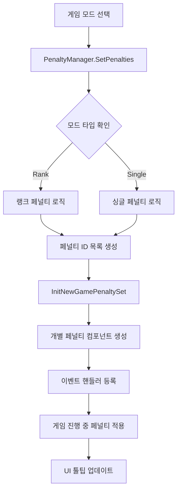

# 페널티 시스템 - 페널티 관리

## 개요
메토체스의 페널티 시스템은 게임 모드와 난이도에 따라 자동으로 적용되는 불리한 조건들을 관리하는 시스템입니다. 싱글 모드의 레벨 상승이나 랭크 모드의 티어 진행에 따라 점진적으로 더 어려운 조건들이 추가되어, 플레이어에게 지속적인 도전을 제공합니다.

## 핵심 컴포넌트 구조

### PenaltyManager
페널티의 선택과 초기화를 담당하는 메인 관리 컴포넌트입니다.

주요 기능:
- 모드와 레벨에 따른 페널티 자동 선택
- 페널티 컴포넌트의 동적 로딩
- UI 툴팁 표시용 페널티 정보 제공

핵심 프로퍼티:
- `SetPenaltiesID`: 설정된 페널티 ID 목록
- `PlayPenaltiesID`: 실제 플레이에 적용되는 페널티 ID 목록

핵심 메서드:
- `InitNewGamePenaltySet()`: 게임 시작 전 페널티 컴포넌트 로딩
- `SetPenalties(string modeType, number modeLevel)`: 모드별 페널티 설정
- `SetGameModeTooltip_PenaltyList()`: UI 툴팁 업데이트

### PenaltyComponent
모든 개별 페널티의 베이스 컴포넌트로, `ChallengeComponent`와 동일한 구조를 가집니다.

주요 특징:
- 게임 내 모든 주요 이벤트에 대한 핸들러 제공
- 페널티별 스택 정보 관리
- 문자열 타입 데이터 저장 시스템

## 페널티 적용 시스템

### 모드별 페널티 선택 로직

#### 랭크 모드
```lua
if modeType == "Rank" then
    for i = modeLevel, 1, -1 do
        local penaltyInfo = _ModeDataLogic.SetRankPenalties[i]
        if penaltyInfo == "-" then break end
        -- 페널티 추가
    end
```

#### 싱글 모드
```lua
for i = 1, modeLevel do
    local getPenaltyID = singleModeInfo:GetRow(i):GetItem("AddPenaltyID")
    if getPenaltyID ~= "-" then
        table.insert(self.SetPenaltiesID, getPenaltyID)
    end
```

### 페널티 컴포넌트 동적 로딩

각 페널티는 독립적인 엔티티에 컴포넌트로 부착됩니다:

1. `PenaltyListEntity` 하위에 `Penalty_1` ~ `Penalty_5` 엔티티 생성
2. 각 엔티티에 해당하는 페널티 ID의 컴포넌트 추가
3. 이벤트 자동 연결 및 핸들러 등록

## 페널티 분류 시스템

### 레벨별 분류
- **Level 0**: 기본 제약 (PEN00001~PEN00003)
- **Level 1**: 적 스탯 강화 (PEN10001~PEN10008)
- **Level 2**: 시스템 제약 및 추가 적 (PEN20001~PEN20016)
- **Level 3**: 비용 증가 및 슬롯 제한 (PEN30001~PEN30016)
- **Level 4**: 극한 제약 (PEN40001)

### 카테고리별 분류

#### 적 강화 페널티 (PEN1XXXX)
- 공격력/마력 증가 (PEN10001, PEN10002)
- 방어력 증가 (PEN10003, PEN10004)
- 공격속도/크리티컬 증가 (PEN10005, PEN10006)
- MP/체력 증가 (PEN10007, PEN10008)

#### 시스템 제약 페널티 (PEN2XXXX)
- 상점 제한 (PEN20001, PEN20002)
- 추가 적 소환 (PEN20003)
- 경제 시스템 변경 (PEN20005, PEN20006)
- 강제 룬카드 (PEN20007~PEN20016)

#### 비용/슬롯 제약 (PEN3XXXX)
- 상점 비용 증가 (PEN30001, PEN30002)
- 슬롯 수 제한 (PEN30003~PEN30016)

## 구현 패턴

### 적 스탯 강화 패턴
```lua
for _, unit in pairs(teamManager.EnemyUnits) do
    if unit.UnitAIWanderComponent.Enable then
        _StatusChangeLogic:GetBuff(unit, "Multi_PhysicalAttack", percent, -1)
    end
end
```

### 추가 적 소환 패턴
```lua
self.SetUnit = _UnitSetLogic_New:SpawnEnemyUnit(ownerId, "C00000", level, 0)
gameManager.EnemyCount += 1
```

### 아이템 장착 패턴
```lua
local itemTable = {"NI10017", "NI10021", "NI10026"}
for i = 1, count do
    _ItemSetLogic:EquipItemThroughItemID(unit, itemTable[i])
end
```

## UI 연동 시스템

### 툴팁 표시
페널티 정보는 두 곳에서 표시됩니다:
- 호버 팝업 (`/ui/HoverPopupGroup/TooltipUI_GameMode/Text_Penalties`)
- ESC 메뉴 (`/ui/ESCMenu/Panel_ESCMenu/TooltipUI_GameMode/Text_Penalties`)

### 실시간 업데이트
`OnSyncProperty` 이벤트를 통해 페널티 목록이 변경될 때마다 UI가 자동 업데이트됩니다.

## 시스템 흐름도



## Data References
- `RootDesk/MyDesk/InGame/Penalty/PenaltyInfo.csv` — 페널티 메타데이터 및 설명
- `_ModeDataLogic.SetRankPenalties` — 랭크 모드 페널티 설정
- `SingleModeInfo` 테이블 — 싱글 모드 페널티 설정

## Code References
- `RootDesk/MyDesk/InGame/Penalty/PenaltyManager.mlua :: InitNewGamePenaltySet()` — 페널티 컴포넌트 초기화
- `RootDesk/MyDesk/InGame/Penalty/PenaltyManager.mlua :: SetPenalties()` — 모드별 페널티 설정
- `RootDesk/MyDesk/InGame/Penalty/PenaltyManager.mlua :: SetGameModeTooltip_PenaltyList()` — UI 툴팁 업데이트
- `RootDesk/MyDesk/InGame/Penalty/PenaltyComponent.mlua :: OnBeginPlay()` — 이벤트 핸들러 등록
- `RootDesk/MyDesk/InGame/Penalty/PenaltyComponent.mlua :: SetPenaltyStackInfo()` — 스택 정보 동기화
- `RootDesk/MyDesk/InGame/Penalty/List/PEN10001.mlua :: StartBattleHandler()` — 적 스탯 강화 예시
- `RootDesk/MyDesk/InGame/Penalty/List/PEN20003.mlua :: SetBattleHandler()` — 추가 적 소환 예시

## 특징 및 장점

1. **점진적 난이도 조절**: 레벨/티어에 따른 자연스러운 난이도 상승
2. **모듈화된 구조**: 각 페널티가 독립적인 컴포넌트로 구현
3. **자동화된 적용**: 수동 설정 없이 모드에 따른 자동 페널티 적용
4. **UI 연동**: 실시간 페널티 정보 표시
5. **확장성**: 새로운 페널티 추가가 용이한 구조
6. **다양성**: 스탯 강화부터 시스템 제약까지 다양한 페널티 타입

이 시스템을 통해 플레이어는 점진적으로 증가하는 난이도를 경험하며, 각 레벨에서 새로운 전략적 도전에 직면하게 됩니다.
