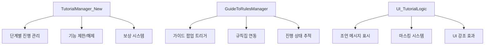
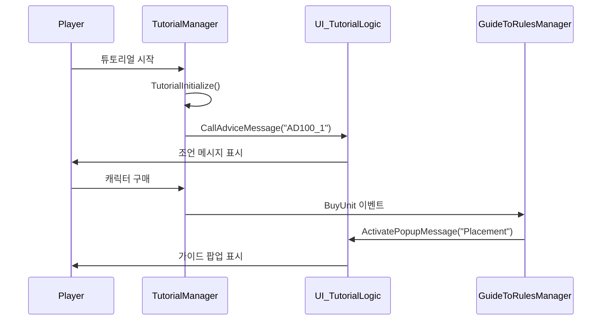

# 가이드 및 튜토리얼

## 개요

초보자를 위한 체계적인 튜토리얼 시스템과 실시간 가이드 팝업을 제공하는 교육 시스템입니다. 단계별 진행 관리, 기능 제한/해제, 조언 메시지를 통해 게임의 기본 플레이를 효과적으로 학습할 수 있도록 지원합니다.

## 핵심 컴포넌트 구조



## 1. 튜토리얼 관리자 (TutorialManager_New)

### 기본 구조

튜토리얼의 전반적인 진행을 관리하는 핵심 컴포넌트입니다.

```lua
@Component
script TutorialManager_New extends Component

    @TargetUserSync
    property boolean TutorialRewardReceived = false
    
    -- 기능 제한 플래그들
    property boolean AllowReroll = false
    property boolean AllowPurchaseChar = false
    property boolean AllowPurchaseEXP = false
    property boolean AllowSellCharacter = false
```

### 기능 제한/해제 시스템

튜토리얼 단계에 따라 게임 기능을 점진적으로 해제합니다:

```lua
method void SetAllowFeature(string allowAct, boolean TorF)
```

#### 제한 가능한 기능들

- **Char**: 캐릭터 구매
- **EXP**: 경험치 구매  
- **RuneCard**: 룬카드 구매
- **Item**: 아이템 구매
- **Reroll**: 상점 새로고침
- **SellChar**: 캐릭터 판매
- **CharLock**: 캐릭터 잠금
- **DragAllChar**: 모든 캐릭터 드래그

### 단계별 진행 처리

```lua
handler HandleRoundStart(RoundStart event)
```

라운드 시작 시마다 호출되어 튜토리얼 진행 상황을 체크합니다:

#### Stage 1 (기초 학습)

- **Round 1**: 첫 캐릭터 구매 학습
  ```lua
  self:ReRollTest("C10002","C10010","C10001","C10011","C10003")
  self:CallAdviceMessage("AD100_1")
  self:SetAllowFeature("Char1", true)
  ```

- **Round 2**: 특정 캐릭터 구매 유도
- **Round 3**: 다수 캐릭터 구매 학습

#### Stage 2 (응용 학습)

- **Round 1**: 고급 기능 학습 (캐릭터 판매 등)

### 이벤트 기반 조언 시스템

플레이어 행동에 따라 실시간으로 조언을 제공합니다:

```lua
handler HandleBuyUnit(BuyUnit event)
```

- 첫 캐릭터 구매 시: "AD101_1" 메시지
- 3개 이상 보유 시: "AD102_1" 메시지  
- 특정 캐릭터 구매 시: 해당 캐릭터별 메시지

## 2. 가이드-규칙 연결 관리자 (GuideToRulesManager)

### 가이드 팝업 시스템

```lua
@TargetUserSync
property SyncTable<string, boolean> WatchedGuideList
```

각 가이드 팝업의 표시 여부를 추적하여 중복 표시를 방지합니다.

### 행동 기반 가이드 트리거

특정 게임 행동 시 관련 가이드를 자동으로 표시합니다:

#### 주요 트리거 이벤트들

```lua
handler HandleBuyUnit(BuyUnit event)          -- 캐릭터 구매 시
handler HandleMergeUnit(MergeUnit event)      -- 캐릭터 합성 시  
handler HandleBuyItem(BuyItem event)          -- 아이템 구매 시
handler HandleRerollCharacterShop(RerollCharacterShop event)  -- 상점 새로고침 시
handler HandlePlaceUnit(PlaceUnit event)      -- 캐릭터 배치 시
```

각 이벤트는 해당하는 가이드 팝업을 표시합니다:

- **Placement**: 캐릭터 배치 가이드
- **Cost**: 비용 시스템 가이드
- **Upgrade**: 업그레이드 가이드
- **Item**: 아이템 시스템 가이드
- **Synergy**: 시너지 시스템 가이드

### 규칙집 연동

가이드 팝업에서 "자세히 보기" 버튼 클릭 시 관련 규칙 페이지로 이동:

```lua
handler HandleButtonClickEvent(ButtonClickEvent event)
    _DictionaryManager:OnOpenDictionary()
    _DictionaryManager:OnSelectCategory_1st(2)  -- 게임 규칙 탭
```

## 3. 튜토리얼 UI 시스템 (UI_TutorialLogic)

### 조언 메시지 표시

```lua
method void ActivateAdviceMessage(string adviceID)
```

캐릭터 안내와 함께 상세한 조언 메시지를 표시합니다:

#### 메시지 구성 요소

- **안내 캐릭터**: AdviceCharImageRUID로 캐릭터 이미지 표시
- **조언 텍스트**: 현지화된 안내 메시지
- **진행 버튼**: 다음 메시지로 이동 (MaxCount 체크)
- **마스킹**: 특정 UI 요소 강조

### 마스킹 시스템

튜토리얼 진행 중 특정 UI 요소만 강조하여 혼란을 방지합니다:

```lua
-- 마스크 타입별 처리
if overImageRUID == "927ddee89c2244649e5d7c1dad300a7b" then
    self.maskType = 1  -- 대기석
elseif overImageRUID == "b258f19fa36e4bfda88352cf9412a6e6" then
    self.maskType = 2  -- 전장
```

#### 마스킹 기능

- **대상 강조**: 클릭해야 할 UI 요소 하이라이트
- **클릭 차단**: 다른 UI 요소 클릭 방지 (BlockMaskClick)
- **위치 조정**: MaskSetPos 테이블로 마스크 위치 설정
- **오버레이 이미지**: 추가 시각적 효과

### 스킵 기능

튜토리얼 진행 중 스킵 버튼을 제공하여 사용자 편의성을 높입니다:

```lua
_UI_TutorialLogic:SetSkipButton(true, userID)
```

## 4. 데이터 관리 시스템

### 핵심 데이터 테이블

#### AdviceDataset
```lua
-- 조언 메시지 정보
AdviceID: "AD100_1", "AD101_1", ...
AdviceText: 현지화 키
AdviceCharImageRUID: 안내 캐릭터 이미지
MaxCount: 연속 메시지 개수
```

#### GuidePopupDataset  
```lua
-- 가이드 팝업 정보
GuidePopupID: "Placement", "Cost", "Upgrade", ...
Category: 규칙집 카테고리
Text: 가이드 내용 현지화 키
```

#### MaskSetPos
```lua
-- 마스킹 위치 정보  
AdviceID: 연결된 조언 ID
IsMaskOn: 마스크 사용 여부
BlockMaskClick: 클릭 차단 여부
PosX, PosY: 마스크 위치
```

### 진행 상황 저장

```lua
-- PlayerDataLogic.mlua
method void GetPlayerTutorialData(string userID)
method void SetPlayerTutorialData(string userID)
```

플레이어의 튜토리얼 진행 상황을 DB에 저장합니다:

- **TutorialRewardReceived**: 보상 수령 여부
- **TutorialRejected**: 튜토리얼 거부 여부
- **WatchedGuideList**: 확인한 가이드 목록

## 5. 보상 시스템

### 튜토리얼 완료 보상

```lua
method void SetRewardReceived()
```

튜토리얼 완료 시 보상을 지급하고 완료 상태를 기록합니다:

- 보상 지급 처리
- 완료 상태 DB 저장  
- UI 상태 업데이트

### 반복 진행 처리

이미 보상을 받은 플레이어가 다시 튜토리얼에 진입할 경우:

```lua
if self.TutorialRewardReceived == true then
    -- 간소화된 튜토리얼 진행
    self:CallAdviceMessage("AD133_1")
```

## 6. 초기화 및 설정

### 튜토리얼 시작 시 초기화

```lua
method void TutorialInitialize()
```

모든 제한 플래그를 초기 상태로 리셋하고 가이드 시스템을 비활성화합니다.

### 자동 활성화 조건

신규 플레이어는 자동으로 튜토리얼 선택 화면이 표시됩니다:

```lua
if playerDataComponent.TutorialRewardReceived == false and 
   playerDataComponent.TutorialRejected == false then
    user.TutorialManager_New:ActivateTutoSelectForServer(userID)
```

## 통합 워크플로우

### 신규 플레이어 진행 흐름



## 코드 레퍼런스

- `RootDesk/MyDesk/TutorialGuide/TutorialManager_New.mlua :: SetAllowFeature()` - 기능 제한/해제
- `RootDesk/MyDesk/TutorialGuide/GuideToRulesManager.mlua :: ActivatePopupMessage()` - 가이드 팝업 표시
- `RootDesk/MyDesk/UIComponents/UI_TutorialLogic.mlua :: ActivateAdviceMessage()` - 조언 메시지 활성화
- `RootDesk/MyDesk/DataStorage/PlayerDataLogic.mlua :: GetPlayerTutorialData()` - 튜토리얼 데이터 로드
- `RootDesk/MyDesk/Dictionary/DictionaryManager.mlua :: UpdateUI_GameRulesList()` - 규칙집 연동
