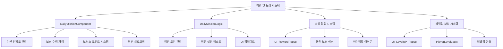
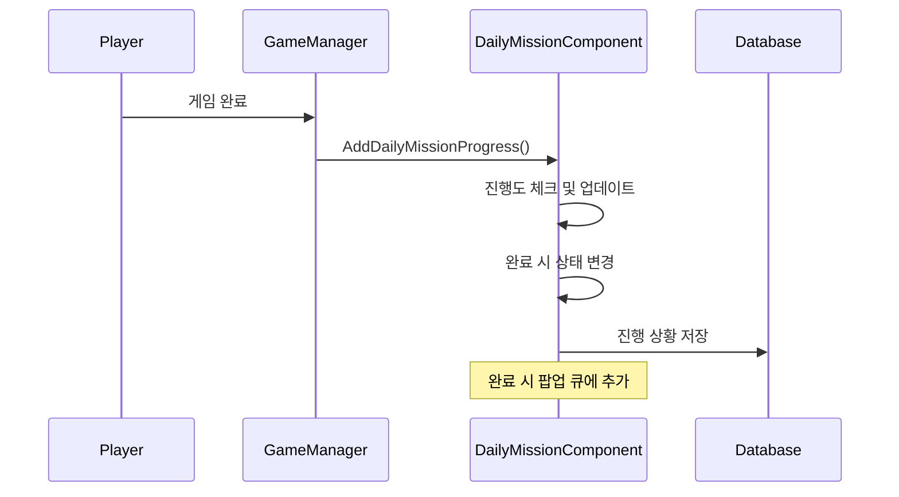

# 미션 및 보상

## 개요

플레이어의 지속적인 플레이를 유도하는 일일 미션 시스템과 다양한 보상 지급 시스템입니다. 매일 새로운 목표를 제시하고, 달성 시 보상을 통해 게임 진행을 도우며, 보너스 포인트 시스템으로 추가적인 동기를 부여합니다.

## 핵심 시스템 구조



## 1. 일일 미션 컴포넌트 (DailyMissionComponent)

### 미션 데이터 구조

```lua
@Component
script DailyMissionComponent extends Component

    @TargetUserSync
    property SyncTable<string> MissionID           -- 미션 ID (1~3: 기본, 4~6: 추가)
    
    @TargetUserSync
    property SyncTable<integer> MissionProgress    -- 진행도
    
    @TargetUserSync
    property SyncTable<integer> MissionState       -- 상태 (0:진행중, 1:완료, 2:수령)
    
    @TargetUserSync
    property integer BonusPoint = -1               -- 보너스 포인트
    
    @TargetUserSync
    property integer BonusRewardReceiveState = 0   -- 보너스 보상 수령 단계
```

### 미션 상태 관리

미션은 3가지 상태로 관리됩니다:

- **0 (진행 중)**: 목표 달성을 위해 진행 중
- **1 (보상 수령 가능)**: 목표 달성 완료, 보상 수령 대기
- **2 (보상 수령 완료)**: 보상을 받아 완료된 상태

### 일일 초기화 시스템

```lua
method void InitDailyMission()
```

매일 UTC 0시 기준으로 모든 미션이 리셋됩니다:

1. **미션 새로고침**: 3개 기본 미션 무작위 선정
2. **진행도 초기화**: 모든 진행도를 0으로 리셋
3. **보너스 포인트 리셋**: 보너스 포인트 및 수령 상태 초기화
4. **데이터베이스 저장**: 변경사항 영구 저장

### 미션 진행도 업데이트

```lua
method void AddDailyMissionProgress(string missionTypeID, integer playedLevel, integer addedValue)
```

게임 플레이 중 특정 행동 시 자동으로 진행도가 업데이트됩니다:

#### 진행도 업데이트 과정

1. **기본/추가 미션 구분**: 기본 미션 완료 여부에 따라 적용 범위 결정
2. **미션 타입 매칭**: 현재 행동이 어떤 미션에 해당하는지 확인
3. **레벨 조건 검증**: 플레이한 레벨이 미션 조건을 만족하는지 체크
4. **진행도 증가**: 조건을 만족하면 addedValue만큼 진행도 추가
5. **완료 체크**: 목표치 도달 시 상태를 "보상 수령 가능"으로 변경

#### 자동 연동되는 미션들

```lua
-- 게임 종료 시 호출되는 예시들
self.Entity.DailyMissionComponent:AddDailyMissionProgress("DM10002", self.ModeLevel, 1)  -- 싱글 모드 완료
self.Entity.DailyMissionComponent:AddDailyMissionProgress("DM10015", self.ModeLevel, 1)  -- 챌린지 모드 완료
```

### 미션 새로고침 시스템

```lua
method void RefreshMission_Check(integer missionIndex)
```

플레이어는 시럽 1개를 소모하여 특정 미션을 새로고침할 수 있습니다:

#### 새로고침 조건

1. **보상 미수령**: 이미 보상을 받은 미션은 새로고침 불가
2. **시럽 보유**: 시럽 1개 이상 보유 필요
3. **플레이 가능 미션**: 현재 플레이어가 도전 가능한 미션만 등장

#### 스마트 미션 선정

```lua
method void RefreshMission(integer missionIndex)
```

새로고침 시 플레이어의 현재 진행도에 맞는 미션만 선정됩니다:

- **싱글 모드**: 클리어한 레벨 + 1까지의 미션만 등장
- **챌린지 모드**: 레벨 50 이상이고, 해금된 챌린지만 등장

### 보너스 포인트 시스템

미션 완료 시 획득하는 포인트로 추가 보상을 제공합니다:

#### 보너스 보상 단계
```lua
local pointCondition = {20, 40, 60, 80, 100, 120}
```

각 단계별로 보상을 수령할 수 있으며, 단계별 누적 포인트가 필요합니다.

## 2. 일일 미션 로직 (DailyMissionLogic)

### 미션 데이터 관리

```lua
@Logic
script DailyMissionLogic extends Logic

    property SyncTable<string, string> MissionDesc           -- 미션 설명
    property SyncTable<string, integer> MissionConditionLevel -- 필요 레벨
    property SyncTable<string, integer> MissionCondition      -- 완료 조건값
    property SyncTable<string, integer> MissionRewardPoint    -- 보상 포인트
```

### 데이터셋 로딩

```lua
method void LoadDataSet()
```

DailyMission 테이블에서 미션 정보를 로드하여 현지화된 설명과 조건을 설정합니다:

- **설명 현지화**: 미션별 설명 텍스트를 플레이어 언어로 변환
- **조건 파라미터**: 레벨이나 횟수 등 동적 값을 텍스트에 삽입
- **조건값 설정**: 미션 완료를 위한 목표치 설정

### UI 업데이트 관리

```lua
method void UI_RefreshMissionList()
method void UI_RefreshPointArea()
```

미션 상태 변경 시 UI를 실시간으로 업데이트합니다.

## 3. 보상 팝업 시스템

### 범용 보상 팝업 (UI_RewardPopup)

```lua
method void Open_N_UpdateRewardList(SyncTable<string, integer> rewards)
```

다양한 보상을 동적으로 표시하는 범용 팝업입니다:

#### 동적 보상 생성 과정

1. **보상 목록 순회**: rewards 테이블의 모든 보상 아이템 처리
2. **UI 엔티티 재사용**: 기존 엔티티가 있으면 내용 갱신, 없으면 새로 생성
3. **아이콘 및 수량 설정**: 각 보상의 아이콘과 개수 표시
4. **팝업 활성화**: 모든 보상 설정 완료 후 팝업 표시

#### 보상 아이템 UI (UI_Reward_inPopup)

```lua
method void UpdateReward(string rID, integer amount)
```

개별 보상 아이템의 시각적 표현을 관리합니다:

- **아이콘 설정**: 보상 타입에 따른 적절한 이미지 RUID 할당
- **수량 표시**: 보상 개수를 텍스트로 표시
- **툴팁 연동**: 마우스 오버 시 상세 정보 표시

## 4. 레벨업 보상 시스템

### 레벨업 팝업 (UI_LevelUP_Popup)

```lua
method void SetPopup(integer before, integer up, table rewardList)
```

플레이어 레벨 상승 시 전용 보상 팝업을 표시합니다:

#### 레벨업 보상 처리

1. **레벨 표시**: 이전 레벨과 상승 후 레벨 표시
2. **기본 보상**: 레벨당 시럽 80개 자동 지급
3. **특별 보상**: 10의 배수 레벨마다 추가 보상
4. **보상 아이콘**: 보상 타입별 시각적 구분

#### 보상 타입별 처리

```lua
-- 코치 보상
if rewardType == "Coach" then
    self.Entity.CoachManager:ModifyPlayerOwnedCoachesID(rewardID, 1,"LvUp")

-- 패자부활권 보상  
elseif rewardType == "Repechage" then
    self:AddSyrup("Repechage_Free", rewardAmount, "LvUp")

-- 모드 해금 보상
elseif rewardInfo[1] == "ModeOpen" then
    -- 랭크 모드 또는 챌린지 모드 해금
```

### PlayerLevelLogic 연동

```lua
method void SetUI_LevelUpPopup(integer beforeLevel, integer afterLevel, integer rewardSyrup, string rewardList_str)
```

레벨업 시 UI 설정을 담당합니다:

- **팝업 데이터 설정**: 레벨, 보상 정보 등 UI 요소 설정
- **애니메이션 연출**: 1초에 걸친 페이드인 효과
- **최대 레벨 처리**: 레벨 500 도달 시 특별 안내

### 레벨업 연출 시스템

```lua
method void EnableUI_LevelUpPopup()
```

레벨업 팝업의 시각적 연출을 관리합니다:

- **알파 애니메이션**: 0에서 1까지 서서히 나타나는 효과
- **타이밍 제어**: 50개 단계로 나누어 부드러운 애니메이션
- **사운드 연동**: 레벨업 사운드 재생

## 5. 알림 시스템

### 레드닷 시스템

```lua
method void SetRedDot()
```

미션 완료나 보상 수령 가능 상태를 시각적으로 알려줍니다:

#### 레드닷 활성화 조건

1. **완료된 미션 존재**: 보상 수령 가능한 미션이 있는 경우
2. **보너스 포인트 달성**: 다음 단계 보너스 보상 수령 가능한 경우

### 팝업 큐 시스템

```lua
_UI_AchievementPopup:InsertPopUpQueue(self.MissionID[i], 0, 2, self.Entity.OwnerId)
```

미션 완료 시 업적 팝업 시스템과 연동하여 순차적으로 알림을 표시합니다.

## 6. 데이터 관리 시스템

### 데이터베이스 연동

```lua
-- 저장
_PlayerDataLogic:SetPlayerDailyMissionData(self.Entity.OwnerId)

-- 로드  
method void OnLoadData(string data)
```

미션 진행도와 상태를 데이터베이스에 영구 저장합니다.

#### 저장 형식

```lua
-- "미션ID,진행도,상태/미션ID,진행도,상태/미션ID,진행도,상태/보너스포인트,보너스수령상태"
local dataInfo = _UtilLogic:Split(data, "/")
local missionData = _UtilLogic:Split(dataInfo[i], ",")
```

### 실시간 동기화

모든 미션 데이터는 @TargetUserSync를 통해 클라이언트와 실시간 동기화됩니다.

## 7. 게임 시스템 연동

### 자동 진행도 업데이트

게임 플레이 중 다양한 행동이 미션 진행도에 자동 반영됩니다:



### 미션 타입 예시

- **DM10002**: 싱글 모드 완료
- **DM10015**: 챌린지 모드 완료  
- **DM10005**: 10레벨 달성
- **DM10001**: 게임 플레이 횟수

## 8. UI 슬롯 시스템

### UI_DailyMission_Slot

개별 미션을 표시하는 UI 슬롯:

- **미션 설명**: 현지화된 미션 목표 텍스트
- **진행도 바**: 현재 진행 상황 시각화
- **보상 정보**: 완료 시 획득 가능한 포인트 표시
- **새로고침 버튼**: 시럽 소모하여 미션 변경

## 9. 보상 연출 시스템

### 툴팁 시스템

```lua
-- UI_LevelUpPopup_RewardButton
property string RewardTitle = ""
property string RewardDesc = ""
```

보상 아이템에 마우스를 올릴 때 상세 정보를 툴팁으로 표시합니다.

### 애니메이션 시스템

레벨업과 미션 완료 시 다양한 시각적 피드백을 제공합니다:

- **페이드 인/아웃**: 팝업 등장/사라짐 효과
- **진행도 바 애니메이션**: 미션 진행 상황 표시
- **보상 아이콘 효과**: 보상 획득 시 특별 효과

## 코드 레퍼런스

- `RootDesk/MyDesk/OutGame/DailyMission/DailyMissionComponent.mlua :: AddDailyMissionProgress()` - 미션 진행도 업데이트
- `RootDesk/MyDesk/OutGame/DailyMission/DailyMissionLogic.mlua :: LoadDataSet()` - 미션 데이터 로딩
- `RootDesk/MyDesk/OutGame/Reward_Popup/UI_RewardPopup.mlua :: Open_N_UpdateRewardList()` - 보상 팝업 표시
- `RootDesk/MyDesk/OutGame/UI_LevelUP_Popup.mlua :: SetPopup()` - 레벨업 팝업 설정
- `RootDesk/MyDesk/Player/PlayerLevelLogic.mlua :: SetUI_LevelUpPopup()` - 레벨업 UI 관리
