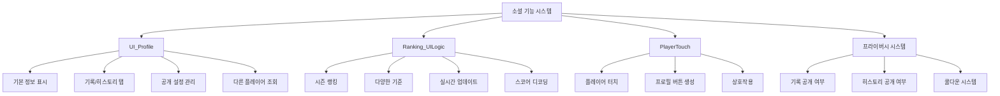

# 소셜 기능

## 개요

플레이어 간의 소통과 경쟁을 지원하는 소셜 시스템입니다. 프로필 조회, 랭킹 시스템, 플레이어 상호작용을 통해 커뮤니티 형성을 도우며, 프라이버시 설정을 통해 개인 정보 보호도 제공합니다.

## 핵심 시스템 구조



## 1. 프로필 시스템 (UI_Profile)

### 프로필 데이터 구조

```lua
@Logic
script UI_Profile extends Logic

    property string TargetUserID = ""                    -- 조회 대상 유저 ID
    
    -- 기록 관련 데이터
    property boolean Record_IsPublic = false             -- 기록 공개 여부
    property integer Record_HighestTier = 0              -- 최고 티어
    property string Record_HighestTier_Season = ""       -- 최고 티어 달성 시즌
    property integer Record_HighestRank = 0              -- 최고 랭킹
    property SyncTable<string, number> Record_PlayRecords -- 플레이 기록
    
    -- 히스토리 관련 데이터
    property boolean History_IsPublic = false            -- 히스토리 공개 여부
    property SyncTable<number, boolean> History_IsWin    -- 승리 여부
    property SyncTable<number, string> History_ModeType  -- 게임 모드
    property SyncTable<number, string> History_UnitInfo  -- 사용한 유닛
    property SyncTable<number, string> History_RuneList  -- 룬카드 목록
```

### 프로필 데이터 요청

```lua
method void RequestData(string userID)
```

다른 플레이어의 프로필을 조회할 때 서버에서 데이터를 수집하고 전달합니다:

#### 데이터 수집 과정

1. **기본 정보 수집**: 닉네임, 레벨, 장착 칭호
2. **공개 설정 확인**: 기록/히스토리 공개 여부 체크
3. **기록 데이터**: 공개 시에만 최고 티어, 랭킹, 플레이 통계 제공
4. **히스토리 데이터**: 공개 시에만 최근 게임 기록 제공

#### 프라이버시 보호

```lua
if userID ~= senderUserId and playerDataCompo.Profile_Record_IsPublic == false then
    -- 비공개인 경우 nil 데이터 전송
    self:SetData_Record(nil, nil, nil, nil, nil, nil, nil, nil, nil, nil, senderUserId)
```

다른 플레이어가 프로필을 비공개로 설정한 경우 해당 정보를 숨깁니다.

### UI 구성 및 로딩 시스템

```lua
method void OnOpenUI()
```

프로필 UI는 4단계 로딩 시스템을 사용합니다:

#### 로딩 단계

1. **Default**: 기본 정보 (닉네임, 레벨, 칭호)
2. **Public**: 공개 설정 정보
3. **Record**: 기록 탭 데이터
4. **History**: 히스토리 탭 데이터

#### 로딩 애니메이션

```lua
-- 로딩 완료 체크 (0.5초마다)
-- 완료 시 페이드 아웃 애니메이션 (1초)
for i=1, 40 do
    _TimerService:SetTimerOnce(setLoadingPanelAlpha, i/80)
end
```

### 탭 시스템

프로필은 두 개의 주요 탭으로 구성됩니다:

#### 기록 탭 (Record)

- **최고 티어**: 랭크 모드에서 달성한 최고 등급
- **최고 랭킹**: 시즌별 최고 순위 및 상위 퍼센트
- **플레이 통계**: 총 게임 수, 승률 등
- **수집 진행도**: 업적, 칭호, 코치, 캐릭터 컬렉션 완성도

#### 히스토리 탭 (History)

- **최근 게임**: 최대 10개 게임 기록
- **게임 정보**: 모드, 레벨, 승패, 도달 라운드
- **유닛 구성**: 사용한 캐릭터들
- **룬카드**: 장착한 룬카드 목록
- **코치**: 사용한 코치들

## 2. 랭킹 시스템 (Ranking_UILogic)

### 랭킹 데이터 관리

```lua
@Logic
script Ranking_UILogic extends Logic

    property table RankingData = {}                      -- 랭킹 데이터
    property integer RankingPageNum = 1                  -- 현재 페이지
    property string RanknigCriteriaID = ""               -- 랭킹 기준
```

### 실시간 업데이트 시스템

```lua
method void OnUpdate(number delta)
```

랭킹 정보는 자동으로 업데이트됩니다:

- **시즌 잔여 시간**: 1초마다 업데이트
- **랭킹 데이터**: 3분(180초)마다 서버에서 새로고침

### 다양한 랭킹 기준

```lua
method table ScoreDecoder(integer score, string criterialID)
```

시즌마다 다른 기준으로 랭킹을 매깁니다:

#### 랭킹 기준 종류

- **CT10001**: 짧은 플레이 타임 (빠른 클리어)
- **CT10002**: 단일 유닛 최대 가해량
- **CT10003**: 단일 유닛 최대 피해량  
- **CT10004**: 전 라운드 누적 생존 수
- **CT10005**: 최종 팀 가치 (전장)
- **CT10006**: 룬카드 총 가치
- **CT10007**: 남은 하트 수량
- **CT10008**: 활성화된 시너지 수
- **CT10009**: 게임 후 남은 골드
- **CT10010**: 완성 아이템 개수

### 스코어 인코딩/디코딩

랭킹 점수는 복합 정보를 하나의 숫자로 압축하여 저장합니다:

```lua
-- 스코어 구조: [랭크레벨(2,500,000)] + [스테이지라운드(100,000)] + [추가기준값]
rankingInfo["RankLevel"] = score // 2500000
local stageRound = (score % 2500000) // 100000 - 1
local remainder = score % 100000
```

### 페이징 시스템

```lua
method void SetRankingPage(integer pageNum)
```

대량의 랭킹 데이터를 페이지 단위로 표시하여 성능을 최적화합니다.

## 3. 플레이어 상호작용 시스템

### 플레이어 터치 이벤트 (PlayerTouch)

```lua
@Component
script PlayerTouch extends Component

    @EventSender("Self")
    handler HandleTouchEvent(TouchEvent event)
```

다른 플레이어를 클릭했을 때의 기본 처리를 담당합니다.

### 프로필 버튼 동적 생성 (ProfileButtonClick)

```lua
@EventSender("Model", "defaultplayer")
handler HandlePlayerTouchEvent(PlayerTouchEvent event)
```

플레이어 터치 시 동적으로 프로필 버튼을 생성합니다:

#### 버튼 생성 로직

```lua
if self.Entity.Enable then -- 버튼이 활성화된 경우
    if self.CurrentTargetEntity == TouchedUserEntity then  
        -- 같은 플레이어 재클릭 시 버튼 비활성화
        self.CurrentTargetEntity = nil
        self.Entity:SetEnable(false)
    else 
        -- 다른 플레이어 클릭 시 텍스트 변경
        self.Entity.TextComponent.Text = string.format("%s의 프로필 보기", TouchedUserEntity.NameTagComponent.Name)
        self.CurrentTargetEntity = TouchedUserEntity
    end
else 
    -- 버튼 신규 활성화
    self.Entity.TextComponent.Text = string.format("%s의 프로필 보기", TouchedUserEntity.NameTagComponent.Name)
    self.CurrentTargetEntity = TouchedUserEntity
    self.Entity:SetEnable(true)
end
```

### 코치 상호작용

```lua
-- CoachMoveComponent :: Interaction()
method void Interaction()
```

동행 코치와의 상호작용도 소셜 요소 중 하나입니다:

- **무작위 반응**: 4가지 상호작용 애니메이션 중 랜덤 선택
- **쿨타임 시스템**: 3초 쿨타임으로 남용 방지
- **자동 수면**: 100초 비상호작용 시 수면 모드

## 4. 프라이버시 설정 시스템

### 공개 설정 데이터

```lua
-- PlayerDataComponent
@TargetUserSync
property boolean Profile_Record_IsPublic = false         -- 기록 공개 여부

@TargetUserSync
property boolean Profile_History_IsPublic = false        -- 히스토리 공개 여부
```

플레이어는 기록과 히스토리를 각각 독립적으로 공개/비공개 설정할 수 있습니다.

### 공개 설정 변경

```lua
handler HandleButtonClickEvent2(ButtonClickEvent event)   -- 기록 공개 설정
handler HandleButtonClickEvent3(ButtonClickEvent event)   -- 히스토리 공개 설정
```

#### 변경 과정

1. **권한 검증**: 본인 프로필인지 확인
2. **설정 토글**: 현재 상태의 반대로 변경
3. **UI 즉시 반영**: 체크박스 상태 업데이트
4. **쿨다운 체크**: 3초 쿨다운 확인
5. **서버 전송**: 설정 변경 요청

#### 쿨다운 시스템

```lua
-- 3초에 1회만 요청 가능
self.IsPublicChangeCooldown = true
_TimerService:SetTimerOnce(function()
    self.IsPublicChangeCooldown = false
end, 3)
```

무분별한 설정 변경을 방지하기 위해 3초 쿨다운을 적용합니다.

### 데이터베이스 저장

```lua
method void SetPlayerProfileIsPublicData(string userID)
method void GetPlayerProfileIsPublicData(string userID)
```

공개 설정은 데이터베이스에 영구 저장되어 다음 접속 시에도 유지됩니다:

```lua
-- 저장 형식: "기록공개여부_히스토리공개여부"
local isPublicData = string.format("%s_%s", 
    playerDataComponent.Profile_Record_IsPublic, 
    playerDataComponent.Profile_History_IsPublic)
```

## 5. 게임 히스토리 시스템

### 자동 기록 수집

게임 종료 시 자동으로 프로필 히스토리에 기록됩니다:

```lua
-- PlayerDataComponent 히스토리 프로퍼티들
property SyncTable<number, boolean> Profile_IsWin        -- 승패
property SyncTable<number, string> Profile_ModeType      -- 모드
property SyncTable<number, number> Profile_ModeLevel     -- 레벨  
property SyncTable<number, string> Profile_LastRound     -- 도달 라운드
property SyncTable<number, string> Profile_UnitInfo      -- 유닛 구성
property SyncTable<number, string> Profile_RuneList      -- 룬카드
property SyncTable<number, string> Profile_CoachList     -- 코치
```

### 히스토리 제한

최대 10개의 최근 게임 기록만 저장하여 데이터 크기를 관리합니다.

## 6. UI 연동 시스템

### 탭 컴포넌트 연동

```lua
self.UI_TabList.TabComponent:ChangeTab(1)  -- 기본으로 Record 페이지 표시
```

프로필 UI는 탭 시스템을 활용하여 기록과 히스토리를 구분 표시합니다.

### 동적 UI 생성

프로필 정보에 따라 UI 요소가 동적으로 생성되거나 숨겨집니다:

- **비공개 패널**: 비공개 설정 시 "비공개" 메시지 표시
- **공개 설정 버튼**: 본인 프로필에만 표시
- **데이터 없음**: 기록이 없는 경우 "NoRecord" 표시

### 아이콘 및 리소스 관리

랭킹, 티어, 모드별로 해당하는 아이콘 RUID를 동적으로 할당하여 시각적 정보를 제공합니다.

## 7. 멀티플레이어 동기화

### 실시간 정보 동기화

@TargetUserSync를 통해 프로필 관련 정보가 실시간으로 동기화됩니다:

- 레벨 변경 시 즉시 반영
- 칭호 변경 시 즉시 반영  
- 게임 기록 추가 시 즉시 반영

### 서버-클라이언트 통신

프로필 조회는 서버에서 검증된 데이터만 제공하여 보안을 유지합니다.

## 8. 성능 최적화

### 데이터 캐싱

```lua
property SyncTable<string, boolean> IsLoadComplete
```

로딩 상태를 추적하여 중복 요청을 방지합니다.

### 페이징 처리

랭킹 데이터는 페이지 단위로 로드하여 메모리 사용량을 최적화합니다.

### 타이머 관리

불필요한 타이머는 적절히 정리하여 성능 저하를 방지합니다:

```lua
_TimerService:ClearTimer(timerID)
```

## 코드 레퍼런스

- `RootDesk/MyDesk/OutGame/Profile/UI_Profile.mlua :: RequestData()` - 프로필 데이터 요청
- `RootDesk/MyDesk/OutGame/Ranking/Ranking_UILogic.mlua :: GetRankingData()` - 랭킹 데이터 수집
- `RootDesk/MyDesk/OutGame/Profile/ProfileButtonClick.mlua :: HandlePlayerTouchEvent()` - 플레이어 터치 처리
- `RootDesk/MyDesk/DataStorage/PlayerDataLogic.mlua :: SetPlayerProfileIsPublicData()` - 프라이버시 설정 저장
- `RootDesk/MyDesk/OutGame/Profile/PlayerTouch.mlua :: HandleTouchEvent()` - 플레이어 상호작용
