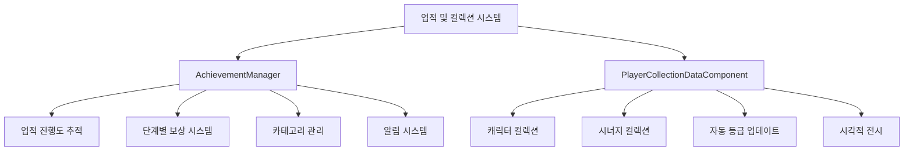
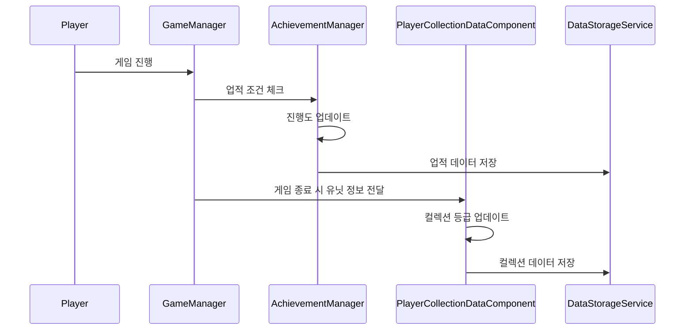

# 업적 및 컬렉션

## 개요

플레이어의 장기적인 게임 참여를 유도하는 업적 달성 시스템과 캐릭터/시너지 컬렉션 시스템입니다. 단계별 업적 진행도 추적, 다양한 보상 지급, 시각적 컬렉션 전시를 통해 메타게임의 깊이를 제공합니다.

## 핵심 시스템 구조



## 1. 업적 시스템 (AchievementManager)

### 데이터 구조

업적은 ID별로 단계적 진행도와 상태를 관리합니다:

```lua
@Component
script AchievementManager extends Component

    property table PlayerAchievementData = {}
    property table PlayerAchieveCategoryData = {}
```

각 업적의 데이터 구조:

```lua
PlayerAchievementData[achieveID] = {
    ['count'] = 진행도,
    ['state'] = {단계별_상태},
    ['date'] = {완료_날짜}
}
```

### 업적 상태 관리

업적은 4가지 상태를 가집니다:

- **InProgress**: 진행 중
- **RewardEarned**: 보상 획득 가능
- **Complete**: 보상 수령 완료
- **Lock**: 잠금 상태

### 진행도 업데이트

```lua
method void Modify_AchieveData(string achievementID, number value)
```

업적 진행도는 두 가지 방식으로 계산됩니다:

#### 누적 방식 (IsCumulative = "TRUE")
```lua
if data.IsCumulative == "TRUE" then 
    aftCount = befCount + value  -- 이전값 + 추가값
```

#### 최대값 방식 (IsCumulative = "FALSE")  
```lua
else 
    aftCount = math.max(befCount, value)  -- 최대값 갱신
```

### 단계별 업적 시스템

하나의 업적이 여러 단계를 가질 수 있습니다:

```lua
for i = data.MaxStep, 1, -1 do 
    if aftCount >= tonumber(data.Count[i]) then 
        playerAchieveData['state'][i] = _AchievementStateEnum.RewardEarned
        playerAchieveData['date'][i] = DateTime.UtcNow:ToFormattedString("yyyy/MM/dd")
    end
end
```

### 특수 업적 타입: 스택 업적

```lua
method void Modify_AchieveStack(string achieveID, number value)
```

게임 내에서만 유효한 업적으로, 게임 종료 시 초기화됩니다:

- 한 게임 내에서 특정 조건 달성
- 게임 종료 시 progress 리셋
- 실시간 진행도 추적

### 업적 보상 시스템

```lua
method void EarnReward_Achieve(string achievementID, integer befStep)
```

보상 지급 과정:

1. **유효성 검사**: 업적 ID 및 보상 가능 상태 확인
2. **상태 변경**: RewardEarned → Complete
3. **보상 지급**: RewardTable에 따른 아이템 지급
4. **카테고리 업데이트**: 완료 개수 증가
5. **UI 알림**: 레드닷 및 팝업 표시

### 카테고리 관리

```lua
method void Modify_AchieveCategoryData(string categoryID, integer value)
```

업적 카테고리별 완료 개수를 추적하여 전체 진행도를 관리합니다.

### 알림 시스템

업적 완료 시 다단계 알림을 제공합니다:

```lua
_UI_AchievementService:EnableRedDotByID(categoryID, true, userId)
_UI_AchievementService:EnableAchieveBtnRedDot(true, userId)
_UI_AchievementPopup:InsertPopUpQueue(achievementID, step, 1, userId)
```

## 2. 컬렉션 시스템 (PlayerCollectionDataComponent)

### 컬렉션 타입

두 가지 컬렉션을 관리합니다:

```lua
@TargetUserSync
property SyncTable<string, number> CharacterCollection  -- 캐릭터별 수집 등급
    
@TargetUserSync
property SyncTable<string, number> SynergyCollection     -- 시너지별 수집 등급
```

### 캐릭터 컬렉션

#### 초기화

```lua
method void InitializeCharacterCollectionData()
```

캐릭터 정보 테이블에서 수집 가능한 캐릭터들을 필터링하여 초기값 설정:

```lua
if _DataService:GetTable("CharacterInfo"):GetCell(i, "CollectionEnable") == "TRUE" then
    self.CharacterCollection[charID] = 0
end
```

#### 자동 등급 업데이트

```lua
method void GetGameOverUnitSet(SyncTable<Entity> ownUnits, string season)
```

게임 종료 시 마지막 전장에 있던 유닛들의 레벨을 확인하여 컬렉션 등급을 자동 업데이트:

1. **마지막 전장 유닛 추출**: 최종 라운드에 배치된 유닛들만 선별
2. **레벨 비교**: 현재 컬렉션 등급보다 높은 레벨만 업데이트
3. **중복 처리**: 같은 캐릭터 여러 개 중 최고 레벨만 적용

### 시너지 컬렉션

```lua
method void InitializeSynergyCollectionData()
```

모든 시너지 정보를 기반으로 초기화하며, 시너지 달성 시 등급이 업데이트됩니다.

### 컬렉션 UI 시스템

#### UI_CollectionManager

컬렉션북의 메인 관리자:

```lua
method void CreateCharColList_NewGrid(string season)
```

- **시즌별 필터링**: 각 시즌에 포함된 캐릭터만 표시
- **GridView 활용**: 효율적인 대량 데이터 표시
- **수집률 계산**: 시즌별 수집 완성도 표시

#### UI_CollectionCharacterCard

개별 캐릭터 카드 표시:

```lua
method void Initialize(string charID, integer level)
method void Set_CollectLevel(integer collectLevel)
```

- **등급별 시각화**: 별점 시스템으로 수집 등급 표시
- **플래티넘 카드**: 최고 등급(4단계) 달성 시 특별 효과
- **리소스 최적화**: 스프라이트 스케일과 위치 자동 조정

#### UI_CollectionCharacterInfo

선택한 캐릭터의 상세 정보:

```lua
method void SetInfo(integer collectLevel, string charID)
```

- **미수집 상태 처리**: 실루엣과 "???" 표시
- **시너지 정보**: 해당 캐릭터의 시너지 표시
- **아바타 변경 연동**: 수집한 캐릭터로 아바타 변경 가능

### 데이터 저장 시스템

#### 저장 형식

```lua
-- CharacterCollection: "(ID)-(Grade)_..._(ID)-(Grade)"
-- SynergyCollection: "(ID)-(Grade)_..._(ID)-(Grade)"
```

#### 로드 과정

```lua
method void GetCollectionData(string userID)
```

1. **DB에서 문자열 로드**: DataStorageService 활용
2. **데이터 파싱**: Split을 통한 ID-등급 쌍 분리  
3. **컴포넌트 적용**: SyncTable에 데이터 할당
4. **초기값 처리**: 데이터 없을 경우 Initialize 함수 호출

## 3. 통합 연동 시스템

### 게임 진행과 자동 연동



### 업적-컬렉션 상호 연동

컬렉션 달성이 업적 진행도에 반영됩니다:

```lua
-- 칭호 획득 업적 예시
_AchievementService:UpdateProgress_Graduate("AC001007", 1, self.Entity)
```

### UI 알림 통합

두 시스템 모두 통합된 알림 시스템을 사용합니다:

- **레드닷 표시**: 새로운 보상이나 컬렉션 업데이트 시
- **팝업 큐**: 순차적 알림 표시로 사용자 경험 최적화
- **실시간 동기화**: @TargetUserSync를 통한 즉시 UI 반영

## 4. 성능 최적화

### 데이터 캐싱

- **AchievementService**: 업적 정보 캐싱으로 반복 조회 최적화
- **DictionaryDataManager**: 캐릭터/시너지 정보 사전 로딩

### UI 최적화

- **GridView**: 대량 컬렉션 데이터의 효율적 표시
- **On-Demand Loading**: 필요시에만 카드 정보 로드
- **리소스 관리**: 이미지 스케일과 위치 정보 캐싱

## 5. 데이터 테이블 연동

### 필수 데이터 테이블

- **AchievementData**: 업적 정의 및 보상 정보
- **AchievementCategory**: 업적 카테고리 분류
- **CharacterInfo**: 캐릭터별 수집 가능 여부
- **SynergyInfo**: 시너지 정보 및 수집 설정

### 보상 시스템 연동

업적 완료 시 다양한 보상 타입을 지원합니다:

- **코치**: CoachManager와 연동
- **칭호**: TitleManager와 연동
- **화폐**: PlayerDataComponent와 연동
- **아이템**: 인게임 아이템 시스템과 연동

## 코드 레퍼런스

- `RootDesk/MyDesk/OutGame/Achievement/AchievementManager.mlua :: Modify_AchieveData()` - 업적 진행도 업데이트
- `RootDesk/MyDesk/OutGame/Outgame_CollectionBook/PlayerCollectionDataComponent.mlua :: GetGameOverUnitSet()` - 컬렉션 자동 업데이트
- `RootDesk/MyDesk/OutGame/Outgame_CollectionBook/UI_CollectionManager.mlua :: CreateCharColList_NewGrid()` - 컬렉션 UI 생성
- `RootDesk/MyDesk/DataStorage/PlayerDataLogic.mlua :: GetCollectionData()` - 컬렉션 데이터 로드
- `RootDesk/MyDesk/OutGame/Achievement/AchievementManager.mlua :: EarnReward_Achieve()` - 업적 보상 지급
