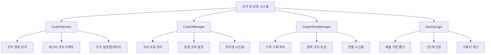

# 코치 및 상점

## 개요

코치 컬렉션과 가챠 상점을 중심으로 한 메타게임 시스템입니다. 다양한 코치를 수집하고, 동행 코치 설정, 마스터 코치 이펙트, 아바타 변경 등을 통해 개성 있는 플레이 경험을 제공합니다.

## 핵심 시스템 구조



## 1. 코치 서비스 (CoachService)

### 코치 정보 관리

모든 코치의 기본 정보를 로드하고 관리합니다:

```lua
@Logic
script CoachService extends Logic

    property table CoachData = {}
    property SyncTable<integer, integer> CoachCountByCost
```

#### 코치 데이터 구조

```lua
-- CoachInfo 구조체
coachData.CoachID = "C_001"
coachData.Name = 현지화된_이름
coachData.Cost = 등급_비용
coachData.ProfileRUID = 프로필_이미지
coachData.IdleRUID = 기본_애니메이션
coachData.MoveRUID = 이동_애니메이션
coachData.LoveRUID = 좋아함_애니메이션
coachData.SadRUID = 슬픔_애니메이션
coachData.SleepRUID = 수면_애니메이션
coachData.InteractionRUID_1~5 = 상호작용_애니메이션들
coachData.AngryRUID = 화남_애니메이션
coachData.Tags = 태그_목록
coachData.Desc = 설명_텍스트
```

### 마스터 코치 이펙트 시스템

```lua
property SyncTable<integer, string> MasterCoachRUID_Anim
property SyncTable<integer, Vector3> MasterCoachOffset
property SyncTable<integer, Vector3> MasterCoachScale
```

각 코치별로 특별한 마스터 등급 이펙트를 관리합니다:

- **애니메이션 RUID**: 마스터 전용 이펙트 애니메이션
- **오프셋**: 이펙트 위치 조정
- **스케일**: 이펙트 크기 조정

### 코치 엔티티 생성

```lua
method void CreateCoach(string userId)
method void UpdateCoach(Entity player)
```

플레이어의 동행 코치를 실제 게임 월드에 생성하고 관리합니다:

1. **생성 조건 체크**: 동행 코치 설정 여부 확인
2. **엔티티 스폰**: CoachEntity 모델로 코치 생성
3. **연출 적용**: create/destroy 애니메이션
4. **마스터 이펙트**: 마스터 코치인 경우 특별 이펙트 활성화

## 2. 코치 관리자 (CoachManager)

### 코치 소유 시스템

```lua
@TargetUserSync
property SyncTable<string, integer> PlayerOwnedCoachesID
```

각 코치의 보유 상태를 관리합니다:

- **0**: 미보유
- **1**: 일반 코치 보유  
- **2**: 마스터 코치 보유

### 동행 코치 시스템

```lua
@TargetUserSync
property string FollowingCoachID = ""

@TargetUserSync  
property Entity CurrentFollowingCoachEntity = nil
```

로비에서 플레이어와 함께 다니는 동행 코치를 관리합니다.

### 프리셋 시스템

```lua
@TargetUserSync
property SyncTable<string> SetCoachesID          -- 설정된 코치 ID 목록

@TargetUserSync
property SyncTable<number> SetCoachesCost        -- 설정된 코치 비용 목록

@TargetUserSync
property SyncTable<number, string> SetCoachPresetInfo  -- 프리셋 정보

@TargetUserSync  
property SyncTable<string> SetCoachPresetName    -- 프리셋 이름
```

인게임에서 사용할 코치 조합을 미리 설정할 수 있는 시스템입니다.

### 인게임 코치 시스템

```lua
@TargetUserSync
property SyncTable<string> PlayCoachesID         -- 실제 게임에 적용된 코치들

@TargetUserSync
property SyncTable<number> PlayCoachesCost       -- 적용된 코치들의 비용
```

동행 코치와 별도로 실제 게임 플레이에 영향을 주는 코치들을 관리합니다.

## 3. 코치 상점 관리자 (CoachShopManager)

### 가챠 구매 처리

```lua
method void Purchase_Gacha(string player, string GoodsID)
```

가챠 구매의 전체 프로세스를 처리합니다:

#### 1. 화폐 소모 검증
```lua
local gachaData = _CoachShopDataLogic:Get_Gacha(GoodsID)
local purchaseResult = self.Entity.PlayerDataComponent:SubtractSyrup("Syrup", gachaData.Price)
```

#### 2. 코치 선정
```lua
-- 1회 가챠 (CG00001)
if GoodsID == "CG00001" then
    table.insert(pickCoachID, _GachaLogic:ProcessGacha(self.Entity,""))
elseif GoodsID == "CG00002" then
    -- 10회 가챠 로직
```

#### 3. 중복 코치 처리
```lua
if pickCoachType ~= 0 then 
    if pickCoachType == 1 then -- 일반 코치 중복
        -- 중복 보상으로 로얄시럽 지급
        duplicateReward = _GachaLogic:GetCoachPrice(cost,1,true)
        self.Entity.PlayerDataComponent:AddSyrup("RoyalSyrup", duplicateReward, "DuplicateCoach")
    end
else
    -- 신규 코치는 컬렉션에 추가
    isDuplicate = false
    pickCoachType = 1 
end
```

#### 4. 코치 지급 및 연출 설정
```lua
if not isDuplicate then
    self.Entity.CoachManager:ModifyPlayerOwnedCoachesID(pickCoachID[i],pickCoachType,"GachaCoach")
end

-- 가챠 연출 데이터 설정
_UI_GachaDirection:SetGachaGrade(bestdirectionGrade,bestisDuplicate,PlayerEntity.OwnerId)
_UI_GachaDirection:NextPlay(PlayerEntity.OwnerId)
```

## 4. 가챠 로직 시스템 (GachaLogic)

### 2단계 선정 방식

```lua
method string ProcessGacha(Entity player, string type)
```

#### 1단계: 등급(비용) 결정
```lua
local pickUpStruct = GachaPick()
local dataSet = _DataService:GetTable("GachaProbability")

-- 가중치 기반 등급 선정
for i=1, dataSet:GetRowCount() do
    local cost = row:GetItem("Cost") 
    pickUpStruct:AddItem(cost, tonumber(row:GetItem("Weight")))
end

local pickCost = pickUpStruct:Pick()
```

#### 2단계: 해당 등급 내 코치 선정
```lua
-- 선정된 등급의 모든 코치 수집
local coachTable = {} 
for coachId, data in pairs(_CoachService.CoachData) do 
    if pickCost == tostring(coachInfo.Cost) then 
        table.insert(coachTable, coachId)
    end
end

-- 균등 확률로 선정
local rand = _UtilLogic:RandomIntegerRange(1, #coachTable)
return coachTable[rand]
```

### 가중치 뽑기 시스템 (GachaPick)

```lua
@Struct
script GachaPick

    property table items = {}
    property table itemWeight = {}
    property number totalWeight = 0
```

#### 가중치 추가
```lua
method void AddItem(string itemID, number weight)
    table.insert(self.items, itemID)
    self.totalWeight = self.totalWeight + weight
    table.insert(self.itemWeight, weight)
```

#### 확률 계산 및 선정
```lua
method string Pick()
    local pickNumber = _UtilLogic:RandomIntegerRange(0, self.totalWeight-1)
    
    local cumulative_weight = 0
    for i=1, #self.itemWeight do
        cumulative_weight = cumulative_weight + self.itemWeight[i]
        if pickNumber < cumulative_weight then
            return self.items[i]
        end
    end
```

## 5. 가챠 연출 시스템 (UI_GachaDirection)

### 단계별 연출 진행

```lua
method void NextPlay()
```

가챠 연출은 6단계로 구성됩니다:

```mermaid
stateDiagram-v2
    [*] --> play : 연출 요청
    play --> start : Init()
    start --> auto : Play_Start()
    auto --> preview : Play_Auto() 
    preview --> click : Play_Preview()
    click --> acquire : Play_Click()
    acquire --> end : Play_Acquire()
    end --> [*] : Play_End()
```

#### 각 단계별 처리

1. **play → start**: 초기화 및 연출 시작
2. **start → auto**: 자동 연출 재생
3. **auto → preview**: 등급 미리보기 표시
4. **preview → click**: 사용자 클릭 유도
5. **click → acquire**: 코치 획득 표시
6. **acquire → end**: 연출 종료

### 등급별 연출 차별화

```lua
method void SetGachaGrade(table gradeInfo, boolean isDuplicate, string userID)
```

코치의 등급(비용)에 따라 다른 연출을 적용합니다:

- **문 리소스**: 등급별 다른 미스틱 도어
- **파티클 이펙트**: 등급별 특별 효과
- **사운드**: 등급별 전용 사운드
- **중복 표시**: 중복 코치인 경우 특별 UI

## 6. 아바타 변경 시스템 (PlayerAvatarChangeComponent)

### 변신 시스템

```lua
method void AvatarChange(string charID)
```

수집한 캐릭터로 플레이어 아바타를 변경할 수 있습니다:

#### 변신 활성화
```lua
if self.nowChanging == true then
    self.Entity.AvatarRendererComponent.Enable = false
    self.newAvatar.Enable = true
    self.nowChangeID = charID
    self.newAvatar.NewPlayerAvatarComponent:ChangeCharacter_ON(charID)
```

#### 변신 해제
```lua
else
    self.Entity.AvatarRendererComponent.Enable = true
    self.nowChangeID = ""
    self.newAvatar.Enable = false
```

### 변신 상태 관리

```lua
@Sync
property boolean nowChanging = false       -- 현재 변신 중인가

@Sync  
property string nowChangeID = ""           -- 변신한 캐릭터 ID

@Sync
property Entity newAvatar = nil            -- 변신 아바타 엔티티

@Sync
property Entity newAvatarEffect = nil      -- 변신 이펙트 엔티티
```

### 멀티플레이어 동기화

```lua
method void Init_OtherUser_Avatar(Entity user)
```

다른 플레이어의 변신 상태를 실시간으로 동기화하여 모든 플레이어에게 변신 상태가 보이도록 합니다.

## 7. UI 연동 시스템

### 코치 인벤토리 UI

```lua
-- UI_LobbyCoachInventory
method void SetCoachFollow(string coachID)      -- 동행 코치 설정
method void RefreshFollowingCoach()             -- 동행 코치 UI 갱신  
method void RefreshCoachList()                  -- 코치 목록 갱신
```

### 가챠 결과 UI

```lua  
-- UI_GachaResult
-- 1회/10회 뽑기 결과 표시
-- 코치 프로필, 등급, 중복 보상 정보 표시
-- 획득 애니메이션 연출
```

### 확률 정보 UI

```lua
-- UI_ChanceTable  
-- 가챠 확률 정보 표시
-- 등급별 출현 확률
-- 법적 요구사항 준수
```

## 8. 데이터 관리 시스템

### 필수 데이터 테이블

- **CoachInfo**: 코치 기본 정보 및 리소스
- **GachaProbability**: 가챠 확률 테이블
- **CoachGachaGoods**: 가챠 상품 정보  
- **CoachDirectGoods**: 직접 구매 코치 정보

### 저장/로드 시스템

```lua
-- PlayerDataLogic 연동
_PlayerDataLogic:SetPlayerOwnedCoachesData(userID)  -- 보유 코치 저장
_PlayerDataLogic:GetPlayerOwnedCoachesData(userID)  -- 보유 코치 로드
```

### 실시간 동기화

모든 코치 관련 데이터는 @TargetUserSync를 통해 실시간으로 클라이언트와 동기화됩니다.

## 9. 경제 시스템 연동

### 화폐 소모/획득

- **시럽**: 가챠 구매 시 소모
- **로얄시럽**: 중복 코치 보상으로 획득
- **코치 직접 구매**: 특정 코치 바로 구매

### 보상 시스템

중복 코치 획득 시 등급에 비례한 로얄시럽 보상을 제공하여 손실감을 완화합니다.

## 코드 레퍼런스

- `RootDesk/MyDesk/OutGame/Coach/CoachService.mlua :: LoadCoachInfo()` - 코치 정보 로딩
- `RootDesk/MyDesk/InGame/Coach/CoachManager.mlua :: ModifyPlayerOwnedCoachesID()` - 코치 보유 상태 변경
- `RootDesk/MyDesk/OutGame/CoachShop/Shop/CoachShopManager.mlua :: Purchase_Gacha()` - 가챠 구매 처리
- `RootDesk/MyDesk/OutGame/CoachShop/Goods_Gacha/GachaLogic.mlua :: ProcessGacha()` - 가챠 뽑기 로직
- `RootDesk/MyDesk/OutGame/OutGame_AvatarChange/PlayerAvatarChangeCompoenent.mlua :: AvatarChange()` - 아바타 변경 시스템
