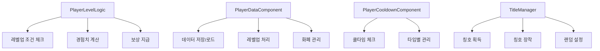

# 플레이어 진행 관리

## 개요

아웃게임에서 플레이어의 전반적인 진행 상황을 관리하는 시스템입니다. 플레이어 레벨, 경험치, 쿨다운, 칭호 등 플레이어의 성장과 관련된 모든 요소를 포괄적으로 다룹니다.

## 핵심 컴포넌트



## 1. 레벨 시스템 (PlayerLevelLogic)

### 기본 구조

플레이어 레벨은 1~500 범위로 관리되며, 게임 모드와 난이도에 따라 차별화된 경험치를 제공합니다.

```lua
-- PlayerLevelLogic.mlua
property integer Level_Min = 1
property integer Level_Max = 500

method integer GetRewardEXPAmount(string mode, integer level)
method integer IsLevelUpCondition(integer currentLevel, integer currentEXP)  
method integer GetRequiredEXP(integer targetLevel)
```

### 경험치 획득 로직

게임을 클리어할 때마다 모드와 난이도에 따라 경험치를 획득합니다:

- EXPRewardByModeNLevel 테이블에서 모드별 경험치 계산
- 모드 이름에서 "_" 이전 부분만 추출하여 사용
- 클리어 기준으로만 경험치 지급

### 레벨업 조건 체크

현재 경험치가 다음 레벨의 필요 경험치에 도달하면 레벨업이 가능합니다:

- 레벨업 가능 시: 남은 경험치량 반환
- 레벨업 불가능 시: -1 반환  
- 데이터 오류 시: -2 반환

### 레벨업 UI 관리

레벨업 시 UI 팝업을 통해 결과를 시각적으로 표시합니다:

- 이전/이후 레벨 표시
- 최대 레벨(500) 도달 시 특별 안내
- 획득한 보상 목록 표시

## 2. 플레이어 데이터 관리 (PlayerDataComponent)

### 경험치 및 레벨 처리

```lua
method integer AddEXP(integer amount, string systemType)
```

경험치 추가 시 자동으로 레벨업 조건을 체크하며, 다중 레벨업도 처리합니다:

1. 경험치 추가
2. 레벨업 조건 반복 체크
3. 레벨업 시 보상 계산 및 지급
4. UI 팝업 설정

### 레벨업 보상 시스템

- **기본 보상**: 레벨당 시럽 80개
- **특별 보상**: 10의 배수 레벨마다 추가 보상
  - 코치 지급
  - 패자부활권 지급
  - Reward_LevelUP 테이블 참조

### 데이터 동기화

PlayerDataLogic을 통해 서버 DB와 실시간 동기화:

- `GetPlayerLevelData()`: 로그인 시 레벨 데이터 로드
- `SetPlayerLevelData()`: 레벨 변경 시 저장
- 데이터 형식: "레벨_경험치" (예: "25_1500")

## 3. 쿨다운 관리 (PlayerCooldownComponent)

### 타입별 쿨다운 시스템

각 액션별로 독립적인 쿨다운을 관리합니다:

```lua
property table CooldownTable = {}

method boolean CheckAndSetCooldown(integer type)
method boolean CheckCooldown(integer type) 
method void SetCooldown(integer type)
```

### 쿨다운 타입

- `Type_CharacterShopLock = 1`: 캐릭터 상점 잠금 (0.3초)
- 추가 타입은 CooldownType.mlua에서 정의

### 서버-클라이언트 차별화

서버는 클라이언트보다 0.2초 짧은 쿨타임을 적용하여 지연 시간을 보상합니다.

## 4. 칭호 시스템 (TitleManager)

### 칭호 구성 요소

칭호는 3가지 요소로 구성됩니다:

- **네임태그** (NT1xxx): 플레이어 이름 배경
- **키워드 앞** (KWFxxx): 이름 앞쪽 수식어
- **키워드 뒤** (KWBxxx): 이름 뒤쪽 수식어

### 주요 기능

```lua
method void GetTitle(string TitleElementID, boolean GetBool)    -- 칭호 요소 획득
method void CheckTitleAvaliable(string titleElementID)         -- 칭호 장착 가능 체크
method void Random_Title()                                      -- 랜덤 칭호 설정
```

### 칭호 엔티티 관리

- 플레이어당 하나의 칭호 엔티티 생성
- 맵 이동 시에도 칭호 상태 유지
- 멀티플레이어 환경에서 실시간 동기화

### 획득 및 업적 연동

- 칭호 획득 시 레드닷 표시로 알림
- 업적 시스템과 연동 (AC001007: 칭호 획득하기)
- 무작위 칭호 기능으로 다양성 제공

## 데이터 테이블 연동

### 필수 데이터 테이블

- **EXPRewardByModeNLevel**: 모드별 경험치 보상량
- **RequiredEXP**: 레벨별 필요 경험치  
- **Reward_LevelUP**: 레벨업 보상 정보
- **Title_NameTagDataset**: 네임태그 정보
- **Title_KeyWordFrontDataset**: 앞쪽 키워드 정보
- **Title_KeyWordBackDataset**: 뒤쪽 키워드 정보

## UI 연동

### 레벨 관련 UI

- `UI_PlayerLevel`: 로비에서 플레이어 레벨 표시
- `Lobby_LevelUP`: 레벨업 팝업 UI
- 실시간 경험치 바 업데이트

### 칭호 관련 UI

- `UI_PlayerTitleSetting`: 칭호 설정 화면
- 네임태그 시각적 표시
- 색상 및 폰트 오프셋 적용

## 성능 최적화

### 캐싱 및 최적화

- ExpTableLogic: 인게임 경험치 테이블 캐싱
- 타이머를 활용한 지연 처리로 동시 접속 오류 방지
- 레벨업 시에만 UI 업데이트하여 성능 최적화

## 코드 레퍼런스

- `RootDesk/MyDesk/Player/PlayerLevelLogic.mlua :: GetRewardEXPAmount()` - 모드별 경험치 계산
- `RootDesk/MyDesk/DataStorage/PlayerDataComponent.mlua :: AddEXP()` - 경험치 추가 및 레벨업
- `RootDesk/MyDesk/Player/PlayerCooldownComponent.mlua :: CheckAndSetCooldown()` - 쿨다운 체크
- `RootDesk/MyDesk/Title/TitleManager.mlua :: GetTitle()` - 칭호 획득
- `RootDesk/MyDesk/DataStorage/PlayerDataLogic.mlua :: SetPlayerLevelData()` - 레벨 데이터 저장
