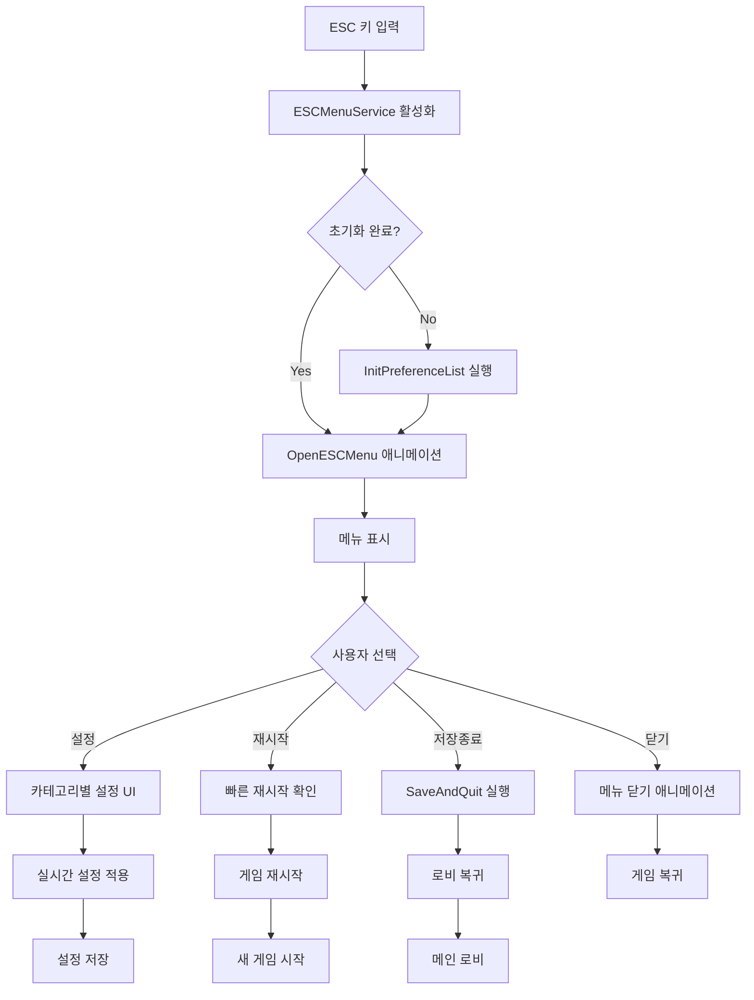

# UI 관리 - ESC 메뉴 시스템

## 개요
메토체스의 ESC 메뉴 시스템은 `ESCMenuService`를 중심으로 인게임 일시정지 메뉴, 설정 관리, 단축키 시스템을 통합적으로 제공하는 핵심 UI 관리 시스템입니다. 게임 중 필요한 모든 설정 변경과 편의 기능을 중앙 집중식으로 관리하여 일관된 사용자 경험을 제공합니다.

## 핵심 컴포넌트 구조

### ESCMenuService - 메인 메뉴 관리 시스템

#### 주요 UI 엔티티
```lua
property Entity UI_MenuGroup        -- 전체 메뉴 그룹
property Entity UI_Background       -- 배경 오버레이  
property Entity UI_ESCMenu          -- 메인 ESC 메뉴
property Entity UI_Setting          -- 설정 페이지
property Entity UI_GameModeInfo     -- 게임 모드 정보
property Entity UI_PreferencePage   -- 환경설정 페이지
property Entity UI_ConfirmPopup     -- 확인 팝업
property Entity UI_ShortcutPopup    -- 단축키 팝업
property Entity UI_QuickRestartButton -- 빠른 재시작 버튼
```

#### 상태 관리 프로퍼티
```lua
property boolean ItsOn = false                          -- 메뉴 활성화 상태
property boolean Open = false                           -- 현재 열림/닫힘 상태
property number skillEffectAlpha = 100                  -- 스킬 이펙트 투명도
property string Setting_ShowingCategory = "ShortcutKey" -- 현재 설정 카테고리
```

## 메뉴 애니메이션 시스템

### 열기/닫기 애니메이션
```lua
-- OpenESCMenu() - 부드러운 애니메이션과 함께 메뉴 표시
method void OpenESCMenu(boolean enable)
    if enable == true then
        -- 열기 애니메이션: 위에서 아래로 슬라이드
        local move = function()
            t += 1/40
            self.UI_ESCMenu.UITransformComponent.anchoredPosition.y = 
                _TweenLogic:Ease(1200, 0, 1, EaseType.BackEaseOut, t)
        end
        self._T.TimerID = _TimerService:SetTimerRepeat(move, 1/80, 0)
    else
        -- 닫기 애니메이션: 아래에서 위로 슬라이드
        local move = function()
            self.UI_ESCMenu.UITransformComponent.anchoredPosition.y = 
                _TweenLogic:Ease(0, 1200, 1, EaseType.BackEaseOut, t)
        end
    end
end
```

### 애니메이션 특징
- **BackEaseOut**: 부드럽고 자연스러운 easing 효과
- **타이밍 제어**: 1/80초 간격으로 40프레임 애니메이션
- **비동기 처리**: 타이머 기반의 논블로킹 애니메이션

## 환경설정 시스템

### 동적 설정 로딩
```lua
-- InitPreferenceList() - CSV 데이터 기반 설정 UI 동적 생성
method void InitPreferenceList()
    local prefDataset = _DataService:GetTable("PreferenceList")
    
    for i=1, prefDataset:GetRowCount() do
        local optionName = prefDataset:GetRow(i):GetItem("Act")
        local optionType = prefDataset:GetRow(i):GetItem("Type")
        local defaultValue = prefDataset:GetRow(i):GetItem("DefaultSet")
        
        -- 설정 타입별 UI 생성
        if optionType == "CheckBox" then
            -- 체크박스 타입 설정
        elseif optionType == "Slider" then
            -- 슬라이더 타입 설정
        end
    end
end
```

### 지원하는 설정 타입

#### CheckBox 타입 설정들
- **AchievementPopup**: 업적 팝업 활성화/비활성화
- **BattleWaitingTime**: 전투 대기시간 생략 옵션
- **CoinObtainEffect**: 코인 획득 애니메이션 토글

```lua
-- 체크박스 클릭 이벤트 처리
checkbox:ConnectEvent(ButtonClickEvent, function(event)
    if optionName == "AchievementPopup" then
        _UI_AchievementPopup.isActivated = not _UI_AchievementPopup.isActivated
    elseif optionName == "BattleWaitingTime" then
        battleStartButton.ArenaUI_BattleStartButton.SkipWaitingTime = 
            not battleStartButton.ArenaUI_BattleStartButton.SkipWaitingTime
    elseif optionName == "CoinObtainEffect" then
        _GeneralDirectorLogic.IsCoinAnimationOn = not _GeneralDirectorLogic.IsCoinAnimationOn
    end
    
    -- 체크박스 시각적 상태 업데이트
    button.SpriteGUIRendererComponent.ImageRUID = activated and 
        "b84c0a94f4e7f13478fb731495ae84ad" or "9fd67813972dc5642b6563c6903583c8"
end)
```

#### Slider 타입 설정들
- **SkillEffectOpacity**: 스킬 이펙트 투명도 조절
- **BGMVolume**: 배경음악 볼륨 조절
- **SFXVolume**: 효과음 볼륨 조절

```lua
-- 슬라이더 값 변경 이벤트 처리
slideBar:ConnectEvent(SliderValueChangedEvent, function(event)
    if optionName == "SkillEffectOpacity" then
        self.skillEffectAlpha = slideBar.SliderComponent.Value
    elseif optionName == "BGMVolume" then
        _PlaySoundLogic.BGMVolume = slideBar.SliderComponent.Value
    elseif optionName == "SFXVolume" then
        _PlaySoundLogic.SFXVolume = slideBar.SliderComponent.Value
    end
end)
```

## 단축키 시스템

### 단축키 매핑 구조
```lua
-- ShortCutList.csv 기반 단축키 정의
Act,DefaultKey
RerollCharShop,D        -- 캐릭터 상점 새로고침
BuyEXP,F               -- 경험치 구매
RerollRuneShop,R       -- 룬 상점 새로고침
SellChar,E             -- 캐릭터 판매
LockCharShop,T         -- 캐릭터 상점 고정
BattleStart,Space      -- 전투 시작
BuyCharShop1-5,Alpha1-5 -- 캐릭터 상점 구매
BuyItemShop1-2,Alpha6-7 -- 아이템 상점 구매
BuyRuneShop1-2,Alpha8-9 -- 룬 상점 구매
Dictionary,Equals      -- 백과사전 열기
Statistics,Minus       -- 통계 열기
```

### 키보드 키 이름 변환
```lua
-- KeyboardKeyShorten.csv 기반 키 이름 단축화
Escape → ESC
Backspace → Back
Return → ↵
Space → Space
Alpha0-9 → 0-9
LeftShift → L-Shift
RightShift → R-Shift
```

## 게임 제어 기능

### 저장 및 종료 시스템
```lua
-- SaveAndQuit() - 게임 상태 저장 후 로비 복귀
method void SaveAndQuit()
    local gameManager = user.GameManager
    
    if gameManager.PhaseType ~= "End" then
        -- 정상 종료 가능 상태
        self:OpenESCMenu(false)
        user.LoadingManager:SetEnableUI(true)
        
        -- 1초 후 로비로 이동
        _TimerService:SetTimerOnce(function()
            gameManager:MoveToLobby("SaveAndExit")
        end, 1)
    else
        -- 종료 불가 상태 - 토스트 메시지 표시
        _UIToast:ShowMessageByLocalizingKey("Toast_SaveError")
    end
end
```

### 빠른 재시작 시스템
```lua
-- 게임 재시작 (도전 모드 제한 체크 포함)
if string.sub(user.GameManager.ModeType, 1, 9) == "Challenge" then
    local leftTryCount = user.PlayerDataComponent.ChallengeMode_LeftTryCount
    if leftTryCount < 1 then
        _UIToast:ShowMessageByLocalizingKey("ExhaustAllTryChange")
        return
    end
end

user.GameManager:RestartArena()
```

### 설정 초기화 시스템
```lua
-- ResetSetting() - 모든 설정을 기본값으로 복원
method void ResetSetting()
    local prefDataset = _DataService:GetTable("PreferenceList")
    
    for i=1, prefList.Children.Count do
        local dataRow = prefDataset:GetRow(i)
        local defaultValue = dataRow:GetItem("DefaultSet")
        local optionName = dataRow:GetItem("Act")
        
        -- 각 설정별 기본값 적용
        if optionName == "SkillEffectOpacity" then
            ui_line:GetChildByName("SlideBar").SliderComponent.Value = 100
        elseif optionName == "BGMVolume" then
            ui_line:GetChildByName("SlideBar").SliderComponent.Value = 1
            _PlaySoundLogic.BGMVolume = 1
        -- 기타 설정들...
    end
end
```

## 카테고리 기반 설정 관리

### 설정 카테고리 시스템
```lua
-- 탭 변경 이벤트 처리
local settingCategory = {
    [1] = "ShortcutKey",  -- 단축키 설정
    [2] = "Preference",   -- 환경설정
}
self.Setting_ShowingCategory = settingCategory[ChangedIdx]

-- 탭 UI 상태 업데이트
for i=1, #ui_tab.Children do
    local ui_button = ui_tab.Children[i]
    ui_button.ButtonComponent.Enable = (i ~= ChangedIdx)
end

-- 설정 페이지 표시/숨김
for _, page in pairs(settingPage.Children) do
    page.Enable = (page.Name == "Page_"..self.Setting_ShowingCategory)
end
```

## 맵별 메뉴 동작

### 로비/인게임 맵별 처리
```lua
-- 현재 맵에 따른 메뉴 동작 분기
local currentMapName = _UserService.LocalPlayer.CurrentMapName

if currentMapName == "Lobby" then
    -- 로비에서의 메뉴 동작
    self.UI_MenuGroup.Enable = false
elseif _UserService.LocalPlayer.CurrentMap.MapComponent.IsDynamicMap == true then
    -- 동적 맵(인게임)에서의 메뉴 동작
    self.UI_MenuGroup.Enable = true
    self.UI_ESCMenu.Visible = true
end
```

## 시스템 통합 흐름



## Data References
- `RootDesk/MyDesk/InGame/ESCMenu/ShortCutList.csv` — 기본 단축키 매핑 정보
- `RootDesk/MyDesk/InGame/ESCMenu/KeyboardKeyShorten.csv` — 키보드 키 이름 단축 표기
- `RootDesk/MyDesk/InGame/ESCMenu/PreferenceList.csv` — 환경설정 항목 정의

## Code References
- `RootDesk/MyDesk/InGame/ESCMenu/ESCMenuService.mlua :: OpenESCMenu()` — 메뉴 애니메이션 및 표시 제어
- `RootDesk/MyDesk/InGame/ESCMenu/ESCMenuService.mlua :: InitPreferenceList()` — 환경설정 UI 동적 생성
- `RootDesk/MyDesk/InGame/ESCMenu/ESCMenuService.mlua :: SaveAndQuit()` — 게임 저장 및 종료 처리
- `RootDesk/MyDesk/InGame/ESCMenu/ESCMenuService.mlua :: ResetSetting()` — 설정 초기화 시스템
- `RootDesk/MyDesk/InGame/ESCMenu/ESCMenuService.mlua :: HandleTabChangedEvent()` — 설정 카테고리 전환
- `RootDesk/MyDesk/InGame/ESCMenu/ESCMenuService.mlua :: HandleKeyDownEvent()` — 키보드 입력 처리

## 특징 및 장점

1. **통합 관리**: 모든 게임 설정과 제어 기능을 하나의 메뉴에서 관리
2. **동적 생성**: CSV 데이터 기반의 유연한 설정 UI 생성
3. **실시간 적용**: 설정 변경 시 즉시 게임에 반영
4. **애니메이션**: 부드러운 UI 전환으로 향상된 사용자 경험
5. **카테고리 분류**: 체계적인 설정 분류로 찾기 쉬운 구조
6. **예외 처리**: 상황별 적절한 오류 메시지와 제한 처리
7. **맵 인식**: 현재 위치에 따른 적절한 메뉴 동작
8. **데이터 드리븐**: 설정 항목의 추가/변경이 용이한 구조

ESC 메뉴 시스템은 메토체스에서 플레이어가 게임 중 필요한 모든 설정과 제어를 직관적이고 효율적으로 수행할 수 있게 해주는 핵심 UI 시스템입니다.
