# UI 프레임워크

## 개요

메토체스의 UI 프레임워크는 재사용 가능한 **UI 컴포넌트**들과 **애니메이션 시스템**, **상호작용 처리**, **레이아웃 관리** 등을 통합하여 일관되고 확장 가능한 사용자 인터페이스 개발 환경을 제공합니다. 기본 버튼부터 복잡한 스크롤 레이아웃, 이미지 폰트 시스템까지 포괄하는 완전한 UI 솔루션을 구성합니다.

## 시스템 구조

### UI 프레임워크 구성도

```mermaid
graph TD
    A[UI 프레임워크] --> B[기본 컴포넌트]
    A --> C[레이아웃 시스템]
    A --> D[애니메이션 시스템]
    A --> E[상호작용 시스템]
    A --> F[고급 기능]
    
    B --> B1[UI_OpenButton/ExitButton]
    B --> B2[UI_ButtonClickSoundComponent]
    B --> B3[UI_HideButtonComponent]
    
    C --> C1[CustomScrollLayoutComponent]
    C --> C2[TabComponent]
    C --> C3[DropDownComponent]
    
    D --> D1[UITweenAlpha]
    D --> D2[UITweenPosition]
    D --> D3[UITweenScale/Rotate]
    D --> D4[UI_FlyingUIEntity]
    
    E --> E1[UI_DragMoverComponent]
    E --> E2[CursorPosManager]
    E --> E3[UI_ActivateTooltipOnMouseHover]
    
    F --> F1[UI_ImageFontService]
    F --> F2[UI_Color]
    F --> F3[UI_Mask]
    F --> F4[UI_AlphaDesolve]
```



## 1. 기본 UI 컴포넌트

### 범용 버튼 컴포넌트

메토체스는 일관된 버튼 동작을 위한 범용 컴포넌트들을 제공합니다.

#### UI_OpenButton - 열기 버튼
```lua
-- UI_OpenButton - 간단한 UI 활성화 버튼
@Component
script UI_OpenButton extends Component
    property Entity TargetUI = nil   -- 활성화할 대상 UI
    
    @EventSender("Self")
    handler HandleButtonClickEvent(ButtonClickEvent event)
        self.TargetUI.Enable = true  -- 대상 UI 활성화
    end
end
```

#### UI_ExitButton - 종료 버튼
```lua
-- UI_ExitButton - 간단한 UI 비활성화 버튼
@Component  
script UI_ExitButton extends Component
    property Entity TargetUI = nil   -- 비활성화할 대상 UI
    
    @EventSender("Self")
    handler HandleButtonClickEvent(ButtonClickEvent event)
        if self.TargetUI ~= nil then
            self.TargetUI.Enable = false  -- 대상 UI 비활성화
        end
    end
end
```

#### UI_ButtonClickSoundComponent - 사운드 첨부
```lua
-- UI_ButtonClickSoundComponent - 버튼 클릭 사운드 자동 재생
@Component
script UI_ButtonClickSoundComponent extends Component
    property string Soundtype = ""   -- 재생할 사운드 타입
    
    @EventSender("Self")
    handler HandleButtonClickEvent(ButtonClickEvent event)
        if self.Soundtype ~= "" then
            _PlaySoundLogic:PlaySound(self.Soundtype)
        end
    end
end
```

#### UI_HideButtonComponent - 토글 숨김 버튼
```lua
-- UI_HideButtonComponent - 부모 UI의 모든 자식 토글
@Component
script UI_HideButtonComponent extends Component
    property boolean IsHideState = false
    
    method void HideTargetUI(boolean hide)
        -- 자신을 제외한 모든 형제 엔티티 토글
        local parent = self.Entity.Parent
        for i=1, #parent.Children do
            parent.Children[i].Enable = not hide
        end
        self.Entity.Enable = true  -- 자신은 항상 활성화
    end
end
```

## 2. 레이아웃 관리 시스템

### CustomScrollLayoutComponent - 스크롤 및 페이지네이션

**CustomScrollLayoutComponent**는 복잡한 목록 UI를 위한 완전한 스크롤 및 페이지네이션 솔루션입니다.

#### 핵심 설정
```lua
-- CustomScrollLayoutComponent 주요 프로퍼티
property string ChildAlignment = "UpperLeft"     -- 정렬 방식 (9가지 조합)
property boolean ReverseArrange = false          -- 역순 정렬 여부
property integer SlotCountPerPage = 0           -- 페이지당 슬롯 수
property integer CurrentScroll = 1              -- 현재 페이지 번호
property integer MaxScrollCount = 1             -- 최대 페이지 수

-- 패딩 및 간격 설정
property number Padding_Top/Bottom/Left/Right   -- 패딩값들
property number Spacing = 0                     -- 아이템 간 간격

-- 스크롤바 지원
property Entity ScrollBarBackgroundEntity       -- 스크롤바 배경
property Entity ScrollBarEntity                 -- 스크롤바 핸들
```

#### 정렬 방식 시스템

**ChildAlignment** 프로퍼티는 9가지 정렬 조합을 지원합니다:
- **Vertical**: Upper, Middle, Lower (상, 중, 하)
- **Horizontal**: Left, Center, Right (좌, 중, 우)
- **조합 예시**: "UpperLeft", "MiddleCenter", "LowerRight"

#### 스크롤바 드래그 지원
```lua
-- CustomScrollLayoutComponent :: OnBeginPlay()
if isvalid(self.ScrollBarEntity) then
    -- 드래그 시작 이벤트
    self.ScrollBarEntity:ConnectEvent(UITouchBeginDragEvent, function(event)
        self.ScrollbarDragStartPosition = e.TouchPoint.y
    end)
    
    -- 드래그 중 이벤트
    self.ScrollBarEntity:ConnectEvent(UITouchDragEvent, function(event)
        self:OnDragScrollBar(event)
    end)
end
```

### TabComponent - 다중 탭 관리

**TabComponent**는 탭 버튼들을 자동으로 관리하고 상태를 동기화합니다.

#### 자동 탭 인식
```lua
-- TabComponent - 자식 엔티티들을 자동으로 탭 버튼으로 인식
property string ChildNameStartsWith = "Tab"     -- 탭 이름 접두사
-- 예: "Tab_1", "Tab_2", "Tab_3" 등을 자동 인식
```

#### 탭 변경 이벤트
```lua
-- TabChangedEvent 발송
-- 다른 컴포넌트에서 탭 변경을 감지하고 대응 가능
```

### DropDownComponent - 드롭다운 메뉴

**DropDownComponent**는 메인 버튼과 드롭다운 리스트를 관리합니다.

#### 드롭다운 구조
```lua
-- DropDownComponent - 메인 드롭다운 버튼
-- DropDownBtnComponent - 개별 드롭다운 항목 버튼

-- 클릭 시 드롭다운 리스트 토글
-- 항목 선택 시 메인 버튼 텍스트 변경 및 리스트 닫기
```

## 3. 애니메이션 시스템

### UITween 시리즈 - 통합 애니메이션

메토체스는 다양한 UI 애니메이션을 위한 **UITween** 컴포넌트 시리즈를 제공합니다.

#### 공통 애니메이션 속성
```lua
-- 모든 UITween 컴포넌트의 공통 설정
property Vector2 from = Vector2(0,0)    -- 시작값
property Vector2 to = Vector2(0,0)      -- 종료값
property boolean loop = true            -- 반복 재생
property boolean pingpong = false       -- 핑퐁 모드 (왕복)
property boolean autoPlay = true        -- 자동 재생
property number duration = 1            -- 애니메이션 지속시간
property string tweenType = "Linear"    -- 이징 타입
```

#### UITweenPosition - 위치 애니메이션
```lua
-- UITweenPosition - 위치 이동 애니메이션
property boolean isWorldPosition = false  -- 월드/로컬 좌표 선택

-- OnUpdate() - 실시간 위치 계산
local tweenValue = _TweenLogic:Ease(0, 1, self.duration, self._T.tweenType, time)
if self.isWorldPosition == true then
    self.Entity.UITransformComponent.WorldPosition = 
        Vector3((self.to * tweenValue + self.from * (1 - tweenValue)).x, 
                (self.to * tweenValue + self.from * (1 - tweenValue)).y, 0)
else
    self.Entity.UITransformComponent.anchoredPosition = 
        self.to * tweenValue + self.from * (1 - tweenValue)
end
```

#### UITweenScale - 크기 애니메이션
```lua
-- UITweenScale - 크기 변경 애니메이션
property boolean useRectSize = true  -- RectSize vs LocalScale 선택

local scale = self.to * tweenValue + self.from * (1 - tweenValue)
if self.useRectSize then
    self.Entity.UITransformComponent.RectSize = scale
else
    self.Entity.SpriteGUIRendererComponent.LocalScale = Vector2(scale.x, scale.y)
end
```

#### UITweenAlpha - 투명도 애니메이션
```lua
-- UITweenAlpha - 투명도 변화 애니메이션
-- SpriteGUIRendererComponent.Color.a 제어

-- UITweenAlpha_GroupCanvas - 그룹 투명도 애니메이션
-- CanvasGroupComponent.GroupAlpha 제어 (자식 포함)
```

#### UITweenRotate - 회전 애니메이션
```lua
-- UITweenRotate - Z축 회전 애니메이션
-- UITransformComponent.ZRotation 제어
```

### 고급 애니메이션 기능

#### 이징 타입 지원
```lua
-- 다양한 이징 타입 지원 (EaseType 열거형)
"Linear"
"SineEaseIn", "SineEaseOut", "SineEaseInOut"
"QuintEaseIn", "QuintEaseOut", "QuintEaseInOut" 
"BackEaseIn", "BackEaseOut", "BackEaseInOut"
// 그 외 다수...
```

#### 루프 및 핑퐁 모드
```lua
-- UITweenPosition :: OnUpdate()
if self.loop then
    if self.pingpong then
        time = self:PingPong(time, self.duration)  -- 왕복 애니메이션
    else
        time = self:Repeat(time, self.duration)    -- 반복 애니메이션
    end
else
    if time > self.duration then
        time = self.duration
        self:Stop()  -- 일회성 애니메이션 종료
    end
end
```

## 4. 상호작용 시스템

### UI_DragMoverComponent - UI 드래그 이동

**UI_DragMoverComponent**는 UI 패널을 드래그로 이동시키는 기능을 제공합니다.

#### 드래그 설정
```lua
-- UI_DragMoverComponent
property Entity TargetUI = nil                    -- 이동할 대상 UI
property Vector2 PosBound_UpperRight = Vector2(0,0)  -- 이동 범위 우상단
property Vector2 PosBound_LowerLeft = Vector2(0,0)   -- 이동 범위 좌하단
```

#### 드래그 처리 로직
```lua
-- HandleUITouchDragEvent() - 터치 드래그 이벤트 처리
local moveDelta = Vector2(TouchDelta.x * 1920 / _UILogic.ScreenWidth, 
                         TouchDelta.y * 1080 / _UILogic.ScreenHeight)
self.TargetUI.UITransformComponent.anchoredPosition += moveDelta

-- 경계 제한 처리
if self.TargetUI.UITransformComponent.anchoredPosition.x > self.PosBound_UpperRight.x then
    self.TargetUI.UITransformComponent.anchoredPosition.x = self.PosBound_UpperRight.x
end
```

### CursorPosManager - 커서 및 엔티티 감지

**CursorPosManager**는 마우스 커서 위치의 엔티티를 감지하고 하이라이트 효과를 제공합니다.

#### 엔티티 우선순위 감지
```lua
-- CursorPosManager :: CheckHoverEntity()
-- 우선순위: 1. 유닛 > 타일, 2. LayerOrder 높은 순
for i = 1, #components do
    local selectEntity = components[i].Entity
    
    if isvalid(hoverEntity) then
        -- 유닛이 타일보다 우선
        if isvalid(hoverEntity.TileComponent_New) and isvalid(selectEntity.UnitInfo) then
            hoverEntity = selectEntity
        elseif isvalid(selectEntity.TileComponent_New) and isvalid(hoverEntity.UnitInfo) then
            -- 유닛 유지
        else
            -- LayerOrder 비교
            if hoverEntity.SpriteRendererComponent.OrderInLayer < 
               selectEntity.SpriteRendererComponent.OrderInLayer then
                hoverEntity = selectEntity
            end
        end
    else
        hoverEntity = selectEntity
    end
end
```

#### 아웃라인 효과 적용
```lua
-- 마우스 호버 시 아웃라인 셰이더 적용
if isvalid(self.HoverEntity.UnitInfo) then
    self.HoverEntity.UnitInfo:SetOutlineMaterial(true, "mouseHover")
    
    -- 아이템 드래그 중인 경우 합성 정보 표시
    if isvalid(_ItemSetLogic.DraggingEntity) then
        local itemID = _ItemSetLogic.DraggingEntity.UI_InventoryItemSlot.ItemID
        _UI_Tooltip:SetItemEquipInfo(true, itemID, charID, level)
    end
end
```

## 5. 고급 UI 기능

### UI_ImageFontService - 이미지 폰트 시스템

**UI_ImageFontService**는 개별 문자를 이미지 스프라이트로 렌더링하는 고급 텍스트 시스템입니다.

#### 이미지 폰트 구조
```lua
-- UI_ImageFontService 데이터 관리
property SyncTable<string, string> RUID         -- 문자별 이미지 RUID
property SyncTable<string, Vector2> Size        -- 문자별 크기 정보
property table RUIDTable = {}                   -- 폰트별 문자 테이블
property string DefaultFontType = "Default_22"  -- 기본 폰트 타입
property SyncTable<string> ValidCharacters      -- 지원 문자 목록
```

#### 데이터 초기화
```lua
-- UI_ImageFontService :: OnBeginPlay()
local imageFontTable = _DataService:GetTable("ImageFontRUIDList")

-- 유효한 문자 목록 구성
for i, v in pairs(imageFontTable.Columns) do
    table.insert(self.ValidCharacters, v)
end

-- 행열 반전으로 빠른 액세스 테이블 구성
for i=1, rowCount do
    local key = keyColumn[i]
    local row = imageFontTable:GetRow(i)
    self.RUIDTable[key] = row 
end
```

#### ImageFontComponent 연동
```lua
-- ImageFontComponent - 이미지 폰트 UI 컴포넌트
property string FontType = "Default_22"      -- 폰트 타입
property string Text = ""                    -- 표시할 텍스트
property integer TextSize = 22               -- 폰트 크기
property Color TextColor = Color(1,1,1,1)    -- 텍스트 색상
property boolean DropShadow = false          -- 그림자 사용 여부
property Color DropShadowColor               -- 그림자 색상
property number DropShadowDistance = 32     -- 그림자 거리
property number DropShadowAngle = 30        -- 그림자 각도
```

#### 실시간 갱신 시스템
```lua
-- ImageFontComponent :: SetText()
method void SetText(string value)
    self.Text = value
    _UI_ImageFontService:Refresh(self.Entity)  -- 즉시 갱신
end
```

### UI_Color - 색상 및 머터리얼 관리

**UI_Color**는 게임 전반에서 사용되는 색상과 머터리얼을 중앙 집중 관리합니다.

#### 색상 카테고리 관리
```lua
-- UI_Color 색상 분류
property SyncTable<integer, Color> CharCost         -- 캐릭터 코스트별 색상
property SyncTable<integer, Color> CharCost_Darker  -- 어두운 버전
property SyncTable<integer, Color> CoachCost        -- 코치 코스트별 색상
property SyncTable<string, Color> RuneGrade         -- 룬 등급별 색상
property SyncTable<string, string> Status           -- 상태별 색상코드
property SyncTable<number, string> SynergyStepMaterial  -- 시너지 단계별 머터리얼
```

#### 데이터셋 기반 초기화
```lua
-- UI_Color :: OnBeginPlay()
local colorTable = _DataService:GetTable("GradeColor")

-- 캐릭터 코스트별 색상 (0~5)
for i=0, 5 do
    local row = colorTable:FindRow("Key", string.format("Cost%d", i))
    self.CharCost[i] = Color.FromHexCode(row:GetItem("Default"))
    self.CharCost_Darker[i] = Color.FromHexCode(row:GetItem("Darker"))
end

-- 룬 등급별 색상
local runeGrade = {"Normal", "Rare", "Epic", "Legendary"}
for i=1, #runeGrade do
    local grade = runeGrade[i]
    local row = colorTable:FindRow("Key", string.format("Rune_%s", grade))
    self.RuneGrade[grade] = Color.FromHexCode(row:GetItem("Default"))
end
```

### UI_Mask - 마스킹 및 하이라이트

**UI_Mask**는 특정 UI 요소를 강조하기 위한 마스킹 효과를 제공합니다.

#### 마스크 구성요소
```lua
-- UI_Mask 마스크 패널들
property Entity BG_center     -- 중앙 마스크 (대상 UI 크기)
property Entity BG_top        -- 상단 블러 영역
property Entity BG_bottom     -- 하단 블러 영역  
property Entity BG_left       -- 좌측 블러 영역
property Entity BG_right      -- 우측 블러 영역
property boolean IsHighlight  -- 하이라이트 모드
```

#### 마스크 적용 시스템
```lua
-- UI_Mask :: SetMask()
method void SetMask(Entity targetUI, any targetImageRUID)
    -- 전체 화면 크기로 블러 영역 설정
    local screenSize = Vector2(_UILogic.ScreenWidth, _UILogic.ScreenHeight)
    self.BG_top.UITransformComponent.RectSize = screenSize * 3
    self.BG_bottom.UITransformComponent.RectSize = screenSize * 3
    
    -- 마스크 영역을 대상 UI에 맞춤
    local mask = self.Entity
    mask.SpriteGUIRendererComponent.ImageRUID = targetImageRUID
    mask.UITransformComponent.RectSize = targetUI.UITransformComponent.RectSize
    mask.UITransformComponent.WorldPosition = targetUI.UITransformComponent.WorldPosition
end
```

## 6. 특수 UI 효과

### UI_FlyingUIEntity - 이동 연출

UI 요소가 화면을 이동하며 나타나는 연출 효과를 제공합니다.

### UI_AlphaDesolve - 자동 페이드

UI 요소의 자동 페이드인/아웃 처리:
- 일정 시간 후 자동 투명화
- 완료 후 자동 비활성화
- 부드러운 알파 전환

### UI_AutoScroll - 자동 스크롤

텍스트나 목록이 자동으로 스크롤되는 효과:
```lua
-- UI_AutoScroll 설정
property boolean IsVertical           -- 수직/수평 스크롤
property number ScrollSpeed          -- 스크롤 속도
property number WaitTime             -- 대기 시간
property boolean DynamicContentLength // 동적 길이 계산
```

## 7. 통합 활용 예시

### 복합 UI 구성
```lua
-- 전형적인 복합 UI 구성 예시
Panel_Main/
├── TabComponent              -- 탭 관리
├── CustomScrollLayoutComponent  -- 내용 스크롤
├── UI_DragMoverComponent     -- 패널 드래그 이동
├── UITweenAlpha             -- 등장/퇴장 애니메이션
└── Children/
    ├── Tab_1 (UI_ButtonClickSoundComponent)  -- 사운드 있는 탭
    ├── Tab_2 (UI_ExitButton)                 -- 종료 기능 탭
    └── Content/
        └── CustomScrollLayoutComponent       -- 중첩 스크롤
```

### 이벤트 체인 시스템
```lua
-- TabComponent 변경 → CustomScrollLayoutComponent 갱신 → UITweenPosition 실행
-- 컴포넌트 간 이벤트 기반 연동으로 복잡한 UI 동작 구현
```

## 코드 참조

### 기본 컴포넌트
- `RootDesk/MyDesk/UIComponents/UI_Common/UI_OpenButton.mlua` — 범용 열기 버튼
- `RootDesk/MyDesk/UIComponents/UI_Common/UI_ExitButton.mlua` — 범용 종료 버튼  
- `RootDesk/MyDesk/UIComponents/UI_Common/UI_ButtonClickSoundComponent.mlua` — 버튼 사운드
- `RootDesk/MyDesk/UIComponents/UI_HideButtonComponent.mlua` — 토글 숨김 버튼

### 레이아웃 시스템
- `RootDesk/MyDesk/UIComponents/UI_Common/CustomScrollLayoutCompo/CustomScrollLayoutComponent.mlua` — 스크롤 레이아웃
- `RootDesk/MyDesk/UIComponents/UI_Common/TabCompo/TabComponent.mlua` — 탭 관리
- `RootDesk/MyDesk/UIComponents/UI_Common/DropdownCompo/DropDownComponent.mlua` — 드롭다운

### 애니메이션 시스템
- `RootDesk/MyDesk/UIComponents/UI_Common/UITween/UITweenPosition.mlua` — 위치 애니메이션
- `RootDesk/MyDesk/UIComponents/UI_Common/UITween/UITweenScale.mlua` — 크기 애니메이션
- `RootDesk/MyDesk/UIComponents/UI_Common/UITween/UITweenAlpha.mlua` — 투명도 애니메이션
- `RootDesk/MyDesk/UIComponents/UI_Common/UITween/UITweenRotate.mlua` — 회전 애니메이션

### 상호작용 시스템
- `RootDesk/MyDesk/UIComponents/UI_DragMoverComponent.mlua` — UI 드래그 이동
- `RootDesk/MyDesk/UIComponents/CursorPosManager.mlua` — 커서 및 엔티티 감지
- `RootDesk/MyDesk/UIComponents/UI_Common/UI_ActivateTooltipOnMouseHover.mlua` — 호버 툴팁

### 고급 기능
- `RootDesk/MyDesk/UIComponents/UI_Common/ImageFontSystem/UI_ImageFontService.mlua` — 이미지 폰트 서비스
- `RootDesk/MyDesk/UIComponents/UI_Common/ImageFontSystem/ImageFontComponent.mlua` — 이미지 폰트 컴포넌트
- `RootDesk/MyDesk/UIComponents/UI_Color/UI_Color.mlua` — 색상 관리
- `RootDesk/MyDesk/UIComponents/UI_Mask.mlua` — 마스킹 처리

이러한 포괄적인 UI 프레임워크를 통해 메토체스는 재사용 가능하고 확장성 높은 사용자 인터페이스를 구축하며, 개발자들이 일관된 UI 경험을 쉽게 구현할 수 있는 강력한 도구들을 제공합니다.


