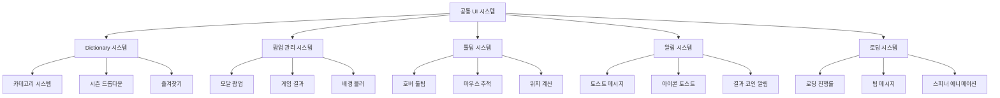
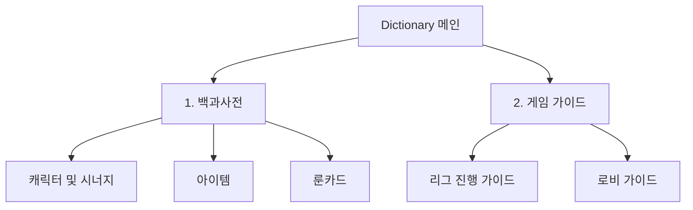

# 공통 UI 시스템

## 개요

메토체스의 공통 UI 시스템은 게임 전반에서 공유되는 **팝업**, **툴팁**, **알림**, **로딩** 등의 인터페이스 요소들을 통합 관리합니다. **Dictionary**의 백과사전부터 **GameResultGroup**의 결과 화면, **HoverPopupGroup**의 상황별 툴팁, **ToastGroup**의 피드백 메시지까지, 일관된 사용자 경험을 제공하는 범용 UI 프레임워크를 구성합니다.

## 시스템 구조

### 공통 UI 구성도



## 1. Dictionary 시스템 - 백과사전

### 다층 카테고리 구조

**DictionaryManager**는 3단계 계층 구조의 백과사전을 관리합니다.

#### 카테고리 체계
```lua
-- DictionaryManager :: Initialize()
self.ShowingPageIndex["Default"] = 1      -- 1차: 사전/가이드
self.ShowingPageIndex["1"] = 1            -- 2차: 캐릭터/아이템/룬카드
self.ShowingPageIndex["1_1"] = 1          -- 3차: 시너지별/타입별/등급별
self.ShowingPageIndex["1_2"] = 1          
self.ShowingPageIndex["1_3"] = 1          
self.ShowingPageIndex["2"] = 1            -- 2차: 가이드 
self.ShowingPageIndex["2_1"] = 1          -- 3차: 리그/로비 규칙
self.ShowingPageIndex["2_2"] = 1
```

#### 1차 카테고리 시스템


### UI 패널 관리

**DictionaryManager**는 패널별로 UI 엔티티를 관리합니다:

```lua
-- DictionaryManager 주요 UI 엔티티
property Entity UI_Dictionary = "fe246253-c976-4abe-9cb0-ba3b32a59366"
property Entity UI_CharListPanel = "ae92af29-481e-4087-8f59-0e2f3aab1d68"
property Entity UI_ItemListPanel = "fec85286-f6bd-4a0f-9c0b-6af1bcd27ffa" 
property Entity UI_RuneListPanel = "4810457e-6c2b-4ca2-a6cc-417d98bba628"
property Entity UI_GameGuidePanel = "8723e575-1248-490a-97a6-2326fc92de16"
property Entity UI_CharInfoPanel = "bbfeb059-9cf2-4595-aa90-baed65982ddb"
property Entity UI_SynergyInfoPanel = "da6cc3bb-da92-4e51-afbb-1b9cf7e97a56"
```

#### 탭 전환 시스템
```lua
-- DictionaryManager :: OnSelectCategory_1st()
-- 1차 카테고리 선택 시 탭 버튼 상태 변경
if idx == categoryIdx then
    ui_tabButton.SpriteGUIRendererComponent.Color = Color.FromHexCode("#233450")
    ui_tabButton.TextComponent.FontColor = Color.FromHexCode("#FFFFFF")
else
    ui_tabButton.SpriteGUIRendererComponent.Color = Color.FromHexCode("#253c5f")
    ui_tabButton.TextComponent.FontColor = Color.FromHexCode("#6078b8")
end
```

### 시즌 드롭다운 시스템

#### 시즌 목록 관리
```lua
property SyncTable<string> SeasonList          -- 시즌 목록
property string NowShowingSeason = "1.0"       -- 현재 표시 시즌
property Entity UI_SelectSeasonList            -- 시즌 선택 드롭다운
```

#### 시즌별 필터링
**DictionaryDataManager**와 연동하여 시즌별 콘텐츠 필터링:
- 캐릭터: 시즌별 등장 캐릭터 목록
- 아이템: 시즌별 추가/변경 아이템
- 룬카드: 시즌별 룬카드 풀

### 즐겨찾기 시스템

**DictionaryFavoriteListManager**와 연동:
```lua
-- DictionaryManager :: OnOpenDictionary()
_DictionaryFavoriteListManager:Update_FavoriteUI("Character", fave_CharList)
_DictionaryFavoriteListManager:Update_FavoriteUI("Item", fave_itemList)  
_DictionaryFavoriteListManager:Update_FavoriteUI("RuneCard", fave_RunecardList)
```

## 2. 팝업 관리 시스템

### UIPopup - 범용 모달 팝업

**UIPopup**은 확인/취소가 필요한 모든 상황에서 사용되는 범용 팝업입니다.

#### 팝업 구조
```lua
-- UIPopup 주요 구성요소  
property TextComponent message = "PopupMessage"      -- 팝업 메시지
property ButtonComponent btnOk = "PopupBtnOK"       -- 확인 버튼
property ButtonComponent btnCancel = "PopupBtnCancel" -- 취소 버튼
property Entity popupGroup = "PopupGroup"           -- 팝업 그룹
```

#### 팝업 표시 시스템
```lua
-- UIPopup :: Open()
method void Open(string message, any onOk, any onCancel)
    if self.isOpen == true then return end
    
    self.isOpen = true
    self.popupGroup.Enable = true
    self.message.Text = message
    self.onOk = onOk
    self.onCancel = onCancel
    
    -- 이벤트 핸들러 연결
    self.okHandler = self.btnOk.Entity:ConnectEvent(ButtonClickEvent, self.OnClickOk)
    self.cancelHandler = self.btnCancel.Entity:ConnectEvent(ButtonClickEvent, self.OnClickCancel)
    
    self:StartTween(true)  -- 등장 애니메이션
end
```

#### 트윈 애니메이션
```lua
-- UIPopup :: StartTween()
property number duration = 0.15    -- 애니메이션 시간
property number from = 0.5         -- 시작 스케일
property number to = 1             -- 종료 스케일
```

### GameResultGroup - 게임 결과 표시

**GameResultGroup**은 게임 종료 시 승리/패배 결과를 표시합니다.

#### 구성요소
```lua
-- GameResultGroup.ui 주요 엔티티
GameResultPanel/
├── Particle_light        -- 라이트 파티클 효과
├── Particle_Fog          -- 안개 파티클 효과  
├── Background            -- 배경 이미지
├── Title                 -- 승리/패배 타이틀
└── Message               -- 결과 메시지
```

#### 결과별 연출
- **승리**: 빛 파티클과 함께 화려한 연출
- **패배**: 차분한 색조의 안개 효과
- **애니메이션**: CanvasGroupComponent를 통한 페이드 인/아웃

## 3. 툴팁 시스템

### UI_Tooltip - 통합 툴팁 관리

**UI_Tooltip**은 게임 내 모든 호버 정보를 통합 관리하는 핵심 시스템입니다.

#### 툴팁 종류별 관리
```lua
-- UI_Tooltip 주요 UI 엔티티
property Entity UI_ItemInfo           -- 아이템 정보 툴팁
property Entity UI_RuneInfo           -- 룰카드 정보 툴팁  
property Entity UI_SynergyInfo        -- 시너지 정보 툴팁
property Entity UI_CharShopInfo       -- 캐릭터 상점 툴팁
property Entity UI_SkillInfo          -- 스킬 정보 툴팁
```

#### 마우스 추적 시스템
```lua
-- UI_Tooltip :: OnUpdate() - 실시간 마우스 위치 추적
if self.RealtimeUpdateShowType == "ItemEquip" then
    local mousePos = _InputService:GetCursorPosition()
    local targetPos = _Util:ScreenPostoUIPos(mousePos)
    
    self.UI_ItemInfo.UITransformComponent.anchoredPosition = Vector2(
        -960 + targetPos.x + 0.5 * self.UI_ItemInfo.UITransformComponent.RectSize.x,
        -540 + targetPos.y - 0.5 * self.UI_ItemInfo.UITransformComponent.RectSize.y
    )
end
```

#### 상황별 위치 계산

**UI_Tooltip**은 상황과 UI 타입에 따라 최적의 위치를 계산합니다:

```lua
-- 시너지 정보 툴팁 위치 설정
if type == "unitInfo" then  -- 유닛정보창 기준
    local ui_unitInfo = _EntityService:GetEntityByPath("/ui/UnitInfoPopupGroup/Popup_UnitInfo")
    local targetX = ui_unitInfo.UITransformComponent.anchoredPosition.x - ui_unitInfo.UITransformComponent.RectSize.x
    hoverUI.UITransformComponent.anchoredPosition = Vector2(targetX - 4, 2.5)
    
elseif type == "hud" then   -- HUD 기준
    if targetTeam == "User" then     -- 좌상단
        hoverUI.UITransformComponent.anchoredPosition = Vector2(-960 + 250, 110)
    elseif targetTeam == "Enemy" then -- 우상단  
        hoverUI.UITransformComponent.anchoredPosition = Vector2(960 - 250, 110)
    end
end
```

#### 화면 경계 처리
```lua
-- 모니터 화면 경계 제한
if targetPos.x + 0.5 * rectSize.x > 960 then
    targetPos.x = 960 - 0.5 * rectSize.x
end

if targetPos.y - 0.5 * rectSize.y < -540 then
    targetPos.y = -540 + 0.5 * rectSize.y
end
```

### UI_ActivateTooltipOnMouseHover - 간단 툴팁

**단순 호버 툴팁**을 위한 범용 컴포넌트:

```lua
-- UI_ActivateTooltipOnMouseHover 설정
property Entity TooltipUI = nil       -- 활성화할 툴팁 UI
property boolean PositionUpdate       -- 위치 실시간 업데이트 여부
property Vector2 Anchor = Vector2(0,0) -- 앵커 위치
property Vector2 AnchoredPosition     -- 오프셋 위치
```

#### 자동 위치 계산
```lua
-- OnUpdate() 실시간 위치 업데이트
if self.PositionUpdate == true and self.TooltipUI.Enable then
    self.TooltipUI.UITransformComponent.anchoredPosition = Vector2(
        960 * self.Anchor.x + self.AnchoredPosition.x - self.Anchor.x * self.TooltipUI.UITransformComponent.RectSize.x * 0.5,
        540 * self.Anchor.y + self.AnchoredPosition.y - self.Anchor.y * self.TooltipUI.UITransformComponent.RectSize.y * 0.5
    )
end
```

## 4. 알림 시스템

### UIToast - 토스트 메시지

**UIToast**는 게임 내 모든 피드백 메시지를 담당합니다.

#### 토스트 표시 시스템
```lua
-- UIToast 핵심 프로퍼티
property TextComponent message         -- 메시지 텍스트
property Entity toastGroup            -- 토스트 그룹
property number duration = 2          -- 표시 지속시간
property number tweenDuration = 0.1   -- 애니메이션 시간
```

#### 애니메이션 시스템
```lua
-- UIToast :: StartTween() - 페이드 인/아웃 애니메이션
local tween = function()
    if time >= (self.duration + self.tweenDuration) then    
        self.toastGroup.Enable = false  -- 토스트 종료
    else
        if time > self.duration then    
            alpha = alpha - delta / self.tweenDuration  -- 페이드 아웃
        else
            alpha = alpha + delta / self.tweenDuration  -- 페이드 인
        end
    end
    
    canvasGroup.GroupAlpha = alpha
    -- 위치 애니메이션 (위로 이동하면서 사라짐)
    local tweenValue = _TweenLogic:Ease(0, 1, 1, EaseType.SineEaseIn, alpha)
    transform.anchoredPosition = Vector2(0, -self.offset * tweenValue)
end
```

#### 지역화 지원
```lua
-- UIToast :: ShowMessageByLocalizingKey()
method void ShowMessageByLocalizingKey(string messageCode)
    local localizedMessage = _LocalizationService:GetText(messageCode)
    self:ShowMessage(localizedMessage)
end
```

### 아이콘 토스트 시스템

**RuneCardDirector**를 통한 특수 아이콘 토스트:

#### 준비 단계 토스트
```lua
-- RuneCardDirector :: IconToastDirector_Ready()
local toastclone = toastUI:Clone("IconToast")
toastclone.UITransformComponent.WorldPosition = worldpos:Clone()

-- 아이콘 및 텍스트 설정
toastclone:GetChildByName("Value"):GetChildByName("Icon").SpriteGUIRendererComponent.ImageRUID = RUID
toastclone:GetChildByName("Value").TextComponent.Text = value

-- 위치 및 애니메이션
toastclone.UITweenPosition.from = toastclone.UITransformComponent.anchoredPosition:Clone()
toastclone.UITweenPosition.to = Vector2(from.x, from.y + 30)  -- 위로 30px 이동
toastclone.UITweenPosition:Play()
```

#### 결과 코인 토스트
```lua
-- GeneralDirectorLogic :: ShowResultCoins() - 전투 결과 보상 토스트
for ID, Coins in pairs(self.ResultCoin) do
    local toastUI_Clone = toastUI:Clone("ToastUI")
    toastUI_Clone.TextComponent.Text = name.."+"..tostring(math.floor(Coins))
    
    -- 순차 표시 (0.4초 간격)
    _TimerService:SetTimerOnce(showUI, timer)
    timer += 0.4
end
```

## 5. 로딩 시스템

### LoadingGroup - 로딩 화면 관리

**LoadingManager**와 **UI_Loading**을 통한 통합 로딩 시스템 (이미 로딩 시스템 문서에서 상세 다룸):

#### 주요 기능
- **진행률 표시**: 실시간 로딩 진행률 업데이트
- **팁 메시지**: 5초마다 순환하는 게임 팁
- **스피너 애니메이션**: 다중 점 애니메이션
- **BGM 페이드**: 로딩 시작/완료 시 BGM 제어

## 6. 모달 처리 및 배경 관리

### 배경 블러 시스템

팝업 표시 시 배경을 블러 처리하여 사용자 집중도를 높입니다:

```lua
-- PopupGroup.ui 구조
PopupGroup/
├── PopupBack            -- 반투명 배경 오버레이
│   └── PopupPanel      -- 팝업 패널
│       ├── PopupMessage -- 메시지 텍스트
│       ├── PopupBtnOK  -- 확인 버튼
│       └── PopupBtnCancel -- 취소 버튼
```

### 스택 관리 시스템

여러 팝업이 동시에 나타날 때의 우선순위 관리:
- **최상위 팝업**: 가장 나중에 열린 팝업이 최상단
- **모달 처리**: 하위 팝업은 상위 팝업 종료 전까지 비활성화
- **ESC 키 처리**: 최상위 팝업부터 순차 닫기

## 7. 메시지 큐 및 시간 관리

### 토스트 메시지 큐잉

동시에 여러 토스트가 요청될 때의 큐 관리:
- **60fps 타이머**: 부드러운 애니메이션을 위한 고빈도 업데이트
- **메시지 중복 방지**: 동일 메시지 연속 표시 방지
- **자동 정리**: 애니메이션 완료 후 자동 리소스 해제

### 실시간 업데이트 관리

**UI_Tooltip**의 실시간 업데이트 시스템:
```lua
-- UI_Tooltip :: OnUpdate() - 60fps 실시간 업데이트
if self.RealtimeUpdateTargetUI ~= nil and self.RealtimeUpdateTargetUI.Enable then
    self:OnUpdate_RealtimePosition()
end
```

## 코드 참조

### 백과사전 시스템
- `ui/Dictionary.ui` — 사전 메인 화면 엔티티 구성
- `RootDesk/MyDesk/Dictionary/DictionaryManager.mlua :: OnSelectCategory_1st()` — 카테고리 전환
- `RootDesk/MyDesk/Dictionary/DictionaryManager.mlua :: Initialize()` — 백과사전 초기화

### 팝업 관리
- `ui/PopupGroup.ui` — 범용 팝업 엔티티 구성
- `ui/GameResultGroup.ui` — 게임 결과 화면 구성
- `RootDesk/MyDesk/UIPopup.mlua :: Open()` — 팝업 표시 시스템
- `RootDesk/MyDesk/UIPopup.mlua :: StartTween()` — 팝업 애니메이션

### 툴팁 시스템
- `ui/HoverPopupGroup.ui` — 호버 팝업 엔티티 구성
- `RootDesk/MyDesk/UIComponents/UI_Tooltip.mlua :: OnUpdate_RealtimePosition()` — 실시간 위치 계산
- `RootDesk/MyDesk/UIComponents/UI_Common/UI_ActivateTooltipOnMouseHover.mlua` — 간단 호버 툴팁

### 알림 시스템
- `ui/ToastGroup.ui` — 토스트 메시지 엔티티 구성
- `RootDesk/MyDesk/UIToast.mlua :: ShowMessage()` — 토스트 표시
- `RootDesk/MyDesk/UIToast.mlua :: StartTween()` — 토스트 애니메이션
- `RootDesk/MyDesk/EffectFolder/Logic/RuneCardDirector.mlua :: IconToastDirector_Ready()` — 아이콘 토스트

### 로딩 시스템
- `ui/LoadingGroup.ui` — 로딩 화면 엔티티 구성  
- `RootDesk/MyDesk/UIComponents/LoadingUI/LoadingManager.mlua` — 로딩 진행률 관리
- `RootDesk/MyDesk/UIComponents/LoadingUI/UI_Loading.mlua` — 로딩 UI 제어

이러한 체계적인 공통 UI 시스템을 통해 메토체스는 게임 전반에 걸쳐 일관된 사용자 인터페이스 경험을 제공하며, 각 상황에 맞는 적절한 피드백과 정보 표시를 통해 직관적이고 사용자 친화적인 게임 환경을 구현합니다.


