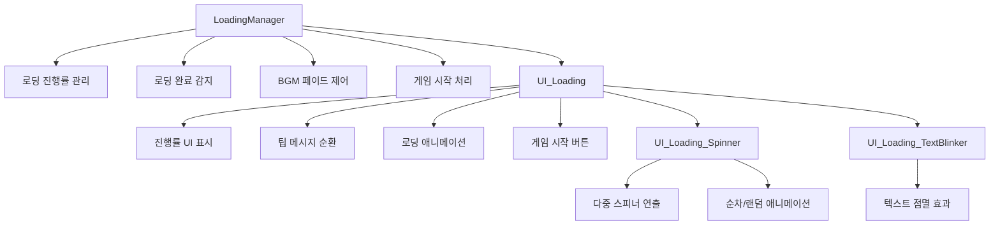

# 로딩 시스템

## 개요

메토체스의 로딩 시스템은 **LoadingManager**와 **UI_Loading** 컴포넌트를 중심으로 게임 로딩 과정을 관리합니다. 단순한 진행률 표시를 넘어서 **팁 메시지 순환 표시**, **애니메이션 연출**, **BGM 페이드 제어**, **다중 스피너 효과** 등을 통해 플레이어에게 시각적으로 풍부한 로딩 경험을 제공합니다.

## 시스템 구조

### 핵심 컴포넌트 관계도



## 로딩 진행률 관리

### LoadingManager 핵심 기능

**LoadingManager**는 서버-클라이언트 동기화를 통해 전체 로딩 진행률을 추적하고 관리합니다.

#### 로딩 단계 정의
```lua
-- LoadingManager :: ClearLoadedCount()
self.NeedLoadCount["UnitSampleSpawn"] = 1      -- 유닛 샘플 스폰
self.NeedLoadCount["ProjectileSampleSpawn"] = 1 -- 투사체 샘플 스폰  
self.NeedLoadCount["GameDataLoad"] = 1         -- 게임 데이터 로드

-- 초기 로딩 상태
self.LoadedCount["UnitSampleSpawn"] = 0
self.LoadedCount["ProjectileSampleSpawn"] = 0
self.LoadedCount["GameDataLoad"] = 0
```

#### 진행률 계산 및 동기화
```lua
-- LoadingManager :: OnSyncProperty()
local totalNeedCount = 0
for key, value in pairs(self.NeedLoadCount) do
    totalNeedCount += value
end

local totalLoadedCount = 0  
for key, value in pairs(self.LoadedCount) do
    totalLoadedCount += value
end

-- UI에 진행률 전달
self:SetProgressUI(totalLoadedCount / totalNeedCount)
```

### 로딩 완료 처리

#### GameStart() - 로딩 완료 시 실행
```lua
-- 로딩 완료 여부 검증
if totalLoadedCount / totalNeedCount < 1 then
    return  -- 아직 로딩 미완료
end

-- 로딩창 비활성화
self:SetEnableUI(false, self.Entity.OwnerId)

-- 스테이지 이동 연출 시작
_BackgroundChangeLogic:GotoNextNode(gameManager.Stage, self.Entity.OwnerId)
_BackgroundChangeLogic:SetBg(gameManager.Stage, self.Entity.OwnerId)

-- 게임 시작 (1.8초 후)
_TimerService:SetTimerOnce(gotonext, 1.8)
```

## UI 로딩 시스템

### UI_Loading 컴포넌트 구성

**UI_Loading**은 로딩 화면의 모든 시각적 요소를 관리합니다:

| 엔티티 | 역할 | 설명 |
|--------|------|------|
| **Text_Tip** | 팁 메시지 | 5초마다 순환하는 게임 팁 |
| **Text_LoadingState** | 로딩 상태 텍스트 | 현재 로딩 단계 표시 |
| **Sprite_ProgressBar** | 진행률 바 | FillAmount로 진행률 표시 |
| **Particle_Progress** | 진행률 파티클 | 진행률 바와 연동된 파티클 효과 |
| **Text_ProgressRate** | 진행률 퍼센트 | "75%" 형태의 수치 표시 |
| **Sprite_LoadingSpinner** | 스피너 애니메이션 | 다중 점 애니메이션 |
| **Button_GameStart** | 게임 시작 버튼 | 로딩 완료 후 활성화 |

### 진행률 애니메이션 시스템

#### SetProgressUI() - 애니메이션과 함께 진행률 업데이트
```lua
-- 즉시 리셋 (애니메이션 없음)
if rate == 0 then
    self.Sprite_ProgressBar.SpriteGUIRendererComponent.FillAmount = 0
    self.Particle_Progress.UITransformComponent.anchoredPosition.x = 0
    self.Text_ProgressRate.TextComponent.Text = "0%"
    return
end

-- 애니메이션 큐에 추가
table.insert(self.ProgressDirectionTimerQueue, delta)

-- 큐가 비어있다면 즉시 실행
if #self.ProgressDirectionTimerQueue == 1 then
    self:PlayLoadingAnim()
end
```

#### 로딩 완료 처리
```lua
-- 100% 달성 시
if rate >= 1.00 then
    -- 게임 시작 버튼 활성화
    setEnable_GameStartButton()
    
    -- 완료 이펙트 재생
    self.Sprite_LoadComplete.Enable = true
    self.Sprite_LoadCompleteDeco.Enable = true
end
```

## 팁 메시지 시스템

### 팁 분류 시스템

**UI_Loading**은 상황에 맞는 팁을 표시하기 위해 두 가지 팁 카테고리를 관리합니다:

#### 팁 데이터 로드 및 분류
```lua
-- UI_Loading :: UpdateUI_Tip()
local tipListDataSet = _DataService:GetTable("LoadingTipList")
for i=1, tipListDataSet:GetRowCount() do
    local row = tipListDataSet:GetRow(i)
    local tipID = row:GetItem("Key")
    local condition = row:GetItem("Condition")
    
    if condition == "Enterance" then
        table.insert(self.TipList_Enterance, tipID)  -- 입장 시 팁
    else
        table.insert(self.TipList_Exit, tipID)       -- 나가는 시 팁
    end
end
```

#### 상황별 팁 선택
```lua
-- 상황에 맞는 랜덤 팁 선택
if self.TipUpdate_IsGoingToLobby == true then
    randomIndex = _UtilLogic:RandomIntegerRange(1, #self.TipList_Exit)
    targetID = self.TipList_Exit[randomIndex]
else
    randomIndex = _UtilLogic:RandomIntegerRange(1, #self.TipList_Enterance)  
    targetID = self.TipList_Enterance[randomIndex]
end

-- 중복 방지
if targetID == self.TipUpdate_LastTipID then
    self:UpdateUI_Tip()  -- 재시도
    return
end
```

### 팁 업데이트 주기
- **업데이트 간격**: 5초마다 자동 변경
- **중복 방지**: 이전 팁과 동일한 경우 재선택
- **OnUpdate()**: 타이머 기반 자동 순환

## 시각적 연출 시스템

### UI_Loading_Spinner - 다중 스피너 애니메이션

**UI_Loading_Spinner**는 로딩 중임을 시각적으로 표현하는 다중 점 애니메이션을 제공합니다.

#### 스피너 설정
```lua
-- 애니메이션 설정
Period: 0.4          -- 다음 점 선택 주기
UpTime: 0.1         -- 올라가는 시간
HoverTime: 0.3      -- 정점에서 머무는 시간
DownTime: 0.1       -- 내려오는 시간
HoverDistance: 2    -- 움직임 거리 (px)
HoverColorAlpha: 0.5 -- 정점에서의 투명도

IsRandomPlaying: false  -- true=랜덤, false=순차
```

#### 애니메이션 로직
```lua
-- 위로 올라가는 애니메이션 
targetEntity.UITransformComponent.anchoredPosition.y = 
    _TweenLogic:Ease(0, self.HoverDistance, 10, EaseType.SineEaseOut, frame)
targetEntity.SpriteGUIRendererComponent.Color.a = 
    _TweenLogic:Ease(1, self.HoverColorAlpha, 10, EaseType.SineEaseOut, frame)

-- 아래로 내려오는 애니메이션
targetEntity.UITransformComponent.anchoredPosition.y = 
    _TweenLogic:Ease(self.HoverDistance, 0, 10, EaseType.SineEaseOut, frame)
```

### UI_Loading_TextBlinker - 텍스트 점멸 효과

**UI_Loading_TextBlinker**는 로딩 텍스트에 부드러운 색상 전환 효과를 제공합니다:

```lua
-- 2초 주기로 색상 변경
Color1: Color(224/255, 234/255, 242/255, 1)  -- 밝은 색
Color2: Color(83/255, 125/255, 207/255, 1)   -- 어두운 색

-- 색상 보간
if self.Time <= 1 then
    local color = Color.Lerp(self.Color1, self.Color2, self.Time / 1)
elseif self.Time <= 2 then  
    local color = Color.Lerp(self.Color2, self.Color1, (self.Time - 1) / 1)
end
```

## BGM 및 사운드 연동

### BGM 페이드 시스템

**LoadingManager**는 로딩 시작과 완료 시점에 **PlaySoundLogic**과 연동하여 BGM을 제어합니다:

#### 로딩 시작 시 페이드 아웃
```lua
-- LoadingManager :: SetEnableUI(true)
if enable then
    -- BGM을 0.5*볼륨으로 페이드 아웃 (1초에 걸쳐)
    _PlaySoundLogic:FadeInFadeOut(false, 1, 0.5*_PlaySoundLogic.BGMVolume, 0)
end
```

#### 로딩 완료 시 BGM 전환
```lua
-- GameManager :: GoToLobby()
-- 로비 BGM으로 전환
_PlaySoundLogic:PlayBGM_Ver2(9)
```

## 맵 전환별 로딩 패턴

### 인게임 → 로비 전환

**GameManager**에서 관리하는 로비 이동 시 특별한 로딩 패턴:

```lua  
-- GameManager :: GoToLobby()
-- 3단계로 나눠서 진행률 표시 (각 33%씩)
local progressRate = 0.0
local setProgressUp = function()
    progressRate += 0.33
    self.Entity.LoadingManager:SetProgressUI(progressRate)
end

-- 0초, 1.3초, 2.6초에 각각 실행
for i=1, 3 do
    _TimerService:SetTimerOnce(setProgressUp, 1.3*(i-1))
end

-- 2.9초에 완료 (진행률 2.0 = 특수 완료 신호)
_TimerService:SetTimerOnce(function()
    self.Entity.LoadingManager:SetProgressUI(2.0)
end, 2.9)
```

### 게임 결과 연동
```lua
-- 게임 종료 후 로비 이동 시
if type == "GameEnd" then
    -- 결과 화면 활성화
    _EntityService:GetEntityByPath("/ui/Lobby_GameResult").Enable = true
    
    -- 경험치 애니메이션 예약
    _TimerService:SetTimerOnce(function()
        _UI_GameResult:PlayAnim_EXP()
    end, 1.5)
end
```

## 확장 및 커스터마이징

### 새로운 로딩 단계 추가

**LoadingManager**에 새 로딩 항목 추가:
```lua
-- ClearLoadedCount()에 추가
self.NeedLoadCount["NewLoadingStep"] = 1
self.LoadedCount["NewLoadingStep"] = 0
```

### 커스텀 팁 추가
**LoadingTipList.csv**에 새 팁 추가하고 조건 설정:
- **Condition**: "Enterance" 또는 "Exit"
- **Key**: 현지화 키 또는 직접 텍스트

### 스피너 커스터마이징
**UI_Loading_Spinner**의 다양한 설정값 조정으로 연출 변경:
- 애니메이션 타이밍 조절
- 색상 및 거리 변경  
- 순차/랜덤 모드 선택

## 코드 참조

### 핵심 로딩 관리
- `RootDesk/MyDesk/UIComponents/LoadingUI/LoadingManager.mlua :: GameStart()` — 로딩 완료 처리
- `RootDesk/MyDesk/UIComponents/LoadingUI/LoadingManager.mlua :: SetProgressUI()` — 진행률 UI 갱신

### UI 및 연출 
- `RootDesk/MyDesk/UIComponents/LoadingUI/UI_Loading.mlua :: PlayLoadingAnim()` — 진행률 애니메이션
- `RootDesk/MyDesk/UIComponents/LoadingUI/UI_Loading.mlua :: UpdateUI_Tip()` — 팁 메시지 순환
- `RootDesk/MyDesk/UIComponents/LoadingUI/UI_Loading_Spinner.mlua :: OnUpdate()` — 스피너 애니메이션
- `RootDesk/MyDesk/UIComponents/LoadingUI/UI_Loading_TextBlinker.mlua :: OnUpdate()` — 텍스트 점멸

### 게임 플로우 연동
- `RootDesk/MyDesk/InGame/Managers/GameManager.mlua :: GoToLobby()` — 로비 이동 로딩 패턴
- `RootDesk/MyDesk/DatasetCacheLogic/PlaySoundLogic.mlua :: FadeInFadeOut()` — BGM 페이드 제어

이러한 체계적인 로딩 시스템을 통해 메토체스는 단순한 대기 시간을 유용한 정보 전달과 시각적 즐거움의 시간으로 변환시켜, 전반적인 사용자 경험을 향상시킵니다.
