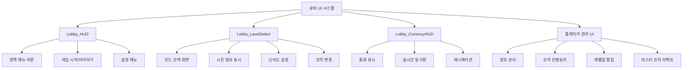

# 로비 UI 시스템

## 개요

메토체스의 로비 UI 시스템은 게임의 **메타게임 허브 역할**을 담당합니다. **Lobby_HUD**를 중심으로 한 메인 네비게이션부터 **Lobby_LevelSelect**의 모드 선택, **Lobby_CurrencyHUD**의 통화 관리, 그리고 다양한 캐릭터 관리 시스템까지 포괄하는 통합된 아웃게임 경험을 제공합니다.

## 시스템 구조

### 로비 UI 구성도



## 1. Lobby_HUD - 메인 로비 인터페이스

### 핵심 구성요소

**Lobby_HUD**는 로비의 메인 인터페이스로서 왼쪽 메뉴 버튼들과 게임 시작 기능을 제공합니다.

#### 왼쪽 메뉴 시스템 (List_LeftMenu)
```lua
-- Lobby_HUD.ui 구조
List_LeftMenu/
├── Button_Event           -- 이벤트 버튼 (RedDot 지원)
├── Button_CoachGacha      -- 코치 가챠 버튼
├── Button_Dictionary      -- 게임 백과사전 버튼  
├── Button_CollectionBook  -- 컬렉션 북 버튼
├── Button_Achievement     -- 업적 버튼
├── Button_Profile         -- 프로필 버튼
└── Button_TitleSetting    -- 칭호 설정 버튼
```

#### 게임 시작/이어하기 시스템

**UI_LobbyHUD**는 저장된 게임 데이터 유무에 따라 버튼을 동적으로 전환합니다:

```lua
-- UI_LobbyHUD :: RefreshUI_LobbyHUD_GameStart()
if hasSavedData == true then
    btn_newGame.Enable = false         -- 새 게임 비활성화
    btn_resumeLastGame.Enable = true   -- 이어하기 활성화
    
    -- 저장된 게임 정보 표시
    text_lastGameInfo:GetChildByName("Level").TextComponent.Text = 
        modeText.." / "..modeLevelText
    text_lastGameInfo:GetChildByName("Round").TextComponent.Text = 
        string.format("%d - %d", needDataLoadStage, needDataLoadRound)
```

#### 모드별 정보 표시
- **Rank Mode**: 랭크 티어 정보 표시
- **Single Mode**: 시즌과 난이도 정보
- **Challenge Mode**: 챌린지 번호와 진행도

## 2. Lobby_LevelSelect - 게임 모드 선택

### 모드 선택 시스템

**UI_LobbyLevelSelect**는 게임 모드 선택의 핵심을 담당합니다.

#### 모드 선택 패널 (Panel_SelectMode)
```lua
-- UI_LobbyLevelSelect :: RefreshUI_ModeSelectPanel()
Button_SingleMode       -- 싱글 모드 
Button_RankMode         -- 랭크 모드 (레벨 10 이상)  
Button_ChallengeMode    -- 챌린지 모드 (조건 확인)
```

#### 입장 조건 검증 시스템

**랭크 모드 조건**:
```lua
-- 레벨 조건 검사
if playerLevel < 10 then
    ui_rank.ButtonComponent.Enable = false
    ui_rank_locked.Enable = true
    ui_rank_locked.TextComponent.Text = 
        _LocalizationService:GetTextFormat("ModeLockedDesc", 10)
end

-- 점검 시간 확인
local leftTimeToNextUpdate = _ModeDataLogic:GetLeftTimeToNextOrdinal()
if leftTimeToNextUpdate["hours"] <= 0 then
    ui_rank.ButtonComponent.Enable = false
    ui_rank_locked.TextComponent.Text = 
        _LocalizationService:GetText("Ranking_CoolTime")
end
```

### 시즌 및 난이도 정보

#### 시즌 정보 패널 (Panel_SeasonInfo)
```lua
-- UI_LobbyLevelSelect :: RefreshUI_SeasonLevelInfo()
ui_seasonIllust         -- 시즌 일러스트
ui_seasonTitle          -- 시즌 제목
ui_seasonDesc           -- 시즌 규칙 설명
```

#### 난이도 설정 (Panel_LevelInfo)
```lua
ui_levelIcon            -- 난이도 플래그 아이콘
ui_levelTitle           -- 난이도 이름
ui_levelDesc            -- 난이도 설명  
ui_penaltyDesc          -- 페널티 설명
```

#### 모드별 포인트 컬러 시스템
각 게임 모드마다 고유한 **포인트 컬러**를 적용하여 시각적 구분을 제공합니다.

## 3. Lobby_CurrencyHUD - 통화 표시 시스템

### 통화 종류 및 관리

**Lobby_CurrencyHUD**는 게임의 3가지 주요 통화를 실시간으로 표시합니다:

| 통화 | 설명 | UI 경로 |
|------|------|---------|
| **Syrup** | 기본 게임 화폐 | `Currency_1/Amount` |
| **RoyalSyrup** | 프리미엄 화폐 | `Currency_2/Amount` |
| **Repechage** | 패자부활권 | `Currency_3/Amount` |

#### 실시간 동기화 시스템

**PlayerDataComponent**에서 통화 변경 시 자동으로 UI를 갱신합니다:

```lua
-- PlayerDataComponent :: OnSyncProperty()
if name == "Syrup" then
    local ui_currency = _EntityService:GetEntityByPath(
        "/ui/Lobby_CurrencyHUD/List_Currency/Currency_1/Amount")
    ui_currency.TextComponent.Text = string.format("%d", self.Syrup)

elseif name == "Repechage" or name == "Repechage_Free" then
    local ui_currency = _EntityService:GetEntityByPath(
        "/ui/Lobby_CurrencyHUD/List_Currency/Currency_3/Amount")
    ui_currency.TextComponent.Text = string.format("%d", 
        self.Repechage + self.Repechage_Free)
    
    -- 툴팁 정보 업데이트
    ui_currency.Parent.UI_SimpleTooltipActivator.Desc = 
        _LocalizationService:GetText("Repechage_Tooltip").."\n\n"..
        _LocalizationService:GetTextFormat("Repechage_Tooltip_Extra", 
            self.Repechage_Free, self.Repechage)
```

#### 애니메이션 연출
통화 변경 시 **UI_SimpleTooltipActivator**를 통한 툴팁과 함께 시각적 피드백을 제공합니다.

## 4. 칭호 관리 시스템

### UI_PlayerTitleButton - 칭호 설정

**칭호 시스템**은 3가지 요소를 조합하여 플레이어 개성을 표현합니다:

#### 칭호 구성 요소
```lua
-- UI_PlayerTitleButton 구성
NameTag         -- 네임태그 (등급별 색상)
KeyWordFront    -- 앞 키워드  
KeyWordBack     -- 뒤 키워드
```

#### 칭호 요소 관리 시스템
```lua
-- UI_PlayerTitleButton :: callTitleElementList()
-- 현재 보유중인 항목만 보기 옵션
if _UI_PlayerTitleSetting.ShowOwnedTitlesOnly then
    targetTable = _UI_PlayerTitleSetting.KWFTable_owned  -- 보유 중인 것만
else  
    targetTable = keywordFrontTable  -- 전체 목록
end

-- 보유 여부에 따른 잠금 처리
if targetTitleData[elementID] == true then
    titleElement:GetChildByName("LockedCover").Enable = false
    titleElement.ButtonComponent.Enable = true
else
    titleElement:GetChildByName("LockedCover").Enable = true  
    titleElement.ButtonComponent.Enable = false
end
```

#### 네임태그 등급 색상 시스템
```lua
-- UI_PlayerTitleButton :: SetNameTagFontColor()
local fontColor
if tonumber(NTRank) == 0 then fontColor = Color.FromHexCode("#FFFFFF")  -- 기본
elseif tonumber(NTRank) == 2 then fontColor = Color.FromHexCode("#85db8f")  -- 초록
elseif tonumber(NTRank) == 3 then fontColor = Color.FromHexCode("#859fdb")  -- 파랑
elseif tonumber(NTRank) == 9 then fontColor = Color.FromHexCode("#ff5252")  -- 빨강 (최고등급)
```

#### 레드닷 시스템
```lua
-- 새 칭호 획득 시 레드닷 표시
if isvalid(titleManager.redDotTable[elementID]) then
    titleElement:GetChildByName("RedDot").Enable = true
else
    titleElement:GetChildByName("RedDot").Enable = false
end
```

## 5. 코치 인벤토리 시스템

### UI_LobbyCoachInventory - 코치 관리

**코치 보관함**은 소유한 코치들을 관리하고 동행 코치를 선택하는 시스템입니다.

#### 동행 코치 표시
```lua
-- UI_LobbyCoachInventory :: RefreshFollowingCoach()
if _UtilLogic:IsNilorEmptyString(self.CurrentFollowingCoachID) == false then
    -- 코치가 있는 경우
    local coachData = _CoachService:GetCoachInfo(self.CurrentFollowingCoachID)
    coach_icon.SpriteGUIRendererComponent.ImageRUID = coachData.ProfileRUID
    coach_name.TextComponent.Text = coachData.Name
else
    -- 코치가 없는 경우 (기본 고양이 + 머터리얼)
    coach_icon.SpriteGUIRendererComponent.ImageRUID = "f8756e7774ae4d2bb0ed2c65ec81d706"
    coach_icon.SpriteGUIRendererComponent.MaterialId = 
        "material://e70dfe07-01ad-4ddc-bc12-f0858c772837"
    coach_name.TextComponent.Text = _LocalizationService:GetText("Coach_None")
end
```

#### 마스터 코치 이펙트 시스템

**마스터 코치**(HasType == 2)인 경우 특별한 이펙트를 적용합니다:

```lua
-- 마스터 코치 이펙트 활성화
if _UserService.LocalPlayer.CoachManager:GetHasType(self.CurrentFollowingCoachID) == 2 then 
    self:EnableMasterCoachEffect(true)
    
    -- 로비 맵의 코치 엔티티에 이펙트 적용
    local myCoach = _EntityService:GetEntityByPath("/maps/Lobby/coach"..senderUserId)
    local effect = myCoach:GetChildByName("Effect")
    effect:SetEnable(coachManager.MasterCoachEffect)
```

#### 코치 정렬 시스템
```lua
-- 보유 여부별 정렬
property boolean SortByPossession = true

-- 코스트별 필터링
property integer ShowingCoachCost = -3  -- -3(전체), 1~5(코스트별)
```

## 6. 특수 UI 시스템들

### UI_ChanceTable - 가챠 확률 표시

**CharacterShopManager_New**와 연동하여 캐릭터 상점의 코스트별 등장 확률을 표시합니다:

```lua
-- CharacterShopManager_New :: UI_RefreshChanceList()
local chanceListUI = _EntityService:GetEntityByPath(
    "/ui/Arena_ReadyPhase/ShopPanel/CharacterShop/List_ChanceTable")

for i=1, 5 do
    local slot = chanceListUI:GetChildByName(string.format("Chance_%d", i))
    slot:GetChildByName("Text").TextComponent.Text = string.format("%d%%", costProb[i])
end
```

### UI_LevelUpPopup - 레벨업 보상

**PlayerLevelLogic**과 연동하여 레벨업 시 보상 팝업을 표시합니다:

#### 레벨업 팝업 설정
```lua
-- PlayerLevelLogic :: SetUI_LevelUpPopup()
-- 레벨 표시
ui_lvupGroup:GetChildByName("t_beforeLevel").TextComponent.Text = 
    string.format("%d", beforeLevel)
ui_lvupGroup:GetChildByName("t_UpLevel").TextComponent.Text = 
    string.format("%d", afterLevel)

-- 기본 보상 (시럽)
if rewardSyrup > 0 then
    self.UI_LvUp_Reward1.Enable = true
    self.UI_LvUp_Reward1:GetChildByName("t_amount").TextComponent.Text = 
        string.format("%d", rewardSyrup)
end
```

#### 특별 보상 처리
```lua
-- 모드 해금 보상
if rewardInfo[1] == "ModeOpen" then
    if rewardInfo[2] == "RankMode" then
        ui_reward2_icon.SpriteGUIRendererComponent.ImageRUID = 
            "ea216e4763e14908aa4f115fdf356a43"  -- 랭크 모드 아이콘
        modeText = _LocalizationService:GetText("GameMode_Rank")
    else  -- Challenge Mode
        ui_reward2_icon.SpriteGUIRendererComponent.ImageRUID = 
            "39d166064d7945929c3800cd00423c72"  -- 챌린지 모드 아이콘
        modeText = _LocalizationService:GetText("GameMode_Challenge")
    end
end
```

#### 팝업 애니메이션
```lua
-- PlayerLevelLogic :: EnableUI_LevelUpPopup()  
-- 1초에 걸쳐 페이드인 애니메이션
local alpha = 0
local setPopupAlpha = function()
    alpha += 0.02
    ui_levelUpPopup.CanvasGroupComponent.GroupAlpha = alpha
end
for i=1, 50 do
    _TimerService:SetTimerOnce(setPopupAlpha, 0.02*i)
end
```

## 7. 통합 UI 관리

### 팝업 및 패널 시스템

로비 UI는 다양한 팝업과 패널을 계층적으로 관리합니다:

#### 주요 팝업들
- **Dictionary**: 게임 백과사전 
- **CollectionBook**: 컬렉션 관리
- **ProfileGroup**: 플레이어 프로필
- **ESCMenu**: 설정 메뉴
- **Lobby_GameResult**: 게임 결과 화면

#### UI 상태 관리
```lua
-- UI 그룹별 Enable/Disable 관리
ui_selectMode.Enable = true      -- 모드 선택 화면
ui_selectCoach.Enable = false    -- 코치 선택 화면  
ui_main.Enable = false           -- 메인 설정 화면
ui_resume.Enable = false         -- 이어하기 화면
```

### 카메라 줌 연동

**UI_CameraZoomLogic**과 연동하여 특정 UI 접근 시 카메라 줌 효과를 제공합니다:

```lua
-- UI_PlayerTitleButton에서 프로필 버튼 클릭 시
_UI_CameraZoomLogic:Zoom()  -- 카메라 줌 토글
_UI_Profile:RequestData(_UserService.LocalPlayer.OwnerId)  -- 프로필 데이터 요청
```

## 코드 참조

### 메인 로비 인터페이스
- `ui/Lobby_HUD.ui` — 로비 메인 화면 엔티티 구성
- `RootDesk/MyDesk/UIComponents/UI_Lobby/UI_LobbyHUD.mlua :: RefreshUI_LobbyHUD_GameStart()` — 게임 시작/이어하기 전환

### 모드 선택 시스템  
- `ui/Lobby_LevelSelect.ui` — 레벨 선택 화면 엔티티 구성
- `RootDesk/MyDesk/UIComponents/UI_Lobby/UI_LobbyLevelSelect.mlua :: RefreshUI_ModeSelectPanel()` — 모드 선택 조건 확인
- `RootDesk/MyDesk/UIComponents/UI_Lobby/UI_LobbyLevelSelect.mlua :: RefreshUI_SeasonLevelInfo()` — 시즌/난이도 정보 갱신

### 통화 및 데이터 관리
- `ui/Lobby_CurrencyHUD.ui` — 통화 표시 UI 구성  
- `RootDesk/MyDesk/DataStorage/PlayerDataComponent.mlua :: OnSyncProperty()` — 통화 실시간 동기화

### 플레이어 개성화 시스템
- `RootDesk/MyDesk/UIComponents/UI_Lobby/UI_PlayerTitleButton.mlua :: callTitleElementList()` — 칭호 요소 목록 관리
- `RootDesk/MyDesk/UIComponents/UI_Lobby/UI_PlayerTitleButton.mlua :: SetNameTagFontColor()` — 네임태그 등급 색상
- `RootDesk/MyDesk/UIComponents/UI_Lobby/UI_LobbyCoachInventory.mlua :: RefreshFollowingCoach()` — 동행 코치 표시

### 보상 및 이펙트 시스템
- `RootDesk/MyDesk/Player/PlayerLevelLogic.mlua :: SetUI_LevelUpPopup()` — 레벨업 팝업 설정
- `RootDesk/MyDesk/OutGame/Coach/CoachService.mlua` — 마스터 코치 이펙트 관리
- `RootDesk/MyDesk/UIComponents/UI_Lobby/UI_ChanceTable.mlua` — 가챠 확률 표시

이러한 체계적인 로비 UI 시스템을 통해 메토체스는 플레이어에게 직관적이고 풍부한 메타게임 경험을 제공하며, 게임의 다양한 기능들에 대한 자연스러운 접근점 역할을 수행합니다.


