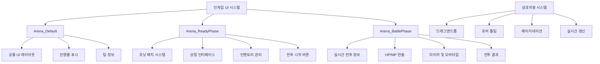

# 인게임 UI 시스템

## 개요

메토체스의 인게임 UI 시스템은 **Arena_ReadyPhase**의 전투 준비부터 **Arena_BattlePhase**의 실시간 전투까지, 게임의 핵심 플레이 경험을 지원하는 통합된 인터페이스를 제공합니다. 드래그앤드롭, 실시간 정보 갱신, 호버 툴팁, 페이지네이션 등 다양한 상호작용 시스템이 유기적으로 연결되어 직관적이고 반응적인 게임플레이를 구현합니다.

## 시스템 구조

### 인게임 UI 구성도



## 1. Arena_Default - 공통 기본 레이아웃

### 핵심 구성요소

**Arena_Default**는 모든 인게임 화면에서 공통으로 사용되는 기본 레이아웃과 정보를 제공합니다.

#### Progress 시스템
```lua
-- GameManager :: Ready_OnClient()
local ui_progressBar = _EntityService:GetEntityByPath("/ui/Arena_Default/Progress")
ui_progressBar.UITweenScale:Play()

-- Progress UI 사이즈 조절 (게임모드/라운드/하트 정보 표시)
ui_progressBar.UITweenScale.from.x = 650
ui_progressBar.UITweenScale.to.x = 1400
```

#### 페이즈 전환 애니메이션
```lua  
-- 현재 단계 알림 팝업 (Ready/Battle)
local progressPopupUI = _EntityService:GetEntityByPath("/ui/Arena_Default/ProgressPoup")
progressPopupUI:GetChildByName("Text_Phase").TextComponent.Text = "Ready"

-- Ease 애니메이션 (내려오기 → 올라가기)
progressPopupUI.UITransformComponent.anchoredPosition.y = 
    _TweenLogic:Ease(300, -300, 0.4, EaseType.QuintEaseOut, t1)
```

#### 온필드 유닛 수 표시
```lua
-- Ready Phase에서만 활성화
_EntityService:GetEntityByPath("/ui/Arena_Default/Text_OnFieldUnitsCount").Enable = true
```

## 2. Arena_ReadyPhase - 전투 준비 화면

### 유닛 배치 시스템

**Arena_ReadyPhase**는 전투 준비 단계의 모든 상호작용을 관리합니다.

#### 메인 구성요소
```lua
-- Arena_ReadyPhase.ui 주요 엔티티
DefaultPanel/
├── Button_StartBattle     -- 전투 시작 버튼 (ArenaUI_BattleStartButton)
├── ShopPanel/            -- 상점 시스템
│   ├── CharacterShop/    -- 캐릭터 상점
│   ├── ItemShop/         -- 아이템 상점  
│   └── RuneShop/         -- 룬카드 상점
└── InventoryPanel/       -- 인벤토리 시스템
```

#### UI 그룹 전환
```lua
-- GameManager :: Ready_OnClient()
self.UIGroup_ReadyPhase.Enable = true 
self.UIGroup_BattlePhase.Enable = false

-- GameManager :: SetBattle_OnClient()  
self.UIGroup_ReadyPhase.Enable = false
self.UIGroup_BattlePhase.Enable = true
```

## 3. Arena_BattlePhase - 전투 진행 화면

### 실시간 전투 정보

**Arena_BattlePhase**는 전투 중 실시간 정보와 상황을 표시합니다.

#### 팀 HP 시스템
```lua
-- GameManager :: RefreshUI_TeamHPInfo() 
if team == "User" then
    self.UI_UserTeamHPBar.SpriteGUIRendererComponent.FillAmount = 
        self.TeamHP_User / self.TeamHPMax_User
    self.UI_UserTeamHPBar_dir.UI_HPShrinkBar.ShrinkTime = 1
else
    self.UI_EnemyTeamHPBar.SpriteGUIRendererComponent.FillAmount = 
        self.TeamHP_Enemy / self.TeamHPMax_Enemy
    self.UI_EnemyTeamHPBar_dir.UI_HPShrinkBar.ShrinkTime = 1
end
```

#### 팀 정보 UI (TeamInfo_User/TeamInfo_Enemy)
```lua
-- 유저 팀 정보 갱신
local ui_userTeamInfo = _EntityService:GetEntityByPath(
    "/ui/Arena_BattlePhase/TeamInfo/TeamInfo_User")
setUI(ui_userTeamInfo, self.Entity.PlayerComponent.Nickname, 
    self.Entity.TeamManager.OwnRunes, "User")

-- 상대 팀 정보 갱신  
local ui_enemyTeamInfo = _EntityService:GetEntityByPath(
    "/ui/Arena_BattlePhase/TeamInfo/TeamInfo_Enemy")
setUI(ui_enemyTeamInfo, _LocalizationService:GetText(mainEnemyID.."_EnemyName"), 
    runeList, "Enemy")
```

## 4. 상점 시스템

### 캐릭터 상점 (UI_CharShopProduct)

**CharacterShopManager_New**와 연동하여 캐릭터 구매 인터페이스를 제공합니다.

#### 상품 정보 표시
```lua
-- UI_CharShopProduct 구성
property Entity UI_Sprite              -- 캐릭터 스프라이트
property Entity UI_Name                -- 캐릭터 이름
property Entity UI_CostText            -- 가격 표시
property Entity UI_SynergyList_2type   -- 2개 시너지 표시
property Entity UI_SynergyList_3type   -- 3개 시너지 표시
property Entity UI_Stars               -- 등급별 별 표시
property Entity UI_FavoriteMark        -- 즐겨찾기 마크
```

#### 구매 처리 시스템
```lua
-- UI_CharShopProduct :: HandleButtonClickEvent()
-- 골드 부족 검사
if _UserService.LocalPlayer.TeamManager.Golds < self.cost then
    user:SendEvent((NotEnoughCoin()))
    return
end

-- 튜토리얼 진행 체크
if user.GameManager.ModeType == "Tutorial" then
    if self:CheckTutorial() == false then
        _UIToast:ShowMessageByLocalizingKey("Toast_TutoTargetButtonError")
        return	
    end
end

-- 구매 실행
_UserService.LocalPlayer.CharacterShopManager_New:BuyCharacter_Check(self.SlotIdx)
```

#### 호버 툴팁 연동
```lua
-- UI_CharShopProduct :: HandleUITouchEnterEvent()
_UI_Tooltip:SetCharShopInfo(true, self.CharID, slotIdx, true, "CharShop")
```

### 아이템/룬카드 상점

#### UI_ItemShopSlot - 아이템 상점 슬롯
```lua
-- 아이템 정보 툴팁 표시
-- 우클릭 시 합성표 확인 기능
```

#### UI_RuneShopProductButton - 룬카드 상점
```lua
-- UI_RuneShopProductButton :: HandleButtonStateChangeEvent()
if state == ButtonState.Hover then
    _UI_Tooltip:SetRuneInfoUI(true, spriteRUID, self.Name, self.Desc, 
        self.Grade, self.Cost, self.Tag_Indestructible, 
        self.Tag_Deactivated, self.Tag_Incineration, "Shop")
end
```

#### 확률 표시 시스템 (UI_ChanceTable)
```lua
-- CharacterShopManager_New :: UI_RefreshChanceList()
local chanceListUI = _EntityService:GetEntityByPath(
    "/ui/Arena_ReadyPhase/ShopPanel/CharacterShop/List_ChanceTable")

for i=1, 5 do
    local slot = chanceListUI:GetChildByName(string.format("Chance_%d", i))
    slot:GetChildByName("Text").TextComponent.Text = string.format("%d%%", costProb[i])
end
```

## 5. 인벤토리 시스템

### UI_Inventory - 통합 인벤토리 관리

**UI_Inventory**는 아이템과 룬카드 인벤토리를 통합 관리합니다.

#### 인벤토리 구성
```lua
-- UI_Inventory 핵심 프로퍼티
property Entity UI_Inventory        -- 아이템 인벤토리
property Entity UI_RuneInventory    -- 룬카드 인벤토리
property number CurrentShowingPage  -- 현재 페이지
property integer ItemSlotCount_Item -- 아이템 슬롯 수 (10개)

-- 캐싱 시스템
property SyncTable<string, string> IconRUID        -- 아이콘 캐시
property SyncTable<string, string> ItemType        -- 타입 캐시  
property SyncTable<string, string> ItemName        -- 이름 캐시
```

#### 캐시 시스템
```lua
-- UI_Inventory :: ResistCache()
local itemInfoTable = _DataService:GetTable("ItemStatus")
for i=1, itemInfoTable:GetRowCount() do
    local row = itemInfoTable:GetRow(i)
    local key = row:GetItem("ItemID")
    self.IconRUID[key] = row:GetItem("RUID")
    self.ItemType[key] = row:GetItem("Type")
    self.ItemName[key] = _LocalizationService:GetText("Item_"..key.."_Name")
end
```

#### 페이지네이션 시스템
```lua
-- UI_Inventory :: RefreshPageMoveButton()
-- 다음/이전 페이지 버튼 활성화/비활성화 처리
```

### 드래그앤드롭 시스템

#### UI_InventoryItemSlot - 아이템 드래그
```lua
-- 드래그앤드롭 처리
-- 툴팁 표시
-- 아웃라인 효과
-- 우클릭 합성표 확인
```

#### 유닛 배치 드래그 (UnitSetLogic_New)
```lua
-- 전투 시작 시 드래그 종료 처리
if isvalid(_UnitSetLogic_New.SelectUnit) then
    _UnitSetLogic_New.SelectUnit.Visible = true 
    _UnitSetLogic_New.DragSample.Visible = false 
    _UnitSetLogic_New.SelectUnit = nil
    
    _UserService.LocalPlayer.CharacterShopManager_New:UI_ShowSellUI(false, 0)
    _GeneralDirectorLogic:SetTileDirection_Main("OnDragging", false)
end
```

#### 아이템/룬카드 드래그 (ItemSetLogic, RuneCardSetLogic)
```lua
-- 아이템 드래그 종료
if isvalid(_ItemSetLogic.DraggingEntity) then
    _ItemSetLogic.MouseChaser.Enable = false
    _ItemSetLogic.DraggingEntity.Visible = true
    _ItemSetLogic.DraggingEntity = nil
end

-- 룬카드 드래그 종료
if isvalid(_RuneCardSetLogic.CurrentDraggingEntity) then
    _RuneCardSetLogic.DragChaser.Enable = false
    _RuneCardSetLogic.CurrentDraggingEntity.Visible = true
    _RuneCardSetLogic.CurrentDraggingEntity = nil
end
```

## 6. 유닛 정보 시스템

### UI_UnitInfoPopup - 유닛 상세 정보

**UI_UnitInfoPopup**는 우클릭한 유닛의 상세 정보를 표시합니다.

#### 정보 표시 구성요소
```lua
-- UI_UnitInfoPopup :: UI_Init()
local charInfoRow = charInfoTable:FindRow("CharID", charId)
local charSynergyRow = charSynergyTable:FindRow("CharID", charId)

-- 기본 정보
local defaultCost = tonumber(charInfoRow:GetItem("Cost"))
local resellCost = defaultCost * unitInfo.level - 1
local spriteRUID = charInfoRow:GetItem("IdleRUID")
local role = _LocalizationService:GetText("CharacterRole_"..charInfoRow:GetItem("Role"))

-- 시너지 정보 (최대 3개)
local synergyID = {}
for i=1, 3 do
    synergyID[i] = charSynergyRow:GetItem(string.format("Synergy_%d", i))
end
```

#### 실시간 정보 갱신
```lua
-- UI_UnitInfoPopup :: UI_Update()
-- HP/MP/스탯/아이템/시너지 실시간 갱신
-- 병합 처리 (동일 캐릭터 합성)
-- 캐릭터 상점 미리보기
```

#### 호버 시스템 연동
- **UI_UnitInfo_HoverSkill**: 스킬 정보 툴팁
- **UI_UnitInfo_HoverStat**: 스탯 정보 툴팁  
- **UI_UnitInfo_HoverSynergy**: 시너지 정보 툴팁
- **UI_UnitInfo_ItemSlot**: 아이템 정보 및 조합표

### UI_SynergyListComponent - 시너지 목록

**시너지 목록**은 현재 보유한 시너지들을 단계별로 표시합니다.

#### 시너지 표시 기능
```lua
-- 단계별 색상 표시
-- 호버 툴팁
-- 룬카드 강화 연출
-- 통계 UI 지원
```

#### 페이지네이션
**UI_SynergyListNextPageButton**을 통한 시너지 리스트 페이지 순환

## 7. HP/MP 연출 시스템

### UI_HPShrinkBar - HP 감소 연출

**UI_HPShrinkBar**는 HP 변화를 시각적으로 표현하는 지연된 감소 연출을 제공합니다.

#### 연출 메커니즘
```lua
-- UI_HPShrinkBar :: OnUpdate()
if self.ShrinkTime > 0 then
    self.ShrinkTime -= delta
    
    local currentValue = self.Entity.SpriteGUIRendererComponent.FillAmount
    local targetValue = self.UI_TargetHPBar.SpriteGUIRendererComponent.FillAmount
    
    -- 보간 애니메이션 (1초에 걸쳐 자연스럽게 감소)
    self.Entity.SpriteGUIRendererComponent.FillAmount = 
        self:Lerp(currentValue, targetValue, self.ShrinkTime / 1)
end
```

#### 적용 범위
```lua
-- UnitInfoUILogic :: SetBar()
-- 개별 유닛 HP 바
local hpBarShrink = statInfoUI:GetChildByName("HPBar_dir")
hpBarShrink.UI_HPShrinkBar.ShrinkTime = 1

-- GameManager :: RefreshUI_TeamHPInfo()
-- 팀 전체 HP 바
self.UI_UserTeamHPBar_dir.UI_HPShrinkBar.ShrinkTime = 1
```

### 실시간 스탯 표시

#### HP/MP/Shield 계산
```lua
-- UnitInfoUILogic :: SetBar()
if unitStatus.HP + unitStatus.Shield > unitStatus.MaxHP then
    shieldBar.SpriteGUIRendererComponent.FillAmount = 1
    hpBar.SpriteGUIRendererComponent.FillAmount = 
        unitStatus.HP / (unitStatus.MaxHP + unitStatus.Shield)
else
    shieldBar.SpriteGUIRendererComponent.FillAmount = 
        (unitStatus.HP + unitStatus.Shield) / unitStatus.MaxHP
    hpBar.SpriteGUIRendererComponent.FillAmount = unitStatus.HP / unitStatus.MaxHP
end

mpBar.SpriteGUIRendererComponent.FillAmount = unitStatus.MP / unitStatus.MaxMP
```

## 8. 페이지네이션 및 스크롤 시스템

### CustomScrollLayoutComponent - 범용 페이지네이션

**CustomScrollLayoutComponent**는 다양한 UI에서 사용되는 페이지네이션을 제공합니다.

#### 핵심 설정
```lua
-- CustomScrollLayoutComponent 주요 프로퍼티
property string ChildAlignment = "UpperLeft"    -- 정렬 방식
property boolean ReverseArrange = false         -- 역순 정렬
property integer SlotCountPerPage = 0          -- 페이지당 슬롯 수
property integer CurrentScroll = 1             -- 현재 페이지
property integer MaxScrollCount = 1            -- 최대 페이지 수
```

#### 스크롤바 드래그 지원
```lua
-- OnBeginPlay() 스크롤바 드래그 이벤트 연결
self.ScrollBarEntity:ConnectEvent(UITouchBeginDragEvent, function(event)
    self.ScrollbarDragStartPosition = e.TouchPoint.y
end)

self.ScrollBarEntity:ConnectEvent(UITouchDragEvent, function(event)
    self:OnDragScrollBar(event)
end)
```

### 적용 사례
- **코치 인벤토리**: 코치 목록 페이지네이션
- **시너지 리스트**: 시너지 목록 페이지 전환
- **아이템 인벤토리**: 아이템 목록 스크롤
- **상점 시스템**: 상품 목록 관리

## 9. 툴팁 및 호버 시스템

### UI_Tooltip - 통합 툴팁 관리

**UI_Tooltip**은 게임 내 모든 호버 정보를 통합 관리합니다.

#### 툴팁 종류별 처리
```lua
-- 캐릭터 상점 정보
_UI_Tooltip:SetCharShopInfo(true, charID, slotIdx, true, "CharShop")

-- 룬카드 정보  
_UI_Tooltip:SetRuneInfoUI(true, spriteRUID, name, desc, grade, cost, 
    indestructible, deactivated, incineration, "Shop")

// 아이템 정보
// 스킬 정보
// 스탯 정보
// 시너지 정보
```

#### 위치 및 표시 관리
- **마우스 추적**: 커서 위치에 따른 툴팁 배치
- **화면 경계 처리**: 화면 밖으로 나가지 않도록 위치 조정
- **중복 방지**: 동시 여러 툴팁 표시 방지

## 10. 리롤 및 특수 시스템

### 리롤 시스템

#### UI_RuneRerollButton - 룬카드 리롤
```lua
-- 룬카드 슬롯 번호에 따라 리롤 가능 여부 체크
-- 리롤 기회 소모하여 룬카드 재뽑기
```

#### 캐릭터 상점 리롤
**CharacterShopManager_New**를 통한 상점 목록 갱신

### 특수 UI 처리

#### 튜토리얼 연동
```lua
-- 튜토리얼 진행 시 특정 버튼만 활성화
if user.GameManager.ModeType == "Tutorial" then
    if self:CheckTutorial() == false then
        _UIToast:ShowMessageByLocalizingKey("Toast_TutoTargetButtonError")
        return
    end
end
```

#### 팬텀 룬 특수 처리
**UI_RuneInventroyItemButton**에서 팬텀 룬(RC40003) 특수 표시

## 코드 참조

### 기본 레이아웃 시스템
- `ui/Arena_Default.ui` — 아레나 공통 UI 레이아웃
- `ui/Arena_ReadyPhase.ui` — 준비 단계 UI 구성
- `ui/Arena_BattlePhase.ui` — 전투 단계 UI 구성

### 상점 시스템
- `RootDesk/MyDesk/UIComponents/UI_Ingame/UI_CharShopProduct.mlua :: HandleButtonClickEvent()` — 캐릭터 구매 처리
- `RootDesk/MyDesk/UIComponents/UI_Ingame/UI_RuneShopProductButton.mlua :: SetProperty()` — 룬카드 상품 설정
- `RootDesk/MyDesk/InGame/Managers/CharacterShopManager_New.mlua :: UI_RefreshChanceList()` — 확률 표시

### 인벤토리 및 드래그앤드롭
- `RootDesk/MyDesk/UIComponents/UI_Ingame/UI_Inventory.mlua :: ResistCache()` — 인벤토리 캐시 시스템
- `RootDesk/MyDesk/InGame/System/UnitSetLogic_New.mlua` — 유닛 드래그앤드롭
- `RootDesk/MyDesk/InGame/System/ItemSetLogic.mlua` — 아이템 드래그앤드롭
- `RootDesk/MyDesk/InGame/System/RuneCardSetLogic.mlua` — 룬카드 드래그앤드롭

### 정보 표시 시스템
- `RootDesk/MyDesk/UIComponents/UI_Ingame/UI_UnitInfoPopup.mlua :: UI_Init()` — 유닛 정보 초기화
- `RootDesk/MyDesk/UIComponents/UI_Ingame/UI_SynergyListComponent.mlua` — 시너지 목록 관리
- `RootDesk/MyDesk/UIComponents/UI_Ingame/UI_HPShrinkBar.mlua :: OnUpdate()` — HP 감소 연출

### UI 프레임워크
- `RootDesk/MyDesk/UIComponents/UI_Common/CustomScrollLayoutCompo/CustomScrollLayoutComponent.mlua` — 페이지네이션
- `RootDesk/MyDesk/InGame/System/UnitInfoUILogic.mlua :: SetBar()` — 실시간 스탯 표시
- `RootDesk/MyDesk/InGame/Managers/GameManager.mlua :: Ready_OnClient()` — UI 그룹 전환

이러한 체계적인 인게임 UI 시스템을 통해 메토체스는 복잡한 오토 체스 게임플레이를 직관적이고 반응적인 인터페이스로 제공하며, 플레이어가 전략적 결정에 집중할 수 있는 최적화된 사용자 경험을 구현합니다.


