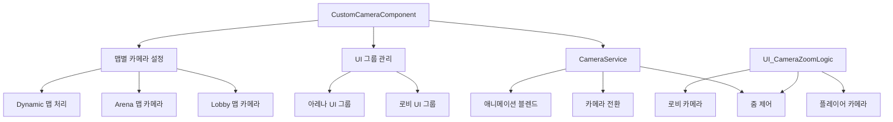

# 카메라 시스템

## 개요

메토체스의 카메라 시스템은 **CustomCameraComponent**를 중심으로 맵별 카메라 설정과 UI 그룹 관리를 통합하여 처리합니다. MapleStory Worlds의 **CameraService**를 기반으로 하여 맵 전환 시 자동으로 적절한 카메라와 UI 설정을 적용하며, 로비에서는 줌 기능을 통한 특별한 카메라 효과도 제공합니다.

## 시스템 구조

### 핵심 컴포넌트 관계도



## 맵별 카메라 제어

### CustomCameraComponent 핵심 기능

**CustomCameraComponent**는 맵 입장 시 자동으로 실행되어 현재 맵에 맞는 카메라와 UI 설정을 적용합니다.

#### 로비 맵 설정
```lua
-- CustomCameraComponent :: OnBeginPlay()
if currentMapName == "Lobby" then
    -- 로비 UI 활성화
    ui_lobbyHUD.Enable = true
    ui_lobbycurrencyHUD.Enable = true
    
    -- 아레나 UI 비활성화  
    ui_arena_Default.Enable = false
    ui_arena_Ready.Enable = false
    ui_arena_battle.Enable = false
    ui_gameResult.Enable = false
```

#### 아레나/동적 맵 설정
```lua
-- 동적 맵(Arena, Field) 진입 시
elseif self.Entity.CurrentMap.MapComponent.IsDynamicMap == true then
    -- 로비 UI 비활성화
    ui_lobbyHUD.Enable = false
    ui_lobbyLevelSelect.Enable = false
    ui_lobbycurrencyHUD.Enable = false
    
    -- 아레나 UI 활성화
    ui_arena_Default.Enable = true  
    ui_arena_Ready.Enable = true
    
    -- 타일 시스템 초기화
    _UnitSetLogic_New:SettingTile(self.Entity.CurrentMap)
```

### UI 그룹 분류

| UI 그룹 | 활성화 맵 | 주요 기능 |
|---------|-----------|-----------|
| **ui_lobbyHUD** | Lobby | 로비 메인 인터페이스, 네비게이션 |
| **ui_lobbycurrencyHUD** | Lobby | 통화 표시, 애니메이션 |
| **ui_lobbyLevelSelect** | Lobby | 게임 모드 선택 화면 |
| **ui_arena_Default** | Arena/Field | 아레나 기본 레이아웃 |
| **ui_arena_Ready** | Arena/Field | 준비 단계 UI (유닛 배치, 상점) |
| **ui_arena_battle** | Arena/Field | 전투 진행 UI (실시간 정보) |
| **ui_gameResult** | Arena/Field | 게임 결과 화면 |

## 카메라 전환 시스템

### CameraService 활용

MapleStory Worlds의 **CameraService**를 통해 부드러운 카메라 전환을 구현합니다:

#### 기본 카메라 전환
```lua
-- 맵 카메라로 전환
_CameraService:SwitchCameraTo(self.Entity.CameraComponent)

-- 블렌드 설정
_CameraService.TransitionBlendType = CameraBlendType.EaseInOut
_CameraService.TransitionBlendTime = 2.0
```

#### CameraService 주요 기능
- **SwitchCameraTo()**: 대상 카메라로 전환
- **ZoomTo()**: 특정 줌 레벨로 애니메이션 
- **ZoomReset()**: 줌 초기화
- **ShakeCamera()**: 카메라 진동 효과

### 카메라 속성 제어

**CameraComponent**의 주요 설정값들:

```lua
-- 카메라 기본 설정
CameraOffset: Vector2(0, 0)          -- 카메라 오프셋
ZoomRatio: 100                       -- 기본 줌 비율  
ZoomRatioMin/Max: 30~500            -- 줌 범위
ConfineCameraArea: true              -- 맵 영역 제한
IsAllowZoomInOut: false              -- 줌 허용 여부

-- 추적 설정
DeadZone: Vector2(0.052, 0.080)     -- 데드존 영역
SoftZone: Vector2(0.268, 0.750)     -- 소프트존 영역  
Damping: Vector2(2.5, 5.0)          -- 카메라 댐핑
```

## 로비 줌 시스템

### UI_CameraZoomLogic 기능

로비에서 특별한 줌 효과를 제공하는 **UI_CameraZoomLogic**:

#### 줌 토글 메커니즘
```lua
-- UI_CameraZoomLogic :: Zoom()
if self.zoomed == false then
    -- 플레이어 카메라로 줌인
    _CameraService:SwitchCameraTo(camera)
    camera.Entity.MovementComponent.Enable = false  -- 이동 비활성화
    self.zoomed = true
else
    -- 로비 카메라로 줌아웃  
    _CameraService:SwitchCameraTo(self.Lobby.CameraComponent)
    camera.Entity.MovementComponent.Enable = true   -- 이동 활성화
    self.zoomed = false
end
```

#### 줌 설정
- **TransitionBlendType**: Cut (즉시 전환)
- **TransitionBlendTime**: 0 (애니메이션 없음)
- **이동 제한**: 줌인 상태에서 캐릭터 이동 비활성화

## 게임 단계별 카메라 연동

### GameManager와의 연동

**GameManager**의 페이즈 전환 시 카메라 시스템도 연동됩니다:

#### Ready Phase 카메라 설정
```lua  
-- GameManager :: Ready_OnClient()
self.UIGroup_ReadyPhase.Enable = true
self.UIGroup_BattlePhase.Enable = false

-- Progress UI 애니메이션과 연동
local ui_progressBar = _EntityService:GetEntityByPath("/ui/Arena_Default/Progress")
ui_progressBar.UITweenScale:Play()
```

#### Battle Phase UI 전환
페이즈 변경 시 **CustomCameraComponent**가 설정한 UI 그룹들이 **GameManager**에 의해 세밀하게 제어됩니다.

### 튜토리얼 연동

**UI_TutorialLogic**에서도 카메라 줌을 활용:

```lua
-- 튜토리얼 단계별 줌 효과
_CameraService:ZoomTo(350, 0.25)  -- 줌인 (350%, 0.25초)
_CameraService:ZoomTo(80, 1)      -- 줌아웃 (80%, 1초)
```

## 카메라 최적화

### 카메라 재질 시스템

블러 효과 등 특수 연출을 위한 카메라 재질 지원:
- **CameraMaterial_Blur002.material**: 블러 효과용 재질
- **ChangeMaterial()**: 실시간 재질 변경

### 성능 고려사항

1. **UI 그룹 단위 관리**: 개별 UI가 아닌 그룹 단위로 활성화/비활성화
2. **즉시 전환**: 로비 줌은 Cut 모드로 성능 우선
3. **조건부 활성화**: 맵 타입에 따른 선택적 기능 활성화

## 확장 가능성

### 새로운 맵 추가 시

**CustomCameraComponent**에 새 맵 처리 로직 추가:
```lua
elseif currentMapName == "NewMap" then
    -- 새 맵 전용 UI 설정
    ui_newMap_UI.Enable = true
    -- 기존 UI 비활성화
    ui_lobbyHUD.Enable = false
```

### 카메라 이벤트 확장

**CameraSwitchEvent**, **CameraZoomEndEvent** 등을 활용한 추가 기능 구현 가능

## 코드 참조

### 핵심 카메라 시스템
- `RootDesk/MyDesk/InGame/CustomCameraComponent.mlua :: OnBeginPlay()` — 맵별 카메라 초기화
- `RootDesk/MyDesk/UIComponents/UI_CameraZoomLogic.mlua :: Zoom()` — 로비 줌 토글

### MSW 네이티브 시스템  
- `Environment/NativeScripts/Service/CameraService.d.mlua :: SwitchCameraTo()` — 카메라 전환
- `Environment/NativeScripts/Component/CameraComponent.d.mlua` — 카메라 컴포넌트 정의

### UI 시스템 연동
- `RootDesk/MyDesk/InGame/Managers/GameManager.mlua :: Ready_OnClient()` — UI 그룹 제어
- `RootDesk/MyDesk/UIComponents/UI_TutorialLogic.mlua` — 튜토리얼 줌 연출

이러한 카메라 시스템을 통해 메토체스는 맵별로 최적화된 시각적 경험을 제공하며, 사용자 인터페이스와 완벽하게 통합된 카메라 제어를 구현합니다.
