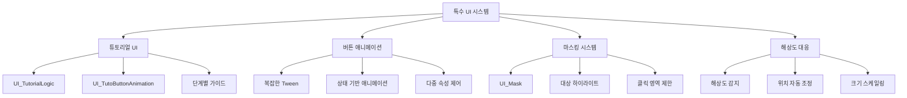
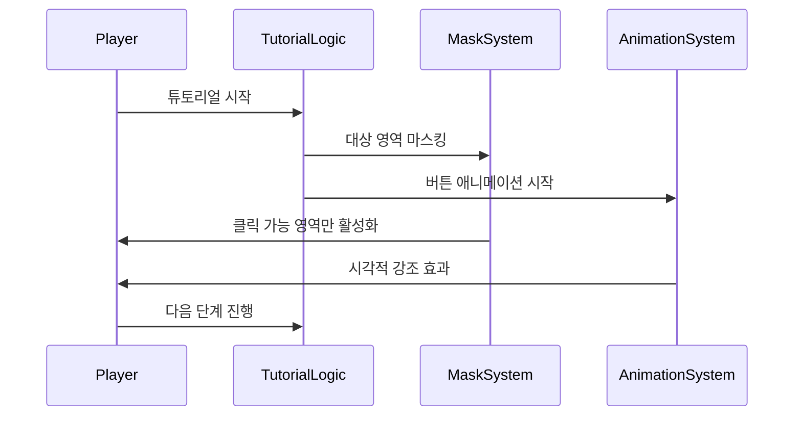

# 특수 UI 시스템

## 개요

게임에서 특별한 용도로 사용되는 UI 시스템들을 다룹니다. 튜토리얼 가이드, 복잡한 애니메이션 효과, 화면 마스킹, 해상도 대응 등 일반적인 UI 컴포넌트로는 구현하기 어려운 고급 기능들을 제공합니다.

## 핵심 컴포넌트 구조



## 1. 튜토리얼 UI 시스템 (UI_TutorialLogic)

### 기본 구조

초보자를 위한 단계별 가이드와 시각적 강조 효과를 제공하는 핵심 시스템입니다.

### 조언 메시지 시스템

```lua
method void ActivateAdviceMessage(string adviceID)
```

안내 캐릭터와 함께 상세한 조언을 표시합니다:

#### 구성 요소
- **안내 캐릭터**: AdviceCharImageRUID로 시각적 친밀감 제공
- **현지화 텍스트**: LocalizationService를 통한 다국어 지원  
- **진행 제어**: MaxCount를 통한 연속 메시지 관리
- **자동 마스킹**: 특정 UI 요소만 강조

### 마스킹 시스템

튜토리얼 진행 중 필요한 UI 요소만 강조하여 혼란을 방지합니다:

```lua
-- 마스크 타입별 분류
if overImageRUID == "927ddee89c2244649e5d7c1dad300a7b" then
    self.maskType = 1  -- 대기석
elseif overImageRUID == "b258f19fa36e4bfda88352cf9412a6e6" then
    self.maskType = 2  -- 전장
```

#### 마스킹 기능
- **대상 하이라이트**: 클릭 대상 UI만 활성화
- **클릭 차단**: BlockMaskClick으로 다른 영역 비활성화
- **동적 위치**: MaskSetPos 테이블 기반 위치 계산
- **오버레이 효과**: 추가 이미지로 시각적 강조

### 해상도 대응 시스템

다양한 화면 해상도에서 일관된 경험을 제공합니다:

```lua
-- 현재 해상도 감지
self.screenSize = Vector2(_UILogic.ScreenWidth,_UILogic.ScreenHeight)

-- 해상도별 위치 조정
if self.screenSize.y == 1080 then
    self.UI_TutorialMask.UITransformComponent.anchoredPosition = Vector2(posX,posY)
```

#### 대응 기능
- **해상도 감지**: 실시간 화면 크기 추적
- **위치 스케일링**: 비율 기반 UI 요소 위치 조정
- **앵커 시스템**: 다양한 정렬 옵션 (Center, BottomLeft, TopRight 등)
- **피봇 자동 계산**: 앵커에 따른 피봇 포인트 설정

## 2. 버튼 애니메이션 시스템 (UI_TutoButtonAnimation)

### 복합 애니메이션 관리

튜토리얼 선택 버튼의 복잡한 상태 전환 애니메이션을 관리합니다:

```lua
method void AdjustTutoSelectButtonSize(string TutoSelectState)
```

### 상태 기반 애니메이션

#### TutoSelectState 처리
- **Reset**: 초기 상태로 복원
- **Play**: "튜토리얼 시작" 상태 강조
- **Skip**: "건너뛰기" 상태 강조

#### 다중 속성 제어
각 상태마다 다음 속성들을 동시에 애니메이션:
- **크기 (Scale)**: 버튼 확대/축소 효과
- **위치 (Position)**: 부드러운 이동 애니메이션
- **투명도 (Alpha)**: 페이드 인/아웃 효과
- **머티리얼**: 시각적 강조를 위한 재질 변경

### 상호작용 피드백

마우스 오버 시 즉각적인 시각적 피드백을 제공하여 사용자 경험을 향상시킵니다.

## 3. 마스킹 시스템 (UI_Mask)

### 기본 원리

특정 UI 요소만 강조하고 나머지를 어둡게 처리하는 시각적 강조 시스템입니다:

```lua
method void SetMask(Entity targetUI, string maskRUID)
```

### 구현 방식

#### 다중 마스크 레이어
- **중앙 마스크**: 강조 대상 영역
- **배경 마스크**: 나머지 화면 영역 덮기
- **경계 마스크**: 부드러운 전환을 위한 테두리

#### 동적 크기 조정
```lua
-- 타겟 크기에 맞춰 마스크 크기 설정
self.Entity.UITransformComponent.RectSize = targetUI.UITransformComponent.RectSize
```

### 활용 사례
- **튜토리얼**: 클릭해야 할 버튼만 강조
- **기능 소개**: 새 기능 안내 시 해당 영역 하이라이트
- **오류 방지**: 잘못된 조작 방지를 위한 영역 제한

## 4. 해상도 대응 시스템

### 다중 해상도 지원

다양한 디바이스와 화면 비율에서 일관된 UI 경험을 보장합니다:

### 자동 스케일링

#### 위치 계산
```lua
local pivotX, pivotY
if self.maskAnchor == "Center" then
    pivotX = 0.5; pivotY = 0.5
elseif self.maskAnchor == "BottomLeft" then
    pivotX = 0; pivotY = 0
```

#### 앵커 포인트 시스템
- **Center**: 화면 중앙 기준
- **BottomLeft**: 좌하단 기준
- **TopRight**: 우상단 기준
- **기타**: 9가지 앵커 포인트 지원

### 동적 조정

게임 실행 중 해상도 변경에도 자동으로 UI가 재조정됩니다.

## 5. 초보자 UI 가이드 시스템

### 통합 가이드 경험

여러 시스템이 협력하여 체계적인 학습 경험을 제공합니다:



### 가이드 흐름 관리

#### 단계별 진행
1. **조언 메시지 표시**: 친숙한 캐릭터와 함께 설명
2. **마스크 적용**: 필요한 UI만 강조
3. **애니메이션 활성화**: 클릭 대상 시각적 강조
4. **상호작용 대기**: 플레이어 액션 기다림
5. **다음 단계 전환**: 부드러운 단계 이동

#### 개인화 지원
- **스킵 기능**: 숙련자를 위한 빠른 진행
- **반복 학습**: 언제든 다시 볼 수 있는 도움말
- **진행 상태 저장**: 중단된 지점에서 재시작

## 데이터 관리

### 핵심 데이터셋

#### AdviceDataset
```lua
AdviceID: "AD100_1", "AD101_1", ...
AdviceText: 현지화 키
AdviceCharImageRUID: 안내 캐릭터 이미지
MaxCount: 연속 메시지 개수
```

#### MaskSetPos
```lua
AdviceID: 연결된 조언 ID
IsMaskOn: 마스킹 활성화 여부
MaskAnchor: 앵커 포인트
posX, posY: 위치 좌표
BlockMaskClick: 클릭 차단 여부
```

### 리소스 최적화

대용량 이미지와 애니메이션 리소스의 효율적 관리:
- **지연 로딩**: 필요할 때만 리소스 로드
- **캐시 시스템**: 자주 사용되는 요소 메모리 보관
- **해상도별 리소스**: 화면 크기에 맞는 적절한 품질

## 성능 고려사항

### 메모리 관리
- **동적 생성/해제**: 필요할 때만 UI 요소 활성화
- **풀링 시스템**: 재사용 가능한 컴포넌트 관리
- **가비지 컬렉션**: 불필요한 객체 정리

### 렌더링 최적화
- **레이어 분리**: 정적/동적 요소 분리 렌더링
- **Culling**: 화면 밖 요소 제외
- **배치 처리**: 유사한 요소들 그룹 렌더링

## 코드 레퍼런스

- `RootDesk/MyDesk/UIComponents/UI_TutorialLogic.mlua :: ActivateAdviceMessage()` - 조언 메시지 활성화
- `RootDesk/MyDesk/UIComponents/UI_TutoButtonAnimation.mlua :: AdjustTutoSelectButtonSize()` - 버튼 애니메이션 제어
- `RootDesk/MyDesk/UIComponents/UI_Mask.mlua :: SetMask()` - 마스킹 적용
- `RootDesk/MyDesk/TutorialGuide/TutorialManager_New.mlua :: SetAllowFeature()` - 기능 제한 관리
- `RootDesk/MyDesk/TutorialGuide/GuideToRulesManager.mlua :: ActivatePopupMessage()` - 가이드 팝업 표시


