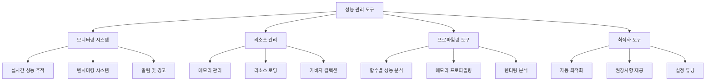

# 성능 및 리소스 관리

## 개요

개발자를 위한 포괄적인 성능 모니터링, 리소스 관리, 프로파일링 도구 시스템입니다. 실시간 성능 추적, 메모리 사용량 분석, 리소스 최적화 도구를 제공하여 게임의 성능 병목을 식별하고 해결할 수 있도록 지원합니다. 개발 단계부터 라이브 서비스까지 전 과정에서 활용 가능한 종합 성능 관리 솔루션입니다.

## 시스템 아키텍처



## 1. 성능 모니터링 시스템

### 실시간 성능 추적

게임 실행 중 핵심 성능 지표를 지속적으로 모니터링합니다.

### 벤치마킹 시스템

```lua
method void BenchmarkCachePerformance()
```

핵심 시스템의 성능을 정량적으로 측정하여 최적화 효과를 검증합니다:

#### 캐시 성능 측정
```lua
local startTime = _TimeService:GetServerTime()
-- 캐시된 데이터 조회 테스트
for i = 1, 1000 do
    local data = _CharacterSynergyLogic.CharacterSynergy["C10001"]
end
local endTime = _TimeService:GetServerTime()
log(string.format("캐시 조회 1000회: %.3fms", (endTime - startTime) * 1000))
```

#### 측정 항목
- **데이터 조회 속도**: 캐시 효율성 검증
- **UI 렌더링 시간**: 프레임 드롭 분석
- **네트워크 응답 시간**: 통신 성능 측정
- **로딩 시간**: 리소스 로딩 효율성

### 성능 임계값 모니터링

```lua
method void CheckPerformanceThresholds()
```

설정된 임계값을 초과하는 성능 문제를 자동 감지하고 알림을 제공합니다:

#### 임계값 설정
- **프레임률**: 60fps 미만 지속 시 경고
- **메모리 사용량**: 80% 초과 시 알림
- **로딩 시간**: 3초 초과 시 최적화 권장
- **네트워크 지연**: 100ms 초과 시 경고

## 2. 메모리 관리 도구

### 메모리 사용량 추적

실시간으로 메모리 사용 패턴을 분석하여 누수를 방지합니다:

```lua
method void LogMemoryUsage()
```

#### 메모리 분석 항목
```lua
log(string.format("CharacterSynergy 캐시: %d 항목", 
    table.count(self.CharacterSynergy)))
log(string.format("ExpTable 캐시: %d 항목", 
    #self.ExpTable))
log(string.format("UI 엔티티: %d 개", 
    _EntityService:GetEntityCount("UITransformComponent")))
```

### 가비지 컬렉션 최적화

#### 자동 메모리 정리
```lua
method void OnDestroy()
    table.clear(self.CharacterSynergy)
    table.clear(self.ExpTable)
    table.clear(self.SoundTable)
    self.IsInitialized = false
end
```

#### 메모리 정리 전략
- **테이블 재사용**: 새 테이블 생성 대신 기존 테이블 클리어 후 재사용
- **문자열 인터닝**: 자주 사용되는 문자열의 중복 제거
- **약한 참조**: WeakTable 사용으로 메모리 누수 방지
- **지연 해제**: 즉시 삭제보다는 일괄 정리 프로세스 활용

### 메모리 누수 감지

```lua
method void DetectMemoryLeaks()
```

장시간 해제되지 않는 객체를 자동으로 식별합니다:
- **오래된 타이머**: 정리되지 않은 타이머 감지
- **참조 순환**: 상호 참조로 인한 누수 탐지
- **이벤트 리스너**: 제거되지 않은 이벤트 핸들러 추적

## 3. 리소스 관리 최적화

### 리소스 로딩 분석

리소스의 로딩 패턴과 사용 빈도를 분석하여 최적화 방안을 제시합니다:

```lua
method void AnalyzeResourceUsage()
```

#### 분석 지표
- **로딩 빈도**: 자주 사용되는 리소스 식별
- **메모리 사용량**: 리소스별 메모리 점유율
- **로딩 시간**: 병목이 되는 대용량 리소스 파악
- **캐시 적중률**: 캐싱 효율성 측정

### 리소스 사전 로딩 최적화

```lua
method void OptimizePreloading()
```

게임 상황별로 필요한 리소스를 미리 식별하고 최적의 로딩 전략을 수립합니다:

#### 최적화 전략
- **우선순위 로딩**: 중요도에 따른 리소스 로딩 순서 결정
- **배치 로딩**: 연관된 리소스들의 일괄 로딩
- **조건부 로딩**: 게임 상황에 따른 선택적 리소스 로딩
- **백그라운드 로딩**: 게임플레이 중 미리 다음 단계 리소스 준비

### UI 리소스 최적화

```lua
method void OptimizeUIResources()
```

UI 관련 리소스의 효율적 사용을 위한 최적화 도구입니다:

```lua
-- 사전 계산된 UI 최적화 정보 활용
local optimInfo = _LoadResourcesInfo:GetUILocalPositionScale(RUID)
uiElement.UITransformComponent.LocalPosition = optimInfo["pos"]
uiElement.UITransformComponent.LocalScale = optimInfo["scale"]
```

#### UI 최적화 기법
- **스프라이트 아틀라싱**: 여러 UI 이미지를 하나로 합성
- **동적 폰트 로딩**: 필요한 문자만 선택적 로딩
- **UI 풀링**: 자주 사용되는 UI 컴포넌트 재사용
- **렌더 타겟 최적화**: 불필요한 렌더링 패스 제거

## 4. 네트워크 성능 최적화

### 데이터 전송 최적화

네트워크 트래픽을 최소화하고 응답 속도를 향상시킵니다:

```lua
method void OptimizeNetworkTraffic()
```

#### 최적화 기법
- **데이터 압축**: 문자열 기반 데이터 압축으로 전송량 감소
- **배치 요청**: 개별 요청 대신 여러 데이터를 묶어서 전송
- **델타 동기화**: 변경된 부분만 전송
- **우선순위 큐**: 중요도에 따른 전송 순서 관리

#### 압축 예시
```lua
-- 효율적인 데이터 압축
local compressedData = string.format("%s_%s_%d", 
    charID, 
    table.concat(synergyList, "-"),
    level
)
```

### 동기화 성능 분석

멀티플레이어 동기화의 성능을 분석하고 최적화합니다:
- **@TargetUserSync 분석**: 플레이어별 동기화 트래픽 측정
- **업데이트 빈도 최적화**: 불필요한 동기화 제거
- **배치 업데이트**: 여러 변경사항을 한 번에 동기화

## 5. 렌더링 성능 도구

### 렌더링 프로파일러

그래픽 성능의 병목을 식별하고 최적화 방안을 제시합니다:

```lua
method void ProfileRenderingPerformance()
```

#### 분석 항목
- **드로우 콜 수**: 렌더링 호출 횟수 최적화
- **텍스처 메모리**: VRAM 사용량 추적
- **셰이더 성능**: 복잡한 셰이더의 성능 영향 분석
- **오버드로우**: 불필요한 중복 렌더링 감지

### 배치 렌더링 최적화

```lua
method void OptimizeBatchRendering()
```

동일한 속성을 가진 객체들을 묶어서 렌더링 효율성을 향상시킵니다:

```lua
-- 동일 텍스처 스프라이트들의 배치 렌더링
_ResourceService:PreloadAsync(spriteRUIDs, function()
    self:RenderSpriteBatch(spriteRUIDs)
end)
```

## 6. 개발자 편의 도구

### 성능 대시보드

실시간으로 모든 성능 지표를 시각화하여 한눈에 파악할 수 있는 대시보드를 제공합니다:

#### 대시보드 구성 요소
- **실시간 그래프**: FPS, 메모리 사용량, 네트워크 지연시간
- **경고 알림**: 임계값 초과 시 즉시 알림
- **히스토리**: 성능 변화 추이 분석
- **상세 정보**: 클릭 시 해당 시스템의 상세 분석 표시

### 자동화된 최적화 제안

```lua
method void SuggestOptimizations()
```

성능 분석 결과를 바탕으로 구체적인 최적화 방안을 자동으로 제안합니다:

#### 제안 유형
- **캐싱 기회**: 반복적으로 계산되는 값의 캐싱 제안
- **리소스 통합**: 개별 로딩되는 리소스의 묶음 제안
- **알고리즘 개선**: 비효율적인 로직의 대안 제시
- **설정 조정**: 성능 향상을 위한 설정값 권장

### 성능 비교 도구

```lua
method void ComparePerformance(string baselineVersion, string currentVersion)
```

버전 간 성능 변화를 정량적으로 비교 분석합니다:
- **성능 회귀 감지**: 이전 버전 대비 성능 저하 식별
- **개선사항 검증**: 최적화 작업의 효과 측정
- **벤치마크 기록**: 버전별 성능 히스토리 관리

## 7. 프로덕션 환경 최적화

### 라이브 서비스 모니터링

실서비스 환경에서의 성능을 지속적으로 모니터링합니다:

#### 모니터링 지표
- **서버 응답 시간**: API 호출별 응답 속도
- **동시 접속자**: 부하에 따른 성능 변화
- **에러율**: 성능 문제로 인한 오류 발생률
- **사용자 경험**: 실제 플레이어가 체감하는 성능

### 자동 스케일링

```lua
method void AutoScale()
```

부하 상황에 따라 시스템 리소스를 동적으로 조정합니다:
- **메모리 할당**: 필요에 따른 메모리 풀 크기 조정
- **스레드 풀**: CPU 사용량에 따른 스레드 개수 조정
- **캐시 크기**: 메모리 압박 시 캐시 크기 자동 조절

## 성능 최적화 모범 사례

### 지연 초기화 (Lazy Initialization)

```lua
method any GetCachedData(string key)
    if not self.IsInitialized then
        self:LoadTable()  -- 필요시에만 초기화
    end
    return self.DataTable[key]
end
```

### 오브젝트 풀링

```lua
method Entity GetPooledEntity(string entityType)
    local pooledEntity = self.EntityPool[entityType]:Pop()
    if not isvalid(pooledEntity) then
        pooledEntity = self:CreateNewEntity(entityType)
    end
    return pooledEntity
end
```

### 효율적인 데이터 구조

```lua
-- O(1) 검색을 위한 해시 테이블 사용
local unitLookup = {}
for i, unit in ipairs(units) do
    unitLookup[unit.ID] = unit
end
```

## 코드 레퍼런스

- `RootDesk/MyDesk/InGame/Managers/LoadResourcesInfo.mlua :: ResourceLoad()` - 리소스 사전 로딩 시스템
- `RootDesk/MyDesk/DatasetCacheLogic/CharacterSynergyLogic.mlua :: LoadTable()` - 캐시 성능 최적화
- `RootDesk/MyDesk/InGame/Managers/TeamManager.mlua :: Check_LevelUpCondition()` - 배치 처리 최적화
- `RootDesk/MyDesk/DatasetCacheLogic/PlaySoundLogic.mlua :: PlaySound()` - 오디오 성능 최적화
- `RootDesk/MyDesk/DataStorage/GameModeDataManager.mlua :: Initialize()` - 모드별 데이터 최적화


