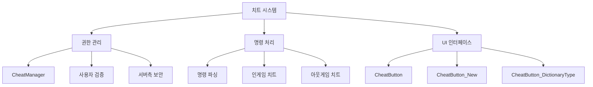
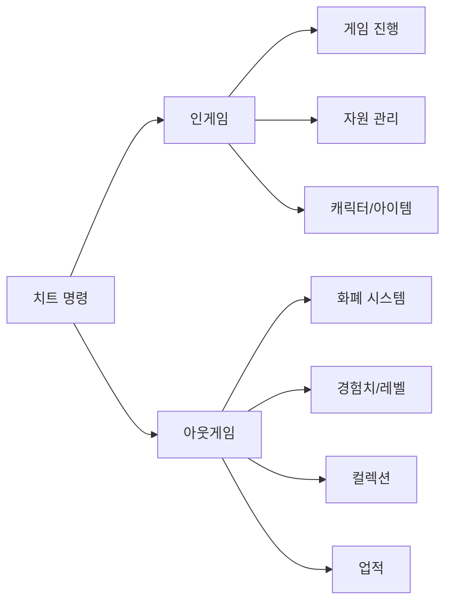

# 치트 및 디버깅 시스템

## 개요

개발자와 테스터를 위한 강력한 치트 및 디버깅 도구 시스템입니다. 보안성과 편의성을 동시에 고려하여 권한 기반 접근 제어, 다양한 입력 방식 지원, 체계적인 명령 체계를 제공합니다. 게임 개발 및 QA 과정에서 효율적인 테스트와 디버깅을 가능하게 합니다.

## 시스템 아키텍처



## 1. 치트 관리자 (CheatManager)

### 핵심 구조

치트 시스템의 중앙 관리자로서 보안 검증부터 명령 실행까지 모든 치트 기능을 통제합니다.

### 권한 검증 시스템

```lua
method boolean IsAllowedUser(string userID)
```

보안을 위해 사전 등록된 개발자만 치트 기능을 사용할 수 있도록 제한합니다:

#### 사용자 등록 방식
```lua
-- 서버 시작 시 허용 사용자 목록 설정
local cheatAllowedUsers = {
    "?????????????????", -- 계정 코드 입력
}
```

#### 보안 특징
- **서버 측 검증**: 모든 치트는 서버에서만 실행 가능
- **계정 코드 기반**: 고유한 계정 식별자로 권한 관리
- **부분 매칭**: 계정 코드의 특정 부분만 사용하여 보안 강화
- **로그 기록**: 치트 사용 기록을 서버에 보관

### 명령 파싱 시스템

```lua
method boolean UseCheat(string cheatKey)
```

복합 명령을 구조적으로 파싱하여 다양한 치트 기능을 제공합니다:

#### 파싱 구조
```lua
local split = _UtilLogic:Split(cheatKey, "_")
-- 예시: "GetCoin_1000" → ["GetCoin", "1000"]
```

#### 명령 체계

**인게임 치트**
- **phaseOver**: 현재 페이즈 강제 종료
- **GoRound_[stage]-[round]**: 특정 스테이지/라운드로 이동
- **GetCoin_[amount]**: 골드 지급
- **ChangeLife_[amount]**: 생명력 변경
- **ChangeLevel_[level]**: 플레이어 레벨 변경
- **GetUnit_[id]**: 특정 캐릭터 획득
- **GetItem_[id]**: 아이템 획득
- **GetRuneCard_[id]**: 룬카드 획득

**아웃게임 치트**
- **GetSyrup_[amount]**: 시럽 화폐 지급
- **GetRoyalSyrup_[amount]**: 로얄시럽 지급
- **GetEXP_[amount]**: 경험치 지급
- **ChangeCoachOwn_[id]_[status]**: 코치 소유 상태 변경
- **SetAchievementCount_[id]_[count]**: 업적 진행도 설정
- **CharCollectChange_[id]_[grade]**: 캐릭터 컬렉션 변경

### UI 패널 관리

```lua
method void OpenCheatPanel()
```

권한이 확인된 사용자에게만 치트 UI를 제공합니다:
- **보안 검증**: 패널 열기 전 권한 재확인
- **클라이언트 동기화**: 서버 승인 후 UI 활성화
- **경로 기반 접근**: "/ui/EtcGroup/CheatUI_New"로 UI 구성

## 2. 치트 버튼 시스템

### 기본 치트 버튼 (CheatButton)

단일 또는 복수 입력값을 받아 치트 명령을 생성하는 기본 컴포넌트입니다:

```lua
property string Key = ""
handler HandleButtonClickEvent(ButtonClickEvent event)
```

#### 복합 입력 처리
```lua
-- 두 개 입력이 필요한 치트 (캐릭터 컬렉션, 코치 획득)
if self.Key == "GetCharacterCollect" then
    local inputs = self.Entity.Parent:GetChildComponentsByTypeName("TextInputComponent", true)
    local key = self.Key.."_"..inputs[1].Entity.TextComponent.Text.."_"..inputs[2].Entity.TextComponent.Text
    _CheatManager:UseCheat(key)
end
```

#### 특수 형식 지원
- **룬카드**: "GetRuneCard" → "GetRuneCard_RC[번호]" 자동 변환
- **캐릭터 컬렉션**: ID와 등급을 함께 입력받아 처리
- **일반 치트**: 단일 입력값으로 명령 완성

### 개선된 치트 버튼 (CheatButton_New)

가변적인 입력 개수를 지원하는 향상된 버튼 시스템입니다:

```lua
property integer InputAmount = 0
property string CheatKey = ""
```

#### 동적 입력 처리
```lua
-- 설정된 입력 개수만큼 값을 수집
if self.InputAmount > 0 then
    for i=1, self.InputAmount do
        local inputValue = Entity.Parent:GetChildByName(string.format("Input_%d", i)).TextComponent.Text
        key = key.."_"..inputValue
    end
end
```

#### 활용 예시
- **InputAmount = 0**: 매개변수 없는 치트 (phaseOver)
- **InputAmount = 1**: 단일 값 치트 (GetCoin_1000)
- **InputAmount = 2**: 복합 값 치트 (GoRound_3-5)

### 타입별 치트 버튼 (CheatButton_DictionaryType)

게임 요소 타입별로 특화된 간편한 치트 버튼입니다:

```lua
property integer Type = 1  -- 1:캐릭터, 2:아이템, 3:룬카드
property string ID = ""
```

#### 타입 기반 처리
```lua
if self.Type == 1 then
    _CheatManager:UseCheat("GetUnit_"..self.ID)
elseif self.Type == 2 then
    _CheatManager:UseCheat("GetItem_"..self.ID)
elseif self.Type == 3 then
    _CheatManager:UseCheat("GetRuneCard_"..self.ID)
```

#### 장점
- **직관적 설정**: 에디터에서 타입과 ID만 설정하면 완성
- **오타 방지**: 미리 정의된 명령 형식으로 실수 최소화
- **빠른 제작**: 대량의 치트 버튼 생성 시 효율적

## 3. 치트 명령 체계

### 명령 분류 체계



### 게임 진행 제어

#### 단계 제어
- **phaseOver**: 준비 → 전투, 전투 → 준비 페이즈 전환
- **GoRound_[stage]-[round]**: 특정 스테이지/라운드 즉시 이동
- **SetBattleResult_[result]**: 전투 결과 강제 설정

#### 자원 관리
- **GetCoin_[amount]**: 인게임 골드 즉시 지급
- **ChangeLife_[amount]**: 현재 생명력 설정
- **SetLevel_[level]**: 플레이어 레벨 즉시 변경

### 컬렉션 및 진행도 관리

#### 대량 처리 지원
```lua
-- 모든 캐릭터 컬렉션을 특정 등급으로 설정
"CharCollectChange_All_3"  -- 모든 캐릭터를 3성으로

-- 특정 등급의 모든 시너지 해금
"SynCollectChange_All_2"   -- 모든 2등급 시너지 해금
```

#### 개별 처리
```lua
-- 특정 캐릭터만 컬렉션 등급 변경
"CharCollectChange_C10001_5"  -- 특정 캐릭터를 5성으로

-- 개별 업적 진행도 설정
"SetAchievementCount_ACHIEVE001_100"  -- 업적 100 달성
```

## 4. 개발자 편의 기능

### 디버그 정보 출력

치트 실행 시 상세한 로그 정보를 제공하여 디버깅을 지원합니다:

```lua
log("cuttedUserID = ", cuttedUserID)  -- 사용자 ID 확인
log("cheatKey = ", cheatKey)          -- 실행된 치트 명령
log("result = ", result)              -- 치트 실행 결과
```

### 안전성 검증

#### 입력값 유효성 검사
- **숫자 변환**: `tonumber()` 함수로 안전한 형변환
- **nil 체크**: `isvalid()` 함수로 유효성 확인
- **범위 검증**: 적절한 값 범위 내에서만 실행

#### 게임 상태 보호
- **페이즈 확인**: 적절한 게임 상태에서만 치트 실행
- **중복 방지**: 동일한 치트의 중복 실행 차단
- **롤백 지원**: 문제 발생 시 이전 상태로 복원

## 5. 확장성 고려사항

### 새로운 치트 추가

기존 구조를 유지하면서 새로운 치트를 쉽게 추가할 수 있도록 설계되었습니다:

```lua
-- CheatManager.mlua의 UseCheat 메소드에 새 조건 추가
elseif split[1] == "NewCheat" then
    local param = split[2]
    self:Cheat_NewFunction(senderUserId, param)
```

### 버튼 컴포넌트 확장

새로운 입력 방식이나 UI 패턴을 지원하는 치트 버튼을 추가할 수 있습니다:
- **슬라이더 기반**: 범위 값을 직관적으로 설정
- **드롭다운 기반**: 미리 정의된 옵션 중 선택
- **체크박스 기반**: 불리언 값 설정

## 성능 및 보안 고려사항

### 성능 최적화
- **지연 실행**: 치트 UI는 필요할 때만 활성화
- **배치 처리**: 여러 치트를 한 번에 실행할 때 최적화
- **캐시 활용**: 자주 사용되는 데이터는 메모리에 캐싱

### 보안 강화
- **서버 전용 실행**: 모든 치트는 서버에서만 처리
- **권한 재검증**: 치트 실행 시마다 권한 확인
- **로그 기록**: 모든 치트 사용 기록을 서버에 보관
- **릴리즈 비활성화**: 프로덕션 빌드에서 자동 비활성화

## 코드 레퍼런스

- `RootDesk/MyDesk/CheatPackage/CheatManager.mlua :: UseCheat()` - 치트 명령 파싱 및 실행
- `RootDesk/MyDesk/CheatPackage/CheatManager.mlua :: IsAllowedUser()` - 사용자 권한 검증
- `RootDesk/MyDesk/CheatPackage/CheatButton.mlua :: HandleButtonClickEvent()` - 기본 치트 버튼 처리
- `RootDesk/MyDesk/CheatPackage/CheatButton_New.mlua :: HandleButtonClickEvent()` - 개선된 치트 버튼 처리
- `RootDesk/MyDesk/CheatPackage/CheatButton_DictionaryType.mlua :: HandleButtonClickEvent()` - 타입별 치트 버튼


